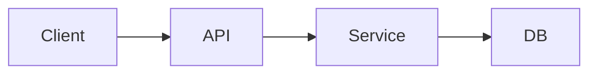

# Extensive README — section templates

Use these as starting headings. Renumber sequentially; skip what does not apply.

## Cover block

```markdown
# Project Name — one-line subtitle

> **What it is:** …  
> **What it is not:** …  
> **Primary interface:** CLI | Web | API | Agent

---

**TL;DR**

- Differentiator 1
- Differentiator 2
- … (8–12 bullets)
```

## Table of contents

```markdown
## Table of contents

1. [Vision](#1-vision)
2. [Architecture](#2-architecture)
…
```

## 1. Vision

```markdown
## 1. Vision

### What it is
### What it is not
### Who it is for
### Success criteria
```

## 2. Architecture

```markdown
## 2. Architecture

### 2.1 High-level diagram


### 2.2 Data flow
### 2.3 Key modules (with paths)
```

## 3. Quickstart

```markdown
## 3. Quickstart

### Prerequisites
### Install
### Run locally
### Verify (smoke test)
```

## 4. Configuration

```markdown
## 4. Configuration

| Variable | Required | Default | Description |
|----------|----------|---------|-------------|
| `DATABASE_URL` | Yes | — | … |
```

## 5. Project structure

```markdown
## 5. Project structure

\`\`\`text
src/
├── …
\`\`\`
```

## 6. API / CLI / interfaces

Catalog tables grouped by category with counts.

## 7. Data model

Entities, relationships, migrations path.

## 8. Testing

How to run, coverage scope, CI command.

## 9. Deployment

Docker, env targets, CI/CD pipeline.

## 10. Cookbook (optional)

Example prompts, common tasks, recipes.

## 11. Roadmap & changelog

Completed phases table + future directions + recent changelog rows.

## 12. FAQ & glossary (optional)

Domain terms and sharp edges.
