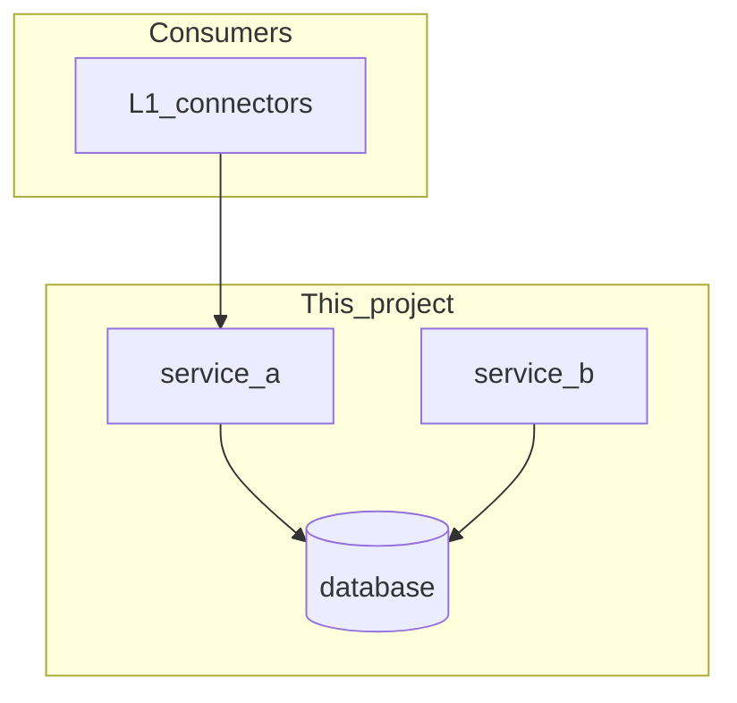
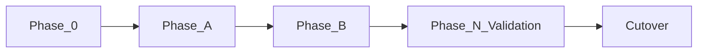

# [PROJECT_OR_FEATURE_NAME] — Master Execution Plan

> Nawab master plan — entire project or major feature execution in one document.
> **Mode:** project | feature  
> Copy to `IMPLEMENTATION_PLAN.md` and maintain `PROGRESS.md` during execution.

---

## §0 Plan metadata

| Field | Value |
|-------|-------|
| **Mode** | project / feature |
| **Stack** | [from repo — e.g. Python/FastAPI + Next.js + Postgres] |
| **Base branch** | `main` |
| **Feature branch(es)** | `cursor/[name]-[suffix]` or per-workstream |
| **Authority docs** | [links] |
| **Estimated commits** | [range — see §9 granularity; e.g. 18–25 for multi-package] |
| **Lead agent** | Orchestrate, commit, integrate subagents, PR |

---

## §1 North star & scope boundary

### Objective

[One sentence — what exists when this plan is complete]

### Deliverables

- [Package / API / UI / script / doc]
- […]

### Non-goals

- [Explicit out of scope]
- […]

### Priority

| Priority | Items |
|----------|-------|
| **P0** | [must ship] |
| **P1** | [defer ok] |

---

## §2 Prerequisites & blockers

| Item | Status | Blocks | Resolution |
|------|--------|--------|------------|
| [PR / dep / infra] | pending / done | [phase / WS] | [how to clear] |

---

## §3 Authority & artifact map

| Document | Path | Role |
|----------|------|------|
| [Handoff spec] | `…` | Read-only schema truth |
| IMPLEMENTATION_PLAN | root | This document |
| PROGRESS | root | Live status |
| DECISIONS | root | ADRs |
| Spec Kit | `.specify/` | Optional Phase 0 |

---

## §4 Architecture & system map



### Target layout

```text
repo/
├── packages/
│   ├── [pkg-a]/
│   └── [pkg-b]/
├── scripts/
├── deploy/
└── …
```

### Trust boundaries

- [Auth model, tenancy, secrets handling]

---

## §5 Workstreams

| ID | Name | Owns paths | Depends on | Lead / subagent |
|----|------|------------|------------|-----------------|
| WS-A | [name] | `packages/…` | blockers clear | lead |
| WS-B | [name] | `packages/…` | WS-A commit [N] | subagent optional |

### WS-A — [name]

- **Objective:** [one line]
- **Phases:** A, B, …
- **Integration:** [when output merges into system]

### WS-B — [name]

- **Objective:** [one line]
- **Integration:** […]

---

## §6 Agent orchestration & subagent spawn map

> See `.cursor/skills/nawab-plans/SUBAGENT_ORCHESTRATION.md` for patterns.

| ID | Trigger | Type | readonly | Task | Sync point | Gate |
|----|---------|------|----------|------|------------|------|
| S1 | Phase 0 | explore | true | Map [area] | Before commit 1 | — |
| S2 | Phase C | generalPurpose | false | [scoped build] | Commit [N] | `[test]` |
| S3 | Phase N | security-review | true | Branch diff | Before cutover | fixes committed |

### Spawn S1 — [example]

```text
Full Repository Path: [absolute]
Workstream: WS-A
Task: Map ingest flow and list all files touching dedupe
Authority: [§3 links]
Return: bullet list of paths + flow summary
Do NOT: edit files, expand scope
```

**Parallel limit:** [2–4]  
**File ownership:** lead owns `packages/shared`; one writer per file per commit window

---

## §7 Phase map & dependencies



| Phase | Objective | Workstreams | Commits | Depends on | Exit gate |
|-------|-----------|-------------|---------|------------|-----------|
| 0 | Spec / research | all | docs | §2 clear | Approved spec + plan |
| A | [name] | WS-A | 1–[n] | 0 | `[commands]` |
| B | [name] | WS-A,B | [n]–[m] | A | `[commands]` |
| … | … | … | … | … | … |
| N | Validation & hardening | all | […] | all P0 phases | orchestrator green |
| Cutover | Rollout / parity | — | — | N | §15 checklist |

---

## §8 Todo registry

```yaml
todos:
  - id: unblock-[item]
    content: "[Clear blocker]"
    status: pending
  - id: phase-0-spec
    content: "Phase 0: research + spec artifacts"
    status: pending
  - id: phase-a-ws-a
    content: "Phase A: [objective]"
    status: pending
  - id: subagent-s1-explore
    content: "Spawn S1: explore [area]"
    status: pending
  - id: phase-n-hardening
    content: "Phase N: full-repo validation"
    status: pending
  - id: cutover
    content: "Cutover: [consumer] points at new system"
    status: pending
```

---

## §9 Commit matrix

> One row = one commit. Tests in same commit. Gates = project-native commands.
> **Break work down** — target a significant commit count for scope (see table).

### Commit granularity targets

| Scope | Target rows |
|-------|-------------|
| Major feature | 8–15+ |
| Multi-package | 18–30+ |
| Full project | 25–50+ |

**Split into separate commits:** scaffold · CI · contracts · each migration ·
each route/handler · each UI module · smoke · E2E · hardening slices.

User minimum (if any): **≥ [N] commits** — matrix must meet or exceed.

### Phase A — [name] (WS-A)

| # | WS | Commit | Contents | Tests (same commit) | Gate | Agent |
|---|-----|--------|----------|---------------------|------|-------|
| 1 | A | `chore: scaffold …` | [files] | [collect/smoke] | `[cmd]` | lead |
| 2 | A | `ci: …` | [workflows] | lint | `[cmd]` | lead |
| 3 | A | `test: contract …` | golden fixtures | all pass | `[cmd]` | lead |
| … | … | … | … | … | … | … |

**Phase A gate:** `[commands before Phase B]`

### Phase B — [name]

| # | WS | Commit | Contents | Tests (same commit) | Gate | Agent |
|---|-----|--------|----------|---------------------|------|-------|
| … | … | … | … | … | … | … |

### Phase N — Validation

| # | WS | Commit | Contents | Tests (same commit) | Gate | Agent |
|---|-----|--------|----------|---------------------|------|-------|
| … | all | `chore: validation orchestrator` | `scripts/validate.sh` | exits 0 | `./scripts/validate.sh` | lead |

---

## §10 Test & CI strategy

| Tier | Purpose | Trigger | Command |
|------|---------|---------|---------|
| Fast | unit, lint, contract | every PR | `[…]` |
| Medium | integration | PR + main | `[…]` |
| Slow | smoke, E2E, UI | main / nightly | `[…]` |

### CI workflow map

| Job | Trigger | Command |
|-----|---------|---------|
| [name] | PR / main | `[…]` |

**Test locations:** `[convention]`  
**Contract-first:** commits [N]–[M] before commit [P]

---

## §11 Research log & decisions

| Topic | Options | Choice | Source / skill | Record in |
|-------|---------|--------|----------------|-----------|
| [DB / framework / auth] | A / B | B | [doc URL] | DECISIONS.md |

---

## §12 Documentation & artifact sync

| Event | Update |
|-------|--------|
| Plan approved | IMPLEMENTATION_PLAN.md |
| Phase complete | PROGRESS.md, PHASE_N_COMPLETION.md |
| Arch decision | DECISIONS.md |
| Cutover | PROGRESS cutover section, PR body |

---

## §13 Quality gates & checkpoints

| Gate | When | Command / checklist | Blocks |
|------|------|---------------------|--------|
| Phase A done | end A | `[…]` | Phase B |
| PR merge | review | fast tier green | main |
| Hardening | pre-cutover | validate.sh | cutover |

### Human checkpoints (optional)

- [ ] [User approves schema freeze]
- [ ] [User approves cutover]

---

## §14 Validation & hardening

### Repo walkthrough

1. Static audit: [forbidden patterns for this project]
2. Test matrix: fast → medium → slow
3. Adjacent packages: missing integration tests
4. ponytail-review on full diff; ponytail-audit on repo
5. speckit-converge (if `.specify/` exists)
6. Add regression tests for gaps — commits in Phase N
7. Manual checklist: [UX / ops items]

### Orchestrator

`scripts/validate.sh` (or `[path]`):

```text
1. static checks
2. fast tier
3. integration tier
4. smoke
5. E2E (if applicable)
6. UI E2E (if applicable)
7. doc sync check
```

---

## §15 Rollout & cutover

N/A — [reason]  
_or:_

- [ ] Parity: [mock vs real — ports, bodies, status codes]
- [ ] Consumer: [relay / config change]
- [ ] E2E green [N]× consecutive
- [ ] Rollback: [steps]

---

## §16 Exit criteria

### P0 (must pass)

- [ ] [Criterion + verifying command]
- [ ] All §13 gates green
- [ ] Hardening orchestrator green
- [ ] PROGRESS.md complete

### P1 (defer ok)

- [ ] […]

---

## §17 Risks & contingencies

| Risk | Likelihood | Impact | Mitigation | Contingency |
|------|------------|--------|------------|-------------|
| [scope creep] | med | high | non-goals §1 | descope P1 |
| [subagent overlap] | low | med | §6 file rules | serialize commits |

---

## §18 Execution protocol

```text
1. Load this plan + nawab-plans skill; ponytail on every edit
2. Clear §2 blockers
3. Phase 0 if spec artifacts required (speckit-*)
4. For each phase in §7:
   a. Sync §8 todos
   b. Execute §6 spawns at trigger rows
   c. For each §9 row: implement → test → gate → commit → push
      (one row per commit — never squash rows)
   d. Integrate subagent output at sync points
   e. Run phase exit gate → PHASE_N_COMPLETION.md → PROGRESS.md
   f. Human checkpoint if §13 requires
5. Phase N: §14 walkthrough + expanded tests
6. §15 cutover if applicable
7. Verify §16 P0 → draft PR with evidence
```

---

## Open questions

- [Question blocking execution]

---

## Approval

**Mode:** [project | feature]  
Plan ready for review. Approve to begin **Phase [0/A]**.  
Lead agent follows **§18 Execution protocol**.
