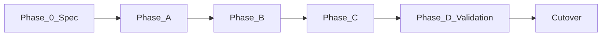

# Nawab Plans

One plan document is the **entire execution contract** for a project or major
feature — not a bullet list, not a roadmap slide, not a single-sprint task dump.

It tells the lead agent (and any spawned subagents) **what to build, in what order,
with what tests, who does what, when to parallelize, and when the work is done**.

Works for:

- **Project mode** — greenfield platform, multi-package system, full stack
- **Feature mode** — major addition to an existing repo (same structure, collapsed depth)

Template: [PLAN.template.md](PLAN.template.md)  
Subagent reference: [SUBAGENT_ORCHESTRATION.md](SUBAGENT_ORCHESTRATION.md)

---

## When to load

| Signal | Mode |
|--------|------|
| "Plan the whole project" / full platform / L2 build | **Project** — all sections, full depth |
| "Major feature" / multi-phase addition | **Feature** — same sections, scale depth |
| Existing plan missing workstreams, agents, or gates | Refactor to nawab shape |
| User pastes a long build spec (like stamped-l2) | Structure it as nawab plan |
| Single-file fix | **Do not use** — ponytail only |

---

## Plan modes

| | Project mode | Feature mode |
|---|-------------|--------------|
| **Scope** | Entire system or platform layer | Significant slice of existing repo |
| **Workstreams** | Often 2–5 parallel tracks | Usually 1–2; optional |
| **Subagents** | Common for research + parallel packages | Use when exploration or UI/API split |
| **Phases** | 0 (spec) + A…N + validation + cutover | A…N + validation |
| **Commit matrix** | Long, per workstream | Shorter, per phase |
| **Hardening** | Mandatory full-repo pass | Mandatory for touched surface + adjacencies |
| **Docs** | IMPLEMENTATION_PLAN, PROGRESS, DECISIONS | PROGRESS + DECISIONS at minimum |

**Fluid rule:** sections never disappear — they **collapse** when not applicable.
Mark collapsed sections `N/A — [reason]` rather than omitting them.

---

## Research phase (before writing the plan)

The plan author MUST load domain skills while researching — not only during
implementation. Record sources and choices in **§11 Research log**.

| Domain | Skill / rule |
|--------|----------------|
| Unfamiliar tech | `learn-while-building` |
| Backend / API / data | `backend-architecture` |
| Frontend / UI | `frontend-architecture` |
| Next.js | `nextjs-app-router-patterns` |
| UI polish | `impeccable` |
| Agents / MCP / automations | `agentic-system-design` + `mcp-architecture.mdc` |
| Trade-offs | `system-design-tradeoffs` + `trade-offs.mdc` |
| Codebase mapping | `graphify` (large or unfamiliar repos) |
| Security | `security-baseline` |
| Greenfield spec artifacts | `speckit-constitution` → `specify` → `plan` → `tasks` |
| README / onboarding | `extensive-readme` |

Plans that recommend stacks or patterns without research citations are **incomplete**.

---

## Required sections (master plan)

Every nawab plan includes **all 18 sections**. Scale table width and row count to
scope; never drop the section heading.

### §0 Plan metadata

```markdown
- **Mode:** project | feature
- **Stack:** [from repo — do not assume]
- **Base branch:** main
- **Branch strategy:** [single feature branch | per-workstream branches]
- **Authority docs:** [links]
- **Estimated commits:** [range — see Commit granularity below]
- **Lead agent role:** orchestrate, commit, integrate subagent outputs
```

### §1 North star & scope boundary

- **Objective** — one sentence
- **Deliverables** — concrete artifacts (packages, APIs, UI, scripts, docs)
- **Non-goals** — explicit; prevents scope creep (e.g. customer UI in other repo)
- **P0 vs P1** — what must ship vs what can defer

### §2 Prerequisites & blockers

| Item | Status | Blocks | Owner / resolution |
|------|--------|--------|-------------------|
| … | pending / done | phase or workstream | … |

**Hard rule:** no execution phase starts while a blocker row is `pending` unless
the plan documents an explicit workaround with risk acceptance.

### §3 Authority & artifact map

| Document | Path | Role in this plan |
|----------|------|-------------------|
| Handoff spec | `external/...` | Schema truth |
| IMPLEMENTATION_PLAN | root | This plan or child |
| PROGRESS | root | Live status |
| DECISIONS | root | ADRs |
| `.specify/` | optional | Spec Kit outputs |

Subagents must be told which artifacts are **read-only authority** vs **writable**.

### §4 Architecture & system map

- Mermaid or ASCII: components, data flow, consumers (internal vs external)
- Target repo layout (paths that will exist when done)
- Ports / services / queues — only if relevant
- Trust boundaries (auth, tenancy, secrets)

### §5 Workstreams

Parallel tracks of work. Single-threaded projects still have one workstream.

| ID | Name | Owns | Depends on | Agent |
|----|------|------|------------|-------|
| WS-A | ingest core | `packages/ingest` | blockers clear | lead |
| WS-B | console UI | `packages/console` | WS-A query-api | subagent (optional) |

Each workstream lists:

- **Objective**
- **Paths touched**
- **Phases / commits** (pointer to §9)
- **Integration point** — when its output merges into main flow

### §6 Agent orchestration & subagent spawn map

Define **who does what** for the entire execution. See
[SUBAGENT_ORCHESTRATION.md](SUBAGENT_ORCHESTRATION.md).

| Task | Executor | subagent_type | When to spawn | Returns |
|------|----------|---------------|---------------|---------|
| Explore unfamiliar codebase area | subagent | `explore` | Phase 0 or pre-phase | File map, flow summary |
| Parallel UI scaffold | subagent | `generalPurpose` | WS-B start, WS-A commit 10+ done | Branch diff or file list |
| Security review before cutover | subagent | `security-review` | Validation phase | Findings list |
| Over-engineering audit | subagent | `ponytail-audit` via lead | Hardening | Ranked cut list |

**Lead agent always retains:** git commits, branch merge, PR, PROGRESS updates,
integrating subagent output, running gates.

**Spawn rules to state in plan:**

1. Subagents are **read-only** unless plan assigns write scope to a path
2. Parallel spawns only when **no shared file overlap** in same commit window
3. Every subagent prompt includes: repo path, workstream ID, read-only paths,
   deliverable format, sections of this plan that apply
4. Sync points: subagent output merged at defined commits or phase gates
5. Max parallel subagents stated (default: 2–4 to avoid integration thrash)

### §7 Phase map & dependency graph



| Phase | Objective | Workstreams | Commits | Depends on | Exit gate |
|-------|-----------|-------------|---------|------------|-----------|
| 0 | Spec / research | all | docs | blockers | Approved spec + this plan |
| A | … | WS-A | 1–n | 0 | [command] |
| … | … | … | … | … | … |
| N | Validation & hardening | all | … | all features | orchestrator green |
| Cutover | Rollout / parity | — | — | N | checklist |

### §8 Todo registry

Structured todos **synced with agent TodoWrite** — ids stable across sessions.

```yaml
todos:
  - id: phase-0-speckit
    content: "Phase 0: Spec Kit constitution, specify, plan, tasks"
    status: pending
  - id: ws-a-commit-06
    content: "WS-A commit 6: POST ingest handler"
    status: pending
```

Rules:

- One todo per phase gate minimum; one per workstream for active work
- Mark `in_progress` only for the single active commit row (lead agent)
- Subagent tasks get todos with prefix `subagent-[ws-id]-…`

### §9 Commit matrix

**One row = one conventional commit.** Split tables by workstream or phase.

#### Commit granularity doctrine

**Break everything down.** A nawab plan deliberately targets a **significant
number of commits** — many small, independently validatable slices rather than
a few large dumps. This is intentional: easier review, bisect, rollback, and
per-commit gates.

| Scope | Target commit count | How to break down |
|-------|---------------------|-------------------|
| Major feature (1–2 packages) | **8–15+** | scaffold · CI · contracts · each endpoint · each migration · tests · docs |
| Multi-package / platform layer | **18–30+** | per package scaffold · per router · per schema migration · per UI module · smoke · E2E · hardening |
| Full greenfield project | **25–50+** | all of the above · per workstream · validation slices · cutover prep |

**Split rules — one commit per row when possible:**

1. **Scaffold** separate from **first behavior**
2. **CI / contract tests** before **implementation** (separate commits)
3. **Each migration file** or schema boundary — own commit
4. **Each API route group** or handler — own commit
5. **Each UI page / module** — own commit
6. **Each test tier addition** (fuzz, E2E, Playwright) — own commit
7. **Hardening** — multiple commits (audit fixes, new regression tests, orchestrator)

If a row bundles more than one of the above, **split it** unless the combined
diff is trivial (<~30 lines, single concern).

**User-specified minimum** (e.g. "≥18 commits") — treat as a hard plan requirement;
add rows until the matrix meets it without padding empty commits.

**Anti-squash:** do not collapse the matrix to "finish faster." Fewer commits is
not fewer work — it is worse integration feedback.

| # | WS | Commit | Contents | Tests (same commit) | Gate | Agent |
|---|-----|--------|----------|---------------------|------|-------|
| 1 | A | `chore: scaffold …` | … | … | `[stack command]` | lead |

**Commit contract (state in plan):**

1. One logical change — independently revertible
2. Tests in the **same commit**
3. Conventional commits: `feat` · `fix` · `test` · `ci` · `chore` · `refactor` · `docs` · `perf`
4. Next row blocked until gate passes
5. Contract/golden tests before implementation when applicable
6. **Matrix row count ≥ target for scope** — see granularity table above

**Gate column:** project-native commands only — read repo first.

Empty matrix or a 3-row matrix for a multi-package project = **invalid plan**.

### §10 Test & CI strategy

| Tier | Purpose | Trigger | Scope | Command |
|------|---------|---------|-------|---------|
| Fast | unit, lint, contract | every PR | touched packages | … |
| Medium | integration, API, DB | PR + main | boundaries | … |
| Slow | smoke, E2E, fuzz, UI | main, nightly, manual | full paths | … |

Include:

- Test location conventions for this repo
- Markers/tags if supported
- CI workflow map (job → trigger → command)
- Contract-first ordering (which commits precede handlers)
- What subagents must run before returning results

### §11 Research log & decisions

| Topic | Options considered | Choice | Source / skill | ADR |
|-------|-------------------|--------|--------------|-----|
| … | A / B | B | … | DECISIONS.md §… |

Populated during plan authoring; appended during execution.

### §12 Documentation & artifact sync

| Event | Artifacts to update |
|-------|---------------------|
| Plan approved | `IMPLEMENTATION_PLAN.md`, this plan |
| Phase complete | `PROGRESS.md`, `PHASE_N_COMPLETION.md` |
| Arch choice | `DECISIONS.md` |
| New surface / egress | inventory doc if applicable |
| Cutover | PROGRESS cutover section, PR evidence |

### §13 Quality gates & checkpoints

| Gate | When | Command / checklist | Blocks |
|------|------|---------------------|--------|
| Phase A complete | end A | … | Phase B |
| PR ready | pre-review | lint + unit | merge |
| Hardening | pre-cutover | full validation script | cutover |

**Human checkpoints** (optional): list explicit user approvals (schema freeze,
cutover, prod config).

### §14 Validation & hardening

Mandatory for project mode; required for feature mode when touching production
paths or >3 packages.

**Repo walkthrough** — lead agent (may spawn `explore` subagent):

1. Static audit — forbidden patterns, secrets, policy violations
2. Full test matrix fast → slow
3. Adjacent code review — tests missing for new integration paths
4. `ponytail-review` on full diff; `ponytail-audit` on repo
5. `speckit-converge` if spec artifacts exist
6. Expand test cases for gaps found — commits in hardening slice
7. Manual checklist for UX / ops flows automation cannot cover

**Orchestrator:** `scripts/validate.sh` or equivalent — define steps in plan.

### §15 Rollout & cutover (if applicable)

- Parity checklist vs mock / previous system
- Consumer relay or config changes
- N× consecutive E2E requirement
- Rollback steps

Mark `N/A` for feature mode with no consumer switch.

### §16 Exit criteria

Binary pass/fail — numbered, testable.

```markdown
- [ ] [Behavior] verified by [test/command]
- [ ] All phase gates green
- [ ] Hardening orchestrator green
- [ ] PROGRESS.md reflects complete state
- [ ] Draft PR with validation evidence
```

Split **P0** (must pass) vs **P1** (defer ok).

### §17 Risks & contingencies

| Risk | Likelihood | Impact | Mitigation | Contingency |
|------|------------|--------|------------|-------------|
| … | … | … | commit/test tied | fallback action |

### §18 Execution protocol (post-approval)

Defines how the **lead agent runs the plan** — this section is part of the plan,
not a separate skill.

```text
1. Load nawab plan + ponytail on every code edit
2. Verify blockers → Phase 0 if spec needed
3. Per phase:
   a. Restate objective; sync todos
   b. Check spawn map — parallel subagents if row allows
   c. For each commit row: implement → test → gate → commit → push
      (never batch multiple matrix rows into one commit)
   d. Integrate subagent deliverables at sync points
   e. Phase gate → PHASE_N_COMPLETION.md → PROGRESS.md
   f. User checkpoint if plan requires
4. Hardening phase: walk repo, expand tests, run orchestrator
5. Cutover checklist → update PROGRESS → draft PR
```

Subagent spawn at step 3b follows §6 exactly.

---

## Subagent decision matrix (quick reference)

| Need | subagent_type | readonly | Parallel OK? |
|------|---------------|----------|--------------|
| Find files, map flows | `explore` | yes | yes |
| Implement assigned WS slice | `generalPurpose` | no* | yes if no file overlap |
| Bug-style review of diff | `bugbot` | yes | yes |
| Security review | `security-review` | yes | yes |
| Cursor product question | `cursor-guide` | yes | yes |

\*Write only when plan assigns explicit paths; default readonly for explore/review.

Full prompts and handoff contracts: [SUBAGENT_ORCHESTRATION.md](SUBAGENT_ORCHESTRATION.md).

---

## Plan quality checklist

Before approval (`planning.mdc`):

```text
[ ] §0–§18 all present (N/A marked where collapsed)
[ ] Blockers explicit; no phase starts through unresolved P0 blocker
[ ] Workstreams cover all deliverables; no orphan packages
[ ] Spawn map names executor per expensive research or parallel track
[ ] Commit matrix complete; row count meets granularity targets for scope
[ ] Work broken into small commits — no mega-rows bundling scaffold + feat + tests
[ ] Every feat/fix row has tests + gate + agent
[ ] Todos align with phases and critical commits
[ ] Test strategy uses repo's real commands
[ ] Exit criteria binary; P0 separated from P1
[ ] Hardening includes repo walkthrough, not only happy-path tests
[ ] Execution protocol §18 matches spawn map and gates
[ ] Research log cites skills or sources for arch choices
```

---

## Anti-patterns

- Feature bullet list with no commit matrix or workstreams
- **3–5 mega-commits for work that should be 20+ rows**
- Squashing matrix rows to reduce commit count
- Subagents spawned without sync points or path boundaries
- Lead agent lets subagents commit without integration plan
- Gates that cannot fail ("manual testing" with no checklist)
- Stack assumed without reading repo
- Hardening skipped because feature commits passed
- Plan ends at Phase A — validation/cutover sections empty
- Duplicate todos with unstable ids
- 10 subagents at once with overlapping file ownership

---

## Scaling guide

| Scope | Mode | Workstreams | Commits (target) | Subagents | Sections depth |
|-------|------|-------------|------------------|-----------|----------------|
| Hotfix | skip nawab | — | 1–3 | — | — |
| Medium feature | feature | 1 | **8–15** | rare | §5–§9 medium; §14 light |
| Multi-package feature | feature | 2–3 | **15–25** | explore + 1 builder | full §6, §14 |
| Greenfield platform | project | 3–5 | **25–40** | common | all sections full |
| Full project + cutover | project | 3–5 | **30–50+** | common | §15 required |

---

## Output format

Deliver the plan using [PLAN.template.md](PLAN.template.md) section order.

End with:

```markdown
## Open questions
- [Must answer before execution]

## Approval
Plan ready. Mode: [project|feature]. Approve to begin Phase [0/A].
Lead agent will follow §18 Execution protocol.
```

After approval, the plan **is** the runbook. Updates go through plan revision,
not ad-hoc scope drift.
