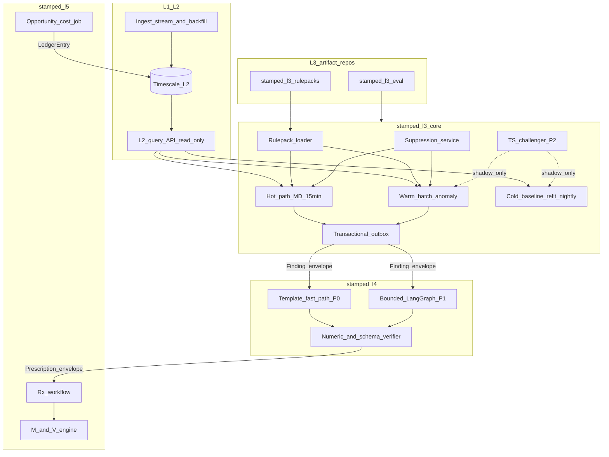
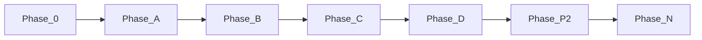

# Beat Zerowatt — L3/L4 Intelligence (Nawab v3, architecture-audited)

> **Supersedes:** `l3_l4_nawab_v2_021db7bc.plan.md`  
> **Mode:** project · **Stack:** Python/FastAPI + Postgres/Timescale + LangGraph (L4)  
> **Branch:** `cursor/l3-l4-intelligence-272a`  
> **Skills applied:** [nawab-plans](.cursor/skills/nawab-plans/SKILL.md), [backend-architecture](.cursor/skills/backend-architecture/SKILL.md), [agentic-system-design](.cursor/skills/agentic-system-design/SKILL.md), [system-design-tradeoffs](.cursor/skills/system-design-tradeoffs/SKILL.md), [frontend-architecture](.cursor/skills/frontend-architecture/SKILL.md) (L6 handoff only)  
> **MCP note:** agent-patterns catalog unavailable in this environment — agent patterns cited from `agentic-system-design` skill; re-query MCP at Phase D for ADR pattern ids.

---

## Architecture audit summary (what changed from v2)

| Area | v2 gap | v3 fix |
|------|--------|--------|
| **Nawab completeness** | Phase B–N matrices deferred | Full matrices below (45+ platform + 30+ consumer rows) |
| **§4 Trust boundaries** | Missing | Auth, tenancy, secrets, OT read-only |
| **§5 Workstreams** | Table only | Per-WS objectives, paths, integration points |
| **§6 Spawn map** | Shorthand rows | Full prompt contracts per [SUBAGENT_ORCHESTRATION.md](.cursor/skills/nawab-plans/SUBAGENT_ORCHESTRATION.md) |
| **ADR-008 vs 3 L3 repos** | Unreconciled | ADR-012 cites L1 edge/cloud/bill precedent; artifact repos ≠ layer boundary violation |
| **Backend** | No outbox/idempotency commits | Transactional outbox, `dedupe_key`, envelope wrapping in contract + core commits |
| **L4 agent** | "Template path" vague | Two-lane architecture: deterministic template-fast-path (P0) + bounded LangGraph (P1) |
| **Evals** | Missing from matrix | L4 golden eval harness (≥20 cases) + L3 golden replay in CI |
| **§17 Risks** | Mitigation only | Likelihood / impact / contingency columns |
| **Frontend** | L6 non-goal only | L6 handoff stub for counterfactual `opportunity_cost` display (no L6 commits P0) — **superseded 2026-07-21:** full L6 architecture/UI handoff + `consumers/stamped-l6` seed (ADR-022/023) |

---

## §0 Plan metadata

| Field | Value |
|-------|-------|
| **Mode** | project |
| **Stack** | stamped-platform → `stamped-l3-core`, `stamped-l3-rulepacks`, `stamped-l3-eval`, `stamped-l4`, `stamped-l5` |
| **Base branch** | `main` |
| **Feature branches** | `cursor/l3-l4-specs-272a` · `cursor/stamped-l3-core-272a` · `cursor/stamped-l3-rulepacks-272a` |
| **Authority docs** | [L3](technical/layers/L3-intelligence-core.md) · [L4](technical/layers/L4-knowledge-and-reasoning.md) · [L5](technical/layers/L5-closure-and-verification.md) · [ADR-008](decisions/ADR-008-layer-repo-topology-and-interfaces.md) · [layer-interfaces-l2](architecture/layer-interfaces-l2.md) · [L2 query API sketch](handoff/stamped-l2-query-api-sketch.md) |
| **Estimated commits** | 45–55 platform + 25–35 consumer |
| **Lead agent** | Orchestrate, commit, integrate subagents, PR |
| **Prerequisite done** | nawab-plans skill (`41577a4`) |

---

## §1 North star and scope boundary

### Objective

Deliver an L3/L4 stack that beats Zerowatt on **bill-verified savings proof**, **prescription accountability** (including counterfactual delay cost), and **dual-mode** (live + historian) analysis — without sacrificing M&V auditability.

### Deliverables

- Updated L1–L5 specs + **ADR-012/013/014**
- New contracts: `finding.json`, `prescription.json`, `ledger-entry.json`, `capex-proposal.json` (+ envelope wrapping)
- [handoff/stamped-l3-build-order.md](handoff/stamped-l3-build-order.md) + [handoff/stamped-l4-architecture-handoff.md](handoff/stamped-l4-architecture-handoff.md)
- `stamped-l3-core` — engines, suppression, transactional outbox
- `stamped-l3-rulepacks` — semver physics/tariff packs + golden CI
- `stamped-l3-eval` — corpus + backtest CLI (P1)
- L4 template-fast-path + L5 `opportunity_cost` job (spec + contracts P0; consumer impl P1)

### Non-goals

- Plant 3D digital twin UX
- Full industrial NILM at incomer ([L3 §3.4](technical/layers/L3-intelligence-core.md))
- Open-ended Zoe-style chat P0
- PINNs / Modelica FMUs
- TimesFM as M&V engine of record
- L6 dashboard implementation (handoff only)

### Priority

| Priority | Items |
|----------|-------|
| **P0** | Specs, contracts, ADRs; MD/PF/tariff deterministic engines; incomer rulepack v0; template-fast-path L4; nawab IMPLEMENTATION_PLAN |
| **P1** | TOW-P baselines, full LangGraph agent, counterfactual ledger job, LightGBM MD exceedance, forging/auto rulepacks |
| **P2** | TimesFM shadow, PdM electrical proxies, fleet meta-analysis, capex ROI sidecar |

**Recommended defaults** (override at approval): incomer-only rulepack P0; execution starts **platform Phase 0+A** before consumer repos (contract-first, clears blockers).

---

## §2 Prerequisites and blockers

| Item | Status | Blocks | Resolution / workaround |
|------|--------|--------|-------------------------|
| nawab-plans skill | **done** | — | `41577a4` |
| L2 query API | pending | Phase B prod path | **Accepted workaround:** fixture JSON client in stamped-l3-core until L2 ships; document in ADR-012 handoff |
| Finding contract frozen | pending | Phase B handlers | Phase A commits 13–18 |
| Pilot golden windows | pending | Phase C eval | Synthetic v0 from L3 playbooks + incomer fixtures |
| TimesFM GPU/RAM | pending | Phase P2 only | CPU single-series batch; optional Vertex for fleet |
| agent-patterns MCP | unavailable | Phase D ADR polish | Manual pattern refs from agentic-system-design skill |

**Hard rule (nawab):** Phase B consumer code starts only after contract-check green on `finding.json` (commit 13 gate).

---

## §3 Authority and artifact map

| Document | Path | Role | Writable by |
|----------|------|------|-------------|
| L3 spec | [technical/layers/L3-intelligence-core.md](technical/layers/L3-intelligence-core.md) | Engine authority | WS-1 lead |
| L4 spec | [technical/layers/L4-knowledge-and-reasoning.md](technical/layers/L4-knowledge-and-reasoning.md) | Agent authority | WS-1 lead |
| L5 spec | [technical/layers/L5-closure-and-verification.md](technical/layers/L5-closure-and-verification.md) | Ledger authority | WS-1 lead |
| Contracts | [contracts/](contracts/) | Cross-repo truth | WS-1 lead only |
| Layer interfaces | [architecture/layer-interfaces-l2.md](architecture/layer-interfaces-l2.md) | Transport + outbox | Read-only |
| L2 query sketch | [handoff/stamped-l2-query-api-sketch.md](handoff/stamped-l2-query-api-sketch.md) | L3/L4 tool boundary | Read-only |
| IMPLEMENTATION_PLAN | root | Execution contract | WS-0 lead |
| PROGRESS | root | Live status | Lead |

Subagents: **read-only** unless spawn map assigns write paths.

---

## §4 Architecture and system map



### L3 repo layout (ADR-012)

```text
stamped-l3-core/       Deployable service — engines, schedulers, outbox, MLflow registry
stamped-l3-rulepacks/  Semver YAML/JSON rulepacks + golden windows (artifact repo)
stamped-l3-eval/       Corpus + rolling backtest CLI (artifact repo; P1)
```

**ADR-008 reconciliation:** L1 already splits into edge/cloud/bill at the same layer. ADR-012 treats rulepacks + eval as **versioned artifacts** consumed by the single L3 deployable (`stamped-l3-core`), analogous to contracts submodule — not a fourth intelligence engine repo.

### Trust boundaries

| Boundary | Auth / policy | Rule |
|----------|---------------|------|
| L3 → L2 | `X-Service-Key` + `X-Org-Id` ([query API sketch](handoff/stamped-l2-query-api-sketch.md)) | Read-only; no `L2_DATABASE_URL` in L3 |
| L3 → L4 | Outbox + `StampedRecordEnvelope` | At-least-once; idempotent `dedupe_key` |
| L4 → L2 tools | Same service key; HTTP only | **No direct DB** ([ADR-008 §8](decisions/ADR-008-layer-repo-topology-and-interfaces.md)) |
| L4 → OT | — | **No write tools**; read-only evidence |
| L5 → L2 ledger | Dedicated append endpoint (P1) | Append-only; L5 owns business policy |
| Secrets | SSM/env per consumer | Never in rulepacks or contracts |
| Tenancy | `org_id` + `plant_id` on every envelope | Cross-tenant params rejected at API |

### Dual-mode execution (hot / warm / cold)

| Path | Trigger | Engines | Latency SLO |
|------|---------|---------|-------------|
| **Hot** | 15-min rollup available | MD histogram, PF slab, suppression | p95 < 30s after rollup |
| **Warm** | Hourly / shift boundary | Anomaly EWMA/CUSUM, rulepack batch | p95 < 5 min |
| **Cold** | Nightly + on-demand backfill | TOW-P refit, eval backtest, TimesFM shadow (P2) | Batch; no hot-path block |

**Scheduler default (backend-architecture):** APScheduler in-process for P0 hot/warm; extract to queue (SQS/Celery) only when measured >500ms or retry needs arise ([trade-off below](#explicit-trade-offs-architecture-audit)).

---

## §5 Workstreams

| ID | Name | Owns | Depends on |
|----|------|------|------------|
| WS-0 | Nawab docs | IMPLEMENTATION_PLAN, PROGRESS, DECISIONS | nawab skill |
| WS-1 | Platform specs | L1–L5 docs, ADRs, contracts, handoff | WS-0 |
| WS-2 | L3 core | `stamped-l3-core` | WS-1 contracts |
| WS-3 | Rulepacks | `stamped-l3-rulepacks` | WS-2 rulepack interface |
| WS-4 | L3 eval | `stamped-l3-eval` | WS-3 golden windows |
| WS-5 | L4 agent | `stamped-l4` template + graph | WS-1 Prescription schema |
| WS-6 | L5 ledger | L5 spec + `opportunity_cost` (**extended 2026-07-20:** full L5 SSOT + ADR-019/020/021 + handoff — see [PHASE_L5_ARCHITECTURE_COMPLETION.md](PHASE_L5_ARCHITECTURE_COMPLETION.md)) | WS-1 LedgerEntry schema |
| WS-7 | TS challenger | TimesFM shadow (P2) | WS-4 eval harness |

### WS-2 — L3 core

- **Objective:** Deterministic MD/PF engines emit idempotent `Finding` via transactional outbox
- **Paths:** consumer repo `stamped-l3-core/` (future); platform handoff docs now
- **Integration:** Outbox → L4 at contract freeze; L2 fixture client until query API live

### WS-5 — L4 agent (agentic-system-design)

- **Objective:** Two-lane prescription emitter with verifier + rules veto
- **Lane A (P0):** Template-fast-path — category + rulepack maps to approved action template; **no LLM** for high-confidence single-finding categories (md_overlap, pf_slab)
- **Lane B (P1):** Bounded LangGraph — planner → 7 tools → drafter → verifier → rules veto; **max 8 steps**; human checkpoint for capex/high-risk
- **Eval:** ≥20 golden tasks ([cross-cutting eval doc](technical/cross-cutting/04-evaluation-and-quality.md) RT-01–RT-06 pattern)

### WS-6 — L5 ledger

- **Objective:** Lifecycle timestamps + `opportunity_cost` counterfactual entries
- **Store split:** L5 writes workflow + ledger job; L2 stores financial truth ([ADR-013](#adr-013-counterfactual-savings-ledger))

---

## §6 Agent orchestration and subagent spawn map

**Parallel limit:** 3 · **Lead retains:** git, commits, PR, PROGRESS

| ID | Trigger | Type | Sync point |
|----|---------|------|------------|
| S1 | Done | explore | Plan v1/v2 |
| S2 | Done | explore | Plan v1/v2 |
| S3 | Phase A commit 12 | explore | Contract diff vs L2 handoff → commit 13 |
| S4 | Phase C commit 3 | generalPurpose | Incomer golden windows → WS-3 |
| S5 | Phase P2 | explore | TimesFM vs LightGBM eval → ADR-014 gate |
| S6 | Phase N | security-review | L4 tool boundary → cutover |
| S7 | Phase D | explore | L4 eval harness cases → WS-5 |

### Spawn: S3 — Contract diff vs L2 handoff

- **Type:** explore · **readonly:** true · **Trigger:** Phase A, before commit 13
- **Paths (read):** `handoff/stamped-l2-*.md`, `contracts/`, `technical/02-technical-architecture.md`
- **Return:** Field-level diff table: arch §5.2–5.4 vs proposed JSON schemas; breaking vs additive flags
- **Sync point:** Lead integrates into commits 13–17

### Spawn: S4 — Incomer golden windows

- **Type:** generalPurpose · **readonly:** false · **Trigger:** Phase C WS-3
- **Paths (write):** `stamped-l3-rulepacks/fixtures/` only (consumer branch)
- **Return:** 3 golden windows (MD spike, PF breach, TOD exposure) + expected findings JSON
- **Gate:** golden replay pytest green

### Spawn: S6 — L4 security review

- **Type:** security-review · **readonly:** true · **Trigger:** Phase N
- **Scope:** No L4 DB credentials; tool allowlist; injection via RAG (RT-01)
- **Sync point:** Findings → hardening commits before PR

---

## §7 Phase map

| Phase | Objective | WS | Commits | Exit gate |
|-------|-----------|-----|---------|-----------|
| **0** | IMPLEMENTATION_PLAN + PROGRESS | WS-0 | 2–3 | Plan approved |
| **A** | Specs, ADRs, contracts | WS-1 | 18–22 | `./scripts/contract-check.sh` |
| **B** | L3 core scaffold | WS-2 | 10–14 | MD Finding from fixture L2 |
| **C** | Rulepacks + eval v0 | WS-3, WS-4 | 8–12 | Golden replay CI green |
| **D** | L4 template + L5 ledger | WS-5, WS-6 | 8–12 | Rx → ledger fixture E2E |
| **P2** | TimesFM shadow | WS-7 | 4–6 | Beats seasonal-naive; no FP regression |
| **N** | Validation + hardening | all | 6–8 | `./scripts/validate.sh` |



---

## §8 Todo registry

- `install-nawab` — **completed**
- `master-plan` — write IMPLEMENTATION_PLAN.md from v3
- `phase-a-specs` — L1–L5 + ADR-012/013/014 + contracts
- `phase-b-l3-core` — stamped-l3-core scaffold + outbox
- `phase-c-rulepacks` — incomer rulepack v0 + eval corpus
- `phase-d-l4-l5` — template-fast-path + opportunity_cost spec/impl
- `phase-p2-timesfm` — shadow challenger eval
- `phase-n-validate` — validate.sh + ponytail-review

---

## §9 Commit matrix

### Phase 0 (WS-0) — 3 commits

| # | WS | Commit | Gate |
|---|-----|--------|------|
| 1 | 0 | `docs: add IMPLEMENTATION_PLAN nawab v3 master plan` | review |
| 2 | 0 | `docs: add PROGRESS.md stub` | — |
| 3 | 0 | `docs: add DECISIONS.md stub for ADR-012–014` | — |

### Phase A (WS-1) — 22 commits

| # | WS | Commit | Gate |
|---|-----|--------|------|
| 4 | 1 | `docs(l3): Zerowatt competitive analysis + surrogate twins` | — |
| 5 | 1 | `docs(l3): dual-mode hot/warm/cold execution map` | — |
| 6 | 1 | `docs(l3): TS foundation model shadow placement` | — |
| 7 | 1 | `docs(l3): suppression service shared contract` | — |
| 8 | 1 | `docs(l4): two-lane template-fast-path + LangGraph P1` | — |
| 9 | 1 | `docs(l4): prescription lifecycle + CapexProposal` | — |
| 10 | 1 | `docs(l5): opportunity_cost ledger entry type` | — |
| 11 | 1 | `docs(l1): startup events + maintenance calendar ingest` | — |
| 12 | 1 | `docs(l2): finding_archive + baseline lock API sketch` | — |
| 13 | 1 | `decisions: ADR-012 L3 artifact repo topology` | — |
| 14 | 1 | `decisions: ADR-013 counterfactual savings ledger` | — |
| 15 | 1 | `decisions: ADR-014 TS foundation model role` | — |
| 16 | 1 | `feat(contracts): add finding.json schema` | contract-check |
| 17 | 1 | `feat(contracts): add prescription.json schema` | contract-check |
| 18 | 1 | `feat(contracts): add ledger-entry.json schema` | contract-check |
| 19 | 1 | `feat(contracts): add capex-proposal.json schema` | contract-check |
| 20 | 1 | `feat(contracts): envelope fields for L3-L5 payloads` | contract-check |
| 21 | 1 | `test(contracts): golden fixtures finding/prescription/ledger` | contract-check |
| 22 | 1 | `chore(contracts): semver bump CHANGELOG` | contract-check |
| 23 | 1 | `handoff: stamped-l3-build-order` | — |
| 24 | 1 | `handoff: stamped-l4-architecture-handoff` (+ ADR-017) | — |
| 25 | 1 | `docs: update REPOS.md for l3 artifact repos` | — |

### Phase B (WS-2) — 12 commits — branch `cursor/stamped-l3-core-272a`

| # | WS | Commit | Gate |
|---|-----|--------|------|
| 26 | 2 | `chore(l3-core): scaffold repo pyproject + layout` | pytest collect |
| 27 | 2 | `ci(l3-core): ruff + pytest workflow` | CI green |
| 28 | 2 | `feat(l3-core): L2 query client protocol + fixture impl` | unit |
| 29 | 2 | `feat(l3-core): domain Finding model + dedupe_key` | unit |
| 30 | 2 | `feat(l3-core): MD engine deterministic core` | unit |
| 31 | 2 | `feat(l3-core): suppression service` | unit |
| 32 | 2 | `feat(l3-core): transactional outbox publisher` | unit |
| 33 | 2 | `feat(l3-core): hot path scheduler wiring` | integration |
| 34 | 2 | `test(l3-core): MD golden fixture to Finding` | pytest |
| 35 | 2 | `feat(l3-core): tariff PF engine v0` | unit |
| 36 | 2 | `feat(l3-core): rulepack loader interface` | unit |
| 37 | 2 | `docs(l3-core): README + platform submodule pin` | — |

### Phase C (WS-3, WS-4) — 10 commits — branch `cursor/stamped-l3-rulepacks-272a`

| # | WS | Commit | Gate |
|---|-----|--------|------|
| 38 | 3 | `chore(rulepacks): scaffold repo + manifest schema` | — |
| 39 | 3 | `feat(rulepacks): incomer MD/PF pack v0.1.0` | golden |
| 40 | 3 | `test(rulepacks): golden replay CI workflow` | CI green |
| 41 | 3 | `feat(rulepacks): TOD exposure rules v0.1.0` | golden |
| 42 | 4 | `chore(eval): scaffold stamped-l3-eval CLI` | — |
| 43 | 4 | `feat(eval): synthetic corpus v0 from playbooks` | CLI run |
| 44 | 4 | `feat(eval): rolling-origin backtest skeleton` | CLI run |
| 45 | 4 | `test(eval): champion registry interface stub` | pytest |
| 46 | 3 | `docs(rulepacks): authoring guide` | — |
| 47 | 3 | `feat(rulepacks): forging compressor pack v0.1.0 P1 placeholder` | skip P0 |

*Row 47 is P1 — mark skipped until forging vertical approved.*

### Phase D (WS-5, WS-6) — 10 commits

| # | WS | Commit | Gate |
|---|-----|--------|------|
| 48 | 5 | `docs(l4): template taxonomy for md_overlap pf_slab` | — |
| 49 | 5 | `feat(contracts): prescription lifecycle timestamp fields` | contract-check |
| 50 | 5 | `test(contracts): template-fast-path golden Rx fixtures` | contract-check |
| 51 | 5 | `feat(l4): template renderer stub consumer repo` | unit |
| 52 | 5 | `feat(l4): numeric verifier + schema gate stub` | unit |
| 53 | 5 | `test(l4): eval harness 20 golden tasks manifest` | manifest lint |
| 54 | 6 | `docs(l5): opportunity_cost job spec + cron` | — |
| 55 | 6 | `feat(contracts): ledger opportunity_cost + modeled status` | contract-check |
| 56 | 6 | `test(contracts): counterfactual fixture E2E chain` | contract-check |
| 57 | 6 | `handoff(l6): counterfactual display fields stub` | — |

### Phase P2 (WS-7) — 5 commits

| # | WS | Commit | Gate |
|---|-----|--------|------|
| 58 | 7 | `feat(l3-core): optional timesfm challenger extra` | import |
| 59 | 7 | `feat(eval): TimesFM shadow runner CLI` | CLI |
| 60 | 7 | `test(eval): pinball loss vs LightGBM gate` | eval report |
| 61 | 7 | `docs: ADR-014 promotion decision record` | — |
| 62 | 7 | `chore(l3-core): pin timesfm version lock` | — |

### Phase N — 7 commits

| # | WS | Commit | Gate |
|---|-----|--------|------|
| 63 | all | `chore: add scripts/validate.sh orchestrator` | run |
| 64 | all | `test: E2E fixture replay finding to ledger` | validate |
| 65 | all | `fix: hardening from S6 security review` | security |
| 66 | all | `test: expand contract adversarial fixtures RT-01-06` | contract-check |
| 67 | all | `docs: PHASE_N_COMPLETION report` | — |
| 68 | all | `docs: PROGRESS.md final P0 state` | — |
| 69 | all | `chore: ponytail-review debt notes` | review |

---

## §10 Test and CI strategy

| Tier | Scope | Trigger | Command |
|------|-------|---------|---------|
| Fast | Contract schemas + golden fixtures | every commit 16+ | `./scripts/contract-check.sh` |
| Fast | L3 engine unit | PR stamped-l3-core | `pytest tests/unit` |
| Medium | Golden rulepack replay | rulepack tag | `pytest tests/golden` |
| Medium | L4 eval harness (≥20 tasks) | PR stamped-l4 | `pytest tests/eval` |
| Slow | Rolling-origin backtest | nightly main | `stamped-l3-eval backtest` |
| Shadow | TimesFM vs LightGBM | P2 branch | eval CLI + promotion gate |

**CI map (platform repo):**

- PR → `contract-check.sh` + markdown link check
- Consumer repos → own GitHub Actions; pin `external/contracts` submodule SHA in README

**Contract-first order:** commits 16–22 before any stamped-l3-core handler (commit 30+).

---

## §11 Research log and decisions

| Topic | Options | Choice | Source |
|-------|---------|--------|--------|
| L3 repo split | 1 monorepo / 3 artifact repos / 5+ repos | **3 repos** (core + rulepacks + eval) | ADR-012; L1 precedent |
| M&V baseline | TOW-P / GBM / TimesFM | **TOW-P of record** | [L3 §3.1h](technical/layers/L3-intelligence-core.md) |
| MD exceedance | LightGBM / LSTM / TimesFM | **LightGBM primary**; TimesFM shadow P2 | [L3 §3.3](technical/layers/L3-intelligence-core.md) |
| Rule engine | GoRules / Drools / Python+YAML | **Python+YAML packs** + GoRules for tariff tables P1 | [L3 §3.5](technical/layers/L3-intelligence-core.md) |
| L4 P0 path | Full agent / template only | **Template-fast-path P0** + LangGraph P1 | agentic-system-design |
| Prescription store | L4 / L5 / L2 | **L5 writes, L2 stores** | ADR-013 |
| Zerowatt counter | rule breadth vs bill truth | **Bill truth + counterfactual ledger** | competitive analysis |

### Explicit trade-offs (architecture audit)

**Trade-off: L3 artifact repos vs monorepo packages**

- **Option A:** Single `stamped-l3` monorepo with `packages/core`, `packages/rulepacks` — Pros: simpler CI; Cons: couples release cadences
- **Option B:** Three repos — Pros: semver rulepacks independent of engine; Cons: more submodule pins
- **Default:** Option B — matches L1 edge/cloud/bill split and Zerowatt-style rule breadth ownership

**Trade-off: In-process scheduler vs job queue (Phase B)**

- **Option A:** APScheduler in stamped-l3-core — Pros: zero infra P0; Cons: no retry isolation
- **Option B:** SQS + worker — Pros: retries, scale; Cons: ops cost before measured need
- **Default:** Option A until hot-path exceeds 500ms p95 or retry requirements proven

**Trade-off: TimesFM hosting (P2)**

- **Option A:** Self-hosted CPU batch — Pros: data stays on-prem; Cons: RAM for 200M params
- **Option B:** Vertex/BQ ML fleet batch — Pros: scale; Cons: egress policy, cost
- **Default:** Option A for pilot; Option B for fleet meta-analysis only if ADR-014 promotes

---

## TimesFM placement (unchanged principle, tighter gates)

Foundation models remain **shadow-only** until P2 gates pass:

- Never cited in M&V `LedgerEntry` or prescription `impact`
- Promotion requires: beats seasonal-naive AND LightGBM on pinball loss (≥3 plants); no FP regression on golden corpus; latency within batch SLO
- Optional dep: `timesfm>=2.0.2` in `[challenger]` extra only

---

## §12 Documentation sync

| Event | Update |
|-------|--------|
| Plan approved | IMPLEMENTATION_PLAN.md, PROGRESS.md |
| Phase complete | PHASE_N_COMPLETION.md |
| ADR written | decisions/ + README index |
| Contract change | contracts/CHANGELOG.md semver |
| New consumer repo | REPOS.md + handoff build-order |

---

## §13 Quality gates

| Gate | When | Blocks |
|------|------|--------|
| contract-check.sh | Commits 16+ | next schema commit |
| Golden replay | Rulepack release tag | promote pack |
| G14 floor | Baseline M&V-eligible | ₹ on verified Rx |
| Precision ≥0.75 | L3 finding gate P1 | fleet rollout |
| L4 eval ≥20 tasks | Phase D | L4 consumer cutover |
| TimesFM shadow 2-week min | P2 | promotion |
| validate.sh | Phase N | PR merge |

**Human checkpoints:** schema freeze after commit 22; TimesFM promote/no-promote; P0 cutover sign-off.

---

## §14 Validation and hardening

1. Static audit — no L4 direct DB; no TimesFM in M&V path; no secrets in rulepacks
2. Pipeline: contract-check → rulepack golden → L3 replay → L4 template E2E → L5 ledger fixture
3. S6 security-review on L4 tool boundary
4. ponytail-review on full diff
5. Manual: counterfactual `opportunity_cost` narrative on fixture plant

Orchestrator: `scripts/validate.sh` (Phase N commit 63).

---

## §15 Rollout and cutover

| Step | Action | Rollback |
|------|--------|----------|
| 1 | Pin contracts submodule in consumer repos | Revert SHA |
| 2 | Deploy stamped-l3-core read-only against L2 fixture → staging L2 API | Disable scheduler |
| 3 | Enable Finding outbox → L4 template-fast-path only | Drain outbox |
| 4 | Enable L5 opportunity_cost job (modeled status only) | Stop cron |
| 5 | P1: enable LangGraph lane + forging rulepacks | Feature flag per plant |

**Parity:** 3 consecutive E2E replays (finding → Rx → ledger) green before pilot plant.

---

## §16 Exit criteria

### P0 (must pass)

- [ ] IMPLEMENTATION_PLAN.md with full §0–§18 + all commit matrices
- [ ] ADR-012, ADR-013, ADR-014 accepted
- [ ] contract-check green on finding/prescription/ledger/capex schemas
- [ ] stamped-l3-core emits MD Finding from fixture via outbox
- [ ] incomer rulepack v0.1 golden CI green
- [ ] L4 template-fast-path produces valid Prescription on fixture
- [ ] L5 opportunity_cost spec + contract fixtures E2E
- [ ] PROGRESS.md reflects Phase A complete minimum

### P1 (defer ok)

- [ ] LangGraph full agent lane
- [ ] forging/auto rulepacks
- [ ] TimesFM promotion decision
- [ ] LightGBM MD exceedance in production

---

## §17 Risks and contingencies

| Risk | L | I | Mitigation | Contingency |
|------|---|---|------------|-------------|
| TimesFM hype displaces TOW-P | M | H | ADR-014 shadow-only | Kill challenger extra |
| ADR-008 vs 3-repo confusion | L | M | ADR-012 explicit L1 precedent | Collapse to monorepo |
| L2 API delay | M | H | Fixture client Phase B | Extend fixture-only pilot |
| Zerowatt rule count narrative | H | M | incomer bill-truth wins first | Add forging P1 |
| Counterfactual disputed | M | H | `verification_status: modeled` | UI disclaimer handoff L6 |
| L4 injection via SOP RAG | L | H | Schema gate + RT-01 tests | Disable RAG P0; templates only |
| Incomer-only caps savings story | M | M | Set 15–20% precision-first expectation | Path A meter expansion |

---

## §18 Execution protocol

1. Load nawab v3 + ponytail on every code edit
2. **Default first scope:** Phase 0 + A (platform) unless user approves parallel B
3. Phase A: one commit per §9 row; contract-check each gate from row 16
4. Spawn S3 before commit 16; integrate diff into schemas
5. Phase B only after commit 22 green; use L2 fixture client
6. Phase C: S4 for golden windows; incomer pack before forging
7. Phase D: template-fast-path before LangGraph; S7 for eval manifest
8. Phase P2: S5 before any TimesFM promotion
9. Phase N: S6 + validate.sh + draft PR

---

## ADR-013 — Counterfactual savings ledger (sketch for Phase A)

**Context:** Zerowatt tracks recommendations; Stamped differentiates with bill-verified closure + "cost of delay."

**Decision:**

- New `LedgerEntry.entry_type: opportunity_cost` when `implemented_at > first_recommended_at`
- Formula path: `delay_days × (potential_inr / 30)` — labeled `verification_status: modeled`
- Lifecycle fields on Prescription: `first_recommended_at`, `implemented_at`, `verified_at`
- L5 job writes; L2 stores; L6 displays (handoff only P0)

---

## Open questions (resolve at approval)

1. **Rulepack vertical:** Default incomer-only P0 — confirm or switch to forging/auto parallel?
2. **Execution scope:** Default platform Phase 0+A first — confirm or parallel B?
3. **TimesFM hosting:** Self-hosted CPU vs Vertex for fleet batch?
4. **Savings ambition:** Hold 15–20% precision-first vs chase Zerowatt 20–30% with Path A commitment?

---

## Approval

Plan v3 — architecture-audited against nawab-plans + backend + agentic + trade-offs skills.

**Status:** Phase 0 in progress — this document is the committed execution contract.

Lead agent follows **§18**; one matrix row = one commit.
