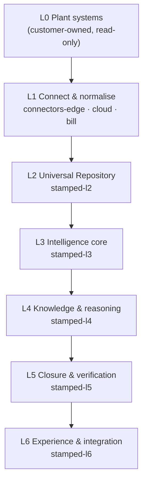
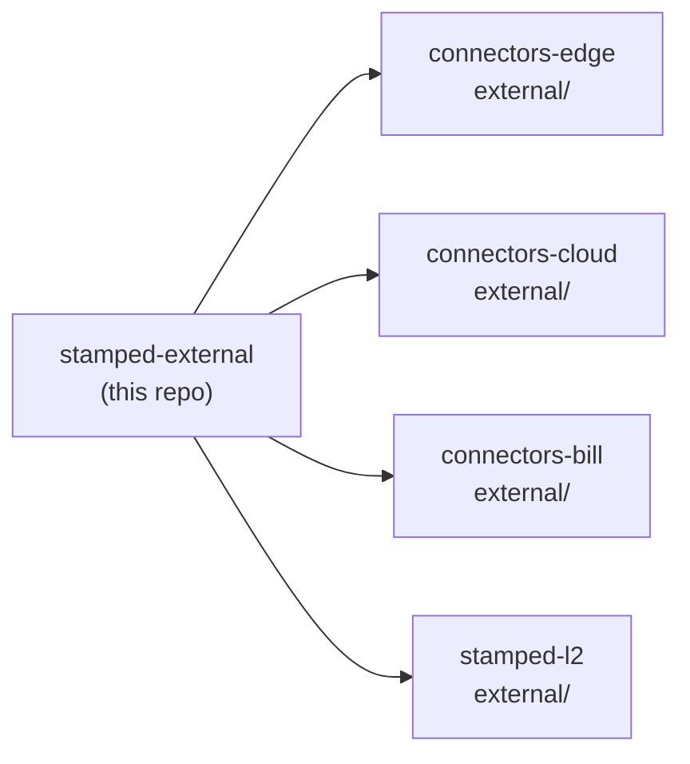
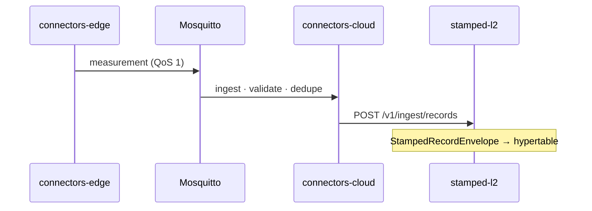
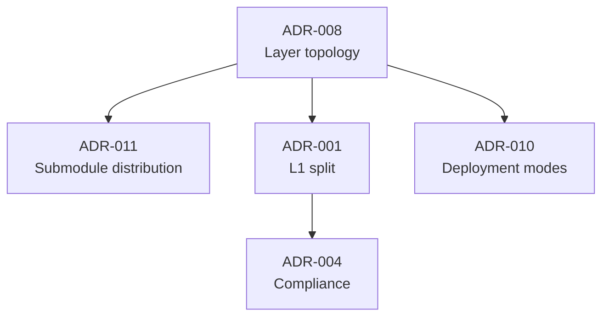
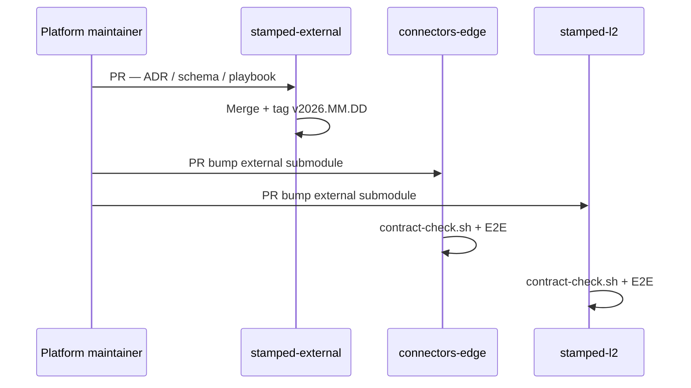

# Stamped Platform — shared architecture, contracts, and handoff

> **What it is:** The single source of truth for Stamped Energy's cross-repo platform layer — JSON schemas, ADRs, technical specs, handoff playbooks, compliance register, and design tokens.  
> **What it is not:** Application code, deploy compose files, or a runnable service. Consumer repos mount this pack as a git submodule and implement layers L1–L6.  
> **Primary interface:** Git submodule at `external/` in each product repository.  
> **GitHub:** [Vinayak-RZ/stamped-external](https://github.com/Vinayak-RZ/stamped-external) · **Current release:** `v2026.07.12` ([VERSION](VERSION))

---

**TL;DR**

- **One repo per layer** (L1 edge/cloud/bill, L2–L6) communicates only through **versioned contracts** in this pack ([ADR-008](decisions/ADR-008-layer-repo-topology-and-interfaces.md))
- **9 JSON schemas**, **5 golden fixtures**, and **7 MQTT topic patterns** define the L1→L2 boundary — CI-enforced via [`scripts/contract-check.sh`](scripts/contract-check.sh)
- **11 accepted ADRs** cover repo topology, edge Go architecture, compliance, deployment modes, and submodule distribution
- **Seven-layer stack (L0–L6)** from plant OT systems to dashboard/API — full engineering spec in [`technical/02-technical-architecture.md`](technical/02-technical-architecture.md)
- **15–20% verified bill reduction** is engineered as closed prescriptions across six waste categories × closure rate × bill M&V — not a single model output
- **Three deployment modes** (`local`, `local-dashboard`, `cloud`) share the same contracts ([ADR-010](decisions/ADR-010-deployment-profiles-and-portability.md))
- **Cost-first defaults:** TimescaleDB on Postgres, Postgres outbox, Mosquitto MQTT, modular monolith — upgrade triggers documented per layer
- **India compliance by design:** CERT-In log residency, DPDP, read-only OT, IS 15959 metering — see [`compliance/india-compliance-register.md`](compliance/india-compliance-register.md)
- **Cursor AI config** vendored from [cursor-config-coding](https://github.com/Vinayak-RZ/cursor-config-coding) — 21 rules, 35 skills ([AGENTS.md](AGENTS.md))
- Pin consumers to **semver tags** (`vYYYY.MM.DD`); never float on `main` in production branches

---

## Table of contents

1. [Vision](#1-vision)
2. [Architecture](#2-architecture)
3. [Platform pack contents](#3-platform-pack-contents)
4. [Consumer repositories](#4-consumer-repositories)
5. [Contracts & MQTT topics](#5-contracts--mqtt-topics)
6. [Architecture decisions (ADRs)](#6-architecture-decisions-adrs)
7. [Technology stack & resolved decisions](#7-technology-stack--resolved-decisions)
8. [Deployment profiles](#8-deployment-profiles)
9. [Quickstart](#9-quickstart)
10. [Project structure](#10-project-structure)
11. [Testing & CI](#11-testing--ci)
12. [Cursor AI configuration](#12-cursor-ai-configuration)
13. [Compliance & design system](#13-compliance--design-system)
14. [Reading order for engineers & agents](#14-reading-order-for-engineers--agents)
15. [Contributing & release workflow](#15-contributing--release-workflow)
16. [Roadmap & changelog](#16-roadmap--changelog)
17. [FAQ & glossary](#17-faq--glossary)

---

## 1. Vision

### 1.1 What Stamped Energy is

Stamped Energy is a **prescriptive energy intelligence platform** for energy-intensive Indian manufacturers. It connects to existing plant infrastructure — SCADA, PLCs, CNCs, energy meters, production data — and turns fragmented telemetry into **assigned actions with rupee-denominated impact**, tracks execution, and **verifies savings on the DISCOM bill**.

> Insight is only valuable if it reliably causes action. Action is only credible if it is measured. Measurement is only trusted if it is in rupees **on the bill**.

Full product context: [`technical/00-stamped-master-document.md`](technical/00-stamped-master-document.md).

### 1.2 What this repository is

| Aspect | Description |
|--------|-------------|
| **Name** | `stamped-external` (platform pack; also referred to as `stamped-platform`) |
| **Role** | Shared contracts, ADRs, specs, handoff docs, compliance, design tokens |
| **Distribution** | Git submodule at `external/` in every consumer repo ([ADR-011](decisions/ADR-011-stamped-platform-submodule-distribution.md)) |
| **Change frequency** | Contracts and ADRs: **high** (CI-enforced). Technical specs: **low**. |

### 1.3 What this repository is not

- Not application code (`packages/`, service implementations live in layer repos)
- Not deploy compose files (each consumer owns `deploy/`)
- Not customer data, secrets, or `.env` with real values
- Not a monitoring dashboard or ESG reporting platform (that is the product built from these specs)

### 1.4 Who it is for

| Audience | Use |
|----------|-----|
| **Layer repo engineers** | Bootstrap new repos, implement against contracts and ADRs |
| **Platform maintainers** | Evolve schemas, ADRs, handoff playbooks; tag releases |
| **AI coding agents** | Onboard via [`AGENTS.md`](AGENTS.md) + [`handoff/`](handoff/) bootstrap docs |
| **Architects / product** | Trace decisions, deployment modes, layer boundaries |

### 1.5 Success criteria

- Every consumer repo pins the same platform tag and passes `contract-check.sh`
- Schema changes are **BACKWARD** compatible unless coordinated major bump
- Dedupe golden in [`contracts/fixtures/dedupe_golden.json`](contracts/fixtures/dedupe_golden.json) matches across cloud ingest and L2 inbox
- ADRs and handoff docs stay authoritative — no drift from copied `external/` folders

---

## 2. Architecture

### 2.1 Seven-layer stack (L0–L6)

Stamped is built as a **layer-per-repo** stack. Each layer improves detection, prescription quality, M&V defensibility, or sustainability evidence — layers that only add charts are rejected.



| Layer | Scope | Repo(s) | Deep spec |
|-------|-------|---------|-----------|
| **L0** | Incomer/feeder meters, SCADA, PLCs, CNC, ERP, DISCOM bills | Customer-owned | — |
| **L1** | Protocol adapters, edge gateway, bill ingest, schema normalisation, MQTT ingress | `connectors-edge`, `connectors-cloud`, `connectors-bill` | [`technical/layers/L1-connect-and-normalise.md`](technical/layers/L1-connect-and-normalise.md) |
| **L2** | Six stores: time-series, energy graph, commercial context, features, baselines, M&V ledger | `stamped-l2` | [`technical/layers/L2-universal-repository.md`](technical/layers/L2-universal-repository.md) |
| **L3** | Baselines, anomaly, MD/demand, attribution, rules/physics, waste classifier | `stamped-l3` | [`technical/layers/L3-intelligence-core.md`](technical/layers/L3-intelligence-core.md) |
| **L4** | Dual-lane prescription agent, adaptive RAG, impact calculator, OSS eval stack | `stamped-l4` | [`technical/layers/L4-knowledge-and-reasoning.md`](technical/layers/L4-knowledge-and-reasoning.md) · [`handoff/stamped-l4-architecture-handoff.md`](handoff/stamped-l4-architecture-handoff.md) |
| **L5** | Workflow, WhatsApp, IPMVP M&V, bill reconciliation, savings ledger | `stamped-l5` | [`technical/layers/L5-closure-and-verification.md`](technical/layers/L5-closure-and-verification.md) |
| **L6** | Dashboard, EMS console, prescription queue, dual-mode analyst, REST API, exports, webhooks | `stamped-l6` | [`technical/layers/L6-experience-and-integration.md`](technical/layers/L6-experience-and-integration.md) · [handoff](handoff/stamped-l6-architecture-handoff.md) |

Engineering authority: [`technical/02-technical-architecture.md`](technical/02-technical-architecture.md) · Boundary contracts: [`architecture/layer-interfaces-l2.md`](architecture/layer-interfaces-l2.md).

### 2.2 Submodule distribution model



Each consumer mounts this pack at **`external/`** and pins an explicit tag (e.g. `v2026.07.12`). Change workflow: PR here → tag → submodule bump PRs in consumers ([SUBMODULE.md](SUBMODULE.md)).

### 2.3 Data flow — measurement path (P0)



Bill path: `connectors-bill` → MQTT `.../bills` → same cloud ingest → L2 `commercial.bill_line`.

Full mode matrix: [`handoff/deployment-profiles.md`](handoff/deployment-profiles.md).

### 2.4 Savings architecture — six waste categories

Verified **15–20% bill reduction** `[~]` is the sum of **closed prescriptions** across six categories, discounted by closure rate and overlap dedup — not a single model output.

| # | Waste category | Typical bill impact `[~]` | Primary L3 engines |
|---|----------------|----------------------------|-------------------|
| 1 | Power quality & MD | 3–8% | Demand/MD, tariff, attribution |
| 2 | Furnaces & process heat | 2–5% | Baseline/SEC, waste classifier, rules |
| 3 | Idle & auxiliary loads | 2–4% | Waste classifier, shift calendar, anomaly |
| 4 | Compressed air | 1–3% | Rules (SP drift), anomaly, attribution |
| 5 | Cooling / HVAC / chillers | 1–3% | Baseline, COP rules, TOD |
| 6 | Source mix & VFD opportunities | 1–4% | Source-mix dispatch, rules |

**Binding constraint:** closure rate and M&V defensibility — which is why L5 is a first-class layer. See §3 of [`technical/02-technical-architecture.md`](technical/02-technical-architecture.md).

### 2.5 Cross-cutting engineering patterns

| Pattern | Application | Authority |
|---------|-------------|-----------|
| Transactional outbox | Reliable L1→L2 publish after local commit | [`architecture/layer-interfaces-l2.md`](architecture/layer-interfaces-l2.md) |
| Idempotent consumers | `dedupe_key` + processed inbox | Same + [`dedupe_golden.json`](contracts/fixtures/dedupe_golden.json) |
| Contract-first JSON Schema | BACKWARD compatibility CI | [ADR-008](decisions/ADR-008-layer-repo-topology-and-interfaces.md) |
| At-least-once delivery | Relay retries; dedupe makes retries safe | Layer interfaces §1 |
| OpenTelemetry | `correlation_id`, `traceparent` on every envelope | [ADR-008](decisions/ADR-008-layer-repo-topology-and-interfaces.md) |

Production patterns: [`technical/cross-cutting/03-production-engineering.md`](technical/cross-cutting/03-production-engineering.md)  
Quality spine: [`technical/cross-cutting/04-evaluation-and-quality.md`](technical/cross-cutting/04-evaluation-and-quality.md)

---

## 3. Platform pack contents

| Directory | Purpose | Change frequency | Key files |
|-----------|---------|------------------|-----------|
| [`contracts/`](contracts/) | JSON schemas, MQTT topics, dedupe golden fixtures | **High** — CI-enforced | 9 schemas, 5 fixtures, [TOPICS.md](contracts/TOPICS.md) |
| [`decisions/`](decisions/) | Architecture Decision Records (ADRs) | **High** — living | 11 ADRs — [index](decisions/README.md) |
| [`handoff/`](handoff/) | Cross-repo integration, playbooks, bootstrap guides | Medium | 15+ handoff docs |
| [`consumers/readmes/`](consumers/readmes/) | Mirrored consumer-repo root READMEs (L1–L4) | Medium | Context snapshots; not canonical |
| [`technical/`](technical/) | Product + engineering reference (L0–L6) | Low | Master doc + 6 layer specs + 2 cross-cutting |
| [`architecture/`](architecture/) | Layer interface contracts (implementation authority) | Medium | [`layer-interfaces-l2.md`](architecture/layer-interfaces-l2.md) |
| [`compliance/`](compliance/) | India regulatory register | Low | [`india-compliance-register.md`](compliance/india-compliance-register.md) |
| [`design/`](design/) | Forge Industrial design system tokens | Low | [`forge-industrial-design-system.md`](design/forge-industrial-design-system.md) |
| [`scripts/`](scripts/) | Shared CI helpers | Medium | [`contract-check.sh`](scripts/contract-check.sh) |
| [`.cursor/`](.cursor/) | Cursor rules, skills, MCP config | Medium | 21 rules, 35 skills |
| Root | Versioning, submodule guide, agent orchestration | Medium | [VERSION](VERSION), [SUBMODULE.md](SUBMODULE.md), [AGENTS.md](AGENTS.md) |

**Invariant:** Contracts and ADRs apply to **all** deployment modes per [ADR-010](decisions/ADR-010-deployment-profiles-and-portability.md).

---

## 4. Consumer repositories

| Repo | GitHub | Layer | Submodule path | Platform pin |
|------|--------|-------|----------------|--------------|
| connectors-edge | [Vinayak-RZ/connectors-edge](https://github.com/Vinayak-RZ/connectors-edge) | L1 plant | `external/` | `v2026.07.12` |
| connectors-cloud | [Vinayak-RZ/connectors-cloud](https://github.com/Vinayak-RZ/connectors-cloud) | L1 cloud | `external/` | `v2026.07.12` |
| connectors-bill | [Vinayak-RZ/connectors-bill](https://github.com/Vinayak-RZ/connectors-bill) | L1 bill | `external/` | `v2026.07.12` |
| universal-repositary | [Vinayak-RZ/universal-repositary](https://github.com/Vinayak-RZ/universal-repositary) | L2 (stamped-l2) | `external/` | `v2026.07.12` |
| intelligence-core | [Vinayak-RZ/intelligence-core](https://github.com/Vinayak-RZ/intelligence-core) | L3 engine | `external/` | — |
| intelligence-rulepacks | [Vinayak-RZ/intelligence-rulepacks](https://github.com/Vinayak-RZ/intelligence-rulepacks) | L3 artifacts | `external/` | — |
| intelligence-evals | [Vinayak-RZ/intelligence-evals](https://github.com/Vinayak-RZ/intelligence-evals) | L3 eval | `external/` | — |
| knowledge-reasoning | [Vinayak-RZ/knowledge-reasoning](https://github.com/Vinayak-RZ/knowledge-reasoning) | L4 | `external/` | — |
| stamped-l5 | planned | L5 | `external/` | [handoff](handoff/stamped-l5-architecture-handoff.md) |
| stamped-l6 | planned | L6 | `external/` | Seed [consumers/stamped-l6](consumers/stamped-l6/) · [handoff](handoff/stamped-l6-architecture-handoff.md) |

Full table: [REPOS.md](REPOS.md). Mirrored root READMEs: [`consumers/readmes/`](consumers/readmes/README.md). Pin each consumer to a **semver tag** of this repo. Do not float on `main` in production branches.

### 4.1 Layer repo one-line missions

| Repo | Mission |
|------|---------|
| **connectors-edge** | Plant runtime — protocol adapters, tag mapping, edge agent (Go), MQTT uplink |
| **connectors-cloud** | Cloud ingest — validate, dedupe, relay `StampedRecordEnvelope` to L2 |
| **connectors-bill** | Bill PDF/photo → validated `BillLine` → MQTT for cloud → L2 |
| **universal-repositary** | Universal Repository (stamped-l2) — six Postgres/Timescale stores, ingest + query APIs |
| **intelligence-core** | L3 engines — findings, dual-lane Lab, outbox to L4 |
| **intelligence-rulepacks** | L3 YAML rulepack / tariff / vertical catalog |
| **intelligence-evals** | L3 golden corpus, gates, Lab forensic UI |
| **knowledge-reasoning** | L4 Finding → Prescription + cited analyst answers |
| **stamped-l5 … l6** | Closure & verification → experience (planned) |

Bootstrap index: [`handoff/README.md`](handoff/README.md).

---

## 5. Contracts & MQTT topics

**Package name (when published):** `stamped-l1-contracts`  
**Schema semver:** `0.5.0` — see [`contracts/CHANGELOG.md`](contracts/CHANGELOG.md)  
**CI:** [`scripts/contract-check.sh`](scripts/contract-check.sh)

### 5.1 JSON schemas (9)

| Schema file | Purpose | Used by |
|-------------|---------|---------|
| [`measurement.json`](contracts/schemas/measurement.json) | Telemetry ingest | edge → MQTT → cloud → L2 |
| [`event.json`](contracts/schemas/event.json) | Connector health, gaps, bill lifecycle events | edge, bill |
| [`production-record.json`](contracts/schemas/production-record.json) | Production context windows | edge |
| [`bill-line.json`](contracts/schemas/bill-line.json) | Canonical DISCOM bill line | bill → MQTT |
| [`stamped-record-envelope.json`](contracts/schemas/stamped-record-envelope.json) | L1→L2 boundary wrapper | cloud → L2 HTTP |
| [`site-config.json`](contracts/schemas/site-config.json) | Plant connector configuration | edge |
| [`mapping-config.json`](contracts/schemas/mapping-config.json) | Tag mapping manifest | edge |
| [`tag-inventory.json`](contracts/schemas/tag-inventory.json) | Discovered tag inventory | edge |
| [`modbus-profile.json`](contracts/schemas/modbus-profile.json) | Modbus register profiles | edge |

### 5.2 Golden fixtures (5)

| Fixture | Validates against | Purpose |
|---------|-------------------|---------|
| [`bill_line.valid.json`](contracts/fixtures/bill_line.valid.json) | `bill-line.json` | Golden valid BillLine |
| [`water_bill_line.valid.json`](contracts/fixtures/water_bill_line.valid.json) | — | Water utility variant |
| [`gas_bill_line.valid.json`](contracts/fixtures/gas_bill_line.valid.json) | — | Gas utility variant |
| [`compliance_doc_event.valid.json`](contracts/fixtures/compliance_doc_event.valid.json) | — | Compliance document event |
| [`dedupe_golden.json`](contracts/fixtures/dedupe_golden.json) | — | **Authoritative** expected `sha256:` dedupe keys |

### 5.3 MQTT topic layout (7 patterns)

Prefix: `stamped/v1/{org_id}/{plant_id}/` · QoS **1** · Retain **false** for high-volume streams.

| Topic suffix | Publisher | Payload schema |
|--------------|-----------|----------------|
| `measurements` | edge-agent | `measurement.json` |
| `measurements/backfill` | edge-agent | `measurement.json` |
| `events` | edge-agent, bill-ingest | `event.json` |
| `production` | edge-agent | `production-record.json` |
| `bills` | bill-ingest | `bill-line.json` |
| `health` | edge-agent | `event.json` |
| `cmd/config` | cloud (tag-mapping-api) | manifest wake-up JSON |

Full spec: [`contracts/TOPICS.md`](contracts/TOPICS.md).

### 5.4 Dedupe keys (business idempotency)

| record_type | Dedupe formula |
|-------------|----------------|
| `measurement` | `sha256(plant_id \| source_tag \| ts_utc \| granularity \| metric.type)` |
| `event` | `sha256(plant_id \| event_type \| event_id)` |
| `production_record` | `sha256(plant_id \| batch_id \| window_start)` |
| `bill_line` | `sha256(plant_id \| bill_id \| line_type \| bill_month)` |

Golden hashes: [`contracts/fixtures/dedupe_golden.json`](contracts/fixtures/dedupe_golden.json). Authority: [`architecture/layer-interfaces-l2.md`](architecture/layer-interfaces-l2.md) §2.2.

---

## 6. Architecture decisions (ADRs)

All ADRs live in [`decisions/`](decisions/). Index: [`decisions/README.md`](decisions/README.md).

| ADR | Title | Status | Key outcome |
|-----|-------|--------|-------------|
| [ADR-001](decisions/ADR-001-l1-repo-split-and-boundaries.md) | L1 repo split, edge packaging, schemas, transport, tag mapping | Accepted | L1 split into edge/cloud/bill; MQTT + schema authority |
| [ADR-002](decisions/ADR-002-build-all-aws-networking.md) | Build-all software, plant networking, AWS cost-first | Accepted | Self-hosted Mosquitto EC2; outbound-only edge |
| [ADR-003](decisions/ADR-003-connectors-edge-monorepo.md) | connectors-edge monorepo, Go/Python packages, asset IDs | Accepted | Go edge-agent; monorepo layout |
| [ADR-004](decisions/ADR-004-compliance-driven-architecture.md) | Compliance-driven architecture | Accepted | CERT-In, DPDP, OT read-only baked into design |
| [ADR-005](decisions/ADR-005-edge-agent-go-architecture.md) | Go edge-agent architecture | Accepted | Buffer, OTA, plugins, testing strategy |
| [ADR-006](decisions/ADR-006-fleet-ota-substrate.md) | Fleet OTA substrate | Accepted | Enhanced manual until ~20 devices |
| [ADR-007](decisions/ADR-007-connectors-cloud-repo-charter.md) | connectors-cloud repo charter | Accepted | L1 cloud ingest only; dedupe + relay |
| [ADR-008](decisions/ADR-008-layer-repo-topology-and-interfaces.md) | Layer-per-repo topology; L1→L6 interfaces | Accepted | One repo per layer; BACKWARD schemas; envelope pattern |
| [ADR-009](decisions/ADR-009-stamped-l2-repo-charter.md) | stamped-l2 repo charter | Accepted | One DB, HTTP P0 ingest, cost-first AWS |
| [ADR-010](decisions/ADR-010-deployment-profiles-and-portability.md) | Three deployment modes | Accepted | `local`, `local-dashboard`, `cloud` |
| [ADR-011](decisions/ADR-011-stamped-platform-submodule-distribution.md) | Submodule single source of truth | Accepted | This repo at `external/`; deprecate copy pattern |

### 6.1 Decision themes (how ADRs connect)



When a downstream repo needs L1 context: start with [`technical/README.md`](technical/README.md), then read ADRs here.

---

## 7. Technology stack & resolved decisions

Defaults from [`technical/02-technical-architecture.md`](technical/02-technical-architecture.md) §4. **Cost rule:** ship the minimum-cost option that is production-correct at pilot scale; document the upgrade trigger.

### 7.1 Core stack (P0 defaults)

| Area | Start now (min cost) | Upgrade when | Deep dive |
|------|---------------------|--------------|-----------|
| Time-series DB | **TimescaleDB on managed Postgres** | ClickHouse sidecar if analytics breach Postgres SLOs | [L2 spec](technical/layers/L2-universal-repository.md) |
| Graph / adjacency | **Relational adjacency in Postgres** + in-memory cache | Dedicated graph DB if traversal >500 nodes/plant | [L2 spec](technical/layers/L2-universal-repository.md) |
| Event backbone | **Postgres transactional outbox** + idempotent ingest | Redpanda/MSK at ~5k msg/s sustained fan-out | [Production engineering](technical/cross-cutting/03-production-engineering.md) |
| Service architecture | **Modular monolith (FastAPI) + satellites** on ECS Fargate | Extract services when isolation justifies ops tax | Same |
| MQTT broker | **Mosquitto** on edge gateway | EMQX Cloud for enterprise SLA/clustering | [L1 spec](technical/layers/L1-connect-and-normalise.md) |
| OT protocol drivers | **Build:** Modbus TCP/RTU, CSV, bill PDF, generic MQTT | **Buy per site:** Kepware/NeuronEX for OPC-DA, S7comm | [L1 spec](technical/layers/L1-connect-and-normalise.md) |
| Edge runtime | **Go edge-agent** (buffer, OTA, plugins) | — | [ADR-005](decisions/ADR-005-edge-agent-go-architecture.md) |
| Agent orchestration | **LangGraph-class** + Postgres checkpointing | Managed agent platform if ops >1 engineer-day/month | [L4 spec](technical/layers/L4-knowledge-and-reasoning.md) |
| LLM inference | **Frontier API** (pay-per-prescription) | Self-hosted when data-residency forbids cloud LLM | [L4 spec](technical/layers/L4-knowledge-and-reasoning.md) |
| WhatsApp | **Meta WhatsApp Cloud API direct** | Indian BSP for enterprise support/redundancy | [L5 spec](technical/layers/L5-closure-and-verification.md) |
| Observability | **OpenTelemetry → Grafana Cloud free tier** | Grafana Pro/Datadog for retention/SSO | [Production engineering](technical/cross-cutting/03-production-engineering.md) |
| Bill OCR | **Open-source layout parser + vision-LLM fallback** | Commercial doc-AI if recompute gate failure rate high | [L1 spec](technical/layers/L1-connect-and-normalise.md) |

### 7.2 Build phases

| Phase | Timeline | Focus |
|-------|----------|-------|
| **P0** | Weeks 1–8 | MD/bill wedge — meter + bill path, dedupe, L2 ingest |
| **P1** | Months 3–6 | Full OT depth — machine-level SEC, compressor/furnace Rx |
| **P2** | Months 6–12 | Fleet + dispatch, source-mix optimization |
| **P3** | 12+ months | Depth features, enterprise integrations |

Every layer spec phases recommendations against P0→P3.

### 7.3 Integration paths

| Path | Data minimum | Cumulative savings target `[~]` |
|------|--------------|----------------------------------|
| **Path B** (meter + bill) | Incomer meter + DISCOM bill | **8–12%** bill (months 1–6) |
| **Path A** (full OT) | Above + SCADA/PLC/CNC tags | **12–20%** bill (months 3–12) |

---

## 8. Deployment profiles

**Authority:** [ADR-010](decisions/ADR-010-deployment-profiles-and-portability.md)  
**Cross-repo reference:** [`handoff/deployment-profiles.md`](handoff/deployment-profiles.md)

```bash
export STAMPED_DEPLOYMENT_MODE=local            # air-gap core
export STAMPED_DEPLOYMENT_MODE=local-dashboard  # air-gap + internal UI
export STAMPED_DEPLOYMENT_MODE=cloud            # Stamped AWS (default pilots)
```

### 8.1 Mode matrix

| Capability | `local` | `local-dashboard` | `cloud` |
|------------|---------|-------------------|---------|
| Outbound internet | None | None | Stamped AWS |
| Orchestration | Docker Compose | Docker Compose | ECS + RDS |
| MQTT broker | compose `mosquitto` | same | EC2 Mosquitto |
| L1 cloud ingest | compose | compose | Fargate |
| L1 bill | compose + MinIO | compose + MinIO | S3 + Fargate |
| L2 Timescale | compose | compose | RDS |
| Intelligence LLM | **local-llm required** | **local-llm required** | Frontier API |
| Customer dashboard | — | stamped-l6 compose | Vercel/CloudFront |
| OTA / updates | signed bundle P1 | same | HTTPS deploy |

### 8.2 Portability playbooks

| Repo | Playbook |
|------|----------|
| connectors-edge | [`handoff/connectors-edge-portability-playbook.md`](handoff/connectors-edge-portability-playbook.md) |
| connectors-cloud | [`handoff/connectors-cloud-portability-playbook.md`](handoff/connectors-cloud-portability-playbook.md) |
| connectors-bill | [`handoff/connectors-bill-portability-playbook.md`](handoff/connectors-bill-portability-playbook.md) |
| stamped-l2 | [`handoff/stamped-l2-portability-playbook.md`](handoff/stamped-l2-portability-playbook.md) |

---

## 9. Quickstart

### 9.1 Prerequisites

- Git 2.13+ (submodule support)
- Python 3.10+ with `jsonschema` (for contract-check): `pip install jsonschema`
- Access to consumer repos on GitHub (for submodule add)

### 9.2 Clone this platform repo

```bash
git clone https://github.com/vinayak-rz/stamped-external.git
cd stamped-external
git checkout v2026.07.12   # pin to release tag
```

### 9.3 Add submodule to a new consumer repo

```bash
# From consumer repo root (e.g. stamped-l2)
git submodule add https://github.com/vinayak-rz/stamped-external.git external
git submodule update --init --recursive
cd external && git checkout v2026.07.12
cd .. && git add .gitmodules external
git commit -m "chore: add stamped-external submodule at v2026.07.12"
```

Full migration from copied `external/`: [SUBMODULE.md](SUBMODULE.md) · Helper: [`scripts/migrate-external-to-submodule.sh`](scripts/migrate-external-to-submodule.sh).

### 9.4 Clone consumer repo with submodules

```bash
git clone --recurse-submodules https://github.com/Vinayak-RZ/universal-repositary.git
# or after clone:
git submodule update --init --recursive
```

**Agents / CI:** always `git submodule update --init` before build.

### 9.5 Verify contract integrity

```bash
./scripts/contract-check.sh
# Expected: contract-check: OK (9 schemas, 5 fixtures)
#            contract-check: dedupe golden present
```

From a consumer repo: `external/scripts/contract-check.sh`.

### 9.6 Platform maintainer release flow

1. **Contract or ADR change** → PR in `stamped-external` only
2. Merge → tag release (`vYYYY.MM.DD`; bump [`VERSION`](VERSION) and [`CHANGELOG.md`](CHANGELOG.md))
3. Open PR in each affected consumer repo bumping `external` submodule pointer
4. Consumer CI must pass `contract-check.sh` and repo-specific E2E

Details: [CONTRIBUTING.md](CONTRIBUTING.md).

---

## 10. Project structure

```text
stamped-external/
├── README.md                         ← this file
├── AGENTS.md                         ← Cursor agent orchestration + repo-specific rules
├── VERSION                           ← current platform release (2026.07.12)
├── CHANGELOG.md                      ← cross-pack release notes
├── SUBMODULE.md                      ← submodule setup & migration guide
├── REPOS.md                          ← consumer repo index
├── CONTRIBUTING.md                   ← PR workflow, release tagging
├── skills-manifest.json              ← Cursor skill inventory
│
├── contracts/                        ← stamped-l1-contracts (canonical)
│   ├── schemas/                      ← 9 JSON Schema files
│   ├── fixtures/                     ← 5 golden fixtures + dedupe_golden
│   ├── TOPICS.md                     ← MQTT topic layout v1
│   ├── CHANGELOG.md                  ← schema semver (0.5.0)
│   └── README.md
│
├── decisions/                        ← 11 ADRs
│   ├── README.md                     ← ADR index
│   └── ADR-001 … ADR-011
│
├── handoff/                          ← cross-repo bootstrap & playbooks
│   ├── README.md                     ← bootstrap index
│   ├── deployment-profiles.md        ← three-mode matrix
│   ├── stamped-l2-*.md               ← L2 charter, schema, build order, AWS
│   ├── connectors-bill-*.md          ← bill repo charter, UI/UX
│   └── *-portability-playbook.md     ← per-repo air-gap guides
│
├── consumers/
│   ├── readmes/                      ← mirrored L1–L4 consumer root READMEs
│   └── stamped-l3-* / stamped-l4/    ← reference scaffolds (not live repos)
│
├── technical/                        ← engineering reference pack
│   ├── 00-stamped-master-document.md ← product & company source of truth
│   ├── 01-product-architecture.md    ← 10 capability modules, UX surfaces
│   ├── 02-technical-architecture.md  ← L0–L6 stack, savings math, tech decisions
│   ├── layers/                       ← L1–L6 deep specs
│   └── cross-cutting/                ← production engineering, eval & quality
│
├── architecture/
│   └── layer-interfaces-l2.md        ← L1↔L2↔L3 boundary authority
│
├── compliance/
│   └── india-compliance-register.md  ← CERT-In, DPDP, OT, metering
│
├── design/
│   ├── forge-industrial-design-system.md
│   └── forge-industrial-v2.tokens.yaml
│
├── scripts/
│   ├── contract-check.sh             ← shared CI schema validator
│   └── migrate-external-to-submodule.sh
│
├── .cursor/                          ← Cursor AI config (vendored)
│   ├── rules/                        ← 21 .mdc rule files
│   ├── skills/                       ← 35 pre-installed skills
│   ├── skills-catalog/               ← optional stack skills (not loaded)
│   └── mcp.json                      ← agent-patterns MCP
│
└── .github/workflows/
    └── contract-check.yml            ← CI on PR
```

---

## 11. Testing & CI

### 11.1 Contract check (this repo)

```bash
pip install jsonschema
./scripts/contract-check.sh
```

Validates: all 9 schemas parse as JSON; fixtures parse; `bill_line.valid.json` validates against `bill-line.json`; `dedupe_golden.json` present.

CI workflow: [`.github/workflows/contract-check.yml`](.github/workflows/contract-check.yml).

### 11.2 Consumer repo CI checklist

Each consumer should run on PR:

- [ ] `external/scripts/contract-check.sh` passes
- [ ] Dedupe golden unchanged across deployment modes
- [ ] Measurement E2E: edge → MQTT → cloud → L2 inbox + hypertable
- [ ] Bill E2E: bill publish → cloud inbox → L2 `bill_line`
- [ ] Repo-specific unit/integration tests pass

Validation checklist: [`handoff/deployment-profiles.md`](handoff/deployment-profiles.md) §Validation.

### 11.3 Evaluation & quality spine

Testing pyramid, data-quality gates, ML/LLM evals, shadow mode, CI gates: [`technical/cross-cutting/04-evaluation-and-quality.md`](technical/cross-cutting/04-evaluation-and-quality.md).

---

## 12. Cursor AI configuration

This repo includes [cursor-config-coding](https://github.com/Vinayak-RZ/cursor-config-coding) vendored under `.cursor/` for cloud agents and local Cursor sessions.

| Asset | Count | Purpose |
|-------|-------|---------|
| Rules (`.cursor/rules/`) | **21** | Workflow, ponytail, architecture, security, commits |
| Skills (`.cursor/skills/`) | **35** | Spec Kit, ponytail, architecture, GSAP, UI, learning |
| MCP (`.cursor/mcp.json`) | 1 server | [Agent Patterns Catalog](https://www.agentpatternscatalog.org/) |
| Orchestration | — | [`AGENTS.md`](AGENTS.md) — repo-specific agent rules |

Manifest: [`skills-manifest.json`](skills-manifest.json).

### 12.1 Agent workflow in this repo

1. Read [`AGENTS.md`](AGENTS.md) + `.cursor/rules/` (start with `rule-awareness`, `ponytail`, `core-engineering`)
2. For contract changes: run `contract-check.sh`; update `contracts/CHANGELOG.md`
3. For ADRs: follow template in `decisions/`; update index
4. Plan → approve → implement → validate → conventional commit

### 12.2 Refresh upstream Cursor config

```bash
git clone --depth 1 https://github.com/Vinayak-RZ/cursor-config-coding.git /tmp/cursor-config-coding
cp -a /tmp/cursor-config-coding/.cursor .
cp /tmp/cursor-config-coding/skills-manifest.json .
# Re-apply repo-specific AGENTS.md overrides as needed
```

---

## 13. Compliance & design system

### 13.1 India compliance register

Living register for Indian ICP manufacturing plants: [`compliance/india-compliance-register.md`](compliance/india-compliance-register.md).

| Priority | Domain | Stamped action |
|----------|--------|----------------|
| **P0** | CERT-In Directions 2022 | 6h incident reporting; **180-day logs in India** (`ap-south-1`); NTP sync |
| **P0** | DPDP Act 2023 + Rules 2025 | Privacy notice, DPAs, breach process, minimal PII in telemetry |
| **P0** | OT security | Read-only + outbound-only; no PLC writes; no inbound plant ports |
| **P0** | Cloud residency | All logs and primary data in `ap-south-1` |
| **P0** | Metering standards | IS 15959, IS 16444, IEC 62056 for DLMS connector |
| **P1** | OT standards | IEC 62443, NIST SP 800-82 zone/conduit design |
| **P1** | Energy customer regs | BEE PAT, Energy Conservation Act — M&V evidence formats |

Authority: [ADR-004](decisions/ADR-004-compliance-driven-architecture.md).

### 13.2 Forge Industrial design system

**Use in:** connectors-bill customer UI, stamped-l6 dashboard, product surfaces.

| Asset | Path |
|-------|------|
| Design system doc | [`design/forge-industrial-design-system.md`](design/forge-industrial-design-system.md) |
| Machine-readable tokens | [`design/forge-industrial-v2.tokens.yaml`](design/forge-industrial-v2.tokens.yaml) |
| Primary CTA color | `#F75440` |
| Product voice | Rupees on the bill; Connect → Observe → Decide → Execute → Verify |

---

## 14. Reading order for engineers & agents

### 14.1 New to Stamped (any repo)

| # | Document | Read for |
|---|----------|----------|
| 1 | This README | Platform pack overview |
| 2 | [`technical/00-stamped-master-document.md`](technical/00-stamped-master-document.md) | Product vision, ICP, outcomes |
| 3 | [`decisions/README.md`](decisions/README.md) | Architecture decisions index |
| 4 | [`handoff/deployment-profiles.md`](handoff/deployment-profiles.md) | Three deployment modes |
| 5 | [`handoff/README.md`](handoff/README.md) | Repo-specific bootstrap index |
| 6 | Your repo's handoff doc | e.g. [`handoff/stamped-l2-spec.md`](handoff/stamped-l2-spec.md) |

### 14.2 Technical deep dive

| # | Document | Read for |
|---|----------|----------|
| 1 | [`technical/README.md`](technical/README.md) | Technical pack index |
| 2 | [`technical/02-technical-architecture.md`](technical/02-technical-architecture.md) | L0–L6 stack, savings math, tech decisions |
| 3 | [`architecture/layer-interfaces-l2.md`](architecture/layer-interfaces-l2.md) | L1↔L2↔L3 boundaries |
| 4 | Relevant layer spec in `technical/layers/` | Per-layer build guidance |
| 5 | [`technical/cross-cutting/03-production-engineering.md`](technical/cross-cutting/03-production-engineering.md) | Streaming, reliability, observability |
| 6 | [`technical/cross-cutting/04-evaluation-and-quality.md`](technical/cross-cutting/04-evaluation-and-quality.md) | Testing, evals, CI gates |

### 14.3 Agent paste-in prompt

For any consumer repo `AGENTS.md`: [`handoff/consumer-platform-prompt.md`](handoff/consumer-platform-prompt.md).

---

## 15. Contributing & release workflow

Full guide: [CONTRIBUTING.md](CONTRIBUTING.md).

| Change type | Who | Requirements |
|-------------|-----|--------------|
| JSON schema / fixture | Contract owner + L1/L2 engineers | BACKWARD compatibility; bump `contracts/CHANGELOG.md` |
| ADR (new decision) | Architecture / product | ADR template in `decisions/` |
| Handoff / playbook | Layer repo owner | Cross-repo impact in PR description |
| Technical reference | Research / architecture | Low frequency |

### 15.1 Release tagging

| Change | Tag bump |
|--------|----------|
| Schema breaking (major) | `contracts` major + platform tag `vYYYY.MM.DD` |
| Schema additive (minor) | `contracts` minor + platform tag |
| ADR / docs only | Platform tag `vYYYY.MM.DD` |

```bash
echo "2026.07.12" > VERSION
git add VERSION CHANGELOG.md
git commit -m "chore(release): v2026.07.12"
git tag v2026.07.12
git push origin main --tags
```

### 15.2 Submodule bump communication



---

## 16. Roadmap & changelog

### 16.1 Build phases (platform pack)

| Phase | Theme | Status |
|-------|-------|--------|
| 0 | Platform pack structure + ADR-010/011 + submodule distribution | ✅ Shipped `v2026.07.12` |
| 1 | Submodule migration in all 4 consumer repos | 🔄 Planned |
| 2 | `stamped-l1-contracts` PyPI/npm publish | 📋 Optional P1 |
| 3 | stamped-l3 … stamped-l6 repos + handoff docs | 📋 Future |

### 16.2 Possible future directions

- Automated submodule bump bot across consumer repos on platform tag
- Schema registry integration (Confluent/Apicurio) when fan-out exceeds Postgres outbox
- Published `stamped-l1-contracts` package for non-git consumers
- ADR-012+ as L3–L6 repos bootstrap

### 16.3 Changelog

Platform release notes: [CHANGELOG.md](CHANGELOG.md) · Schema semver: [contracts/CHANGELOG.md](contracts/CHANGELOG.md).

| Date | Change |
|------|--------|
| 2026-07-19 | Consumer README snapshots under `consumers/readmes/` (L1–L4) |
| 2026-07-12 | Extensive README — architecture, tech, ADRs, contracts catalog |
| 2026-07-12 | Cursor config from `cursor-config-coding` vendored for cloud agents |
| 2026-07-12 | Platform pack prepared for `stamped-external` + submodule distribution (ADR-011) |
| 2026-07-12 | ADR-010 deployment profiles; four portability playbooks |
| 2026-07-12 | ADR-009 stamped-l2 charter; layer-interfaces-l2 |
| 2026-07-11 | connectors-bill handoff; bill-line schema 0.4.0 |
| 2026-07-10 | ADR-007/008; stamped-record-envelope; eight-repo topology |
| 2026-07-09 | Initial P0 schemas; ADR-001 through ADR-006 |

---

## 17. FAQ & glossary

### 17.1 FAQ

**Why a separate platform repo instead of copying `external/`?**  
Copied folders drift across repos (different ADR versions, mismatched dedupe golden). Git submodule with pinned tags gives one source of truth ([ADR-011](decisions/ADR-011-stamped-platform-submodule-distribution.md)).

**Can I change a schema in a consumer repo?**  
No. Schemas are canonical here. PR in `stamped-external`, tag, then bump submodule in consumers.

**What if `contract-check.sh` says `pip install jsonschema`?**  
Run `pip install jsonschema` and retry. CI installs it automatically.

**Do deployment modes change contracts?**  
No. Same schemas and dedupe golden across `local`, `local-dashboard`, and `cloud` ([ADR-010](decisions/ADR-010-deployment-profiles-and-portability.md)).

**Where is application code?**  
In layer repos (`connectors-edge`, `connectors-cloud`, etc.). This repo is specs + contracts only.

**How do cloud agents load Cursor skills?**  
Skills must be committed in-repo under `.cursor/skills/` — vendored from [cursor-config-coding](https://github.com/Vinayak-RZ/cursor-config-coding), not symlinked locally only.

### 17.2 Glossary

| Term | Definition |
|------|------------|
| **StampedRecordEnvelope** | JSON wrapper for all L1→L2 records; includes `dedupe_key`, `record_type`, `payload` |
| **BillLine** | Canonical schema for one line item on a DISCOM electricity bill |
| **Dedupe key** | `sha256:` hash ensuring idempotent ingest across at-least-once delivery |
| **Path A / Path B** | Full OT integration vs meter+bill-only integration paths |
| **Closure rate** | Fraction of high-priority prescriptions acted within one billing cycle |
| **M&V** | Measurement & Verification — IPMVP-style savings proof on bill |
| **MD** | Maximum Demand — billing demand charge driver |
| **DISCOM** | Distribution company — electricity bill issuer in India |
| **Forge Industrial** | Stamped product design system (v2.0) |
| **Platform pin** | Git tag of `stamped-external` that a consumer submodule points to |
| **Ponytail** | Minimal-code discipline skill — read before any code change |
| **Spec Kit** | Spec-Driven Development workflow for greenfield/multi-phase features |

---

*Maintained by Stamped Energy engineering. For issues with this pack, open a PR or issue in [stamped-external](https://github.com/Vinayak-RZ/stamped-external).*
