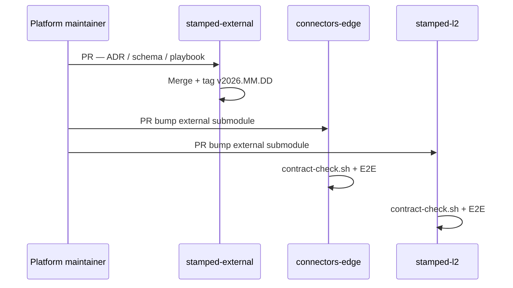

# Submodule setup and migration — stamped-external

> **Audience:** Engineers wiring `stamped-external` into Stamped product repos  
> **ADR:** [ADR-011](decisions/ADR-011-stamped-platform-submodule-distribution.md)

---

## 1. Create the platform repository (one-time — complete)

This repository is **`vinayak-rz/stamped-external`**. Contents live at **repository root** — not under a nested `external/` folder.

To bootstrap a fresh clone of this repo:

```bash
git clone https://github.com/vinayak-rz/stamped-external.git
cd stamped-external
git checkout v2026.07.12   # pin to release tag
```

---

## 2. Add submodule to a consumer repo (new repo)

```bash
cd connectors-cloud   # or stamped-l2, connectors-edge, connectors-bill
git submodule add https://github.com/vinayak-rz/stamped-external.git external
cd external && git checkout v2026.07.12 && cd ..
git add .gitmodules external
git commit -m "chore: add stamped-external submodule at v2026.07.12"
```

Result in consumer repo:

```text
connectors-cloud/
├── external/          ← submodule → stamped-external @ tag
│   ├── contracts/
│   ├── decisions/
│   └── ...
├── packages/
└── deploy/
```

---

## 3. Migrate existing repo (replace copied `external/`)

**If `external/` is already tracked as normal files:**

```bash
cd stamped-l2
# Backup if needed
mv external external.bak

git submodule add https://github.com/vinayak-rz/stamped-external.git external
cd external && git checkout v2026.07.12 && cd ..

# Remove old tracked external/ from git index (paths now submodule)
git rm -r --cached external.bak 2>/dev/null || true
rm -rf external.bak

git add .gitmodules external
git commit -m "refactor: replace copied external/ with stamped-external submodule"
```

**Update CI paths** — scripts should still use `external/contracts/` (unchanged path).

---

## 4. Clone consumer repo with submodules

```bash
git clone --recurse-submodules https://github.com/Vinayak-RZ/universal-repositary.git
# or after clone:
git submodule update --init --recursive
```

**Agents / CI:** always `git submodule update --init` before build.

---

## 5. Bump platform version in a consumer

```bash
cd external
git fetch origin
git checkout v2026.08.01   # new tag
cd ..
git add external
git commit -m "chore(platform): bump stamped-external to v2026.08.01"
```

One PR per consumer repo (or batch if same change affects all).

---

## 6. Make a platform change (communication flow)



**Announce changes:** GitHub release notes on `stamped-external` tag + optional Slack/issue linking affected ADR number.

---

## 7. CI checklist (each consumer)

Add to PR pipeline:

```bash
git submodule update --init --recursive
test -f external/VERSION || (echo "submodule not initialized" && exit 1)
./external/scripts/contract-check.sh
# Optional: fail if submodule not pinned to tag
cd external && git describe --exact-match --tags HEAD
```

---

## 8. Air-gap bundle releases

Signed offline bundles must vendor a **pinned submodule SHA**:

```bash
cd external && git rev-parse HEAD > ../bundle-stamped-external.sha
```

Include `external/` directory contents in the release tarball (not a gitlink).

---

## 9. Troubleshooting

| Problem | Fix |
|---------|-----|
| Empty `external/` after clone | `git submodule update --init --recursive` |
| Submodule on wrong commit | `cd external && git checkout <tag>` |
| Detached HEAD in submodule | Normal at tag pin; commit bumps happen in platform repo |
| Merge conflict on submodule pointer | Take intentional newer SHA; re-run contract-check |

---

## Changelog

| Date | Change |
|------|--------|
| 2026-07-12 | Initial submodule migration guide |
