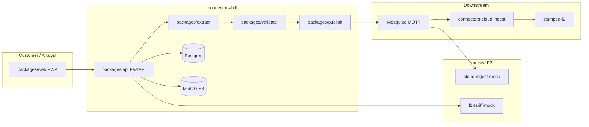
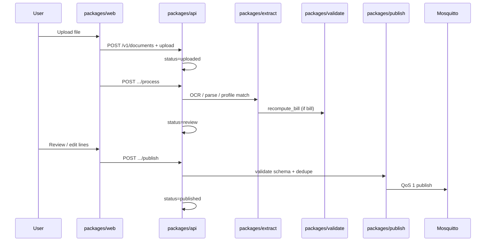

<!-- SNAPSHOT: mirrored from connectors-bill/README.md on 2026-07-19. Canonical README lives in the consumer repo — re-sync when that README changes. -->

> **Snapshot** of [`connectors-bill`](https://github.com/Vinayak-RZ/connectors-bill) root README (copied 2026-07-19).
> Canonical source: consumer repo `README.md`. Do not edit here for product truth — update the consumer repo, then re-copy.

---

# connectors-bill — L1 document intake for Stamped Energy

> **What it is:** A customer-facing mobile-first PWA plus FastAPI backend that ingests DISCOM electricity bills and plant documents, validates them, and publishes canonical records to MQTT for downstream **connectors-cloud** ingest.
>
> **What it is not:** An MQTT consumer, edge agent, L2 database, or intelligence layer. It never writes directly to stamped-l2 and never routes uploads through connectors-edge.
>
> **Primary interface:** Web PWA at `/upload` (customers) and `/analyst/queue` (tariff analysts). REST API at `/v1/*`.

**Runtime:** Python 3.12+ · Node 20+ · Postgres · MinIO/S3 · Mosquitto MQTT

---

**TL;DR**

- Two-section intake: **Section A** (DISCOM bills) and **Section B** (plant documents)
- **7 DISCOM HT zones** with golden fixtures + **LT / water / gas** utility bills (P2)
- Deterministic **₹ recompute gate** before bill publish; tariff-pinned recompute via approved contracts
- Publishes **BillLine**, **Measurement**, **ProductionRecord**, and **Event** payloads over MQTT QoS 1
- **jsonschema** validation at publish boundary; exponential-backoff MQTT retry with dead-letter logging
- Pluggable **OCR** (pdfplumber → pdf2image/Tesseract → Textract) and **LLM** (mock/OpenAI/Bedrock/openai_compat)
- **Tariff analyst builder** — queue, YAML draft, optional L2 relay
- **Mock simulation layer** — seed personas, MQTT inbox assert, provider fixtures, Playwright helpers
- **48 pytest** + **40 Playwright** (14 journeys × desktop/mobile) + contract CI
- **en-IN / hi-IN** i18n via next-intl; offline photo queue (IndexedDB)
- Local stack: `docker compose -f deploy/docker-compose.bill.yml up`

---

## Table of contents

1. [Vision](#1-vision)
2. [Architecture](#2-architecture)
3. [Quickstart](#3-quickstart)
4. [Configuration](#4-configuration)
5. [External AI & OCR API calls](#5-external-ai--ocr-api-calls)
6. [Project structure](#6-project-structure)
7. [REST API reference](#7-rest-api-reference)
8. [Web UI routes](#8-web-ui-routes)
9. [Document types & intake](#9-document-types--intake)
10. [Data model](#10-data-model)
11. [MQTT & contracts](#11-mqtt--contracts)
12. [Mock simulation layer](#12-mock-simulation-layer)
13. [Testing](#13-testing)
14. [Deployment & CI](#14-deployment--ci)
15. [Cookbook](#15-cookbook)
16. [Roadmap & changelog](#16-roadmap--changelog)
17. [FAQ & glossary](#17-faq--glossary)
18. [Related documentation](#18-related-documentation)

---

## 1. Vision

### 1.1 What it is

connectors-bill is the **L1 connect-and-normalise** intake path for Stamped Energy's industrial customers in India. Plant supervisors upload:

- **Electricity bills** (HT portal PDFs, phone photos, LT bills) from state DISCOMs
- **Plant documents** (EMS CSV, production exports, shift calendars, tariff orders, compliance PDFs)

The system extracts structured data, runs validation gates (especially bill ₹ recompute), and publishes schema-valid records to MQTT. **connectors-cloud** consumes those topics and writes to **stamped-l2**.

### 1.2 What it is not

| Out of scope | Owner |
|--------------|-------|
| MQTT ingest / outbox consumer | [connectors-cloud](https://github.com/Vinayak-RZ/connectors-cloud) |
| Modbus / OT edge streaming | connectors-edge |
| Direct stamped-l2 DB writes | connectors-cloud / L2 |
| L3–L6 intelligence (findings, prescriptions) | stamped-l3 … stamped-l6 |
| Production AWS/Terraform deploy | Separate infra repo (P2 ships in-repo only) |

### 1.3 Who it is for

| Persona | Interface | Goal |
|---------|-----------|------|
| Plant supervisor | PWA `/upload` | Upload bills and plant docs from phone or desktop |
| Tariff analyst | PWA `/analyst/queue` | Review tariff orders, draft YAML contracts, approve |
| Engineer / agent | REST API, scripts, mocks | Integrate, test, extend profiles |
| Downstream cloud | MQTT subscriber | Ingest canonical records into L2 |

### 1.4 Success criteria

- Bill lines pass **recompute** (computed total vs printed total within ₹1 tolerance) before publish
- Every MQTT payload validates against `external/contracts/schemas/*.json`
- Playwright journeys **1–14** green; `run-all-tests.sh` green **2×**
- Manual QA signed in `docs/P2_MANUAL_QA.md`

---

## 2. Architecture

### 2.1 High-level diagram



### 2.2 Document lifecycle



### 2.3 Package map

| Package | Path | Responsibility |
|---------|------|----------------|
| **web** | `packages/web/` | Next.js 15 PWA — upload hub, review, history, analyst builder |
| **api** | `packages/api/` | FastAPI — documents, bills, analyst queue, dev seed |
| **extract** | `packages/extract/` | OCR ladder, DISCOM templates, CSV/XLSX parsers, LLM assist |
| **validate** | `packages/validate/` | Bill recompute gate, measurement checks |
| **publish** | `packages/publish/` | MQTT client, jsonschema gate, dedupe keys, retry |
| **templates** | `packages/templates/` | Bill YAML (10), profile YAML (10), golden fixtures |

**Supporting directories**

| Path | Role |
|------|------|
| `external/` | Platform submodule ([stamped-external](https://github.com/vinayak-rz/stamped-external)) — contracts, ADRs, handoff |
| `mocks/` | Simulation layer — ingest subscriber, provider fixtures, seed personas |
| `deploy/` | Docker Compose, Dockerfiles, Mosquitto config |
| `scripts/` | Repo-local wrappers (contract-check delegates to `external/scripts/`) |
| `docs/` | Implementation plans, exit checklists, audit loops |

---

## 3. Quickstart

### 3.1 Prerequisites

| Tool | Version |
|------|---------|
| Docker + Compose | Recent |
| Python | 3.12+ |
| Node.js | 20+ |
| poppler-utils | Optional locally; included in API Docker image for pdf2image |

### 3.2 Full local stack (recommended)

```bash
git clone --recurse-submodules https://github.com/Vinayak-RZ/connectors-bill.git
cd connectors-bill
git submodule update --init --recursive   # if cloned without --recurse-submodules
test -f external/VERSION || { echo "Initialize external/ submodule first"; exit 1; }
cp .env.example .env

# Start Postgres, MinIO, Mosquitto, API, Web, mock services
docker compose -f deploy/docker-compose.bill.yml up --build -d

# Verify
curl http://localhost:8000/health    # {"status":"ok"}
open http://localhost:3000/upload    # PWA upload hub
```

Default ports: **API 8000** · **Web 3000** · **Postgres 5432** · **MinIO 9000** · **MQTT 1883** · **L2 mock 9090**

### 3.3 Development without Docker

**Backend**

```bash
pip install -e ".[dev]"
export DATABASE_URL=sqlite:///./dev.db APP_ENV=dev
uvicorn api.main:app --reload --app-dir packages --port 8000
```

**Frontend**

```bash
cd packages/web
npm install
npm run dev
```

Set `NEXT_PUBLIC_API_URL=http://localhost:8000` in `.env` or shell.

### 3.4 Smoke verification

```bash
pip install -e ".[dev]"
bash scripts/contract-check.sh
APP_ENV=test DATABASE_URL=sqlite:///./test.db pytest packages/ -q
bash scripts/run-all-tests.sh   # full suite; run twice for P2 gate
```

---

## 4. Configuration

All variables are documented in [`.env.example`](.env.example). Summary by category:

### 4.1 Core infrastructure

| Variable | Required | Default | Description |
|----------|----------|---------|-------------|
| `DATABASE_URL` | Yes | — | Postgres (or `sqlite:///` for tests) |
| `S3_ENDPOINT` | Dev | `http://minio:9000` | Object storage endpoint |
| `S3_ACCESS_KEY` | Dev | `minioadmin` | S3 access key |
| `S3_SECRET_KEY` | Dev | `minioadmin` | S3 secret key |
| `S3_BUCKET` | Yes | `connectors-bill` | Document storage bucket |
| `MQTT_BROKER` | Yes | `localhost` | MQTT broker hostname |
| `MQTT_PORT` | No | `1883` | MQTT broker port |
| `APP_ENV` | No | `dev` | `dev` \| `test` \| `prod` |
| `DEFAULT_ORG_ID` | No | `org_dev` | Default tenant org |
| `DEFAULT_PLANT_ID` | No | `plant_dev` | Default tenant plant |
| `NEXT_PUBLIC_API_URL` | Web | `http://localhost:8000` | API base URL for PWA |

### 4.2 Authentication

| Variable | Required | Default | Description |
|----------|----------|---------|-------------|
| `AUTH_ENABLED` | Prod | `false` | Enable JWT on analyst routes |
| `JWT_SECRET` | When auth on | — | HS256 signing secret |
| `JWT_ALGORITHM` | No | `HS256` | Token algorithm |

Mint dev analyst token:

```bash
bash scripts/mint-analyst-token.sh
# or
python3 -c "from api.auth import mint_dev_token; print(mint_dev_token('analyst1','analyst'))"
```

### 4.3 OCR & LLM

| Variable | Required | Default | Description |
|----------|----------|---------|-------------|
| `OCR_PROVIDER` | No | `tesseract` | `tesseract` \| `textract` \| `mock` |
| `LLM_PROVIDER` | No | `mock` | `mock` \| `openai` \| `bedrock` \| `openai_compat` |
| `LLM_ASSIST_ENABLED` | No | `false` | Enable LLM field assist |
| `LLM_MODEL` | No | `gpt-4o-mini` | Model id for OpenAI-compatible providers |
| `OPENAI_API_KEY` | When OpenAI | — | OpenAI API key |
| `LLM_BASE_URL` | Optional | — | OpenAI-compatible base URL (e.g. Groq) |
| `LLM_API_KEY` | When compat | — | API key for compat provider |
| `BEDROCK_MODEL_ID` | When Bedrock | — | Bedrock model identifier |

See **[Section 5 — External AI & OCR API calls](#5-external-ai--ocr-api-calls)** for when each setting triggers a real external call vs in-process mock.

### 4.4 Tariff relay & MQTT TLS

| Variable | Required | Default | Description |
|----------|----------|---------|-------------|
| `TARIFF_L2_API_URL` | No | — | HTTP endpoint for approved tariff relay (compose: `http://l2-tariff-mock:9090/tariff`) |
| `MQTT_TLS_ENABLED` | No | `false` | Enable TLS (stub — document only in dev) |
| `MQTT_TLS_CA_FILE` | When TLS | — | CA certificate path |
| `MQTT_TLS_CERT_FILE` | When TLS | — | Client certificate path |
| `MQTT_TLS_KEY_FILE` | When TLS | — | Client key path |

### 4.5 Mock / simulation (P2)

| Variable | Required | Default | Description |
|----------|----------|---------|-------------|
| `MOCK_PROVIDERS` | No | `false` | Read Textract/Bedrock/OpenAI fixtures instead of calling APIs |
| `TEXTRACT_MOCK_FIXTURE` | When mock | — | Path to recorded Textract JSON |
| `BEDROCK_MOCK_FIXTURE` | When mock | — | Path to recorded Bedrock JSON |
| `OPENAI_MOCK_FIXTURE` | When mock | — | Path to recorded OpenAI JSON |
| `LLM_MOCK_FIXTURE_DIR` | No | `mocks/providers/openai/tasks` | Per-task LLM fixture lookup |
| `MQTT_MOCK_INBOX_PATH` | No | `/tmp/connectors-bill-inbox.json` | Cloud-ingest subscriber output |
| `ENABLE_DEV_SEED` | No | `false` | Expose `/v1/dev/seed` (also auto-enabled when `APP_ENV=test`) |
| `ENABLE_DEV_RESET` | No | `false` | Expose `/v1/dev/reset` |
| `PLAYWRIGHT_SEED_PERSONA` | No | `empty` | Default persona for E2E globalSetup |

---

## 5. External AI & OCR API calls

This section answers: **Does deployment mean paid AI API calls?** **When do mocks run?** **Which code paths are confidence-gated?**

### 5.1 Short answer

| Question | Answer |
|----------|--------|
| Will production always call OpenAI/Bedrock? | **No.** Defaults: `LLM_ASSIST_ENABLED=false`, `LLM_PROVIDER=mock` — all LLM tasks use in-process `MockProvider`. |
| Can I deploy with zero external AI spend? | **Yes.** Leave LLM disabled and `OCR_PROVIDER=tesseract` (local). |
| When do real LLM calls happen? | Only when you set `LLM_ASSIST_ENABLED=true`, configure a real provider + credentials, **and** a wired code path runs (see tables below). |
| Is Textract the same as LLM? | **No.** Textract is cloud **OCR** (`OCR_PROVIDER=textract`). It is env-selected, not confidence-triggered. |

The web PWA never calls AI directly — all inference goes through the FastAPI backend (`packages/extract/llm/`).

### 5.2 Master gate (all LLM tasks)

Every LLM task routes through `get_inference_provider()` in `packages/extract/llm/registry.py`:

```python
if not settings.llm_assist_enabled:
    return MockProvider()  # no network, no cost
```

So with defaults, functions like `suggest_bill_fields()` **may run in code** but **never hit an external API**.

To enable real LLM inference in production:

```env
LLM_ASSIST_ENABLED=true
LLM_PROVIDER=openai          # or bedrock | openai_compat
OPENAI_API_KEY=sk-...        # or BEDROCK_MODEL_ID / LLM_BASE_URL + LLM_API_KEY
```

### 5.3 Why mocks exist

| Layer | Env | Purpose |
|-------|-----|---------|
| **LLM off** | `LLM_ASSIST_ENABLED=false` (default) | All LLM tasks → `MockProvider` heuristics; CI/dev need no API keys |
| **Fixture mocks** | `MOCK_PROVIDERS=true` (Docker Compose dev stack) | Read recorded JSON from `mocks/providers/` for deterministic E2E |
| **OCR mock** | `OCR_PROVIDER=mock` | Skip Tesseract/Textract; decode bytes as text for tests |

Mocks are not a permanent substitute for production — they keep intake testable and cost-free until you explicitly opt in.

### 5.4 OCR ladder (before any LLM)

Bill and document processing run OCR first via `packages/extract/ocr.py`:

```text
PDF upload
  → pdfplumber (native text extraction — not AI)
  → if text looks good (confidence ≥ 0.5, > 50 chars): stop
  → else: configured OCR provider (default: Tesseract via pdf2image)
```

| `OCR_PROVIDER` | External call? | Notes |
|----------------|----------------|-------|
| `tesseract` (default) | **No** — local | Poppler + Tesseract on the API container |
| `textract` | **Yes** — AWS Textract | Replace provider via env; not auto-fallback on low confidence |
| `mock` | **No** | Test/dev only |

Tesseract confidence in this repo is **heuristic** (text present → 0.7, empty → 0.1), not per-word Tesseract scores.

### 5.5 LLM call inventory

#### Gated (condition required)

| Task | Function | Gate | Trigger | Code location |
|------|----------|------|---------|---------------|
| **Bill field assist** | `suggest_bill_fields` | `ocr.confidence < 0.6` | Process bill upload (DISCOM bill lane or LT/water/gas utility types) | `packages/extract/bills.py` → `DocumentService._process_bill()` / `_process_utility_bill()` |
| **Doc classify** | `suggest_doc_type` | — | **Not wired** to production flow (tests only) | `packages/extract/llm/tasks/classify.py` |

Bill gate (only LLM path that checks OCR confidence):

```python
if ocr.confidence < 0.6:
    hints = suggest_bill_fields(ocr.text, discom)
```

**Doc types on this path:** `discom_bill` lane, `discom_lt_bill`, `water_municipal`, `png_industrial` (skipped when `use_fixture=true` in metadata).

#### Non-gated (runs whenever the trigger fires)

| Task | Function | Trigger | Real API if LLM enabled? | Code location |
|------|----------|---------|--------------------------|---------------|
| **Vision / nameplate assist** | `suggest_vision_attrs` | Every `nameplate_photo` upload with stored file | **Yes — every nameplate** | `DocumentService._process_document_received()` in `packages/api/services.py` |
| **Tariff rate assist** | `suggest_tariff_rates` | `GET /v1/analyst/queue/{item_id}/tariff-suggestions` | **Yes — per API call** | `packages/api/main.py` |

Notes:

- **Tariff orders** uploaded as `tariff_order` go to the analyst queue only — LLM is **not** called automatically on upload.
- The tariff-suggestions endpoint exists but is **not wired in the web UI** yet (analyst build page is manual YAML only).
- Vision assist has **no OCR confidence gate** — it always runs after OCR when processing a nameplate photo.

### 5.6 Production scenario matrix

| Configuration | Bill LLM | Vision LLM | Tariff LLM | AWS Textract |
|---------------|----------|------------|------------|--------------|
| **Defaults** (`LLM_ASSIST_ENABLED=false`, `OCR_PROVIDER=tesseract`) | Never (mock) | Never (mock) | Never (mock) | Never |
| LLM on, local OCR | Only bad scans (`ocr.confidence < 0.6`) | Every nameplate photo | Only if API called | Never |
| LLM on + `OCR_PROVIDER=textract` | Same as above | Every nameplate | Only if API called | On OCR fallback path |
| Compose dev stack (`MOCK_PROVIDERS=true`, mock OCR/LLM) | Never (fixtures/heuristics) | Never | Never | Never (fixtures) |

### 5.7 Cost-control recommendations

1. **Ship with defaults** — `LLM_ASSIST_ENABLED=false` until you need assist in prod.
2. **Keep local OCR** — `OCR_PROVIDER=tesseract` avoids Textract per-document cost.
3. **Bill assist is already gated** — most native PDF bills skip LLM because pdfplumber returns high confidence.
4. **Nameplate vision is the highest automatic LLM volume** — consider gating it similarly before enabling LLM in prod, or leave LLM off if nameplate hints are optional.
5. **Tariff LLM is on-demand** — no cost until something calls the analyst suggestions endpoint.

### 5.8 What this repo does not call

| Capability | Owner |
|------------|-------|
| L3–L6 intelligence, RAG, findings | stamped-l3 … stamped-l6 / connectors-cloud |
| Direct OpenAI/Bedrock from Next.js | Not implemented — backend only |
| Auto LLM on tariff order upload | Not implemented — queue + manual analyst workflow |

---

## 6. Project structure

```text
connectors-bill/
├── packages/
│   ├── api/                 # FastAPI — main.py, services.py, models.py, dev_seed.py
│   ├── web/                 # Next.js PWA — app/, components/, features/, e2e/
│   ├── extract/             # OCR, bills, CSV/XLSX, LLM tasks
│   ├── validate/            # recompute.py
│   ├── publish/             # MQTT, schema_validate, dedupe, retry
│   └── templates/
│       ├── bills/           # 10 DISCOM/utility YAML templates
│       ├── profiles/        # 10 document profile YAMLs
│       └── fixtures/        # Golden bill JSON, EMS CSV, etc.
├── external/
│   ├── contracts/schemas/   # 9 JSON Schema files
│   ├── contracts/fixtures/  # Golden valid payloads
│   └── handoff/             # Charter, spec, agent onboarding
├── mocks/
│   ├── cloud-ingest/        # MQTT subscriber, assert_inbox, replay
│   ├── providers/           # Textract, Bedrock, OpenAI fixtures
│   ├── seed/personas.yaml   # Named test scenarios
│   ├── l2/                  # Tariff relay stub
│   └── broker/              # Fault injector for retry tests
├── deploy/
│   ├── docker-compose.bill.yml
│   ├── Dockerfile.api
│   └── Dockerfile.web
├── scripts/
│   ├── run-all-tests.sh
│   ├── contract-check.sh
│   ├── e2e-*.sh
│   ├── mint-analyst-token.sh
│   └── demo-walkthrough.sh
└── docs/
    ├── IMPLEMENTATION_PLAN_P1.md
    ├── IMPLEMENTATION_PLAN_P2.md
    ├── P2_EXIT_CHECKLIST.md
    └── P2_MOCKS_AND_SIMULATION.md
```

---

## 7. REST API reference

**Base URL:** `http://localhost:8000` · **OpenAPI:** `/docs` · **Total routes:** 19 (17 production + 2 dev)

### 7.1 Health

| Method | Path | Auth | Description |
|--------|------|------|-------------|
| `GET` | `/health` | None | Liveness check |

### 7.2 Documents (customer)

| Method | Path | Auth | Description |
|--------|------|------|-------------|
| `POST` | `/v1/documents` | None | Create document + presigned upload URL |
| `POST` | `/v1/documents/{id}/upload` | None | Direct file upload (dev/test) |
| `GET` | `/v1/documents/{id}` | None | Get document status and metadata |
| `GET` | `/v1/documents` | None | List documents (optional `?plant_id=`) |
| `POST` | `/v1/documents/{id}/process` | None | Run extraction + validation |
| `POST` | `/v1/documents/{id}/publish` | None | Publish validated records to MQTT |
| `POST` | `/v1/documents/{id}/recompute` | None | Re-run bill recompute after edits |
| `GET` | `/v1/documents/{id}/lines` | None | Get bill lines or measurement preview |
| `PATCH` | `/v1/documents/{id}/lines/{line_row_id}` | None | Edit bill line amount/qty/rate |
| `GET` | `/v1/documents/{id}/download-url` | None | Presigned download URL for source file |

### 7.3 Analyst (JWT when `AUTH_ENABLED=true`)

| Method | Path | Auth | Description |
|--------|------|------|-------------|
| `GET` | `/v1/analyst/queue` | Analyst | List analyst queue items |
| `GET` | `/v1/analyst/queue/{item_id}` | Analyst | Item detail + tariff contract |
| `GET` | `/v1/analyst/queue/{item_id}/tariff-suggestions` | Analyst | LLM-suggested tariff rate rows |
| `PATCH` | `/v1/analyst/queue/{item_id}` | Analyst | Update queue item status |
| `POST` | `/v1/analyst/tariff-contracts` | Analyst | Create/update/approve tariff YAML draft |

### 7.4 Dev / test (guarded: `APP_ENV=dev|test`)

| Method | Path | Auth | Description |
|--------|------|------|-------------|
| `POST` | `/v1/dev/seed` | None | Seed persona preset (`{"persona":"bill_happy"}`) |
| `POST` | `/v1/dev/reset` | None | Wipe all documents and analyst queue |

---

## 8. Web UI routes

**Base URL:** `http://localhost:3000` · **Total pages:** 11

| Route | Feature module | Description |
|-------|----------------|-------------|
| `/` | — | Redirect / landing |
| `/upload` | `features/upload` | Two-section intake hub (A: bills, B: plant docs) |
| `/upload/bills` | `features/upload` | DISCOM bill upload with zone dropdown + camera |
| `/upload/documents` | `features/upload` | 7-category plant document picker + camera (image types) |
| `/upload/camera` | `features/camera` | Full-screen capture + draft gallery (pre-selected multi-upload) |
| `/documents` | `features/history` | Document history with filter chips |
| `/documents/[id]` | — | Processing status / detail |
| `/documents/[id]/review` | `features/review` | Bill/EMS review, recompute summary, publish |
| `/documents/[id]/map` | — | Generic EMS column mapper |
| `/analyst/queue` | `features/analyst` | Tariff analyst work queue |
| `/analyst/queue/[id]/build` | `features/analyst` | Tariff YAML builder |

**i18n:** en-IN (default) and hi-IN via next-intl. Locale persisted in `localStorage`.

**Offline:** IndexedDB queue for photo uploads when network unavailable (`lib/offline-queue.ts`).

**Camera:** In-app capture via `getUserMedia` with IndexedDB draft gallery; native `<input capture>` fallback. See [docs/CAMERA_QA.md](docs/CAMERA_QA.md).

### 8.1 Screen walkthrough

A full guided tour of every screen (recorded against the dev stack with seeded personas):

📹 **[Full UI walkthrough video](docs/walkthrough/connectors_bill_full_ui_walkthrough.mp4)** — continuous navigation across all pages.

| Screen | Preview |
|--------|---------|
| Home — org/plant context |  |
| Upload hub (Section A / B) |  |
| DISCOM bill upload (+ camera) |  |
| Plant documents upload (+ camera) |  |
| In-app camera capture |  |
| Camera fallback (no hardware → system camera) |  |
| Upload history (status chips) |  |
| Bill review — recompute summary |  |
| EMS column mapper |  |
| Document detail (published) |  |
| Analyst tariff queue |  |

---

## 9. Document types & intake

### 9.1 Section A — Electricity bills

| doc_type | Lane | MQTT output | Notes |
|----------|------|-------------|-------|
| `discom_ht_bill` | `discom_bill` | `BillLine` → `…/bills` | 7 DISCOM HT templates |
| `discom_lt_bill` | `plant_doc` | `BillLine` + `lt_bill_received` event | P2 LT template |

**DISCOM HT templates** (under `packages/templates/bills/`): UPPCL, MSEDCL, DVVNL, MVVNL, PVVNL, PuVVNL, KESCO

**Golden fixtures:** one JSON per DISCOM under `packages/templates/fixtures/bills/` plus recompute pass/fail variants.

### 9.2 Section B — Plant documents

| doc_type | Profile YAML | MQTT output | Notes |
|----------|--------------|-------------|-------|
| `ems_csv` | `ems_schneider_pme`, `ems_elmeasure` | `Measurement` + `ems_published` event | Column mapper for unknown vendors |
| `production_export` | `production_export` | `ProductionRecord` | CSV export |
| `oee_downtime` | `production_export` | `ProductionRecord` | Same parser path |
| `shift_calendar` | — | `Event` + `ProductionRecord` | XLSX |
| `load_profile` | `load_profile` | `Measurement` | CSV |
| `pat_proforma` | `pat_proforma` | Review only | PAT metadata |
| `pm_log` | `pm_log` | `Event` on publish | CSV |
| `tariff_order` | — | Analyst queue + `tariff_order_received` | No direct MQTT publish |
| `nameplate_photo` | — | `document_classified` + vision hints | Photo → OCR → LLM |
| `energy_audit` | `energy_audit` | `compliance_doc_received` | Store + event metadata |
| `brsr_export` | `brsr_export` | `compliance_doc_received` | Store + event metadata |
| `thermography_report` | — | `compliance_doc_received` | P2 metadata-only |
| `cnc_energy_log` | — | `compliance_doc_received` | P2 metadata-only |
| `water_municipal` | `water_municipal` | `BillLine` + `water_bill_received` | P2 utility bill |
| `png_industrial` | `png_industrial` | `BillLine` + `gas_bill_received` | P2 PNG/gas bill |
| `other` | — | `document_received` event | Manual review |

Full taxonomy reference: [docs/research/plant-document-intake-taxonomy.md](docs/research/plant-document-intake-taxonomy.md)

### 9.3 Recompute gate

Bills must pass `validate.recompute_bill()` before publish:

- Sums all line `amount_inr` values
- Compares to `printed_total_inr` within **₹1.00** tolerance (`RECOMPUTE_TOLERANCE_INR`)
- Sets `extraction.validated=true` on each line when passed
- **P2:** pins to approved `tariff_contracts` row when `effective_from <= bill_month`

Implementation: [`packages/validate/recompute.py`](packages/validate/recompute.py)

---

## 10. Data model

Postgres tables (SQLAlchemy models in [`packages/api/models.py`](packages/api/models.py)):

| Table | Purpose | Key fields |
|-------|---------|------------|
| `documents` | Upload job state | `lane`, `doc_type`, `status`, `metadata_json`, `bill_id` |
| `bill_lines` | Extracted BillLine JSON rows | `document_id`, `bill_id`, `line_json` |
| `analyst_queue` | Tariff analyst work items | `document_id`, `discom_hint`, `status` |
| `tariff_contracts` | YAML draft / approved contracts | `yaml_draft`, `effective_from`, `status` |

**Document statuses:** `uploaded` → `extracting` → `review` → `published` (or `failed`)

**Analyst queue statuses:** `pending` → `in_review` → `completed` \| `rejected`

**Tariff contract statuses:** `draft` → `approved` \| `rejected`

---

## 11. MQTT & contracts

### 11.1 Topics published

Prefix: `stamped/v1/{org_id}/{plant_id}/`

| Suffix | Schema | Publisher |
|--------|--------|-----------|
| `bills` | `bill-line.json` | Bill publish |
| `measurements` | `measurement.json` | EMS / load profile publish |
| `production` | `production-record.json` | Production export publish |
| `events` | `event.json` | Lifecycle and compliance events |

Full spec: [external/contracts/TOPICS.md](external/contracts/TOPICS.md)

### 11.2 JSON schemas (9)

| Schema | Path |
|--------|------|
| BillLine | `external/contracts/schemas/bill-line.json` |
| Measurement | `external/contracts/schemas/measurement.json` |
| ProductionRecord | `external/contracts/schemas/production-record.json` |
| Event | `external/contracts/schemas/event.json` |
| SiteConfig | `external/contracts/schemas/site-config.json` |
| MappingConfig | `external/contracts/schemas/mapping-config.json` |
| ModbusProfile | `external/contracts/schemas/modbus-profile.json` |
| TagInventory | `external/contracts/schemas/tag-inventory.json` |
| StampedRecordEnvelope | `external/contracts/schemas/stamped-record-envelope.json` |

Validation at publish: [`packages/publish/schema_validate.py`](packages/publish/schema_validate.py)

### 11.3 Dedupe keys

BillLine dedupe (must match connectors-cloud):

```text
sha256(plant_id | bill_id | line_type | bill_month)
```

Golden vector: [external/contracts/fixtures/dedupe_golden.json](external/contracts/fixtures/dedupe_golden.json)

---

## 12. Mock simulation layer

The `mocks/` directory lets you run the full intake lifecycle **without** AWS credentials, real DISCOM PDFs, or connectors-cloud checkout.

See also: [Section 5 — External AI & OCR API calls](#5-external-ai--ocr-api-calls) · [mocks/README.md](mocks/README.md) · [docs/P2_MOCKS_AND_SIMULATION.md](docs/P2_MOCKS_AND_SIMULATION.md)

### 12.1 Compose mock services

| Service | Port | Role |
|---------|------|------|
| `cloud-ingest-mock` | — | Subscribes to MQTT; writes inbox JSON |
| `l2-tariff-mock` | 9090 | Accepts tariff relay POST → 202 |
| `api` | 8000 | `MOCK_PROVIDERS=true`, dev seed enabled |

### 12.2 Seed personas (10)

| Persona | Use case |
|---------|----------|
| `empty` | Empty history (journey 11) |
| `bill_happy` | Bill ready to publish (journey 1) |
| `bill_recompute_fail` | Recompute fail in review (journeys 2, 14) |
| `ems_review` | EMS in column-mapper review (journeys 3, 10) |
| `production_ready` | Production CSV preview (journey 4) |
| `all_categories` | One doc per Section B category (journey 5) |
| `tariff_queue` | Analyst queue + draft contract (journey 6) |
| `published_history` | 3 published docs for history filters |
| `error_corrupt` | Failed doc with error message (journey 12) |
| `processing` | Stuck in extracting (journey 13) |

```bash
curl -X POST http://localhost:8000/v1/dev/seed \
  -H "Content-Type: application/json" \
  -d '{"persona":"bill_recompute_fail"}'
```

### 12.3 Mock catalog

| Mock | Path | Purpose |
|------|------|---------|
| MQTT subscriber | `mocks/cloud-ingest/subscriber.py` | Live ingest → inbox JSON |
| Inbox assert CLI | `mocks/cloud-ingest/assert_inbox.py` | `--expect bills=1` |
| MQTT replay | `mocks/cloud-ingest/replay.py` | Replay JSONL transcripts |
| Provider fixtures | `mocks/providers/*` | Textract, Bedrock, OpenAI recorded responses |
| Fault injector | `mocks/broker/fault_injector.py` | Simulated publish failures |
| L2 stub | `mocks/l2/tariff_relay_stub.py` | Tariff relay HTTP stub |
| Synthetic PDF | `mocks/generators/synthetic_bill_pdf.py` | Minimal PDF for OCR tests |
| Playwright helpers | `packages/web/e2e/helpers/` | seed, auth, network, offline |

### 12.4 Playwright helper usage

```typescript
import { seedPersona, setAnalystToken } from "./helpers/journeys";

await seedPersona("bill_recompute_fail");
await setAnalystToken(page, process.env.ANALYST_JWT!);
```

---

## 13. Testing

### 13.1 Test inventory

| Layer | Command | Count | Scope |
|-------|---------|-------|-------|
| Contract | `bash scripts/contract-check.sh` | 9 schemas + 4 fixtures | JSON Schema parse + validate |
| Python unit/integration | `pytest packages/ -q` | 48 tests | api, extract, validate, publish |
| Hypothesis fuzz | (in pytest) | 4 modules | dedupe, recompute, schema, API |
| Shell E2E | `scripts/e2e-*.sh` | 4 scripts | MQTT publish smoke |
| Vitest | `cd packages/web && npm test` | 5 tests | UI components |
| Playwright | `cd packages/web && CI=true npm run test:e2e` | 40 runs | 20 tests × 2 projects (desktop + mobile) |
| Full suite | `bash scripts/run-all-tests.sh` | All above | **Run 2× for P2 gate** |

### 13.2 Playwright journeys (1–14)

Defined in [`packages/web/e2e/journeys.spec.ts`](packages/web/e2e/journeys.spec.ts):

| # | Journey | Persona / mock |
|---|---------|----------------|
| 1 | Bill happy path | `bill_happy` |
| 2 | Bill recompute fail (mobile) | `bill_recompute_fail` |
| 3 | EMS CSV | `ems_review` |
| 4 | Production export | `production_ready` |
| 5 | Category picker (7 categories) | UI navigation |
| 6 | Tariff analyst | `tariff_queue` + JWT |
| 7 | Hindi toggle | LanguageSwitcher |
| 8 | Offline queue | `context.setOffline` |
| 9 | Auth guard | stub 401 |
| 10 | Generic EMS mapper | `ems_review` → `/map` |
| 11 | Empty history | `empty` |
| 12 | Error path | `error_corrupt` |
| 13 | Loading skeleton | `processing` |
| 14 | Recompute trust (mobile) | `bill_recompute_fail` |

Legacy smoke tests remain in [`packages/web/e2e/upload.spec.ts`](packages/web/e2e/upload.spec.ts) (6 tests).

### 13.3 Running tests locally

```bash
# Everything (recommended before PR)
bash scripts/run-all-tests.sh
bash scripts/run-all-tests.sh   # second run — P2 gate

# Targeted
APP_ENV=test DATABASE_URL=sqlite:///./test.db pytest packages/api/tests/test_dev_seed.py -v
cd packages/web && CI=true npm run test:e2e
python mocks/cloud-ingest/assert_inbox.py --expect bills=1
```

---

## 14. Deployment & CI

### 14.1 Docker Compose services

File: [`deploy/docker-compose.bill.yml`](deploy/docker-compose.bill.yml)

| Service | Image / build | Port |
|---------|---------------|------|
| `postgres` | postgres:16-alpine | 5432 |
| `minio` | minio/minio | 9000, 9001 |
| `mosquitto` | eclipse-mosquitto:2 | 1883 |
| `api` | Dockerfile.api | 8000 |
| `web` | Dockerfile.web | 3000 |
| `cloud-ingest-mock` | Dockerfile.api | — |
| `l2-tariff-mock` | python:3.12-slim | 9090 |

### 14.2 CI pipeline

File: [`.github/workflows/ci.yml`](.github/workflows/ci.yml)

| Job | Steps |
|-----|-------|
| `test` | contract-check → pytest (48) → schemathesis (optional) → E2E shell scripts → Vitest |
| `web-e2e` | Playwright install → 40 E2E runs (starts Next.js dev server via `webServer` config) |

### 14.3 Production notes

- Set `AUTH_ENABLED=true` and a strong `JWT_SECRET`
- Use real S3 and managed Postgres (not MinIO/sqlite)
- MQTT TLS required per [TOPICS.md](external/contracts/TOPICS.md)
- **Do not** expose `/v1/dev/*` in production (`APP_ENV=prod`)
- Production Terraform/AWS deploy is **out of repo scope** for P2

---

## 15. Cookbook

### 15.1 Upload a bill with fixture (no real PDF)

```bash
# Create document
DOC=$(curl -sf -X POST http://localhost:8000/v1/documents \
  -H "Content-Type: application/json" \
  -d '{"lane":"discom_bill","doc_type":"discom_ht_bill","filename":"bill.pdf","mime_type":"application/pdf","metadata":{"use_fixture":true,"discom":"MSEDCL"}}' \
  | python3 -c "import sys,json; print(json.load(sys.stdin)['document_id'])")

# Process + publish
curl -sf -X POST "http://localhost:8000/v1/documents/$DOC/process"
curl -sf -X POST "http://localhost:8000/v1/documents/$DOC/publish"
```

### 15.2 Seed recompute-fail bill for UI testing

```bash
curl -sf -X POST http://localhost:8000/v1/dev/seed \
  -H "Content-Type: application/json" \
  -d '{"persona":"bill_recompute_fail"}'
# Open http://localhost:3000/documents — click into review
```

### 15.3 Analyst tariff workflow

```bash
export ANALYST_JWT=$(bash scripts/mint-analyst-token.sh)
curl -sf http://localhost:8000/v1/analyst/queue \
  -H "Authorization: Bearer $ANALYST_JWT"
```

### 15.4 Assert MQTT ingest

```bash
# After publish with cloud-ingest-mock running
python mocks/cloud-ingest/assert_inbox.py --expect bills=1
```

### 15.5 Demo walkthrough (all personas)

```bash
bash scripts/demo-walkthrough.sh
```

### 15.6 Add a new DISCOM template

1. Add `packages/templates/bills/{discom}.yaml` with label patterns
2. Add golden fixture `packages/templates/fixtures/bills/{discom}_sample.json`
3. Extend `write_fixtures()` in `packages/templates/fixtures/bills/__init__.py` if generating
4. Run `pytest packages/extract/tests/test_llm_and_discom.py` and `scripts/e2e-multi-discom.sh`

---

## 16. Roadmap & changelog

### 16.1 Build phases (completed)

| Phase | Theme | Status |
|-------|-------|--------|
| P0 | HT bill intake, EMS CSV, MQTT publish, recompute gate | ✅ |
| P1 | 7 DISCOM zones, 7-category hub, OCR/LLM, tariff analyst, auth, offline queue, i18n | ✅ |
| P2 | LT/water/gas bills, pdf2image, mock layer, Playwright 1–14, next-intl, tariff-pinned recompute | ✅ |

Detailed plans: [docs/IMPLEMENTATION_PLAN_P1.md](docs/IMPLEMENTATION_PLAN_P1.md) · [docs/IMPLEMENTATION_PLAN_P2.md](docs/IMPLEMENTATION_PLAN_P2.md)

Exit checklists: [docs/P1_EXIT_CHECKLIST.md](docs/P1_EXIT_CHECKLIST.md) · [docs/P2_EXIT_CHECKLIST.md](docs/P2_EXIT_CHECKLIST.md)

### 16.2 Possible future directions

- PDF bbox highlight on bill review (coordinate overlay from OCR)
- Compose-backed CI job with full `test-harness` profile
- Real connectors-cloud E2E script in CI (env-gated)
- SQS job queue if Postgres polling becomes a bottleneck
- Full structured extraction for BRSR / thermography (today: store + Event metadata only)
- Production AWS/Terraform deploy (separate infra milestone)

### 16.3 Changelog (recent)

| Date | Milestone | Highlights |
|------|-----------|------------|
| 2026-07 | **P2** | Mock simulation layer, LT/water/gas bills, pdf2image, Playwright 1–14, next-intl, tariff-pinned recompute |
| 2026-07 | **P1** | 7 DISCOM templates, tariff analyst builder, JWT auth, jsonschema MQTT gate, offline queue |
| 2026-06 | **P0** | HT bill intake, EMS CSV, MQTT publish, recompute gate, Docker Compose stack |

Known limitations: [docs/P2_KNOWN_LIMITATIONS.md](docs/P2_KNOWN_LIMITATIONS.md)

---

## 17. FAQ & glossary

### FAQ

**Why MQTT instead of writing directly to L2?**
ADR-001 splits L1 publish from L2 ingest. connectors-bill publishes; connectors-cloud consumes and writes. This keeps intake stateless relative to L2 schema migrations.

**Why does recompute fail on my bill?**
The sum of extracted line amounts does not match the printed total within ₹1. Edit lines on the review page or check OCR extraction quality.

**How do I test without AWS Textract/OpenAI keys?**
Set `MOCK_PROVIDERS=true` and `OCR_PROVIDER=mock` / `LLM_PROVIDER=mock`, or use the Docker Compose dev stack defaults. See [Section 5](#5-external-ai--ocr-api-calls).

**Will production deployment always call OpenAI or Bedrock?**
No. Defaults keep `LLM_ASSIST_ENABLED=false`, so all LLM tasks use in-process mocks. Real inference requires explicitly enabling LLM assist and configuring a provider. See [Section 5](#5-external-ai--ocr-api-calls).

**When does the bill LLM run vs local OCR only?**
Bills use pdfplumber → Tesseract first. LLM bill assist runs only when OCR confidence is below 0.6 **and** `LLM_ASSIST_ENABLED=true`. Most native PDF bills never trigger LLM.

**Which LLM calls are not confidence-gated?**
Nameplate vision assist runs on every `nameplate_photo` upload (when LLM is enabled). Tariff suggestions run only when `GET /v1/analyst/queue/{id}/tariff-suggestions` is called (not wired in the web UI yet). Full inventory: [Section 5.5](#55-llm-call-inventory).

**Why is `/v1/analyst/*` returning 401?**
Set `AUTH_ENABLED=true` and pass `Authorization: Bearer <jwt>` with `role=analyst`. Use `scripts/mint-analyst-token.sh` for local dev.

### Glossary

| Term | Meaning |
|------|---------|
| **DISCOM** | Distribution company — state electricity utility (UPPCL, MSEDCL, …) |
| **BillLine** | Canonical MQTT payload for one bill charge line |
| **Recompute** | ₹ arithmetic gate comparing line sum to printed total |
| **Lane** | Intake path: `discom_bill` or `plant_doc` |
| **Persona** | Named seed preset for dev/test (`bill_happy`, etc.) |
| **Tariff contract** | YAML rate structure drafted by analyst, approved → pinned to recompute |
| **connectors-cloud** | Sibling repo — MQTT ingest → L2 outbox |
| **LLM assist** | Optional backend inference (OpenAI/Bedrock) — off by default; see Section 5 |
| **MockProvider** | In-process LLM stub used when `LLM_ASSIST_ENABLED=false` |

---

## 18. Related documentation

| Document | Description |
|----------|-------------|
| [external/handoff/connectors-bill-spec.md](external/handoff/connectors-bill-spec.md) | Product charter and scope |
| [external/handoff/connectors-bill-agent-onboarding.md](external/handoff/connectors-bill-agent-onboarding.md) | Agent onboarding |
| [docs/research/plant-document-intake-taxonomy.md](docs/research/plant-document-intake-taxonomy.md) | Full document taxonomy |
| [docs/architecture/layer-interfaces.md](docs/architecture/layer-interfaces.md) | L1 boundary definitions |
| [docs/P2_MOCKS_AND_SIMULATION.md](docs/P2_MOCKS_AND_SIMULATION.md) | Mock layer runbook |
| [docs/P2_CLOUD_E2E.md](docs/P2_CLOUD_E2E.md) | Full-stack E2E guide |
| README §5 | External AI & OCR API calls — gated vs non-gated inventory |
| [AGENTS.md](AGENTS.md) | Cursor agent workflow and skills |

### Sibling repositories

| Repo | Role |
|------|------|
| [connectors-cloud](https://github.com/Vinayak-RZ/connectors-cloud) | MQTT ingest → L2 outbox |
| connectors-edge | OT streaming (not in upload path) |
| stamped-l2 … stamped-l6 | Universal repository through experience layers |

---

*connectors-bill v0.1.0 · Stamped Energy L1 intake · Python 3.12+ · Next.js 15*
