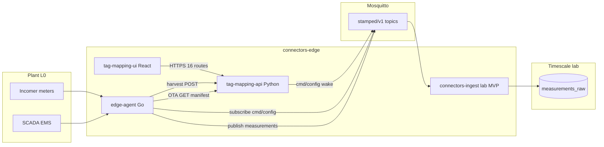
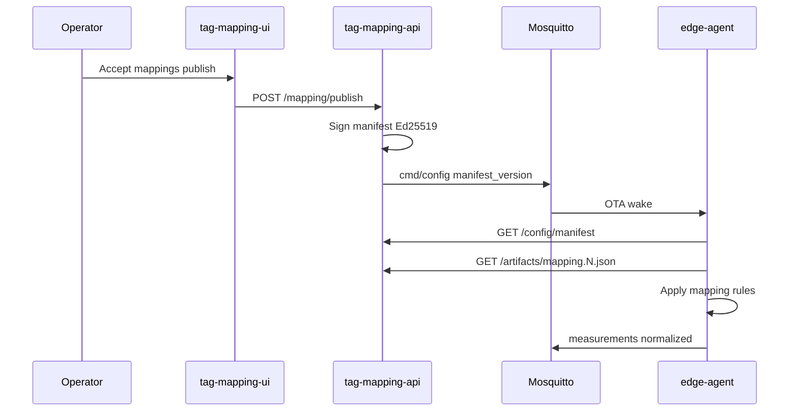

<!-- SNAPSHOT: mirrored from connectors-edge/README.md on 2026-07-19. Canonical README lives in the consumer repo — re-sync when that README changes. -->

> **Snapshot** of [`connectors-edge`](https://github.com/Vinayak-RZ/connectors-edge) root README (copied 2026-07-19).
> Canonical source: consumer repo `README.md`. Do not edit here for product truth — update the consumer repo, then re-copy.

---

# connectors-edge — L1 plant connectivity and tag mapping

> **What it is:** Stamped's L1 (Connect & normalise) monorepo — edge gateway, OT/IT protocol adapters, schema normaliser, tag-mapping onboarding, and lab MQTT ingest for Indian ICP manufacturing plants.  
> **What it is not:** L2–L6 cloud intelligence, production Timescale fleet, DISCOM bill PDF ingest, or customer-facing prescription dashboard. Those live in [`connectors-cloud`](docs/handoff/connectors-cloud-spec.md) and [`connectors-bill`](external/decisions/ADR-001-l1-repo-split-and-boundaries.md) (future).  
> **Primary interface:** Edge agent (MQTT uplink) + tag-mapping web UI + onboarding API.

**GitHub:** `Vinayak-RZ/Connectors` · **Canonical name:** `connectors-edge`  
**Deploy context:** Plant gateway (arm64/amd64) + AWS Fargate for tag-mapping-api at pilot scale.

---

**TL;DR**

- **Four packages:** Go `edge-agent`, Python `tag-mapping-api`, TypeScript `tag-mapping-ui`, Python `connectors-ingest` (lab MVP only).
- **11 connector plugins:** modbus, mqtt, sparkplug, filewatch, opcua, dlms, historian, restpoller, bacnet, mtconnect, fake.
- **Closed-loop lab E2E:** harvest → map → publish → OTA → MQTT → Timescale via `./scripts/e2e-pathb.sh`.
- **16 HTTP routes** on tag-mapping-api; **6 SPA screens** on tag-mapping-ui; **0 HTTP server** on edge-agent.
- **7 L1 JSON schemas** in `external/contracts/schemas/` — single source of truth for edge, bill, and cloud ingest.
- **MQTT contract:** `stamped/v1/{org_id}/{plant_id}/measurements|events|production|health|cmd/config`.
- **OTA mapping:** signed manifest publish from tag-mapping-api; edge-agent pulls via HTTPS.
- **Path B pilot:** cellular gateway + Modbus incomer + EMS filewatch — [path-b-pilot runbook](docs/runbooks/path-b-pilot.md).
- **CI:** edge-agent certification, Path B E2E, per-package unit/integration tests — all green on `main`.
- **Next repo:** [`connectors-cloud`](docs/handoff/connectors-cloud-spec.md) — **L1 cloud ingest only** (not L2–L6). Downstream layers: separate `stamped-l2` … `stamped-l6` repos per [ADR-008](external/decisions/ADR-008-layer-repo-topology-and-interfaces.md).

---

## Table of contents

1. [Vision](#1-vision)
2. [Architecture](#2-architecture)
3. [Quickstart](#3-quickstart)
4. [Configuration](#4-configuration)
5. [Project structure](#5-project-structure)
6. [Interfaces](#6-interfaces)
7. [Data model](#7-data-model)
8. [Testing](#8-testing)
9. [Deployment](#9-deployment)
10. [Cookbook](#10-cookbook)
11. [Roadmap and changelog](#11-roadmap-and-changelog)

---

## 1. Vision

### 1.1 What it is

`connectors-edge` implements **Stamped L1** — read-only taps on plant OT/IT systems, on-device normalisation and quality gates, tag discovery and mapping, and MQTT uplink of canonical `Measurement` and `Event` records to the cloud data plane.

Primary spec: [L1 — Connect & normalise](external/technical/layers/L1-connect-and-normalise.md).

### 1.2 What it is not

| Out of scope | Where it lives |
|--------------|----------------|
| L2 Timescale graph, baselines, ledger | `stamped-l2` |
| L3–L6 intelligence, prescriptions, dashboard | `stamped-l2` … `stamped-l6` (one repo per layer) |
| DISCOM bill PDF ingest | `connectors-bill` (future) |
| Production cloud ingest at fleet scale | `connectors-cloud` (L1 boundary publish only) |
| Fleet managed OTA (balena/k3s) | Deferred per [ADR-006](external/decisions/ADR-006-fleet-ota-substrate.md) |

### 1.3 Who it is for

- **Field engineers** deploying edge agents on plant gateways.
- **Onboarding operators** mapping raw tags to `asset_id` + `metric_type` via the web UI.
- **Platform engineers** extending connectors, contracts, and lab E2E.

### 1.4 Success criteria

- Path B E2E green: measurements in Timescale after OTA mapping publish.
- Edge-agent certification rows 1–17 PASS ([CERTIFICATION.md](tests/edge-agent/CERTIFICATION.md)) except row 6 (field hardware soak).
- Contracts validate in CI; golden-replay hash pinned.

---

## 2. Architecture

### 2.1 High-level diagram



### 2.2 OTA and mapping flow



### 2.3 Key modules

| Package | Path | Runtime |
|---------|------|---------|
| Edge agent | [`packages/edge-agent/`](packages/edge-agent/) | Go 1.25 — `cmd/edge-agent/main.go` |
| Tag mapping API | [`packages/tag-mapping-api/app/main.py`](packages/tag-mapping-api/app/main.py) | Python 3.12 / FastAPI / uvicorn :8080 |
| Tag mapping UI | [`packages/tag-mapping-ui/src/`](packages/tag-mapping-ui/src/) | React 19 / Vite 6 — dev :5173 |
| Lab ingest MVP | [`packages/connectors-ingest/ingest/service.py`](packages/connectors-ingest/ingest/service.py) | Python 3.12 — MQTT + optional HTTP |
| L1 contracts | [`external/contracts/schemas/`](external/contracts/schemas/) | JSON Schema 7 files |
| Vertical templates | [`templates/verticals/`](templates/verticals/) | YAML per industry |

**Edge connectors** (`packages/edge-agent/internal/connectors/`): bacnet, dlms, fake, filewatch, historian, modbus, mqtt, mtconnect, opcua, restpoller, sparkplug.

---

## 3. Quickstart

### 3.1 Prerequisites

- Docker and Docker Compose
- Go 1.25+ (edge-agent local tests)
- Python 3.12+ (API, ingest)
- Node.js 20+ (UI)

### 3.2 Clone and platform submodule

Platform contracts, ADRs, and cross-repo architecture live in **[stamped-external](https://github.com/vinayak-rz/stamped-external)** — mounted here as git submodule `external/` ([ADR-011](external/decisions/ADR-011-stamped-platform-submodule-distribution.md)).

```bash
git clone --recurse-submodules https://github.com/Vinayak-RZ/connectors-edge.git
cd connectors-edge

# If already cloned without submodules:
git submodule update --init --recursive
test -f external/VERSION || { echo "Run: git submodule update --init"; exit 1; }
```

Current platform pin: `external/VERSION` (target tag `v2026.07.12`). See [external/SUBMODULE.md](external/SUBMODULE.md) for bump and migration procedures.

**Do not edit** `external/` in this repo — open PRs in `stamped-external` only.

### 3.3 Full closed-loop E2E (recommended)

```bash
# Harvest → map → publish → OTA → MQTT → Timescale
./scripts/e2e-pathb.sh

# Above + UI demo seed + Playwright smoke
./scripts/e2e-full-stack.sh
```

### 3.4 Manual stack

```bash
docker compose -f deploy/profiles/local.yml up -d --build
```

| Service | Host URL |
|---------|----------|
| tag-mapping-api | http://127.0.0.1:18080 |
| tag-mapping-ui | http://127.0.0.1:5173 |
| Mosquitto | localhost:1883 |

### 3.5 UI offline demo (no edge-agent)

```bash
cd packages/tag-mapping-ui && VITE_USE_FIXTURES=true npm run dev
```

### 3.6 Seed demo plants

```bash
TAG_MAPPING_API_URL=http://127.0.0.1:18080 ./scripts/seed-ui-demo.sh
```

### 3.7 Verify smoke

```bash
curl -s http://127.0.0.1:18080/health
# {"status":"ok",...}
```

### 3.8 Demo walkthrough

End-to-end operator flow in `tag-mapping-ui`: harvest tags → generate mapping suggestions → accept a rule → publish a signed mapping with OTA wake-up.

<video src="https://github.com/Vinayak-RZ/connectors-edge/raw/main/docs/assets/demo-onboarding-flow.mp4" controls></video>

> If the player above does not load, [watch the demo video](docs/assets/demo-onboarding-flow.mp4).

| Harvest — pull tag inventory | Mapping — accept suggestions | Publish — signed mapping + audit |
|---|---|---|
|  |  |  |

---

## 4. Configuration

### 4.1 edge-agent (JSON file — no process env vars)

Configured via `--config` flag (default `/etc/stamped/site-config.json`).

| Field | Purpose |
|-------|---------|
| `plant_id`, `org_id`, `timezone` | Plant identity |
| `connectors.enabled[]` | Which plugins start |
| `connectors.modbus[]` | Modbus TCP profiles |
| `uplink.broker_url` | MQTT broker (e.g. `tcp://mosquitto:1883`) |
| `config.manifest_url` | OTA manifest HTTPS URL |
| `harvest.url` | Tag inventory POST endpoint |
| `mapping.path` | Local mapping JSON path |
| `buffer.*` | SQLite WAL buffer settings |

Example configs:

- Lab Path B: [`deploy/site-config.pathb.json`](deploy/site-config.pathb.json)
- Dev: [`packages/edge-agent/deploy/site-config.dev.json`](packages/edge-agent/deploy/site-config.dev.json)

Modbus profiles: [`packages/edge-agent/profiles/modbus/`](packages/edge-agent/profiles/modbus/) (7 YAML profiles).

### 4.2 tag-mapping-api

| Variable | Required | Default | Description |
|----------|----------|---------|-------------|
| `TAG_MAPPING_DATA` | No | `/tmp/tag-mapping-data` | Plant JSON + artifacts directory |
| `TEMPLATE_DIR` | No | repo `templates/verticals` | Vertical YAML templates |
| `ARTIFACT_BASE_URL` | No | `http://tag-mapping-api:8080/artifacts` | URLs embedded in manifests |
| `CONTRACTS_SCHEMA_DIR` | No | `external/contracts/schemas` | JSON Schema validation dir |
| `MQTT_BROKER` | No | (unset) | If set, publishes OTA wake on publish |
| `ORG_ID` | No | `default` | MQTT topic org segment |
| `SIGNING_KEY_PATH` | No | (unset) | Ed25519 private key file |
| `SIGNING_KEY_AUTO_GENERATE` | No | `1` | Auto-generate signing key |
| `JWT_SECRET` | No | (unset) | Bearer JWT auth when set |
| `LLM_BACKEND` | No | `rules-only` | `rules-only`, `frontier`, or `local` (ADR-010) |
| `LLM_PROVIDER` | No | — | **Deprecated** — use `LLM_BACKEND` (`stub`→`rules-only`, `openai`→`frontier`) |
| `LOCAL_LLM_URL` | No | (unset) | Local LLM endpoint when `LLM_BACKEND=local` |
| `OPENAI_API_KEY` | No | (unset) | OpenAI API key |
| `OPENAI_MODEL` | No | `gpt-4o-mini` | OpenAI model name |

Persistence is file-backed JSON under `TAG_MAPPING_DATA`. Postgres (`DATABASE_URL`) is noted in code comments but **not implemented**.

### 4.3 connectors-ingest (lab MVP)

| Variable | Required | Default | Description |
|----------|----------|---------|-------------|
| `DATABASE_URL` | Yes | — | Postgres/Timescale DSN |
| `MQTT_BROKER` | No | `localhost` | MQTT broker hostname |
| `HTTP_INGEST` | No | `0` | Set `1` to enable HTTP backfill |
| `HTTP_INGEST_PORT` | No | `8081` | HTTP listen port |
| `INGEST_API_KEY` | No | `""` | Requires `X-API-Key` when set |
| `INGEST_MODE` | No | (unset) | `once` skips MQTT loop (tests) |
| `OUTBOX_WEBHOOK_URL` | No | `""` | Outbox publisher webhook stub |

### 4.4 tag-mapping-ui (Vite build-time)

| Variable | Default | Description |
|----------|---------|-------------|
| `VITE_API_URL` | `` (empty, same-origin) | tag-mapping-api base URL; dev server proxies `/v1` to `:8080` |
| `VITE_USE_FIXTURES` | `false` | Load `tests/fixtures/ui/*.json` instead of API |

---

## 5. Project structure

```text
connectors-edge/
├── packages/
│   ├── edge-agent/           # Go — plant runtime, connectors, buffer, MQTT uplink
│   ├── tag-mapping-api/      # Python FastAPI — harvest, mapping, OTA publish
│   ├── tag-mapping-ui/       # React/Vite — 6-screen onboarding SPA
│   └── connectors-ingest/    # Python — lab MQTT→Timescale MVP (migrates to connectors-cloud)
├── external/                 # git submodule → vinayak-rz/stamped-external @ v2026.07.12
│   ├── contracts/            # L1 JSON schemas (canonical — edit in platform repo only)
│   ├── decisions/            # ADR-001–011
│   ├── technical/            # L0–L6 reference architecture
│   ├── handoff/              # Cross-repo playbooks and bootstrap guides
│   └── compliance/           # India compliance register
├── templates/verticals/      # Git YAML mapping templates per industry
├── deploy/                   # profiles (local/cloud), Path B fixtures, mosquitto
│   └── profiles/             # ADR-010 deployment modes
├── scripts/                  # e2e-pathb.sh, e2e-full-stack.sh, seed-ui-demo.sh
├── tests/
│   ├── edge-agent/           # CERTIFICATION.md, integration fixtures
│   └── fixtures/ui/          # Offline UI demo JSON
├── docs/
│   ├── architecture/         # Edge agent architecture spec
│   ├── handoff/              # connectors-cloud workspace handoff
│   ├── plans/                # Build plans and UX review logs
│   └── runbooks/             # Path B pilot, OTA, mTLS
├── .github/workflows/        # CI: edge-agent, api, ui, ingest, path-b-e2e, contracts
├── AGENTS.md                 # Agent orchestration entry point
└── README.md                 # This file
```

---

## 6. Interfaces

### 6.1 tag-mapping-api — 16 HTTP routes

| # | Method | Path | Purpose |
|---|--------|------|---------|
| 1 | `POST` | `/v1/plants` | Create/update plant metadata |
| 2 | `POST` | `/v1/plants/{plant_id}/harvest` | Ingest tag inventory from edge |
| 3 | `GET` | `/v1/plants/{plant_id}/inventory` | List harvested tags |
| 4 | `POST` | `/v1/plants/{plant_id}/mapping/suggest` | Template + optional LLM suggestions |
| 5 | `GET` | `/v1/plants/{plant_id}/mapping/suggestions` | List pending suggestions |
| 6 | `POST` | `/v1/plants/{plant_id}/mapping/suggestions/{rule_id}/accept` | Accept suggestion |
| 7 | `POST` | `/v1/plants/{plant_id}/mapping/suggestions/{rule_id}/reject` | Reject suggestion |
| 8 | `PUT` | `/v1/plants/{plant_id}/mapping/rules/{rule_id}` | Manual rule edit |
| 9 | `POST` | `/v1/plants/{plant_id}/mapping/preview` | Raw → normalised preview |
| 10 | `POST` | `/v1/plants/{plant_id}/mapping/publish` | Publish signed mapping + MQTT wake |
| 11 | `GET` | `/v1/plants/{plant_id}/config/manifest` | Edge OTA manifest pull |
| 12 | `GET` | `/artifacts/{filename}` | Signed mapping artifact download |
| 13 | `GET` | `/v1/plants/{plant_id}/drift` | Drift inbox |
| 14 | `POST` | `/v1/plants/{plant_id}/drift` | Post drift event |
| 15 | `GET` | `/v1/plants/{plant_id}/audit` | Publish audit log |
| 16 | `GET` | `/health` | Health check |

Auth: Bearer JWT when `JWT_SECRET` is set; plant-scoped via `plant_ids` claim or `*`.

### 6.2 tag-mapping-ui — 6 SPA routes

| Path | Page |
|------|------|
| `/` | Onboarding |
| `/harvest` | Harvest |
| `/mapping` | Mapping |
| `/preview` | Preview |
| `/publish` | Publish |
| `/drift` | Drift |

### 6.3 connectors-ingest — 1 HTTP route (lab)

| Method | Path | Auth | Purpose |
|--------|------|------|---------|
| `POST` | `/v1/measurements` | Optional `X-API-Key` | Topology F file-drop backfill |

MQTT subscribe: `stamped/v1/+/+/measurements` only (cloud repo expands to all topics).

### 6.4 edge-agent — MQTT topics (no HTTP server)

Prefix: `stamped/v1/{org_id}/{plant_id}/`

| Direction | Topic suffix | Schema |
|-----------|--------------|--------|
| Publish | `measurements` | `measurement.json` |
| Publish | `measurements/backfill` | `measurement.json` |
| Publish | `events` | `event.json` |
| Publish | `health` | `event.json` |
| Subscribe | `cmd/config` | OTA wake JSON |

Full contract: [`external/contracts/TOPICS.md`](external/contracts/TOPICS.md).

---

## 7. Data model

### 7.1 L1 contracts (7 schemas)

| Schema file | Used by |
|-------------|---------|
| `measurement.json` | edge uplink, ingest |
| `event.json` | edge events, health |
| `production-record.json` | edge production connector |
| `tag-inventory.json` | harvest POST |
| `mapping-config.json` | OTA mapping artifact |
| `site-config.json` | edge-agent config |
| `modbus-profile.json` | Modbus register profiles |

**Missing (planned):** `bill-line.json` — for `connectors-bill` repo.

Changelog: [`external/contracts/CHANGELOG.md`](external/contracts/CHANGELOG.md) (0.1.0, 0.2.0).

### 7.2 Edge buffer (SQLite)

Table `buffered_records` in [`packages/edge-agent/internal/buffer/sqlite.go`](packages/edge-agent/internal/buffer/sqlite.go) — WAL-mode offline buffer with MQTT flush on reconnect.

### 7.3 Tag mapping persistence (file-backed)

Under `TAG_MAPPING_DATA`:

- `plant_{plant_id}.json` — plant metadata + published rules
- `artifacts/mapping.{version}.json` — signed mapping artifacts
- `artifacts/manifest.{version}.json` — OTA manifests

### 7.4 Ingest tables (lab MVP)

| Table | Purpose |
|-------|---------|
| `measurements_raw` | Deduped measurements hypertable |
| `ingest_outbox` | Transactional outbox (webhook stub) |

### 7.5 `asset_id` namespace

Temporary format until L2 graph exists: `stamped.local/{plant_slug}/{asset_slug}` ([ADR-003 §3](external/decisions/ADR-003-connectors-edge-monorepo.md)).

---

## 8. Testing

### 8.1 Per-package commands

```bash
# edge-agent — race detector + coverage
cd packages/edge-agent && go test -race ./...

# tag-mapping-api
cd packages/tag-mapping-api && pip install -r requirements.txt && python -m pytest -q

# connectors-ingest (unit; integration needs Docker)
cd packages/connectors-ingest && pip install -r requirements.txt && python -m pytest -q --ignore=tests/test_integration_timescale.py

# tag-mapping-ui
cd packages/tag-mapping-ui && npm run lint && npm test && npm run build
```

### 8.2 Integration and E2E

```bash
./scripts/e2e-pathb.sh
./scripts/e2e-full-stack.sh   # includes Playwright
```

### 8.3 CI workflows

| Workflow | Scope |
|----------|-------|
| `edge-agent.yml` | Go test, build amd64/arm64 |
| `edge-agent-certification.yml` | Coverage gates, chaos, fuzz, golden replay |
| `tag-mapping-api.yml` | pytest |
| `tag-mapping-ui.yml` | tsc, vitest, Playwright |
| `connectors-ingest.yml` | pytest + Timescale integration |
| `path-b-e2e.yml` | Full compose E2E |
| `contracts.yml` | Schema validation |

Certification checklist: [`tests/edge-agent/CERTIFICATION.md`](tests/edge-agent/CERTIFICATION.md).

---

## 9. Deployment

Per [ADR-010](external/decisions/ADR-010-deployment-profiles-and-portability.md), the same images deploy in three modes via compose profile + env:

| Mode | Orchestration | connectors-ingest |
|------|---------------|-------------------|
| `local` | [`deploy/profiles/local.yml`](deploy/profiles/local.yml) | Enabled |
| `local-dashboard` | Joint compose + stamped-l6 (stamped-l2 repo) | Enabled |
| `cloud` | AWS Fargate/EC2 ([`deploy/profiles/cloud.yml`](deploy/profiles/cloud.yml) stub) | Disabled — use connectors-cloud |

```bash
export STAMPED_DEPLOYMENT_MODE=local
docker compose -f deploy/profiles/local.yml up -d --build
```

Runbook: [`docs/runbooks/deployment-profiles.md`](docs/runbooks/deployment-profiles.md) · Architecture: [`deploy/profiles/ARCHITECTURE.md`](deploy/profiles/ARCHITECTURE.md)

### 9.1 Docker images

| Image | Dockerfile | Flavours |
|-------|------------|----------|
| `stamped-edge:p0/p1/full` | `packages/edge-agent/deploy/Dockerfile` | `ARG FLAVOUR` |
| `stamped-tag-mapping-api` | `packages/tag-mapping-api/Dockerfile` | — |
| `stamped-tag-mapping-ui` | `packages/tag-mapping-ui/Dockerfile` | static `serve` :5173 |
| ingest (lab) | `packages/connectors-ingest/Dockerfile` | — |

### 9.2 Local profile services

File: [`deploy/profiles/local.yml`](deploy/profiles/local.yml) (legacy shim: [`deploy/docker-compose.pathb.yml`](deploy/docker-compose.pathb.yml))

| Service | Host port |
|---------|-----------|
| mosquitto | 1883 |
| tag-mapping-api | 127.0.0.1:18080 → 8080 |
| tag-mapping-ui | 127.0.0.1:5173 → 5173 |
| timescaledb, modbus-sim, edge-agent, connectors-ingest | internal only |

### 9.3 Production targets (pilot)

Per [ADR-002](external/decisions/ADR-002-build-all-aws-networking.md):

- **Edge:** plant gateway Docker on approved hardware ([hardware list](docs/hardware/approved-edge-hardware.md))
- **tag-mapping-api:** AWS ECS Fargate `ap-south-1`
- **tag-mapping-ui:** S3 + CloudFront static build
- **MQTT broker:** self-hosted Mosquitto on EC2 `ap-south-1`
- **Production ingest + L2:** `connectors-cloud` repo (not this repo's lab MVP)

---

## 10. Cookbook

### 10.1 Path B closed loop (operator flow)

1. Start stack: `docker compose -f deploy/profiles/local.yml up -d --build`
2. Edge harvests tags → `POST /v1/plants/{id}/harvest`
3. Operator opens UI at http://127.0.0.1:5173 — suggests mappings, accepts rules
4. Publish mapping → API signs manifest, MQTT `cmd/config` wakes edge
5. Edge pulls OTA mapping, normalises Modbus reads, publishes `measurements`
6. `connectors-ingest` writes to Timescale; verify with E2E script or SQL

### 10.2 Run edge-agent locally (dev compose)

```bash
docker compose -f packages/edge-agent/deploy/docker-compose.dev.yml up --build
```

### 10.3 Modbus bus scan utility

```bash
cd packages/edge-agent && go run ./cmd/modbus-scan --host 127.0.0.1 --port 5020
```

### 10.4 Manual OTA troubleshooting

See [edge-manual-ota runbook](docs/runbooks/edge-manual-ota.md) and [path-b-pilot runbook](docs/runbooks/path-b-pilot.md).

---

## 11. Roadmap and changelog

### 11.1 Build phases (completed in this repo)

| Phase | Theme | Status |
|-------|-------|--------|
| P0 | Modbus, MQTT, filewatch, buffer, uplink | Done |
| P1 | OPC UA, DLMS, harvest loop, OTA signing | Done |
| P2 | BACnet, MTConnect sim connectors | Done |
| Path B | Full compose E2E, tag-mapping UI triple-pass | Done |
| Repo completion | ingest MVP, UI fixtures, certification rows 14–17 | Done |

### 11.2 Next: connectors-cloud (L1 only) + stamped-l2…l6

| Doc | Purpose |
|-----|---------|
| [connectors-cloud handoff](docs/handoff/connectors-cloud-spec.md) | L1 cloud ingest workspace bootstrap |
| [layer-interfaces](docs/architecture/layer-interfaces.md) | Production-grade cross-repo contracts |
| [ADR-007](external/decisions/ADR-007-connectors-cloud-repo-charter.md) | L1 cloud repo charter |
| [ADR-008](external/decisions/ADR-008-layer-repo-topology-and-interfaces.md) | Layer-per-repo topology |

| Repo | Layer | Scope |
|------|-------|-------|
| `connectors-cloud` | L1 cloud | MQTT/HTTP ingest → L1→L2 outbox |
| `stamped-l2` | L2 | Universal Repository |
| `stamped-l3` … `stamped-l6` | L3–L6 | One repo per layer (separate workspaces) |

**L1 cloud is complete** when ingest publishes `StampedRecordEnvelope` to `stamped-l2` with contract CI green. L2–L6 handoff docs are created when those workspaces start.

### 11.3 Remaining edge-only items

| Item | Status |
|------|--------|
| CERTIFICATION row 6 — 800 tags × 4h field soak | Pending hardware |
| First Path B pilot human sign-off | Pending deployment |
| Postgres for tag-mapping-api | Deferred |
| Real LLM provider (OpenAI path exists) | Stub default |
| Fleet OTA substrate (ADR-006) | Deferred until ~20 devices |
| OPC-DA sidecar | Spec only — [docs/architecture/opc-da-sidecar.md](docs/architecture/opc-da-sidecar.md) |

### 11.4 Changelog

| Date | Change |
|------|--------|
| 2026-07-10 | Amended connectors-cloud scope to L1 only; ADR-008 layer interfaces; layer-interfaces.md |
| 2026-07-09 | Repo completion master plan merged (PR #6); Path B E2E green |
| 2026-07-09 | Path B hardening: harvest loop, OTA signing, Timescale ingest |
| 2026-07-09 | Initial P0/P1 edge-agent, tag-mapping-api, contracts |

---

## Related documentation

| Doc | Purpose |
|-----|---------|
| [AGENTS.md](AGENTS.md) | AI agent orchestration |
| [L1 spec](external/technical/layers/L1-connect-and-normalise.md) | Primary build spec |
| [Technical architecture](external/technical/02-technical-architecture.md) | Full L0–L6 stack |
| [Edge architecture](docs/architecture/edge-agent-architecture.md) | Edge agent design |
| [ADRs](external/decisions/README.md) | Architecture decisions |
| [Path B hardening log](docs/plans/path-b-hardening-plan.md) | E2E progress |
| [Tag mapping user guide](docs/guides/tag-mapping-user-guide.md) | How operators use the onboarding UI (L1 §4.5) |
| [Cursor setup](docs/TECH_STACK_SKILLS.md) | Skills and MCP |
