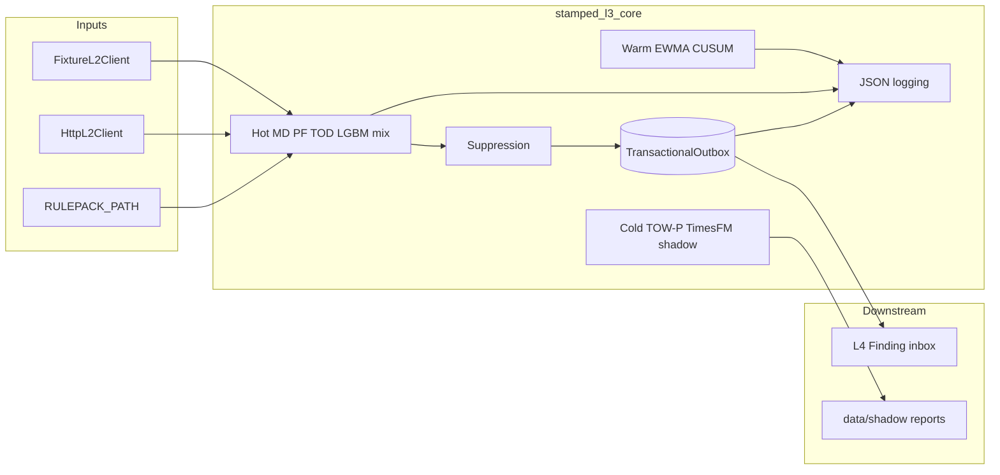
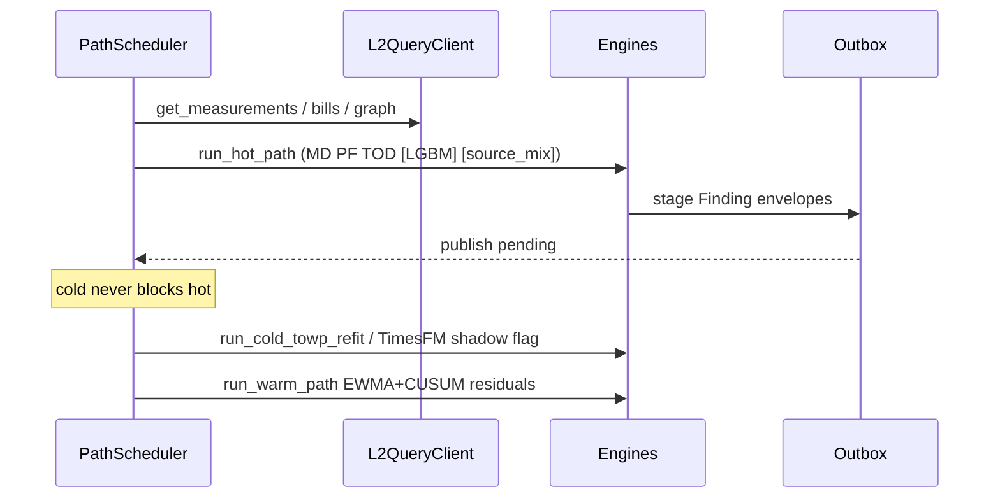

<!-- SNAPSHOT: mirrored from intelligence-core/README.md on 2026-07-19. Canonical README lives in the consumer repo — re-sync when that README changes. -->

> **Snapshot** of [`intelligence-core`](https://github.com/Vinayak-RZ/intelligence-core) root README (copied 2026-07-19).
> Canonical source: consumer repo `README.md`. Do not edit here for product truth — update the consumer repo, then re-copy.

---

# intelligence-core — Stamped L3 Intelligence Engine Runtime

> **What it is:** The deployable **L3 Intelligence Core** for Stamped Energy — a Python runtime that reads L2 telemetry/bills (fixture or HTTP), runs hot/warm/cold engines, and emits contract-aligned `Finding` objects through a durable outbox for L4.  
> **What it is not:** A plant UI, a rulepack authoring repo, an eval workbench, or a database client for L2 (`L2_DATABASE_URL` is forbidden).  
> **Primary interface:** Python library (`stamped_l3_core`) + CLI scripts (`scripts/run_mock_plant.py`, `scripts/validate.sh`)  
> **Runtime:** Python **3.11+** · optional extras `[dev]`, `[ml]`, `[challenger]` · platform SSOT via git submodule `external/` → [stamped-external](https://github.com/Vinayak-RZ/stamped-external) @ `d1e1539` (`VERSION` `2026.07.12`; ADR-015/016 dual-lane)

---

**TL;DR**

- Turns L2 measurements/bills into schema-valid `Finding` payloads inside `StampedRecordEnvelope` rows
- **Dual-lane Lab (ADR-015):** every candidate → `LabLog` / RunArtifact **1.1.0** with `status` + `delivery`; outbox only when `emitted`/`l4`
- Hot path: MD overlap, PF slab, TOD (+ optional LightGBM MD exceedance + greedy source-mix)
- Attribution of-record = graph co-start; runner-ups + ranking/STUMPY shadows stay `lab_only` (ADR-016)
- Warm path: EWMA + CUSUM on TOW-P residuals; cold path: TOW-P refit to filesystem registry
- TimesFM and LightGBM baseline challengers are **cold shadow only** — never of-record, never M&V
- Stdlib **JSON structured logging** with `correlation_id` / plant context and secret redaction
- Mock-plant corpus proves engines without live L2 (`tests/fixtures/mock_plant/` + CLI)
- Lab export: `LabLog.to_run_artifact()` / optional `stamped-l3-lab` → `GET /lab/export`
- CI matrix: validate · smoke · e2e (`[ml]`) · fuzz (Hypothesis); nightly soft challenger
- Hard locks: no `L2_DATABASE_URL`, pin `external/`, load rulepacks by path/semver, TOW-P of record; never promote Lab→L4
- Siblings own rulepack YAML (`stamped-l3-rulepacks`) and fleet eval UI (`stamped-l3-eval`)
- Package version `0.1.0` (`pyproject.toml`); contracts only from `external/contracts/`

---

## Table of contents

1. [Vision](#1-vision)
2. [Architecture](#2-architecture)
3. [Quickstart](#3-quickstart)
4. [Configuration](#4-configuration)
5. [Project structure](#5-project-structure)
6. [Interfaces & catalogs](#6-interfaces--catalogs)
7. [Data model](#7-data-model)
8. [Testing](#8-testing)
9. [Deployment & CI](#9-deployment--ci)
10. [Cookbook](#10-cookbook)
11. [Roadmap & build history](#11-roadmap--build-history)
12. [FAQ & glossary](#12-faq--glossary)
13. [Related docs & authority](#13-related-docs--authority)

---

## 1. Vision

### 1.1 What it is

`intelligence-core` is the **engine runtime** for Stamped layer L3. It:

1. Queries L2 (measurements, bills, assets, graph, baselines, tariffs, SEC features)
2. Runs deterministic and optional-ML detectors on hot / warm / cold schedules
3. Applies waste classification, suppression, and gates (G14 / precision / PSI helpers)
4. Stages findings into a sqlite transactional outbox as `StampedRecordEnvelope` records for L4

Numeric intelligence only — no prose templates, no plant actuation, no customer dashboards.

### 1.2 What it is not

| Not this | Lives where |
| --- | --- |
| Rulepack YAML authoring (furnace/idle/compressor packs) | Sibling `stamped-l3-rulepacks` |
| Fleet blocked-CV UI / eval workbench | Sibling `stamped-l3-eval` |
| L2 write path / `L2_DATABASE_URL` | Forbidden (ADR-008) |
| L4 templating / verifier product | `stamped-l4` consumer |
| L6 counterfactual dashboards | Platform handoff stubs |
| TimesFM as baseline of record | Forbidden (ADR-014) |
| Source-mix MILP / NILM / deep COP | Deferred P3+ |

### 1.3 Who it is for

- Engineers extending L3 engines, observability, or fixture plants
- Platform agents implementing ADR-012 consumer repos
- Integrators wiring `L2_BASE_URL` / outbox DSN in staging

### 1.4 Success criteria (today)

- `./scripts/validate.sh` green (unit · golden · integration · smoke · e2e)
- `python scripts/run_mock_plant.py --enable-source-mix` exits 0 and publishes ≥1 envelope
- Schema-valid Findings for MD / PF / TOD / `dispatch_gap` / optional `md_exceedance_risk`
- Static guard: TimesFM not imported from hot/warm scheduler paths
- Precision fixture gate ≥ **0.85** on labelled mock corpus

---

## 2. Architecture

### 2.1 High-level



### 2.2 Hot / warm / cold lifecycle



### 2.3 Key modules

| Area | Path | Role |
| --- | --- | --- |
| L2 client | [`src/stamped_l3_core/clients/l2.py`](src/stamped_l3_core/clients/l2.py) | Protocol + `FixtureL2Client` + `HttpL2Client` + `client_from_env` |
| Finding / envelope | [`src/stamped_l3_core/models/`](src/stamped_l3_core/models/) | Domain model, schema load, adversarial INR guard |
| Engines | [`src/stamped_l3_core/engines/`](src/stamped_l3_core/engines/) | MD, LGBM MD, PF, TOD, source_mix, TOW-P, SEC, attribution, EWMA, waste, calibration |
| Scheduler | [`src/stamped_l3_core/scheduler.py`](src/stamped_l3_core/scheduler.py) | `run_hot_path` / `run_warm_path` / `run_cold_*` + `PathScheduler` |
| Outbox | [`src/stamped_l3_core/outbox.py`](src/stamped_l3_core/outbox.py) | Sqlite durable stage/publish |
| Logging | [`src/stamped_l3_core/logging_setup.py`](src/stamped_l3_core/logging_setup.py) | JSON formatter + contextvars binder |
| Rulepacks | [`src/stamped_l3_core/rulepack_loader.py`](src/stamped_l3_core/rulepack_loader.py) | Load JSON/YAML manifests by path/semver |
| Registry | [`src/stamped_l3_core/registry/baseline_registry.py`](src/stamped_l3_core/registry/baseline_registry.py) | `FileBaselineRegistry` |
| Gates | [`src/stamped_l3_core/gates/`](src/stamped_l3_core/gates/) | G14, precision ≥0.85, PSI |
| Challengers | [`src/stamped_l3_core/challenger/`](src/stamped_l3_core/challenger/) | TimesFM cold shadow, LGBM baseline shadow |
| Contracts | [`external/contracts/`](external/contracts/) | Read-only schemas (submodule) |

### 2.4 Layer boundaries (ADR-008 / ADR-012)

```text
L1 Connect  →  L2 Universal repo (query API)
                 ↓ read-only (HTTP or fixtures)
            L3 intelligence-core  (this repo)
                 ↓ durable outbox envelopes
            L4 knowledge / reasoning
```

Sibling artifact repos (not this tree): **rulepacks** · **eval**.

---

## 3. Quickstart

### 3.1 Prerequisites

- Python **≥ 3.11**
- Git with submodule support
- Network only for clone / optional Http L2 (CI uses fixtures)

### 3.2 Install

```bash
git clone --recurse-submodules https://github.com/Vinayak-RZ/intelligence-core.git
cd intelligence-core
git submodule update --init --recursive
test -f external/VERSION || { echo "Run: git submodule update --init"; exit 1; }

python3 -m venv .venv && source .venv/bin/activate   # recommended
pip install -e ".[dev]"
# Optional P2 ML path (LightGBM + numpy + scikit-learn):
pip install -e ".[ml]"
# Optional TimesFM challenger (heavy; nightly soft-skip default):
# pip install -e ".[challenger]"

cp .env.example .env   # edit if pointing at live L2
```

### 3.3 Run mock plant (local smoke)

```bash
python scripts/run_mock_plant.py --enable-source-mix
# Full optional P2 flags:
python scripts/run_mock_plant.py --enable-lgbm --enable-source-mix --enable-timesfm-shadow
```

Expected: JSON summary on stdout with `published >= 1` and categories such as `md_overlap`, `pf_slab_breach`, `tod_exposure`, `dispatch_gap`. Structured logs go to **stderr**.

### 3.4 Verify

```bash
./scripts/validate.sh
FUZZ=1 ./scripts/validate.sh   # opt-in Hypothesis fuzz
```

Compose one-shot smoke (fixture plant):

```bash
docker compose -f deploy/docker-compose.yml run --rm l3-core
```

---

## 4. Configuration

Variables match [`.env.example`](.env.example). Feature flags are env-only (not required in `.env`).

### 4.1 Core environment

| Variable | Required | Default | Description |
| --- | --- | --- | --- |
| `L2_BASE_URL` | No | empty | When set, `client_from_env` returns `HttpL2Client`; when empty, `FixtureL2Client` |
| `L2_SERVICE_KEY` | If HTTP | empty | Service key for Http L2 — **never logged** |
| `OUTBOX_DSN` | No | `sqlite:///./data/outbox.db` | Sqlite DSN (`sqlite:///:memory:` for tests) |
| `RULEPACK_PATH` | No | `./tests/fixtures/packs` | Product root (`domain/`, `schemas/`, …), fixture pack tree, or single manifest JSON/YAML |
| `BASELINE_REGISTRY_DIR` | No | `./data/baselines` | Filesystem TOW-P baseline registry |

### 4.2 Feature flags (P2)

| Variable | Default | Effect |
| --- | --- | --- |
| `ENABLE_LGBM_MD` | off | Hot path LightGBM/empirical `md_exceedance_risk` Finding |
| `ENABLE_SOURCE_MIX` | off | Hot path greedy `dispatch_gap` Finding |
| `ENABLE_TIMESFM_SHADOW` | off | Cold path writes shadow JSON under `data/shadow/` only — never outbox Finding |

Truthy values: `1`, `true`, `yes`, `on` (case-insensitive).

### 4.3 Optional package extras

| Extra | Installs | When |
| --- | --- | --- |
| `[dev]` | pytest, ruff, jsonschema, PyYAML, apscheduler, hypothesis | Local + CI validate/smoke/fuzz |
| `[ml]` | lightgbm≥4, numpy, scikit-learn≥1.3,&lt;2 | E2E + real LGBM quantile path |
| `[challenger]` | timesfm≥2.0.2 | Nightly / soft challenger job |

Without `[ml]`, MD LGBM uses an **empirical P90** fallback and never fails the hot path.

### 4.4 Forbidden configuration

| Name | Rule |
| --- | --- |
| `L2_DATABASE_URL` | Must not appear in Python under `src/` or `tests/` — enforced by `scripts/validate.sh` |

---

## 5. Project structure

```text
intelligence-core/
├── src/stamped_l3_core/
│   ├── logging_setup.py       # JSON logger + bind_context / clear_context
│   ├── scheduler.py           # hot / warm / cold + PathScheduler
│   ├── outbox.py              # TransactionalOutbox (sqlite)
│   ├── suppression.py
│   ├── rulepack_loader.py
│   ├── calibration_feedback.py
│   ├── clients/l2.py
│   ├── models/                # Finding, envelope, schema, adversarial
│   ├── engines/               # md, md_lgbm, pf, tod, source_mix, …
│   ├── challenger/            # timesfm_shadow, lgbm_baseline
│   ├── gates/                 # g14, precision, psi
│   └── registry/              # FileBaselineRegistry
├── tests/
│   ├── unit/ golden/ integration/
│   ├── smoke/ fuzz/ e2e/
│   └── fixtures/ (+ mock_plant/)
├── scripts/
│   ├── validate.sh
│   └── run_mock_plant.py
├── deploy/docker-compose.yml
├── external/                  # stamped-external submodule (read-only contracts/ADRs)
├── .github/workflows/         # ci.yml, nightly.yml
├── IMPLEMENTATION_PLAN.md     # active plan (P2+hardening)
├── IMPLEMENTATION_PLAN_P0.md / _P1.md
├── DECISIONS.md · PROGRESS.md · PROJECT_OVERVIEW.md
└── PHASE_*_COMPLETION.md
```

---

## 6. Interfaces & catalogs

### 6.1 L2 query client — 7 methods

Protocol `L2QueryClient` in [`clients/l2.py`](src/stamped_l3_core/clients/l2.py):

| Method | Purpose |
| --- | --- |
| `get_measurements` | Asset metric points in `[from_ts, to_ts]` |
| `get_bill_lines` | Bill lines by `bill_id` |
| `list_assets` | Plant asset list |
| `traverse_graph` | Hop-limited asset graph walk (default `max_hops=2`) |
| `get_baseline` | Baseline artifact by `baseline_id` |
| `get_active_tariff` | Active tariff for plant |
| `get_sec_features` | SEC feature window |

Implementations: `FixtureL2Client` (JSON under fixtures dir), `HttpL2Client` (`L2_BASE_URL` + key), factory `client_from_env`.

### 6.2 Scheduler entry points

| Function | Path | Notes |
| --- | --- | --- |
| `run_hot_path` | hot | MD + PF + TOD; optional LGBM MD + source_mix via flags/config |
| `run_warm_path` | warm | EWMA+CUSUM on residuals or actual−baseline |
| `run_cold_towp_refit` | cold | Fit TOW-P → `FileBaselineRegistry` |
| `run_cold_path` | cold | Generic cold worker; optional TimesFM shadow when flagged |
| `PathScheduler` | APScheduler | Isolated hot/warm/cold interval jobs |

### 6.3 Engines (11 modules)

| Module | Primary emit / output | Of-record? |
| --- | --- | --- |
| `engines/md.py` | `md_overlap`, `md_exceedance_risk` (histogram) | Yes (rules) |
| `engines/md_lgbm.py` | `md_exceedance_risk` (P90 forecast) | Yes when flagged (forecast Finding) |
| `engines/pf.py` | `pf_slab_breach` + bill recon helpers | Yes |
| `engines/tod.py` | `tod_exposure` | Yes |
| `engines/source_mix.py` | `dispatch_gap` (greedy) | Yes when flagged |
| `engines/baseline_towp.py` | Baseline artifact + residuals | **Baseline of record** |
| `engines/anomaly_ewma.py` | Warm alerts structure | Warm diagnostics |
| `engines/sec.py` | `sec_drift` | Yes |
| `engines/attribution.py` | MD spike feeder ranking | Supporting |
| `engines/waste_classifier.py` | Maps category → waste_category 1–6 | Emit-path |
| `engines/calibration.py` | Cold-start / shrinkage params | Params stub |

Challengers (**never** stage of-record Findings):

| Module | Output |
| --- | --- |
| `challenger/timesfm_shadow.py` | JSON under `data/shadow/`; `PROMOTION_ALLOWED=False` |
| `challenger/lgbm_baseline.py` | Pinball / CVRMSE shadow report JSON |

### 6.4 Outbox API

`TransactionalOutbox` ([`outbox.py`](src/stamped_l3_core/outbox.py)):

| Method | Behavior |
| --- | --- |
| `stage(finding)` | Wrap envelope; idempotent on `dedupe_key`; reject forged INR |
| `publish()` | Atomically mark pending → published; return envelopes |
| `pending` / `published` | Inspect queues |

### 6.5 CLI — `scripts/run_mock_plant.py`

| Flag | Effect |
| --- | --- |
| `--fixtures PATH` | Fixture root (default `tests/fixtures/mock_plant`) |
| `--enable-lgbm` | Sets `ENABLE_LGBM_MD=1` |
| `--enable-source-mix` | Sets `ENABLE_SOURCE_MIX=1` + loads `source_mix_day.json` |
| `--enable-timesfm-shadow` | Sets `ENABLE_TIMESFM_SHADOW=1` |

Exit codes: `0` success with publications; `1` missing fixtures; `2` zero publications.

### 6.6 Logging contract

Logger namespace `stamped_l3_core.*`. JSON fields include:

`ts` · `level` · `logger` · `msg` · `correlation_id` · `org_id` · `plant_id` · `engine` · `finding_id` (when present)

Redacted keys (never emitted): `l2_service_key`, `service_key`, `password`, `token`, `authorization`, `secret`.

---

## 7. Data model

### 7.1 Finding (contract `finding.json` v1.0.0)

Domain dataclass: [`models/finding.py`](src/stamped_l3_core/models/finding.py). Schema SSOT: [`external/contracts/schemas/finding.json`](external/contracts/schemas/finding.json).

| Field | Notes |
| --- | --- |
| `schema_version` | Const `1.0.0` |
| `finding_id` / `org_id` / `plant_id` | Identifiers |
| `category` | Enum — see §7.2 |
| `waste_category` | 1=MD/PQ … 6=source mix |
| `assets` | ≥1 asset ids |
| `evidence` | Requires `metric`, `baseline_value`, `actual_value`, `window`; extensions via `supporting_tags` (`additionalProperties: false` on evidence) |
| `confidence` | 0–1 |
| `estimated_monthly_kwh` / `estimated_monthly_inr` | Economics |
| `inr_decomposition` | Required when INR non-trivial (adversarial guard) |
| `urgency` | `low` \| `medium` \| `high` |
| `engine` / `engine_version` / `rule_or_model_ref` | Provenance |
| `dedupe_key` | `sha256:` of category + sorted assets + window |

### 7.2 Finding categories (contract enum — 12)

`md_overlap` · `md_exceedance_risk` · `pf_slab_breach` · `pf_leading` · `tod_exposure` · `compressor_sp_drift` · `furnace_holding` · `idle_load` · `sec_drift` · `dispatch_gap` · `cop_degradation` · `cmd_oversized`

Core engines today emit a subset (MD/PF/TOD/SEC/dispatch_gap). Remaining categories are reserved for rulepack-driven engines in siblings / later packs.

### 7.3 Envelope

`wrap_finding_envelope` → `record_type: "finding"` plus `envelope_id`, `dedupe_key`, `correlation_id`, `ingested_at`, `late`, nested `payload`.

### 7.4 Persistence

| Store | Location | Contents |
| --- | --- | --- |
| Outbox | Sqlite via `OUTBOX_DSN` | `dedupe_key`, `envelope_json`, `status` pending\|published |
| Baselines | `BASELINE_REGISTRY_DIR` | TOW-P JSON artifacts + `_index.json` |
| Shadow reports | `data/shadow/` (gitignored under `data/`) | TimesFM / LGBM challenger JSON |
| Fixtures | `tests/fixtures/` · `tests/fixtures/mock_plant/` | Mock L2 corpus |

No application ORM. No Postgres migration in P0–P2 (DSN-swappable later).

---

## 8. Testing

### 8.1 Tiers

| Tier | Path | Role |
| --- | --- | --- |
| Unit | `tests/unit/` (25 files) | Engines, outbox, logging, gates, L2, challengers |
| Golden | `tests/golden/` | Schema-valid Findings vs `external/contracts` |
| Integration | `tests/integration/` | Scheduler isolation, P1 plant |
| Smoke | `tests/smoke/` | Import path, one hot tick, CLI exit 0 |
| Fuzz | `tests/fuzz/` | Hypothesis (`ci` 20 examples / `nightly` 100) |
| E2E | `tests/e2e/` | Cold→warm→hot→source_mix→outbox + log fields on mock_plant |

### 8.2 Commands

```bash
pip install -e ".[dev]"
pytest tests/unit tests/golden tests/integration tests/smoke -q
pip install -e ".[ml]" && pytest tests/e2e -q
pytest tests/fuzz -q --hypothesis-profile=ci
./scripts/validate.sh
FUZZ=1 ./scripts/validate.sh
```

### 8.3 Validate orchestrator

[`scripts/validate.sh`](scripts/validate.sh) runs: submodule presence → forbid `L2_DATABASE_URL` → `external/scripts/contract-check.sh` → ruff → pytest unit/golden/integration/smoke → e2e → docs sync (`IMPLEMENTATION_PLAN.md`, `PROGRESS.md`, `DECISIONS.md`, `PROJECT_OVERVIEW.md`) → optional fuzz when `FUZZ=1`.

### 8.4 Mock plant contract

All e2e/smoke use filesystem fixtures only — **no network**. Http client covered by unit mocks.

---

## 9. Deployment & CI

### 9.1 GitHub Actions

| Workflow | Jobs |
| --- | --- |
| [`.github/workflows/ci.yml`](.github/workflows/ci.yml) | `validate` · `smoke` · `e2e` (`.[dev,ml]`) · `fuzz` |
| [`.github/workflows/nightly.yml`](.github/workflows/nightly.yml) | Extended fuzz · TimesFM challenger soft (`continue-on-error`) |

Triggers: push to `main`, pull requests; nightly cron + `workflow_dispatch`.

### 9.2 Docker compose

[`deploy/docker-compose.yml`](deploy/docker-compose.yml) — one-shot fixture hot path under Python 3.11 slim. Empty `L2_BASE_URL` → fixtures.

### 9.3 Staging notes

- Set `L2_BASE_URL` + `L2_SERVICE_KEY` when L2 HTTP is available
- Keep TimesFM off until shadow reports reviewed (`ENABLE_TIMESFM_SHADOW`)
- Rollback P2 engines by clearing feature flags — imports stay safe

---

## 10. Cookbook

### 10.1 Publish MD+PF envelopes from fixtures

```python
from pathlib import Path
from stamped_l3_core.clients.l2 import FixtureL2Client
from stamped_l3_core.outbox import TransactionalOutbox
from stamped_l3_core.rulepack_loader import load_rulepack, resolve_engine
from stamped_l3_core.scheduler import run_hot_path
from stamped_l3_core.suppression import SuppressionService

fixtures = Path("tests/fixtures")
pack = load_rulepack(fixtures / "incomer_rulepack.json")
md = {**resolve_engine(pack, rule_id="md_overlap"), "rulepack_version": pack["version"]}
published = run_hot_path(
    FixtureL2Client(fixtures),
    TransactionalOutbox("sqlite:///:memory:"),
    SuppressionService(),
    org_id="org_acme",
    plant_id="plant_ghaziabad_1",
    asset_id="incomer_1",
    from_ts="2026-06-15T00:00:00Z",
    to_ts="2026-06-15T23:59:59Z",
    md_config=md,
    pf_config=resolve_engine(pack, rule_id="pf_slab"),  # category is pf_slab_breach
    tod_config=resolve_engine(pack, rule_id="tod_exposure"),
)
print([e["payload"]["category"] for e in published])
```

Product catalog root (when sibling is available):

```bash
export RULEPACK_PATH=/path/to/stamped-l3-rulepacks   # or intelligence-rulepacks
# Loader walks domain/{pack}/{semver}/manifest.yaml + rules/*.yaml
# Pin: schemas/consumer_manifest.json (target) or schemas/catalog_index.json (interim)
# Engines keyed by rule id — e.g. engines["pf_slab"], URI rulepack://incomer/…#pf_slab
```

Interim CI/dev pin in this repo: `external/consumers/stamped-l3-rulepacks/` (package **0.2.0** / catalog **1.0.0**). Target sibling pin when published: package **0.5.1** / catalog **1.3.1**. Authority docs on the sibling: `docs/CORE_INTEGRATION.md`, `docs/LOADER_CONTRACT.md`. Dual-lane `delivery`/`status` stay engine-owned (ADR-015/016) — never in catalog YAML.

### 10.2 Enable P2 engines for one process

```bash
export ENABLE_LGBM_MD=1 ENABLE_SOURCE_MIX=1
python scripts/run_mock_plant.py --enable-lgbm --enable-source-mix
```

### 10.3 Cold TOW-P refit + warm residuals

```python
from stamped_l3_core.scheduler import run_cold_towp_refit, run_warm_path
from stamped_l3_core.registry.baseline_registry import FileBaselineRegistry
# … client + registry … then run_cold_towp_refit(...); run_warm_path(actual=..., baseline=...)
```

### 10.4 Structured logging in a custom job

```python
from stamped_l3_core.logging_setup import bind_context, clear_context, get_logger, setup_logging

setup_logging()
log = get_logger("stamped_l3_core.jobs.demo")
bind_context(correlation_id="c-demo", org_id="org_acme", plant_id="plant_1", engine="demo")
log.info("tick", extra={"finding_id": "f-1"})
clear_context()
```

### 10.5 Precision gate on labelled predictions

```python
from stamped_l3_core.gates.precision import meets_precision_target, PRECISION_TARGET
assert PRECISION_TARGET == 0.85
assert meets_precision_target(predicted, labels)
```

---

## 11. Roadmap & build history

### 11.1 Build phases (completed)

| Phase | Theme | Status |
| --- | --- | --- |
| Bootstrap | Submodule pin, scaffold, contracts | ✅ |
| P0 | MD/PF/TOD, outbox, scheduler, validate.sh | ✅ (PR #2/#3 lineage) |
| P1 | TOW-P, SEC, attribution, waste, gates, multi-pack | ✅ (PR #4) |
| P2 + hardening | Logging, mock plant, LGBM MD, source-mix, TimesFM shadow, precision 0.85, CI fortress | ✅ (PR #5) |

### 11.2 Possible future directions (not in this repo’s immediate scope)

- **`stamped-l3-rulepacks`** — YAML SSOT packs; core loads via `RULEPACK_PATH` (re-pin to 0.5.1 when published); then sibling may delete legacy top-level `incomer/` (D009)
- **`stamped-l3-eval`** — fleet blocked-CV / UI / closed-loop Rx labels
- P3 engines: source-mix **MILP**, NILM, COP depth
- TimesFM promotion only after ADR-014 gates (never silent)
- Postgres outbox DSN when multi-instance deploy requires it
- Live Http L2 against production query API

### 11.3 Changelog (recent)

| Date / commit | Change |
| --- | --- |
| 2026-07-14 `c8c1a9f` | Merge PR #5 — P2 engines + hardening |
| 2026-07-14 `53b2fae` | `[ml]` extra adds `scikit-learn`; LGBM hot-path fallback |
| 2026-07-14 | Logging, mock plant, source-mix, TimesFM/LGBM shadow, CI matrix |
| 2026-07-14 `9d1e1b6` | Merge PR #4 — P1 TOW-P / SEC / attribution |

Full narrative: [`PHASE_P2_COMPLETION.md`](PHASE_P2_COMPLETION.md), [`PHASE_P1_COMPLETION.md`](PHASE_P1_COMPLETION.md), [`PHASE_N_COMPLETION.md`](PHASE_N_COMPLETION.md).

---

## 12. FAQ & glossary

### 12.1 FAQ

**Why doesn’t CI install TimesFM on every PR?**  
Dependency is heavyweight; cold shadow soft-skips when missing. Nightly job may install `[challenger]` with `continue-on-error`.

**Why is scikit-learn in `[ml]`?**  
`lightgbm.LGBMRegressor` requires sklearn. Without `[ml]`, empirical P90 is used.

**Can I author furnace rulepacks here?**  
No — load via `RULEPACK_PATH`; author in `stamped-l3-rulepacks`.

**Why `engines["pf_slab"]` instead of `pf_slab_breach`?**  
Catalog keys engines by **rule id**; `pf_slab_breach` is the Finding **category**. Use `resolve_engine(pack, rule_id="pf_slab")` or `resolve_engine(pack, category="pf_slab_breach")`.

**Where do Findings go?**  
Sqlite outbox → publish list of envelopes. Downstream L4 inbox is out of process.

**Is TOW-P required for hot MD overlap?**  
Hot MD overlap uses rulepack CMD/band. TOW-P refit is cold-path of-record baseline for residuals/M&V helpers.

### 12.2 Glossary

| Term | Meaning |
| --- | --- |
| **CMD** | Contract maximum demand (kVA) |
| **MD** | Maximum demand / demand-charge risk |
| **PF** | Power factor (tariff slab) |
| **TOD** | Time-of-day energy exposure |
| **TOW-P** | Time-of-week (+ production) baseline — of record |
| **SEC** | Specific energy consumption features |
| **Finding** | L3→L4 numeric intelligence object |
| **Envelope** | Transport wrapper (`StampedRecordEnvelope`) |
| **Cold / warm / hot** | Scheduler path cadence & blocking rules |
| **Shadow challenger** | Metrics-only model — never of-record emit |
| **Rulepack** | Semver JSON/YAML engine config (loaded, not authored here) |
| **G14** | CVRMSE/NMBE M&V eligibility helper |
| **PSI** | Population Stability Index stub |

---

## 13. Related docs & authority

| Doc | Role |
| --- | --- |
| [`PROJECT_OVERVIEW.md`](PROJECT_OVERVIEW.md) | Purpose & constraints summary |
| [`IMPLEMENTATION_PLAN.md`](IMPLEMENTATION_PLAN.md) | Plans (P2 complete; dual-lane addendum) |
| [`PROGRESS.md`](PROGRESS.md) | Phase status |
| [`DECISIONS.md`](DECISIONS.md) | ADR-LOCAL + dual-lane sync notes |
| [`AGENTS.md`](AGENTS.md) | Cursor / ponytail / nawab workflow |
| [`docs/L3_BOOTSTRAP.md`](docs/L3_BOOTSTRAP.md) | Bootstrap notes |
| [`external/technical/layers/L3-intelligence-core.md`](external/technical/layers/L3-intelligence-core.md) | Platform L3 spec (read-only) |
| [`external/technical/layers/L3-attribution-explainability.md`](external/technical/layers/L3-attribution-explainability.md) | Co-start of-record + Lab shadows |
| [`external/handoff/stamped-l3-build-order.md`](external/handoff/stamped-l3-build-order.md) | Core · rulepacks · eval build order |
| [`external/decisions/ADR-012-l3-artifact-repo-topology.md`](external/decisions/ADR-012-l3-artifact-repo-topology.md) | Three-repo split |
| [`external/decisions/ADR-014-ts-foundation-model-role.md`](external/decisions/ADR-014-ts-foundation-model-role.md) | TimesFM role |
| [`external/decisions/ADR-015-l3-dual-lane-lab-detections.md`](external/decisions/ADR-015-l3-dual-lane-lab-detections.md) | Dual-lane Lab retention |
| [`external/decisions/ADR-016-attribution-shadow-challengers.md`](external/decisions/ADR-016-attribution-shadow-challengers.md) | Attribution shadows (Lab-only) |

**Platform pin:** `external/` @ `d1e1539` · `VERSION` `2026.07.12` (ADR-015/016) — bump submodule deliberately; never edit contracts inside consumers.
