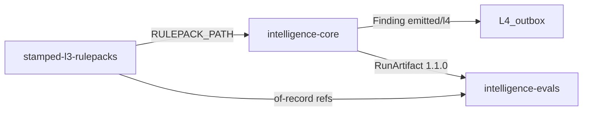
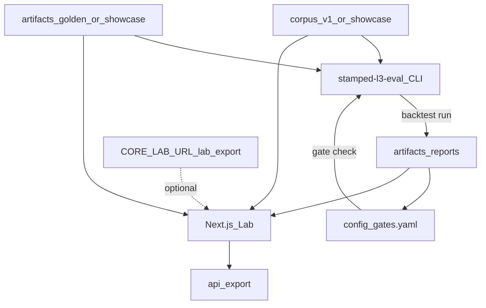

<!-- SNAPSHOT: mirrored from intelligence-evals/README.md on 2026-07-19. Canonical README lives in the consumer repo — re-sync when that README changes. -->

> **Snapshot** of [`intelligence-evals`](https://github.com/Vinayak-RZ/intelligence-evals) root README (copied 2026-07-19).
> Canonical source: consumer repo `README.md`. Do not edit here for product truth — update the consumer repo, then re-copy.

---

# intelligence-evals — L3 evaluation workbench & Lab forensic console

> **What it is:** Golden corpus, offline backtest CLI, champion/challenger gates, and an **internal Lab UI** for engineers to triage, explore, and download every L3 engine / rule / ML-shadow detection candidate.  
> **What it is not:** Plant operator dashboard (L6), rule authoring (rulepacks), prescription approval (L4/L5), or the engine runtime (intelligence-core).  
> **Primary interfaces:** CLI (`stamped-l3-eval`) · Lab UI (Next.js at `ui/`) · JSON/CSV export APIs  
> **Authority:** [ADR-012](external/decisions/ADR-012-l3-artifact-repo-topology.md) · [ADR-015 dual-lane](external/decisions/ADR-015-l3-dual-lane-lab-detections.md) · [ADR-016 attribution](external/decisions/ADR-016-attribution-shadow-challengers.md) · [finding.json](external/contracts/schemas/finding.json)  
> **Package:** `stamped-l3-eval` **0.3.0** · Python ≥3.11 · Lab UI Next.js 15 / React 19  
> **Platform pack:** git submodule [`external/`](https://github.com/Vinayak-RZ/stamped-external) @ `d1e1539`

Sibling L3 repos: **intelligence-core** (engines / outbox / LabLog) · **stamped-l3-rulepacks** (YAML catalog). Platform product name: `stamped-l3-eval`.

---

**TL;DR**

- Offline-first eval: score checked-in **RunArtifact 1.1.0** goldens — no pip dependency on intelligence-core
- Dual-lane Lab IA (ADR-015): **L4** = `delivery=l4` ∧ `status=emitted`; **Discovery** = everything else (retained, not failure)
- Corpus **v1** = 12 Finding categories + of-record expects; precision gate floor **0.75** (`config/gates.yaml`)
- Lab console: Triage · dual-board forensic · Coverage/Expects · **Explore** dataset browser · Gates · Compare · Live attach
- Showcase pack with synthetic `inputs.series` for demos; gate/validate stays pinned to `corpus/v1`
- Download RunArtifacts / reports as **JSON**; tabular matrices as **CSV** (`/api/export/*`)
- CI fortress: unit (`validate.sh`) · `next build` · smoke curls · Playwright e2e
- Observation-only Lab — no promote Lab → L4 control; UI never invents detections at runtime
- Platform contracts live in `external/` (read-only); product code at repo root

---

## Table of contents

1. [Vision](#1-vision)
2. [Architecture](#2-architecture)
3. [Quickstart](#3-quickstart)
4. [Configuration](#4-configuration)
5. [Project structure](#5-project-structure)
6. [CLI reference](#6-cli-reference)
7. [Lab UI & HTTP APIs](#7-lab-ui--http-apis)
8. [Data model](#8-data-model)
9. [Testing & CI](#9-testing--ci)
10. [Platform submodule (`external/`)](#10-platform-submodule-external)
11. [Cookbook](#11-cookbook)
12. [Roadmap & changelog](#12-roadmap--changelog)
13. [FAQ & glossary](#13-faq--glossary)
14. [Related docs](#14-related-docs)

---

## 1. Vision

### 1.1 What it is

An **L3 evaluation workbench** for Stamped Energy: maintain a golden corpus of telemetry windows, score offline RunArtifacts into eval reports, gate precision/recall, compare champion vs challenger reports, and give engineers a dense forensic Lab to inspect every candidate detection (emitted, suppressed, shadow, hypothesis) with clear segregation between outbox-bound (L4) and retained discovery (Lab-only).

### 1.2 What it is not

| Not this | Lives elsewhere |
| --- | --- |
| Engine runtime / scheduler / outbox | intelligence-core |
| Rule YAML / tariffs / catalog goldens | stamped-l3-rulepacks |
| Customer plant dashboard | L6 |
| Prescription approval / dispatch | L4 / L5 |
| Platform contract editor | stamped-external (via `external/`) |
| Promote Discovery → L4 UI | Forbidden (ADR-015) |

### 1.3 Who it is for

- L3 / ML engineers debugging false positives and misses
- Platform engineers verifying corpus pins, gate reports, and dual-lane retention
- Not plant operators, CS, or customers

### 1.4 Success criteria

| Criterion | How we know |
| --- | --- |
| Gates reproducible offline | `./scripts/validate.sh` backtests `corpus/v1` → precision ≥ 0.75 |
| Lab truth = RunArtifact | UI/export only load disk or live export of schema 1.1.0 |
| Dual-lane correct | Unit tests: hypothesis / lab_only never land on L4 board |
| Demo without core | Showcase pack + `npm run dev` shows series + dual boards |
| CI fortress | unit · ui-build · smoke · e2e green on PR |

---

## 2. Architecture

### 2.1 L3 triangle



### 2.2 Eval data flow



### 2.3 Dual-lane partition (ADR-015)

| Lane | Language | Membership |
| --- | --- | --- |
| **L4** | Outbox-bound | `delivery=l4` **and** `status=emitted` |
| **Discovery** | Retained / not confident | All other detections |

False positives in gates count **only** L4 emitted whose category ∉ expects (see D011). Lab-only, hypothesis, and shadow do not punish discovery retention.

### 2.4 Key modules

| Path | Role |
| --- | --- |
| [`src/stamped_l3_eval/cli.py`](src/stamped_l3_eval/cli.py) | CLI entry (`stamped-l3-eval`) |
| [`src/stamped_l3_eval/backtest.py`](src/stamped_l3_eval/backtest.py) | Offline window scoring → eval-report |
| [`src/stamped_l3_eval/metrics.py`](src/stamped_l3_eval/metrics.py) | TP/FP/FN, precision, recall |
| [`src/stamped_l3_eval/gates.py`](src/stamped_l3_eval/gates.py) | `gates.yaml` check |
| [`src/stamped_l3_eval/champion.py`](src/stamped_l3_eval/champion.py) | Report-only compare |
| [`src/stamped_l3_eval/artifact.py`](src/stamped_l3_eval/artifact.py) | RunArtifact load / validate / lab-run |
| [`src/stamped_l3_eval/live_client.py`](src/stamped_l3_eval/live_client.py) | Optional `GET {CORE_LAB_URL}/lab/export` |
| [`ui/lib/lanes.ts`](ui/lib/lanes.ts) | L4 / Discovery partition |
| [`ui/lib/loadArtifacts.ts`](ui/lib/loadArtifacts.ts) | Corpus + artifact IO for Lab |
| [`ui/lib/paths.ts`](ui/lib/paths.ts) | `LAB_CORPUS` → showcase \| v1 \| v0 |
| [`ui/components/trust/LaneSplit.tsx`](ui/components/trust/LaneSplit.tsx) | Dual-board forensic |
| [`scripts/generate_showcase.py`](scripts/generate_showcase.py) | Deterministic demo fixtures |
| [`scripts/validate.sh`](scripts/validate.sh) | Local / CI unit orchestrator |

---

## 3. Quickstart

### 3.1 Prerequisites

| Tool | Version |
| --- | --- |
| Git | with submodule support |
| Python | ≥ 3.11 |
| Node.js | 22.x (Lab UI / CI) |
| npm | ships with Node (Lab uses `npm ci`) |

### 3.2 Clone & submodule

```bash
git clone --recurse-submodules https://github.com/Vinayak-RZ/intelligence-evals.git
cd intelligence-evals
git submodule update --init --recursive
test -f external/VERSION || { echo "Run: git submodule update --init --recursive"; exit 1; }
```

### 3.3 CLI install & smoke

```bash
python3 -m pip install -e ".[dev]"
export PATH="${HOME}/.local/bin:${PATH}"

stamped-l3-eval corpus list
stamped-l3-eval backtest run
stamped-l3-eval gate check --report artifacts/reports/<report_id>.json
stamped-l3-eval artifact show --path artifacts/golden/run_w-md-001.json
./scripts/validate.sh
```

### 3.4 Lab UI (offline showcase)

```bash
# optional auth for local; unset secret = open (CI / e2e)
export LAB_SHARED_SECRET=dev-secret   # or leave unset

python3 scripts/generate_showcase.py  # idempotent; already committed
cd ui
npm ci
npm run dev
# open http://localhost:3000
# Lab defaults to corpus/showcase when present
# LAB_CORPUS=v1 npm run dev   # use gate corpus instead
```

### 3.4.1 Lab UI walkthrough (video + every screen)

Forge Industrial v2 Lab (~3.5 min): every screen (Triage → forensic → Corpus → Coverage → Expects → Explore* → Detectors → Gates → Compare → Live → Login), detections CSV download, and lane-mode toggle. Screenshots are selection-free viewport captures.

<video src="docs/media/lab-walkthrough/lab-ui-full-walkthrough.mp4" controls width="100%"></video>

[Download full walkthrough (MP4, ~3.5 min)](docs/media/lab-walkthrough/lab-ui-full-walkthrough.mp4) · [Screens slideshow (MP4)](docs/media/lab-walkthrough/lab-ui-screens-slideshow.mp4)

| Screen | Route | Screenshot |
| --- | --- | --- |
| Triage | `/` |  |
| Window forensic | `/windows/w-md-001` |  |
| Corpus | `/corpus` |  |
| Coverage | `/coverage` |  |
| Expects | `/expects` |  |
| Explore hub | `/explore` |  |
| Explore windows | `/explore/windows` |  |
| Explore artifacts | `/explore/artifacts` |  |
| Explore detections | `/explore/detections` |  |
| Explore timeline | `/explore/timeline` |  |
| Explore series | `/explore/series` |  |
| Explore reports | `/explore/reports` |  |
| Detectors | `/detectors` |  |
| Gates | `/gates` |  |
| Gate detail | `/gates/demo-walkthrough` |  |
| Compare | `/compare` |  |
| Live | `/live` |  |
| Login | `/login` |  |

Media files live under [`docs/media/lab-walkthrough/`](docs/media/lab-walkthrough/).

### 3.5 Optional live attach

```bash
export CORE_LAB_URL=http://127.0.0.1:8090
export CORE_LAB_TOKEN=dev-token
# Lab → Attach → Live polls GET $CORE_LAB_URL/lab/export
```

### 3.6 Verify

| Check | Command | Expect |
| --- | --- | --- |
| Full unit gate | `./scripts/validate.sh` | `validate: OK` |
| UI unit | `cd ui && npm test` | all pass |
| UI build | `cd ui && npm run build` | success |
| E2E | `cd ui && npm run build && npm run test:e2e` | 5 passed |
| Smoke curls | `./scripts/smoke-lab.sh` | `smoke-lab: OK` |

---

## 4. Configuration

### 4.1 Environment variables

From [`.env.example`](.env.example) and Lab path helpers:

| Variable | Required | Default | Description |
| --- | --- | --- | --- |
| `LAB_SHARED_SECRET` | Prod Lab | unset = open | Cookie/Bearer auth for Lab middleware; unset for local CI/e2e |
| `CORE_LAB_URL` | No | — | Base URL of intelligence-core lab export |
| `CORE_LAB_TOKEN` | No | empty | Optional `Authorization: Bearer` for live export |
| `LAB_CORPUS` | No | `showcase` if dir exists, else `v1` | Lab corpus pack: `showcase` \| `v1` \| `v0` |
| `LAB_PORT` | No | `3000` / smoke `3010` | Port for Playwright / smoke-lab |
| `LAB_BASE_URL` | No | `http://127.0.0.1:$LAB_PORT` | Playwright base URL |
| `VALIDATE_UI` | No | `0` | If `1`, validate.sh runs `npm install` + full UI test install path |
| `CI` | CI | — | Playwright forbidOnly / retries |

### 4.2 Gate config

[`config/gates.yaml`](config/gates.yaml) — P1 floor `precision_min: 0.75` (0.85 deferred to P2.1).

### 4.3 Auth model (P0)

| Mode | Behavior |
| --- | --- |
| Secret unset | Middleware allows all (local / CI) |
| Secret set | `/login` + httpOnly `lab_auth` cookie = SHA-256(secret); APIs 401 without cookie |
| OIDC | Deferred (P2.1 / D007) |

---

## 5. Project structure

```text
intelligence-evals/
├── src/stamped_l3_eval/     # CLI + metrics + backtest + gates + live_client
├── ui/                      # Next.js Lab (App Router)
│   ├── app/(lab)/           # Triage, forensic, Explore, Gates, …
│   ├── app/api/             # JSON APIs + /api/export/*
│   ├── components/          # shell, trust, evidence, explore
│   ├── lib/                 # lanes, coverage, series, csv, paths
│   └── e2e/                 # Playwright specs
├── corpus/
│   ├── v0/                  # Legacy windows
│   ├── v1/                  # Gate corpus (12 categories + expects)
│   └── showcase/            # Lab demo corpus (same windows, richer artifacts)
├── artifacts/
│   ├── golden/              # Gate / CLI goldens
│   ├── showcase/            # Demo RunArtifacts with inputs.series
│   ├── reports/             # Eval reports (gitignored *.json)
│   └── runs/                # Optional core dumps (gitignored)
├── schemas/                 # run-artifact · corpus-window · eval-report
├── config/gates.yaml
├── scripts/
│   ├── validate.sh
│   ├── smoke-lab.sh
│   └── generate_showcase.py
├── tests/                   # pytest
├── .github/workflows/       # ci.yml · nightly.yml
├── external/                # stamped-external submodule (read-only)
├── PRODUCT.md · DESIGN.md
├── DECISIONS.md · PROGRESS.md
└── docs/                    # PROJECT_OVERVIEW · EXTERNAL_DIGEST · SHOWCASE
```

### 3.6 Verify

| Check | Command | Expect |
| --- | --- | --- |
| Full unit gate | `./scripts/validate.sh` | `validate: OK` |
| UI unit | `cd ui && npm test` | all pass |
| UI build | `cd ui && npm run build` | success |
| E2E | `cd ui && npm run build && npm run test:e2e` | 5 passed |
| Smoke curls | `./scripts/smoke-lab.sh` | `smoke-lab: OK` |

---

## 6. CLI reference

Package script: `stamped-l3-eval` → [`src/stamped_l3_eval/cli.py`](src/stamped_l3_eval/cli.py). **6** user commands:

| Command | Purpose |
| --- | --- |
| `corpus list` | List windows from a corpus JSON |
| `backtest run` | Score artifacts → `artifacts/reports/<id>.json` |
| `gate check --report PATH` | Apply `config/gates.yaml` |
| `champion compare --champion A --challenger B` | Report-only delta + recommendation |
| `artifact show --path PATH` | Pretty-print + schema validate |
| `lab-run --window ID` | Produce / refresh a RunArtifact for a window |

Common flags (see `--help` on each): `--corpus`, `--out`, `--report-id`, `--gates`.

**Note:** `--shadow timesfm` paths remain deferred (ADR-014 / P2.1).

---

## 7. Lab UI & HTTP APIs

### 7.1 Console map

| Group | Routes | Job |
| --- | --- | --- |
| Trust | `/`, `/windows/[id]` | Triage queue + dual-lane forensic |
| Corpus | `/corpus`, `/coverage`, `/expects` | Windows, category matrix, expect vs L4 |
| Explore | `/explore`, `/explore/windows`, `/explore/artifacts`, `/explore/detections`, `/explore/timeline`, `/explore/series`, `/explore/reports` | Dataset browser + download |
| Detectors | `/detectors` | Fleet table (lane mode applies) |
| Quality | `/gates`, `/gates/[id]` | Eval reports + precision meter |
| Attach | `/compare`, `/live` | Lane-aware diff; live export |
| Auth | `/login` | Shared-secret login |

Persistent shell control: lane mode **Both | L4 | Discovery** (`sessionStorage`).

### 7.2 JSON APIs (15 routes)

| Method | Path | Role |
| --- | --- | --- |
| POST | `/api/auth` | Set auth cookie |
| GET | `/api/corpus` | Windows + status summaries |
| GET | `/api/artifacts` | Artifact index |
| GET | `/api/artifacts/[windowId]` | Full RunArtifact |
| GET | `/api/reports` | Report summaries |
| GET | `/api/reports/[id]` | Full eval report |
| GET | `/api/live` | Proxy core lab export |
| GET | `/api/export/artifact/[windowId]` | Download RunArtifact JSON |
| GET | `/api/export/report/[id]` | Download report JSON or windows CSV |
| GET | `/api/export/corpus` | Corpus JSON/CSV |
| GET | `/api/export/detections` | Flat detections CSV/JSON |
| GET | `/api/export/timeline` | Timeline CSV |
| GET | `/api/export/coverage` | Coverage matrix CSV |
| GET | `/api/export/expects` | Expects CSV |
| GET | `/api/export/series/[windowId]` | Series CSV/JSON |

Export responses set `Content-Disposition: attachment; filename="…"`.

### 7.3 Design register

Impeccable **product** register — light laboratory theme (IBM Plex, steel-blue accent). See [`PRODUCT.md`](PRODUCT.md) and [`DESIGN.md`](DESIGN.md). SVG sparklines only (no chart npm dependency).

---

## 8. Data model

### 8.1 Schemas (this repo)

| Schema | Path | Version / notes |
| --- | --- | --- |
| RunArtifact | [`schemas/run-artifact.v1.json`](schemas/run-artifact.v1.json) | **1.1.0** — required `delivery` |
| Corpus window | [`schemas/corpus-window.v1.json`](schemas/corpus-window.v1.json) | expects.of_record[] |
| Eval report | [`schemas/eval-report.v1.json`](schemas/eval-report.v1.json) | aggregate + per-window + lanes |
| Finding | `external/contracts/schemas/finding.json` | Platform SSOT (read-only) |

### 8.2 RunArtifact (conceptual)

| Field | Meaning |
| --- | --- |
| `detections[]` | Candidates with `status`, `delivery`, scores, finding, logs |
| `timeline[]` | `{ts, step, detail}` engine/rule/ML steps |
| `inputs.source` | Provenance (`fixture`, `showcase_synthetic_v1`, …) |
| `inputs.measurement_summary` | peak_kva, points, avg_pf, … |
| `inputs.series` | Showcase/demo: timestamps + kva/kw/pf arrays (~96 points) |
| `rulepack_pins[]` | Pack/version pins for the run |
| `errors[]` | Non-fatal run errors |

### 8.3 Corpus packs

| Pack | Path | Used by |
| --- | --- | --- |
| **v1** | `corpus/v1/windows.json` + `artifacts/golden/` | Gates, validate.sh, nightly |
| **showcase** | `corpus/showcase/` + `artifacts/showcase/` | Lab UI demo (default when present) |
| **v0** | `corpus/v0/` | Legacy fallback |

Regenerate showcase: `python3 scripts/generate_showcase.py` — see [`docs/SHOWCASE.md`](docs/SHOWCASE.md).

---

## 9. Testing & CI

### 9.1 Local commands

| Tier | Command | Coverage |
| --- | --- | --- |
| Unit (all) | `./scripts/validate.sh` | submodule · contract-check · pytest · v1 backtest+gate · UI `lib/*.test.mjs` |
| Python | `pytest -q` | CLI, metrics, backtest/gates, schemas, live mock, showcase generator |
| UI unit | `cd ui && npm test` | lanes, coverage, series, csv, paths, status, reports |
| Build | `cd ui && npx tsc --noEmit && npm run build` | Typecheck + Next production build |
| Smoke | `./scripts/smoke-lab.sh` | Build · `next start` · curl critical routes + export header |
| E2E | `cd ui && npm run test:e2e` | Playwright: triage, forensic, explore, download, gates |

### 9.2 GitHub Actions

| Workflow | Jobs |
| --- | --- |
| [`.github/workflows/ci.yml`](.github/workflows/ci.yml) | `unit` · `ui-build` · `smoke` · `e2e` |
| [`.github/workflows/nightly.yml`](.github/workflows/nightly.yml) | contract-check · backtest · gate · upload report artifact |

E2E runs with `LAB_SHARED_SECRET` unset (open middleware). Gate report for Gates page is generated in the e2e job via `backtest run` on **v1**.

### 9.3 Invariants under test

- L4 board never includes hypothesis / lab_only-only rows
- Showcase artifacts validate as RunArtifact 1.1.0
- Export sets `Content-Disposition` filename
- Validate backtest corpus path is explicitly `corpus/v1/windows.json`

---

## 10. Platform submodule (`external/`)

| Field | Value |
| --- | --- |
| **Canonical repo** | `https://github.com/Vinayak-RZ/stamped-external` |
| **Mount path** | `external/` |
| **Current pin** | `d1e1539` (ADR-015/016 — matches intelligence-core / rulepacks) |
| **Authority** | ADR-011 — `external/` is the **single source of truth** |

### 10.1 Read-only in this repo

| Path | Purpose |
| --- | --- |
| `external/contracts/` | JSON schemas, MQTT topics, dedupe goldens |
| `external/decisions/` | ADRs |
| `external/handoff/` | Cross-repo integration docs |
| `external/technical/` | L0–L6 reference architecture |
| `external/scripts/contract-check.sh` | Shared CI validation |
| `external/consumers/stamped-l3-eval/` | Historical reference scaffold — **not** the product tree |

### 10.2 Editable here

| Path | Purpose |
| --- | --- |
| `src/stamped_l3_eval/` | CLI product |
| `ui/` | Lab |
| `corpus/` · `artifacts/` · `schemas/` · `config/` | Eval assets |
| `docs/` · `*.md` at root | Repo docs |
| `.github/workflows/` | CI |

---

## 11. Cookbook

### 11.1 Run a gate on v1 goldens

```bash
stamped-l3-eval backtest run \
  --corpus corpus/v1/windows.json \
  --report-id local-gate \
  --out artifacts/reports
stamped-l3-eval gate check --report artifacts/reports/local-gate.json
```

### 11.2 Inspect one golden

```bash
stamped-l3-eval artifact show --path artifacts/golden/run_w-md-001.json
```

### 11.3 Refresh showcase for a UI demo

```bash
python3 scripts/generate_showcase.py
cd ui && LAB_CORPUS=showcase npm run dev
# open / → Triage, /windows/w-md-001 → series + dual boards, /explore → downloads
```


```bash
stamped-l3-eval backtest run \
  --corpus corpus/v1/windows.json \
  --report-id local-gate \
  --out artifacts/reports
stamped-l3-eval gate check --report artifacts/reports/local-gate.json
```

### 11.2 Inspect one golden

```bash
stamped-l3-eval artifact show --path artifacts/golden/run_w-md-001.json
```

### 11.3 Refresh showcase for a UI demo

```bash
python3 scripts/generate_showcase.py
cd ui && LAB_CORPUS=showcase npm run dev
# open / → Triage, /windows/w-md-001 → series + dual boards, /explore → downloads
```

### 11.4 Download detections CSV (Lab running)

```bash
curl -OJ "http://localhost:3000/api/export/detections?format=csv"
# or use Download buttons in Explore / Gates / window forensic
```

### 11.5 Compare two reports

```bash
stamped-l3-eval champion compare \
  --champion artifacts/reports/A.json \
  --challenger artifacts/reports/B.json
```

### 11.6 Attach live core export

```bash
export CORE_LAB_URL=http://127.0.0.1:8090
export CORE_LAB_TOKEN=dev-token
# Lab → Attach → Live
```

---

## 12. Roadmap & changelog

### 12.1 Build phases (completed)

| Phase | Theme | Status |
| --- | --- | --- |
| P0 | Submodule pin, scaffold port, validate CI, Lab auth secret | ✅ |
| P1 workbench | Corpus v1, backtest/gates/champion CLI, Gates UI, nightly | ✅ |
| P1 UI | Dual-lane forensic console (Triage, LaneSplit, Coverage, Expects) | ✅ |
| P2 | Explore, export, showcase series, CI unit/smoke/e2e | ✅ |

### 12.2 Possible future directions (P2.1+)

- TimesFM pinball / shadow runner (ADR-014) — CLI scoring, not promotion UI
- Precision floor **0.85** (L3 §5)
- OIDC for deployed Lab (replace shared secret)
- Fleet multi-plant blocked-CV corpus expansion
- Live intelligence-core e2e in CI (real sibling process)
- Denser series when core exports the same `inputs.series` shape

### 12.3 Changelog (recent)

| When | Change |
| --- | --- |
| P2 | Explore nav + export APIs; showcase pack; Playwright + smoke CI; D017–D020 |
| P1 UI | Dual-lane Lab IA; Triage home; Coverage/Expects; D015–D016 |
| P1 | Corpus v1, metrics/backtest/gates CLI, Gates UI, nightly, precision 0.75 |
| P0 | Root port from `external/consumers/stamped-l3-eval/`, submodule `d1e1539` |

---

## 13. FAQ & glossary

### 13.1 FAQ

**Why does Lab show showcase but validate uses v1?**  
Showcase is for UI demos (rich series). Precision gates must stay on the committed of-record corpus (`corpus/v1`). Set `LAB_CORPUS=v1` to browse gate goldens in the UI.

**Why is Discovery not a failure?**  
ADR-015: Lab retains near-misses and shadows without polluting the L4 outbox. Gates score only emitted/l4 for FPs.

**Can the UI promote a detection to L4?**  
No. Observation-only. Fix rulepacks / thresholds / engines elsewhere.

**Do I need intelligence-core installed?**  
No for offline eval and Lab. Optional live attach via `CORE_LAB_URL`.

**Where do platform schemas change?**  
PR against stamped-external; bump the submodule pin here when siblings agree.

### 13.2 Glossary

| Term | Meaning |
| --- | --- |
| **RunArtifact** | Lab SSOT payload for one window (schema 1.1.0) |
| **L4 lane** | Outbox-bound: emitted + delivery=l4 |
| **Discovery** | Retained candidates not on the L4 board |
| **Of-record expect** | Corpus-declared category/ref that should emit L4 |
| **Showcase** | Deterministic synthetic demo pack (`showcase_synthetic_v1`) |
| **Gate** | Threshold check on an eval-report (`gates.yaml`) |
| **Champion compare** | Report-only delta; no auto-promote |
| **external/** | Read-only stamped-external submodule |

---

## 14. Related docs

| Doc | Role |
| --- | --- |
| [`docs/PROJECT_OVERVIEW.md`](docs/PROJECT_OVERVIEW.md) | Purpose & constraints |
| [`docs/EXTERNAL_DIGEST.md`](docs/EXTERNAL_DIGEST.md) | L3 triangle + sibling status |
| [`docs/SHOWCASE.md`](docs/SHOWCASE.md) | Showcase series convention |
| [`PRODUCT.md`](PRODUCT.md) · [`DESIGN.md`](DESIGN.md) | Impeccable Lab register |
| [`PROGRESS.md`](PROGRESS.md) · [`DECISIONS.md`](DECISIONS.md) | Status & decisions |
| [`IMPLEMENTATION_PLAN.md`](IMPLEMENTATION_PLAN.md) | Current phase plan |
| [`PHASE_P1_COMPLETION.md`](PHASE_P1_COMPLETION.md) · [`PHASE_P1_UI_COMPLETION.md`](PHASE_P1_UI_COMPLETION.md) · [`PHASE_P2_COMPLETION.md`](PHASE_P2_COMPLETION.md) | Phase exits |
| [`AGENTS.md`](AGENTS.md) | Cursor agent workflow (ponytail · nawab-plans) |

### Cursor configuration

Engineering config from [Vinayak-RZ/cursor-config-coding](https://github.com/Vinayak-RZ/cursor-config-coding). Workflow: **ponytail → nawab-plans → implement → validate → commit**.
