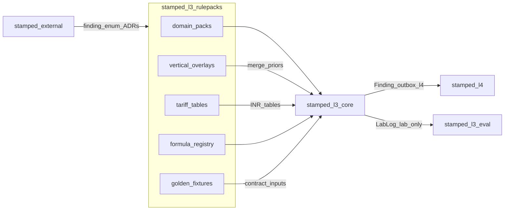

<!-- SNAPSHOT: mirrored from intelligence-rulepacks/README.md on 2026-07-19. Canonical README lives in the consumer repo — re-sync when that README changes. -->

> **Snapshot** of [`intelligence-rulepacks`](https://github.com/Vinayak-RZ/intelligence-rulepacks) root README (copied 2026-07-19).
> Canonical source: consumer repo `README.md`. Do not edit here for product truth — update the consumer repo, then re-copy.

---

# stamped-l3-rulepacks — Stamped L3 Physics & Optimization Catalog

> **What it is:** Semver **YAML/JSON rulepack artifact repository** for Stamped L3 — domain physics thresholds, optimization method rules, DISCOM HT tariff tables, and vertical industry priors. Consumed by `stamped-l3-core` via `RULEPACK_PATH`.  
> **What it is not:** An engine runtime, TOW-P fitter, Lab UI, L4 template store, plant-parameter database, SCADA writer, MILP optimizer, or NILM stack.  
> **Primary interface:** Filesystem packs (`domain/`, `verticals/`, `tariffs/`) + pytest golden / schema CI  
> **Package:** `stamped-l3-rulepacks` **0.5.1** · **Python ≥3.11** · Catalog index **1.3.1**  
> **Authority:** [ADR-012](external/decisions/ADR-012-l3-artifact-repo-topology.md) · [ADR-015 dual-lane](external/decisions/ADR-015-l3-dual-lane-lab-detections.md) · [ADR-016 shadows](external/decisions/ADR-016-attribution-shadow-challengers.md) · [L3 intelligence core](external/technical/layers/L3-intelligence-core.md) · [`finding.json`](external/contracts/schemas/finding.json)

---

**TL;DR**

- **9 domain packs**, **33 rules**, **12 Finding categories** covered end-to-end
- Wastes **1–6** at production `1.1.0` (incomer/tariff/LM/attribution + furnace/idle/compressor + **hvac** + **source_mix**)
- Optimization methods are **first-class rule IDs** (holding, setback, stagger, shed, idle sleep, COP, dispatch gap, …)
- Findings cite `rulepack://{pack}/{semver}#{rule_id}` — math runs in **core**, not here
- **4 DISCOM HT tables** (JVVNL, UPCL, UPPCL, PSPCL) — all `provisional: true` until human order cite
- **8 vertical overlays** (thresholds/priors only — never delivery overrides)
- Dual-lane Lab trust synced via `external @ d1e1539` (ADR-015/016) — of-record only in this repo
- **39 deep synthetic goldens** — every catalog `rule_id` has ≥1 of-record fixture (D025)
- CI: integrity + schema + Python **3.11/3.12** + Hypothesis **fuzz** job
- Platform contracts via git submodule [`external/`](https://github.com/Vinayak-RZ/stamped-external)

---

## Today vs roadmap

| Today (shipped) | Roadmap / other repos |
| --- | --- |
| Waste **1–6** packs at `1.1.0` | Core engines for wastes 2–6 |
| ADR-015/016 pin + AUTHORING dual-lane docs | Core LabLog / RunArtifact **1.1.0** runtime |
| Deep golden for **every** rule_id + unit/fuzz/e2e harden | Core/eval engine replay against these goldens |
| DISCOMs JVVNL + UPCL/UPPCL/PSPCL HT provisional | De-provisional after human PDF cite; more DISCOMs later |
| Verticals thickened for wastes 2–6 where asset-applicable | Plant-specific overlays outside this repo |
| YAML SSOT + [LOADER_CONTRACT.md](docs/LOADER_CONTRACT.md) | Core YAML multi-file loader cutover; then delete legacy `incomer/` |

---

## Table of contents

1. [Vision](#1-vision)
2. [Architecture](#2-architecture)
3. [Quickstart](#3-quickstart)
4. [Configuration & runtime context](#4-configuration--runtime-context)
5. [Project structure](#5-project-structure)
6. [Domain pack catalog](#6-domain-pack-catalog)
7. [Optimization methods](#7-optimization-methods)
8. [Vertical overlays](#8-vertical-overlays)
9. [Tariff tables](#9-tariff-tables)
10. [Schemas, registry & URIs](#10-schemas-registry--uris)
11. [Dual-lane Lab trust](#11-dual-lane-lab-trust)
12. [Loader contract & core export](#12-loader-contract--core-export)
13. [Scripts & tooling](#13-scripts--tooling)
14. [Testing](#14-testing)
15. [Authoring cookbook](#15-authoring-cookbook)
16. [CI & quality gates](#16-ci--quality-gates)
17. [Roadmap & build history](#17-roadmap--build-history)
18. [FAQ & glossary](#18-faq--glossary)
19. [Document map](#19-document-map)

---

## 1. Vision

### 1.1 What it is

Zerowatt-class **rule breadth** with a Stamped **audit trail**: every threshold is versioned YAML, golden-tested, and cited on the Finding. This repo is the **single source of truth for catalog artifacts** (ADR-012) — packs, priors, DISCOM tables, formula registry, and CI contracts.

### 1.2 What it is not

| Not this | Lives where |
| --- | --- |
| MD/PF/idle/furnace/HVAC engines | `stamped-l3-core` |
| LabLog dual-lane runtime / RunArtifact export | `stamped-l3-core` (+ eval) |
| Fleet eval UI / lane filters | `stamped-l3-eval` |
| Prescription prose / L4 templates | `stamped-l4` |
| Plant-calibrated overrides | plant `params.yaml` (L2/core) |
| Platform Finding enum / ADRs | `stamped-external` (`external/` submodule) |

### 1.3 Who it is for

| Audience | Use |
| --- | --- |
| L3 core engineers | Load packs via `RULEPACK_PATH`; implement `formula_id` engines |
| Catalog authors | Add/bump rule YAML + goldens + registry keys |
| Reviewers / CI | Schema, golden coverage, dual-lane forbid list |
| Plant energy engineers (indirect) | Defaults they can challenge; ₹ from DISCOM tables |

### 1.4 Success criteria

- Every Finding `category` in platform `finding.json` maps to ≥1 rule URI
- Catalog index on disk matches `domain/*/*/rules/*.yaml` (33 rules today)
- Every `rule_id` has ≥1 deep of-record golden (≥12 measurements)
- `./scripts/validate.sh` green; optional `VALIDATE_FUZZ=1`
- No engine code, no Lab→L4 promote, no shadow Finding categories in this repo

### 1.5 Inventory snapshot

| Artifact | Count / version |
| --- | --- |
| Package | `0.5.1` |
| Catalog index | `1.3.1` |
| Domain packs | **9** |
| Rules | **33** |
| Formula registry entries | **29** |
| Finding categories covered | **12** |
| DISCOM HT tables | **4** |
| Vertical overlays | **8** |
| Golden fixtures | **39** |
| Platform pin | `external @ d1e1539` |

---

## 2. Architecture

### 2.1 High-level



### 2.2 Merge order into core

1. Domain pack for the Finding category  
2. `verticals/<id>/params.yaml` priors (thresholds only)  
3. Plant `params.yaml` (**outside** this repo)  
4. Tariff ₹ from `tariffs/<discom>/<semver>/tables.yaml`

See [docs/LOADER_CONTRACT.md](docs/LOADER_CONTRACT.md).

### 2.3 Dual path (legacy incomer)

`domain/incomer/1.1.0/` is canonical. Legacy top-level `incomer/` mirrors until core YAML cutover (D009/D018). Do not invent a third path.

### 2.4 Waste map

| Waste | Theme | Packs |
| --- | ---: | --- |
| 1 | Electrical / MD / PF / ToD / attribution | `incomer`, `tariff`, `load_management`, `attribution` |
| 2 | Furnace / process heat | `furnace` |
| 3 | Idle / phantom / off-shift | `idle` |
| 4 | Compressed air | `compressor` |
| 5 | HVAC / COP / AHU | `hvac` |
| 6 | Source mix / dispatch | `source_mix` |

---

## 3. Quickstart

### 3.1 Prerequisites

- Git + Python **≥3.11**
- Network access to clone `stamped-external` submodule

### 3.2 Install

```bash
git clone <this-repo>
cd stamped-l3-rulepacks   # or intelligence-rulepacks
git submodule update --init --recursive
test -f external/VERSION
test -f external/contracts/schemas/finding.json
python3 -m pip install -e ".[dev]"
```

### 3.3 Verify

```bash
./scripts/validate.sh
# optional:
VALIDATE_FUZZ=1 ./scripts/validate.sh
```

Expected: pytest green (unit + e2e); with `VALIDATE_FUZZ=1`, Hypothesis fuzz also green.

### 3.4 Point core at this repo

Set `RULEPACK_PATH` to this repository root (layout in §12). Optional migration JSON:

```bash
python3 scripts/export_core_snapshot.py
# → fixtures/core_export/incomer_rulepack.json
```

---

## 4. Configuration & runtime context

This repo has **no runtime server** and **no `.env` secrets**. Configuration is filesystem + platform pin.

| Knob | Where | Notes |
| --- | --- | --- |
| Platform contracts | `external/` gitlink | Pin `d1e1539` (ADR-015/016); prefer release tag when cut |
| `RULEPACK_PATH` | Consumer env (core) | Directory root of this repo |
| Plant overlays | Outside repo | Never commit plant secrets here |
| DISCOM selection | Plant / core config | Chooses `tariffs/<discom>/…` |
| Dev deps | `pyproject.toml` `[dev]` | `pytest`, `hypothesis`, plus runtime `PyYAML`, `jsonschema` |

---

## 5. Project structure

```text
stamped-l3-rulepacks/
├── domain/{pack}/{semver}/
│   ├── manifest.yaml
│   └── rules/{rule_id}.yaml
├── verticals/{vertical}/params.yaml
├── tariffs/{discom}_ht/{semver}/
│   ├── manifest.yaml          # when present
│   └── tables.yaml
├── shared/suppressions.yaml
├── schemas/
│   ├── catalog_index.json           # derived index (1.3.1)
│   ├── formula_registry.json
│   ├── rulepack-manifest.schema.json
│   ├── rule-file.schema.json
│   ├── golden-fixture.schema.json
│   ├── tariff-tables.schema.json
│   └── vertical-params.schema.json
├── fixtures/
│   ├── golden/*.json                # 39 of-record fixtures
│   ├── mock_plant/                  # D025 seeds + sample windows
│   └── core_export/                 # incomer JSON migration aid
├── incomer/                         # legacy mirror of domain/incomer
├── scripts/
│   ├── validate.sh
│   ├── rebuild_catalog_index.py
│   ├── generate_mock_windows.py
│   └── export_core_snapshot.py
├── tests/                           # unit + fuzz/ + e2e/
├── docs/                            # AUTHORING, LOADER, TESTING, handoffs…
├── external/                        # stamped-external submodule
├── DECISIONS.md
├── PROGRESS.md
├── IMPLEMENTATION_PLAN.md
└── pyproject.toml
```

---

## 6. Domain pack catalog

Full machine index: [`schemas/catalog_index.json`](schemas/catalog_index.json).

| Pack | Semver | Rules | Waste | Finding categories |
| --- | --- | ---: | ---: | --- |
| `incomer` | 1.1.0 | 6 | 1 | md_overlap, md_exceedance_risk, cmd_oversized, pf_slab_breach, pf_leading, tod_exposure |
| `tariff` | 1.1.0 | 3 | 1 | cmd_oversized, pf_slab_breach, tod_exposure (table-backed) |
| `load_management` | 1.1.0 | 9 | 1 | md_*, tod_*, cmd_*, pf_* methods |
| `attribution` | 1.1.0 | 1 | 1 | md_overlap (`costart_window`) |
| `furnace` | 1.1.0 | 4 | 2 | furnace_holding, sec_drift |
| `idle` | 1.1.0 | 4 | 3 | idle_load |
| `compressor` | 1.1.0 | 3 | 4 | compressor_sp_drift |
| `hvac` | 1.1.0 | 2 | 5 | cop_degradation |
| `source_mix` | 1.1.0 | 1 | 6 | dispatch_gap |

**URI form:** `rulepack://{pack}/{semver}#{rule_id}`  
Example: `rulepack://furnace/1.1.0#furnace_holding_detect`

### 6.1 Complete rule index (33)

| Pack | Rule id | Category |
| --- | --- | --- |
| attribution | `costart_window` | md_overlap |
| compressor | `compressor_sp_drift` | compressor_sp_drift |
| compressor | `compressor_unload_seq` | compressor_sp_drift |
| compressor | `compressor_leak_offshift` | compressor_sp_drift |
| furnace | `furnace_holding_detect` | furnace_holding |
| furnace | `furnace_setback_opt` | furnace_holding |
| furnace | `furnace_preheat_early` | furnace_holding |
| furnace | `furnace_sec_drift` | sec_drift |
| hvac | `cop_degradation` | cop_degradation |
| hvac | `ahu_offhours` | cop_degradation |
| idle | `idle_machine_kw` | idle_load |
| idle | `phantom_nonprod` | idle_load |
| idle | `offshift_baseload_drift` | idle_load |
| idle | `idle_cnc_spindle` | idle_load |
| incomer | `md_overlap` | md_overlap |
| incomer | `md_exceedance_risk` | md_exceedance_risk |
| incomer | `cmd_oversized` | cmd_oversized |
| incomer | `pf_slab` | pf_slab_breach |
| incomer | `pf_leading` | pf_leading |
| incomer | `tod_exposure` | tod_exposure |
| load_management | `stagger_costart` | md_overlap |
| load_management | `peak_shave_shed` | md_exceedance_risk |
| load_management | `load_shift_tod` | tod_exposure |
| load_management | `md_exceedance_holdoff` | md_exceedance_risk |
| load_management | `cmd_rightsize` | cmd_oversized |
| load_management | `pf_kvAr_correct` | pf_slab_breach |
| load_management | `pf_leading_cut` | pf_leading |
| load_management | `demand_floor_exposure` | cmd_oversized |
| load_management | `intraday_load_factor` | md_overlap |
| source_mix | `dispatch_gap` | dispatch_gap |
| tariff | `billing_demand_floor` | cmd_oversized |
| tariff | `pf_slab_table` | pf_slab_breach |
| tariff | `tod_windows` | tod_exposure |

---

## 7. Optimization methods

### 7.1 Furnace / process heat (`domain/furnace/`)

| Rule id | Method (catalog-declared) |
| --- | --- |
| `furnace_holding_detect` | `holding_energy_kwh ≈ holding_kw × non_production_hours` |
| `furnace_setback_opt` | Setback / ΔT radiation hold reduction |
| `furnace_preheat_early` | Preheat earlier than MES charge window |
| `furnace_sec_drift` | kWh/ton vs SEC band |

### 7.2 Idle load (`domain/idle/`)

| Rule id | Method |
| --- | --- |
| `idle_machine_kw` | Idle state ∧ kW > floor → sleep/shutdown candidate |
| `phantom_nonprod` | kW > baseload while production ≈ 0 |
| `offshift_baseload_drift` | Off-shift mean kW drift vs lookback |
| `idle_cnc_spindle` | CNC idle as fraction of run power |

### 7.3 Load management — electrical (`domain/load_management/`)

| Rule id | Method |
| --- | --- |
| `stagger_costart` | Stagger startups; core recomputes 15-min peak |
| `peak_shave_shed` | Shed non-critical feeders in MD risk window |
| `load_shift_tod` | Shift flexible kWh off peak ToD |
| `md_exceedance_holdoff` | Defer co-starts if projected peak > CMD |
| `cmd_rightsize` | Recommend CD from `max(MD, floor%·CD)` history |
| `pf_kvAr_correct` | kVAr needed for PF slab recovery |
| `pf_leading_cut` | Cut over-compensation at light load |
| `demand_floor_exposure` | Floor-dominated bill exposure |
| `intraday_load_factor` | Flatten low LF / high MD days |

### 7.4 Compressor / HVAC / source mix / attribution

| Pack | Rules | Notes |
| --- | --- | --- |
| compressor | SP drift, unload seq, **leak off-shift** | D020 |
| hvac | `cop_degradation`, `ahu_offhours` | Research: [P2_HVAC_SOURCEMIX_RESEARCH.md](docs/P2_HVAC_SOURCEMIX_RESEARCH.md) |
| source_mix | `dispatch_gap` | Peak-ToD under-draw of cheaper source; no MILP |
| attribution | `costart_window` | Of-record `score = ramp_kw × 1/(1+hops)`; Lab shadows engine-side |

**Forbidden here:** SCADA writes, plant-wide MILP, NILM as of-record, PINNs, promote Lab→L4.

---

## 8. Vertical overlays

Files: `verticals/<id>/params.yaml` (schema: [`schemas/vertical-params.schema.json`](schemas/vertical-params.schema.json)).

| Vertical | Emphasis |
| --- | --- |
| `forging` | Holding + MD co-start + compressed air |
| `auto_components` | CNC idle + SP + HVAC COP |
| `die_casting` | Holding + chiller COP |
| `cement` | SEC-heavy |
| `pharma` | Process AHU/chiller COP + PF |
| `textile` | Idle + SP + ToD |
| `fmcg_food` | Refrigeration COP + idle + source_mix gap priors |
| `general_ht` | Path B incomer-only — **no invented feeder floors** |

Verticals may overlay numeric priors that intersect domain `defaults` keys. They must **not** set `delivery`, `status`, or force L4 for weak signals.

---

## 9. Tariff tables

₹ SSOT lives in tariff tables (not duplicated in domain rules when `table_fields` exist).

| Path | Content |
| --- | --- |
| `tariffs/jvvnl_ht/1.1.0/` | 75% floor, PF step model (D012), ToD INR deltas |
| `tariffs/upcl_ht/1.0.0/` | kVAh, 75% billable demand, ToD |
| `tariffs/uppcl_ht/1.0.0/` | HV-2 seasonal ToD as INR deltas |
| `tariffs/pspcl_ht/1.0.0/` | LS HT, PF≈0.90 steps, seasonal evening ToD |

All ship with `provisional: true` until a human cites the controlling tariff order PDF.  
Source audit notes: [`docs/DISCOM_SOURCE_REFS.md`](docs/DISCOM_SOURCE_REFS.md).

Schema: [`schemas/tariff-tables.schema.json`](schemas/tariff-tables.schema.json). ToD windows use `rate_delta_inr_per_kwh` only.

---

## 10. Schemas, registry & URIs

| File | Role |
| --- | --- |
| `schemas/formula_registry.json` | Closed `formula_id` set + `defaults_keys` + `bill_line` |
| `schemas/catalog_index.json` | Derived pack/rule/golden/coverage index (**rebuild from disk**) |
| `schemas/rulepack-manifest.schema.json` | Manifest validation |
| `schemas/rule-file.schema.json` | Rule YAML validation |
| `schemas/golden-fixture.schema.json` | Golden JSON validation |
| `schemas/tariff-tables.schema.json` | DISCOM tables |
| `schemas/vertical-params.schema.json` | Vertical overlays |
| `shared/suppressions.yaml` | Shared suppression ids (`startup_window`, …) |

Rebuild index after adding rules/goldens:

```bash
python3 scripts/rebuild_catalog_index.py
```

---

## 11. Dual-lane Lab trust

Platform-owned (do **not** invent a different model):

| Doc | Role |
| --- | --- |
| [ADR-015](external/decisions/ADR-015-l3-dual-lane-lab-detections.md) | `delivery` ∈ {`l4`,`lab_only`}; statuses include `hypothesis` |
| [ADR-016](external/decisions/ADR-016-attribution-shadow-challengers.md) | Of-record co-start; shadows Lab-only (no SHAP / full NILM) |
| [L3-attribution-explainability.md](external/technical/layers/L3-attribution-explainability.md) | Engineer-facing explainability guide |

**Invariant:** `delivery == l4` ⇔ `status == emitted` ⇔ Finding outbox.  
Everything else stays `lab_only` until a future rulepack/threshold/calibration change makes a new emit legitimate.

| Catalog may | Catalog must not |
| --- | --- |
| Author of-record defaults (`costart_minutes`, `max_hops`, …) | Add Finding categories for shadows/hypotheses |
| Golden of-record emit / suppress expectations | Encode `delivery` / `status` on rule YAML or verticals |
| Document Lab shadows as engine-side | Ship promote-Lab→L4 UI/features |

Pack notes: [`domain/attribution/README.md`](domain/attribution/README.md).

---

## 12. Loader contract & core export

**Authority index for core:** [`docs/CORE_INTEGRATION.md`](docs/CORE_INTEGRATION.md)  
**Machine pin:** [`schemas/consumer_manifest.json`](schemas/consumer_manifest.json) (rebuild: `python3 scripts/rebuild_consumer_manifest.py`)  
**Loader layout:** [`docs/LOADER_CONTRACT.md`](docs/LOADER_CONTRACT.md)

```text
$RULEPACK_PATH/
  domain/{pack}/{semver}/manifest.yaml + rules/
  tariffs/{discom}/{semver}/tables.yaml
  verticals/{vertical}/params.yaml
  shared/suppressions.yaml
  schemas/formula_registry.json
  schemas/consumer_manifest.json
```

Point intelligence-core `RULEPACK_PATH` at **this repository root** for product packs. Optional JSON migration aid (incomer only today):

```bash
python3 scripts/export_core_snapshot.py
```

→ `fixtures/core_export/incomer_rulepack.json` for legacy `load_rulepack()`. **YAML remains SSOT.** Engine map keys are **rule ids** (e.g. `pf_slab`), not always Finding category names.

Core handoffs:

- Index: [`docs/CORE_INTEGRATION.md`](docs/CORE_INTEGRATION.md)
- Waste 1: [`docs/HANDOFF_CORE_WASTE_1.md`](docs/HANDOFF_CORE_WASTE_1.md)
- Wastes 2–4: [`docs/HANDOFF_CORE_WASTES_2_4.md`](docs/HANDOFF_CORE_WASTES_2_4.md)
- Wastes 5–6: [`docs/HANDOFF_CORE_WASTES_5_6.md`](docs/HANDOFF_CORE_WASTES_5_6.md)
- YAML loader: [`docs/HANDOFF_CORE_YAML_LOADER.md`](docs/HANDOFF_CORE_YAML_LOADER.md)
- Core agent brief: [`docs/CORE_AGENT_BRIEF.md`](docs/CORE_AGENT_BRIEF.md)
- **Core agent prompt (paste into intelligence-core):** [`docs/AGENT_PROMPT_INTELLIGENCE_CORE_ALIGN_RULESPACKS.md`](docs/AGENT_PROMPT_INTELLIGENCE_CORE_ALIGN_RULESPACKS.md)

---

## 13. Scripts & tooling

| Script | Purpose |
| --- | --- |
| [`scripts/validate.sh`](scripts/validate.sh) | Submodule check + consumer_manifest drift + unit/e2e pytest + export; `VALIDATE_FUZZ=1` adds fuzz |
| [`scripts/rebuild_catalog_index.py`](scripts/rebuild_catalog_index.py) | Rebuild `schemas/catalog_index.json` from disk |
| [`scripts/rebuild_consumer_manifest.py`](scripts/rebuild_consumer_manifest.py) | Rebuild / `--check` `schemas/consumer_manifest.json` for core pin |
| [`scripts/generate_mock_windows.py`](scripts/generate_mock_windows.py) | Deterministic synthetic windows/goldens (D025) |
| [`scripts/export_core_snapshot.py`](scripts/export_core_snapshot.py) | Incomer JSON snapshot for legacy core loader |

Mock seeds: [`fixtures/mock_plant/seeds.json`](fixtures/mock_plant/seeds.json).

---

## 14. Testing

Full guide: [`docs/TESTING.md`](docs/TESTING.md). Done report: [`docs/TEST_HARDEN_DONE_REPORT.md`](docs/TEST_HARDEN_DONE_REPORT.md).

### 14.1 Commands

```bash
./scripts/validate.sh                    # unit + e2e + export
VALIDATE_FUZZ=1 ./scripts/validate.sh    # + Hypothesis fuzz
python3 -m pytest -q -m "not fuzz"
python3 -m pytest -q -m e2e
python3 -m pytest -q -m fuzz --hypothesis-profile=ci
python3 scripts/generate_mock_windows.py --seed 7 --write-goldens
```

### 14.2 Tiers

| Marker | Purpose |
| --- | --- |
| *(default / unit)* | Integrity, schemas, tariffs, verticals, golden coverage |
| `e2e` | Rebuild → collect → export + loader-contract walk |
| `fuzz` | Hypothesis property tests on defaults/schemas |

### 14.3 What “results” mean here

This repo does **not** emit Finding ₹. Tests assert **contract results**: URI resolve, category ∈ enum, defaults ⊆ registry, golden depth, tariff shape, no delivery overrides. Engines consume goldens in core/eval for true detection e2e.

### 14.4 Coverage guarantees

| Guarantee | Test |
| --- | --- |
| Every catalog `rule_id` has deep of-record golden | `tests/test_golden_coverage.py` |
| All golden URIs resolve on disk | `tests/test_golden_semver_refs.py` |
| No `delivery`/`status` on rule YAML | `tests/test_rules_forbid_delivery.py` |
| ADR-015/016 docs pinned + AUTHORING links | `tests/test_dual_lane_docs.py` |
| North-India DISCOM structural invariants | `tests/test_tariff_north_india_deep.py` |

---

## 15. Authoring cookbook

Step-by-step: [`docs/AUTHORING.md`](docs/AUTHORING.md).

### 15.1 Add a rule (minimal path)

1. Ensure `formula_id` exists in `schemas/formula_registry.json` (`defaults_keys` freeze first).  
2. Add `domain/<pack>/<semver>/rules/<rule_id>.yaml`.  
3. Register in that pack’s `manifest.yaml`.  
4. Add deep golden under `fixtures/golden/` (≥12 measurements, `rule_or_model_ref`, evidence).  
5. `python3 scripts/rebuild_catalog_index.py`.  
6. `./scripts/validate.sh`.  
7. Bump pack semver on behaviour change; bump package when cutting a release.

### 15.2 Common recipes

| Goal | Recipe |
| --- | --- |
| Thicken a vertical prior | Edit `verticals/<id>/params.yaml`; keep keys ⊆ registry defaults; re-run vertical schema tests |
| Harden DISCOM `source_ref` | Edit `tariffs/…/tables.yaml` + [`docs/DISCOM_SOURCE_REFS.md`](docs/DISCOM_SOURCE_REFS.md); keep `provisional: true` until cite |
| Regenerate waste-1 goldens from seeds | `python3 scripts/generate_mock_windows.py --seed 7 --write-goldens` |
| Refresh incomer JSON export | `python3 scripts/export_core_snapshot.py` |

---

## 16. CI & quality gates

Workflow: [`.github/workflows/catalog-ci.yml`](.github/workflows/catalog-ci.yml).

| Job | What |
| --- | --- |
| **integrity** (3.12) | Repo integrity, P0/P1/P2 pack gates, dual-lane docs, golden coverage/depth, verticals, bindings |
| **catalog** (3.11 + 3.12) | Full `./scripts/validate.sh` + JUnit artifacts |
| **schemas** (3.12) | Manifest/golden/tariff/vertical schemas + export |
| **fuzz** (3.12) | `pytest -m fuzz --hypothesis-profile=ci` |

Local gate of record: `./scripts/validate.sh`.

---

## 17. Roadmap & build history

### 17.1 Build phases (completed)

| Phase | Theme | Status |
| --- | --- | --- |
| P0 | Waste-1 deepen + JVVNL productize | done (PR #3) |
| P1 | Wastes 2–4 + UPCL/UPPCL/PSPCL + all verticals | done (PR #4) |
| P2 | HVAC + source_mix `1.1.0` + ADR-015/016 pin | done (PR #5 train) |
| Test harden | Mock data, golden-per-rule, unit/fuzz/e2e, CI | done (PR #6 train) · package `0.5.1` |

### 17.2 Possible future directions

- Human order-cite → clear `provisional` on DISCOM tables  
- Additional DISCOM HT tables (named expansion)  
- Core YAML multi-file loader cutover → delete legacy `incomer/`  
- Core/eval engine replay wired to these goldens  
- Platform release tag pin once stamped-external cuts `vYYYY.MM.DD` post ADR-015/016  

### 17.3 Changelog (recent)

| Version | Notes |
| --- | --- |
| **0.5.1** | Test harden: D025 mock plant, 33/33 golden coverage, Hypothesis fuzz, e2e pipeline, CI fuzz job, catalog `1.3.1` |
| **0.5.0** | P2: hvac/source_mix `1.1.0`, ADR-015/016 pin `d1e1539`, vertical COP priors, DISCOM `source_ref` harden |
| **0.4.0** | P1: furnace/idle/compressor `1.1.0`, deep goldens, UPCL/UPPCL/PSPCL, catalog `1.2.0` |

Live status: [`PROGRESS.md`](PROGRESS.md) · Decisions: [`DECISIONS.md`](DECISIONS.md) (D001–D025).

---

## 18. FAQ & glossary

**Can I put furnace / COP math in this repo?**  
No — thresholds and `formula_ref` strings here; simulator arithmetic in `stamped-l3-core`.

**Why are tariffs still provisional?**  
Live ₹ claims require a human-cited tariff order PDF. Tables are schema-valid research seeds until then (D023).

**Why synthetic goldens instead of public meter data?**  
Catalog CI needs reproducible contracts (D025). Large public corpora add license/privacy noise without engines here. Core can later replay these fixtures.

**What is dual-lane?**  
Every detection candidate gets `status` + `delivery`. Only `emitted`/`l4` stages the Finding outbox; suppressed/hypothesis/shadow stay Lab-only (ADR-015/016).

**Rulepack** — Semver directory of YAML rules under `domain/<pack>/<semver>/`.  
**Vertical overlay** — Industry prior defaults layered on domain packs.  
**Optimization method** — Named detection / what-if rule (stagger, setback, idle sleep, …).  
**Of-record** — Defaults/rules eligible for L4 emit when core gates pass.  
**Lab-only** — Forensic lane; never customer L4 outbox without a future catalog/calibration change.

---

## 19. Document map

| Doc | Role |
| --- | --- |
| [docs/AUTHORING.md](docs/AUTHORING.md) | How to add rules; dual-lane forbid list |
| [docs/CORE_INTEGRATION.md](docs/CORE_INTEGRATION.md) | Core authority index + compatibility |
| [docs/CORE_AGENT_BRIEF.md](docs/CORE_AGENT_BRIEF.md) | Paste brief for intelligence-core agents |
| [docs/AGENT_PROMPT_CORE_RULESPACK_BRIDGE.md](docs/AGENT_PROMPT_CORE_RULESPACK_BRIDGE.md) | Paste prompt to re-run this bridge work |
| [docs/LOADER_CONTRACT.md](docs/LOADER_CONTRACT.md) | RULEPACK_PATH layout + merge order |
| [schemas/consumer_manifest.json](schemas/consumer_manifest.json) | Machine-readable core pin |
| [docs/TESTING.md](docs/TESTING.md) | Test tiers, mock data, sample outcomes |
| [docs/DISCOM_SOURCE_REFS.md](docs/DISCOM_SOURCE_REFS.md) | Tariff audit notes |
| [docs/P2_HVAC_SOURCEMIX_RESEARCH.md](docs/P2_HVAC_SOURCEMIX_RESEARCH.md) | HVAC / source_mix research freeze |
| [docs/HANDOFF_CORE_WASTE_1.md](docs/HANDOFF_CORE_WASTE_1.md) | Core engine handoff waste 1 |
| [docs/HANDOFF_CORE_WASTES_2_4.md](docs/HANDOFF_CORE_WASTES_2_4.md) | Core engine handoff wastes 2–4 |
| [docs/HANDOFF_CORE_WASTES_5_6.md](docs/HANDOFF_CORE_WASTES_5_6.md) | Core engine handoff wastes 5–6 |
| [docs/HANDOFF_CORE_YAML_LOADER.md](docs/HANDOFF_CORE_YAML_LOADER.md) | YAML loader adoption |
| [DECISIONS.md](DECISIONS.md) | ADRs D001–D026 |
| [PROGRESS.md](PROGRESS.md) | Phase status |
| [PROJECT_OVERVIEW.md](PROJECT_OVERVIEW.md) | One-page overview |
| [AGENTS.md](AGENTS.md) | Agent engineering workflow for this monorepo tooling |
