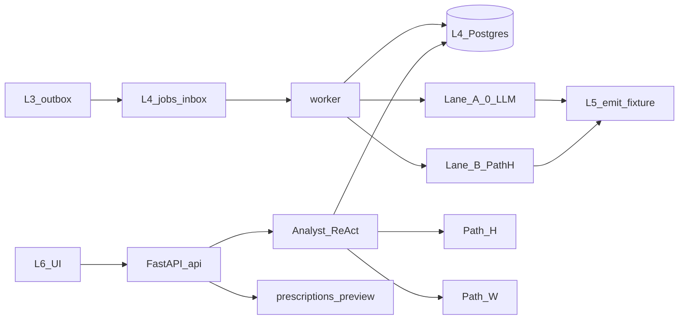
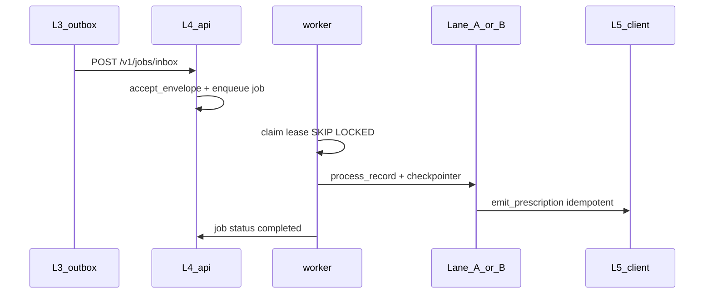
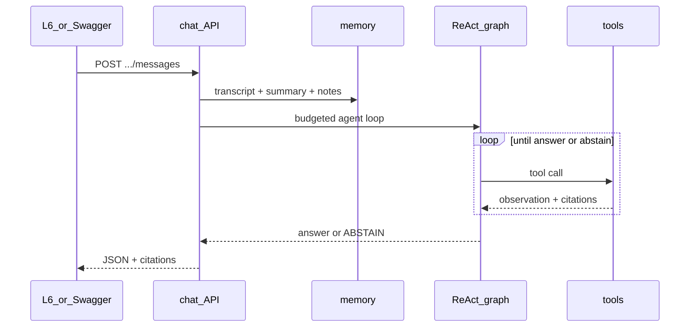
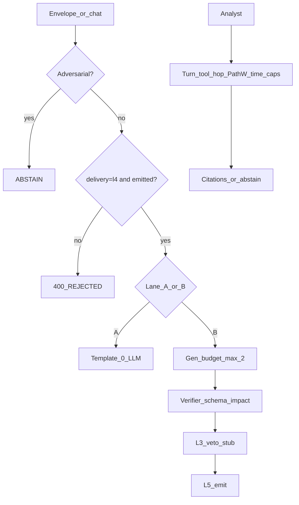

<!-- SNAPSHOT: mirrored from knowledge-reasoning/README.md on 2026-07-19. Canonical README lives in the consumer repo — re-sync when that README changes. -->

> **Snapshot** of [`knowledge-reasoning`](https://github.com/Vinayak-RZ/knowledge-reasoning) root README (copied 2026-07-19).
> Canonical source: consumer repo `README.md`. Do not edit here for product truth — update the consumer repo, then re-copy.

---

# knowledge-reasoning — Stamped L4 Knowledge & Reasoning

> **What it is:** The L4 consumer that turns L3 `Finding` records into L5-ready `Prescription` records and answers read-only plant energy questions with citations.  
> **What it is not:** A plant dashboard, OT controller, bill-truth engine, WhatsApp sender, or product chat UI (those belong to L2/L3/L5/L6).  
> **Primary interface:** FastAPI HTTP API (`api` process) + durable `worker` process. L6 owns the operator UI.

**Runtime:** Python 3.11+ · package `stamped-l4` v0.2.0 · modular monolith (`api` + `worker` + dedicated Postgres).  
**Authority:** Platform SSOT lives in the `external/` submodule — do not fork layer specs into this repo.

---

**TL;DR**

- Dual prescription lanes: **Lane A** (template, **0 LLM**) and **Lane B** (Path H RAG + ≤2 structured generation calls)
- Durable jobs with lease fencing (`FOR UPDATE SKIP LOCKED`) and LangGraph checkpointer resume
- Conversational analyst: budgeted **LangGraph ReAct**, session transcript + rolling summary + explicit notes
- Path H hybrid retrieval (SQLite FTS5 + hash dense + RRF) over `corpus/seed/`
- Path W allowlisted web research labelled **T4** (fixture in CI; `httpx` when live)
- **12** HTTP routes (11 always-on + optional eng-only `/dev/chat`)
- **9** read-only analyst tools; forbidden OT/messaging/SQL/open-crawl tools absent from registry
- **6** Postgres tables via Alembic; compose stack for local ops
- Optional Phoenix/OTel (`--profile obs`) + 60-case eval dataset sync helpers
- CI without live models: mock structured model when `L4_MODEL_*` unset
- Product UI is **L6-only**; live L2/L3/L5 HTTP remains stubs until cutover

---

## Table of contents

1. [Vision](#1-vision)
2. [Architecture](#2-architecture)
3. [Quickstart](#3-quickstart)
4. [Configuration](#4-configuration)
5. [Project structure](#5-project-structure)
6. [HTTP API](#6-http-api)
7. [Analyst tools & lanes](#7-analyst-tools--lanes)
8. [Data model](#8-data-model)
9. [Testing & eval](#9-testing--eval)
10. [Deployment & observability](#10-deployment--observability)
11. [Cookbook](#11-cookbook)
12. [Platform SSOT & reading order](#12-platform-ssot--reading-order)
13. [Roadmap & changelog](#13-roadmap--changelog)
14. [FAQ & glossary](#14-faq--glossary)

---

## 1. Vision

### 1.1 What it is

Stamped Energy’s **L4 — Knowledge & Reasoning** layer. It composes evidence into **advice**:

1. **Prescription compiler** — Accept L3 outbox envelopes (`delivery=l4` ∧ `status=emitted`), route Lane A or B, verify schema/impact, apply L3 veto stub, emit to L5 (fixture today).
2. **Conversational energy analyst** — Multi-turn, cited, budgeted ReAct over Path H / L2 fixture tools / Path W; explicit saved notes only (no silent semantic memory).
3. **Curated web research (Path W)** — Allowlisted hosts, snapshot + checksum, trust tier **T4**; never sole truth for ₹/M&V.

### 1.2 What it is not

| Not this | Owner / note |
|----------|----------------|
| Waste detection | L3 |
| Telemetry / baselines / role map product truth | L2 (HTTP tools only; never `L2_DATABASE_URL`) |
| Tariff / bill arithmetic as product truth | Deterministic calculator (outside L4) |
| Approval, WhatsApp, verified savings | L5 |
| Plant dashboard / operator chat product UI | L6 (calls this API) |
| Autonomous OT write / open web crawl | Forbidden |
| Hindi / Hinglish generation | Far future (D8) |
| Sustainability narrative | Deferred to P3 |

### 1.3 Who it is for

| Persona | Interface |
|---------|-----------|
| Energy engineer / operator | L6 chat & Rx queue → L4 APIs |
| Platform engineer | Swagger `/docs`, preview, docker-compose |
| Reviewer / auditor | Provenance, citations, eval gates |
| Agents / contributors | This README + `external/` SSOT + nawab plans |

### 1.4 Success criteria (today)

- Fixture Finding → valid Prescription on Lane A (0 LLM) and Lane B (mock model)
- Durable job survives restart without duplicate emit (lease + checkpointer path)
- Analyst multi-turn with citations; Path W results labelled T4
- `./scripts/validate.sh` green with `L4_MODEL_*` unset
- No product UI in this repo

---

## 2. Architecture

### 2.1 High-level topology



### 2.2 Prescription lifecycle



### 2.3 Analyst turn lifecycle



### 2.4 Safety / control stack



### 2.5 Key modules

| Path | Role |
|------|------|
| `src/stamped_l4/api/app.py` | FastAPI routes |
| `src/stamped_l4/worker/runner.py` | Route + invoke Lane A/B |
| `src/stamped_l4/worker/durable.py` | Lease claim → process → complete/fail |
| `src/stamped_l4/graph/lane_a.py` | Lane A StateGraph (0 LLM) |
| `src/stamped_l4/graph/lane_b.py` | Lane B retrieve → draft/repair → claims → emit |
| `src/stamped_l4/analyst/react.py` | Analyst ReAct StateGraph |
| `src/stamped_l4/analyst/tools.py` | Read-only tool registry (9 tools) |
| `src/stamped_l4/retrieval/path_h.py` | Path H hybrid RAG |
| `src/stamped_l4/web/path_w.py` | Path W allowlist fetch |
| `src/stamped_l4/jobs/leases.py` | Job leases + fencing token |
| `src/stamped_l4/jobs/checkpointer.py` | Memory / Sqlite / Postgres checkpointer |
| `src/stamped_l4/db/` | Engine, models, repos |
| `src/stamped_l4/obs/` | OTel + Phoenix helpers |
| `src/stamped_l4/clients/http_stubs.py` | Live HTTP stubs (`LiveHttpNotEnabled`) |
| `migrations/` | Alembic revisions |
| `deploy/docker-compose.yml` | api + worker + postgres (+ obs profile) |

---

## 3. Quickstart

### 3.1 Prerequisites

- Python **3.11+**
- Git (with submodule support)
- Optional: Docker + Compose for Postgres / full stack / Phoenix

### 3.2 Install (local / CI style)

```bash
git clone https://github.com/Vinayak-RZ/knowledge-reasoning.git
cd knowledge-reasoning
git submodule update --init --recursive
test -f external/VERSION

python -m pip install -e ".[dev,postgres,obs]"
# leave model env unset for mock mode
unset L4_MODEL_PROVIDER L4_MODEL_BASE_URL L4_MODEL_API_KEY L4_MODEL_NAME
./scripts/validate.sh
```

### 3.3 Run API locally (SQLite or Postgres)

```bash
export L4_DATABASE_URL="${L4_DATABASE_URL:-sqlite+pysqlite:///./data/l4.db}"
mkdir -p data
python -m stamped_l4.api
# → http://127.0.0.1:8000/docs
```

Worker (separate terminal):

```bash
export L4_DATABASE_URL="${L4_DATABASE_URL:-sqlite+pysqlite:///./data/l4.db}"
python -m stamped_l4.worker
```

### 3.4 Run full compose stack

```bash
cp deploy/.env.example deploy/.env
docker compose -f deploy/docker-compose.yml up --build
# API :8000  · Postgres :5432

# Optional Phoenix + traced API:
docker compose -f deploy/docker-compose.yml --profile obs up --build
# Phoenix UI :6006  · traced API :8001
```

### 3.5 Smoke test

```bash
curl -s http://127.0.0.1:8000/health | jq .
# {"status":"ok","layer":"l4",...,"db":"ready"}
```

---

## 4. Configuration

Source of truth for local secrets template: [`deploy/.env.example`](deploy/.env.example). Never commit real values.

| Variable | Required | Default | Description |
|----------|----------|---------|-------------|
| `L4_DATABASE_URL` | compose/prod | `sqlite+pysqlite:///:memory:` in unit tests | SQLAlchemy URL (prefer Postgres) |
| `L4_MODEL_PROVIDER` | no | empty → mock | Set `openai_compat` for real model |
| `L4_MODEL_BASE_URL` | with real model | — | OpenAI-compatible base URL |
| `L4_MODEL_API_KEY` | with real model | — | API key (secret) |
| `L4_MODEL_NAME` | with real model | — | Model id |
| `L4_MODEL_TIMEOUT_S` | no | `20` | Model HTTP timeout |
| `L4_PATH_W_ENABLED` | no | `1` | Enable Path W tool |
| `L4_PATH_W_TRANSPORT` | no | `fixture` | `fixture` \| `httpx` |
| `L4_PATH_W_LIVE` | no | `0` | `1` selects httpx transport |
| `L4_PATH_W_TIMEOUT_S` | no | `10` | Live fetch timeout |
| `L4_ANALYST_MAX_TURNS` | no | `6` (hard max 8) | ReAct model turns / cycle |
| `L4_ANALYST_MAX_TOOL_CALLS` | no | `8` (hard max 12) | Tool calls / cycle |
| `L4_ANALYST_WALL_CLOCK_S` | no | `45` (hard max 60) | Wall clock / cycle |
| `L4_OTEL_ENABLED` | no | `0` | Export OpenTelemetry spans |
| `L4_PHOENIX_ENABLED` | no | `0` | Register Phoenix OTel when installed |
| `L4_PHOENIX_ENDPOINT` | no | `http://localhost:6006/v1/traces` | OTLP traces URL |
| `L4_PHOENIX_BASE_URL` | no | `http://localhost:6006` | Phoenix UI/API for dataset sync |
| `L4_PHOENIX_PROJECT` | no | `stamped-l4` | Phoenix project name |
| `L4_PHOENIX_SYNC_DATASET` | no | `0` | `1` uploads 60-case eval dataset |
| `L4_DEV_CHAT_UI` | no | `0` | Eng-only thin `/dev/chat` page |
| `L4_WORKER_ID` | no | `worker-1` | Lease owner identity |
| `L4_WORKER_POLL_S` | no | `1.0` | Idle poll interval |
| `L4_API_HOST` / `L4_API_PORT` | no | `0.0.0.0` / `8000` | Uvicorn bind |

**Graceful degradation:** mock model without `L4_MODEL_*`; fixture Path W without live flag; MemorySaver checkpointer if Postgres saver unavailable; OTel no-op when disabled.

---

## 5. Project structure

```text
knowledge-reasoning/
├── src/stamped_l4/           # Installable package
│   ├── api/                  # FastAPI app + __main__
│   ├── analyst/              # ReAct, memory, tools, budgets
│   ├── claims/               # Numeric claim ledger (Lane B)
│   ├── clients/              # L2/L3/L5 fixtures + HTTP stubs
│   ├── db/                   # SQLAlchemy engine, models, repos
│   ├── graph/                # Lane A / Lane B StateGraphs
│   ├── jobs/                 # Leases + checkpointer factory
│   ├── models/               # StructuredModel mock / openai_compat
│   ├── obs/                  # OTel + Phoenix
│   ├── retrieval/            # Path H + RRF + seed corpus loader
│   ├── web/                  # Path W
│   ├── worker/               # process_record + durable loop
│   ├── inbox.py              # Envelope filter
│   ├── router.py             # Lane A vs B
│   ├── impact.py             # Deterministic impact from Finding
│   ├── template_renderer.py  # Lane A templates
│   └── verifier.py           # Prescription schema checks
├── migrations/               # Alembic
├── corpus/seed/              # Path H seed playbooks
├── deploy/                   # Dockerfile, compose, .env.example
├── tests/{unit,api,fuzz,e2e,eval,integration,contract}/
├── docs/                     # USER_GUIDE, DEPLOYMENT, cutover-live-http
├── external/                 # stamped-external submodule (SSOT)
├── IMPLEMENTATION_PLAN*.md   # Nawab plans P0/P1/P2
├── DECISIONS.md              # Consumer ADRs
├── PROGRESS.md
└── scripts/validate.sh
```

---

## 6. HTTP API

Base: FastAPI app from `create_app()` in `src/stamped_l4/api/app.py`. Interactive docs at `/docs`.

**Tenancy headers (chat):** `X-Org-Id` (required), `X-Plant-Id`, `X-User-Id` where noted. Cross-tenant access returns **404** (not 403) to avoid existence leaks.

| Method | Path | Auth / tenancy | What it does |
|--------|------|----------------|--------------|
| `GET` | `/health` | — | Liveness + `db` ready/degraded |
| `POST` | `/v1/prescriptions/preview` | — | Sync Lane A/B preview (no durable queue) |
| `POST` | `/v1/chat/sessions` | org/plant/user | Create chat session |
| `GET` | `/v1/chat/sessions` | `X-Org-Id` + filters | List sessions |
| `GET` | `/v1/chat/sessions/{id}` | org (+ plant) | Get session + summary |
| `GET` | `/v1/chat/sessions/{id}/messages` | org/plant/user | Paginated transcript |
| `POST` | `/v1/chat/sessions/{id}/messages` | org/plant/user | ReAct turn → answer/abstain/429 budget |
| `POST` | `/v1/chat/sessions/{id}/notes` | org/plant/user | Explicit save note |
| `GET` | `/v1/chat/sessions/{id}/notes` | org/plant/user | List plant+user notes |
| `DELETE` | `/v1/chat/notes/{note_id}` | org/plant/user | Delete note |
| `POST` | `/v1/jobs/inbox` | org/plant optional | Enqueue outbox envelope (idempotent on `dedupe_key`) |
| `GET` | `/v1/jobs/{id}` | — | Job status / result |
| `GET` | `/dev/chat` | `L4_DEV_CHAT_UI=1` | Eng-only stub page (not product UI) |

**Count:** 12 routes (11 always registered + 1 feature-flagged).

Error shape: FastAPI `{ "detail": … }` — 400 validation/inbox reject, 404 missing/cross-tenant, 429 analyst budget exceeded.

---

## 7. Analyst tools & lanes

### 7.1 Dual lanes (prescriptions)

| Lane | When | LLM | Graph |
|------|------|-----|-------|
| **A — Template** | Known categories (`md_overlap`, `pf_slab_breach`, `tod_exposure`, …) | **0** | `graph/lane_a.py` |
| **B — Synthesis** | Novel / compound (e.g. idle load) | ≤2 structured calls | `graph/lane_b.py` + Path H |

Router: `src/stamped_l4/router.py`. Inbox filter: `delivery=l4` ∧ `status=emitted` ∧ `record_type=finding` (`inbox.py`).

### 7.2 Analyst tools (9)

Registry: `src/stamped_l4/analyst/tools.py`.

| Tool | Category | What it does |
|------|----------|--------------|
| `lookup_knowledge` | Path H | Hybrid RAG over seed corpus; citations |
| `query_timeseries` | L2 fixture | Timeseries stub |
| `get_baseline` | L2 fixture | Baseline stub |
| `traverse_graph` | L2 fixture | Graph traverse stub |
| `get_role_map` | L2 fixture | Role map for plant |
| `list_open_findings` | Preview store | In-process findings list |
| `web_research` | Path W | Allowlisted fetch; **T4** citation |
| `list_saved_notes` | Memory | Explicit notes for plant+user |
| `save_note` | Memory | Explicit persist intent (API commits) |

**Forbidden (must not appear in registry):** `ot_write`, `send_message`, `sql_query`, `open_crawl`, `cross_tenant_retrieve`.

### 7.3 Analyst budgets

| Knob | Default | Hard max |
|------|---------|----------|
| Model turns / cycle | 6 | 8 |
| Tool calls / cycle | 8 | 12 |
| Retrieval hops | 2 | 2 |
| Path W passes | 1 | 1 |
| Wall clock | 45s | 60s |

Separate from Lane B `GenerationBudget` (hard max 2).

---

## 8. Data model

Alembic: `migrations/versions/20260719_0001_p2_durable_schema.py`.

| Table | Purpose |
|-------|---------|
| `jobs` | Durable inbox jobs, lease owner/token/expiry, result JSON |
| `workflow_run` | Per-job run_key / lane / checkpoint snapshot |
| `chat_sessions` | Org/plant/user scoped sessions + rolling `summary` |
| `chat_messages` | Transcript turns + citations JSON |
| `user_notes` | Explicit plant+user notes |
| `web_snapshots` | Path W body checksum store (optional persistence path) |

Checkpointer tables (LangGraph Sqlite/Postgres saver) are managed by the checkpointer library when enabled — separate from the app tables above.

---

## 9. Testing & eval

### 9.1 How to run

```bash
unset L4_MODEL_PROVIDER L4_MODEL_BASE_URL L4_MODEL_API_KEY L4_MODEL_NAME

# Full orchestrator (contracts + forbidden patterns + coverage + suites)
./scripts/validate.sh

# Tiers
python -m pytest tests/unit tests/api tests/contract -q          # fast
python -m pytest tests/fuzz tests/e2e tests/eval -q              # p2
L4_DATABASE_URL=postgresql+psycopg://l4:l4@localhost:5432/stamped_l4 \
  python -m pytest tests/integration -q -m integration           # needs Postgres
```

### 9.2 Layout (~42 test modules)

| Suite | Path | Covers |
|-------|------|--------|
| Unit | `tests/unit/` | inbox, lanes, claims, Path H, leases, ReAct, Path W, Phoenix helpers, checkpointer resume |
| API | `tests/api/` | One module per route group |
| Contract | `tests/contract/` | Finding schema vs platform |
| Fuzz | `tests/fuzz/` | Hypothesis on chat/tenancy/Path W/budgets |
| E2E | `tests/e2e/` | Lane A/B + durable Rx + analyst multi-turn |
| Eval | `tests/eval/` | Lane B goldens + **60-case** `p2_manifest_60.json` |
| Integration | `tests/integration/` | Real Postgres leases/API (skipped without URL) |

Coverage gate: ≥85% lines on `api/`, `analyst/`, `jobs/`, `web/`, `db/` (see `scripts/validate.sh`).

### 9.3 Eval gates (60)

Manifest: `tests/eval/p2_manifest_60.json`. Spans Lane A/B, analyst multi-hop, abstention, Path W T4, adversarial, tenant isolation, budget hard-max. CI runs mock model only.

Phoenix dataset sync (optional):

```bash
L4_PHOENIX_SYNC_DATASET=1 L4_PHOENIX_BASE_URL=http://localhost:6006 \
  python scripts/sync_phoenix_dataset.py
```

---

## 10. Deployment & observability

> [`docs/DEPLOYMENT.md`](docs/DEPLOYMENT.md) is the topology guide — **not** a deploy action. No live plant cutover in P2.

| Process | Command | Port |
|---------|---------|------|
| `api` | `python -m stamped_l4.api` | 8000 |
| `worker` | `python -m stamped_l4.worker` | — |
| `postgres` | compose service | 5432 |
| `phoenix` | compose `--profile obs` | 6006 |
| `api-obs` | traced API under obs profile | 8001 |

CI (`.github/workflows/ci.yml`): jobs `fast`, `integration` (Postgres service), `p2`.

Live upstream cutover (future): [`docs/cutover-live-http.md`](docs/cutover-live-http.md). Clients in `src/stamped_l4/clients/http_stubs.py` raise `LiveHttpNotEnabled` until enabled.

---

## 11. Cookbook

### 11.1 Preview a Lane A prescription

```bash
curl -s -X POST http://127.0.0.1:8000/v1/prescriptions/preview \
  -H 'content-type: application/json' \
  -d @tests/fixtures/finding_md_overlap.json
# Wrap fixture in outbox envelope: delivery=l4, status=emitted, payload=<finding>
```

Use the envelope shape from `tests/e2e/test_e2e_lanes.py` (`_envelope`).

### 11.2 Durable job

```bash
# POST /v1/jobs/inbox with envelope + X-Org-Id / X-Plant-Id
# Ensure worker is running, then:
curl -s http://127.0.0.1:8000/v1/jobs/<job_id> | jq .
```

### 11.3 Analyst multi-turn

```bash
HDR=(-H 'X-Org-Id: org1' -H 'X-Plant-Id: plant1' -H 'X-User-Id: user1' -H 'content-type: application/json')
SID=$(curl -s -X POST http://127.0.0.1:8000/v1/chat/sessions \
  "${HDR[@]}" -d '{"org_id":"org1","plant_id":"plant1","user_id":"user1"}' | jq -r .id)
curl -s -X POST "http://127.0.0.1:8000/v1/chat/sessions/$SID/messages" \
  "${HDR[@]}" -d '{"content":"How should we handle compressor idle load?"}' | jq .
curl -s -X POST "http://127.0.0.1:8000/v1/chat/sessions/$SID/notes" \
  "${HDR[@]}" -d '{"content":"Prefer night-shift MD checks"}' | jq .
```

### 11.4 Enable real model (optional)

```bash
export L4_MODEL_PROVIDER=openai_compat
export L4_MODEL_BASE_URL=https://api.openai.com/v1   # or compatible
export L4_MODEL_API_KEY=sk-...
export L4_MODEL_NAME=gpt-4o-mini
```

### 11.5 Path W live fetch

```bash
export L4_PATH_W_TRANSPORT=httpx   # or L4_PATH_W_LIVE=1
# Allowlist only: beeindia.gov.in, cea.nic.in, powermin.gov.in, DISCOM/OEM hosts, …
```

---

## 12. Platform SSOT & reading order

| Path | Role |
|------|------|
| [`external/`](external/) | Submodule → [Vinayak-RZ/stamped-external](https://github.com/Vinayak-RZ/stamped-external) |
| [`external/technical/layers/L4-knowledge-and-reasoning.md`](external/technical/layers/L4-knowledge-and-reasoning.md) | **L4 architecture SSOT** |
| [`external/handoff/stamped-l4-architecture-handoff.md`](external/handoff/stamped-l4-architecture-handoff.md) | Consumer bootstrap |
| [`external/decisions/ADR-017-l4-adaptive-retrieval-and-web-trust.md`](external/decisions/ADR-017-l4-adaptive-retrieval-and-web-trust.md) | Path W / T4 trust |
| [`external/contracts/schemas/`](external/contracts/schemas/) | `finding.json`, `prescription.json` |

Current pin: `external @ 77fe042` (includes L4 SSOT + handoff; ahead of tag `v2026.07.12`).

```bash
git submodule update --init --recursive
./external/scripts/contract-check.sh
```

**Do not fork** layer specs, schemas, or ADRs into this repo. Change them in `stamped-external`, tag, then bump the pin.

**Reading order**

1. This README  
2. [`docs/USER_GUIDE.md`](docs/USER_GUIDE.md) · [`docs/DEPLOYMENT.md`](docs/DEPLOYMENT.md)  
3. [`external/SUBMODULE.md`](external/SUBMODULE.md)  
4. L4 SSOT + handoff (links above)  
5. [`IMPLEMENTATION_PLAN_P2.md`](IMPLEMENTATION_PLAN_P2.md) · [`DECISIONS.md`](DECISIONS.md) · [`PROGRESS.md`](PROGRESS.md)  
6. [`PHASE_P2_COMPLETION.md`](PHASE_P2_COMPLETION.md)

---

## 13. Roadmap & changelog

### 13.1 Build phases (completed)

| Phase | Theme | Status |
|-------|-------|--------|
| P0 | Lane A pipeline, inbox, fixture clients, FastAPI health/preview | ✅ |
| P1 | Router, Lane B, Path H, mock/openai_compat model, claims budget | ✅ |
| P2 | Durable Postgres jobs, analyst ReAct, Path W, Phoenix/OTel, eval/60, compose | ✅ |

### 13.2 Possible future directions

- **P3** sustainability narrative (ledger-backed; optional language polish with numeric verify)
- Live L2/L3/L5 HTTP clients after deploy credentials ([`docs/cutover-live-http.md`](docs/cutover-live-http.md))
- L6 product chat UX consuming this API (out of this repo)
- Path G GraphRAG / Temporal when upgrade triggers fire
- Hindi / Hinglish — far future only (D8)
- Stronger Phoenix experiments UI wiring against live traced runs

### 13.3 Recent changelog (consumer repo)

| When | Change |
|------|--------|
| 2026-07-19 | P2 harden: ReAct analyst, Path W httpx, checkpointer resume test, Phoenix dataset/OTel, extensive README |
| 2026-07-19 | P2 core: Alembic/jobs/analyst API/Path W/compose/eval-60 |
| 2026-07-18 | P1 Lane B + Path H + mock model + cutover stubs |
| 2026-07-18 | P0 Lane A + submodule `external/` + validate/CI |

---

## 14. FAQ & glossary

### 14.1 FAQ

**Why is there no chat UI here?**  
Product UX is L6. L4 exposes the chat API; optional `/dev/chat` is engineers-only.

**Why mock models in CI?**  
Deterministic gates without network or spend. Set `L4_MODEL_*` locally for a real provider.

**Can L4 write to the plant?**  
No. Analyst tools are read-only; OT write tools are forbidden.

**What is T4?**  
Web trust tier from ADR-017 — allowlisted web evidence must be labelled and must not silently drive ₹/M&V truth.

**SQLite vs Postgres?**  
Unit/API tests use SQLite files. Production/compose use Postgres for leases (`SKIP LOCKED`) and checkpointer fidelity.

### 14.2 Glossary

| Term | Meaning |
|------|---------|
| **Finding** | L3 detection record (input) |
| **Prescription** | L4 advice record for L5 (output) |
| **Lane A / B** | Template fast path vs evidence synthesis |
| **Path H** | Internal hybrid RAG over curated corpus |
| **Path W** | Allowlisted web research |
| **ReAct** | Budgeted reason↔act loop (`analyst/react.py`) |
| **Lease / fencing token** | Worker claim exclusivity; stale workers cannot complete |
| **SSOT** | Platform pack in `external/` — architecture truth |

---

## License / ownership

Consumer repository for Stamped Energy L4. Platform contracts and architecture are owned by `stamped-external`. See submodule license/docs there.
