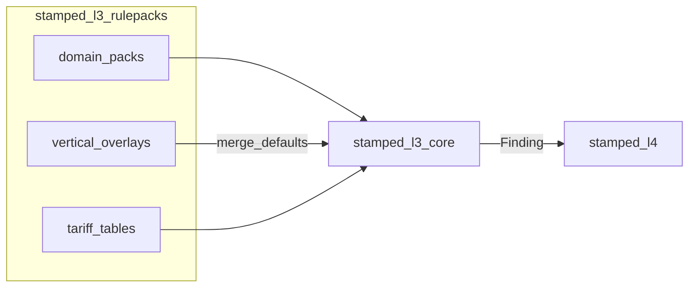

# stamped-l3-rulepacks — Physics & Optimization Catalog

> **What it is:** Semver **YAML/JSON rulepack artifact repo** for Stamped L3 — domain physics thresholds, furnace/idle/load-management optimization methods, DISCOM tariff tables, and vertical fleet priors. Loaded by `stamped-l3-core` via `RULEPACK_PATH`.  
> **What it is not:** An engine runtime, TOW-P fitter, L4 template store, plant-parameter DB, or actuator.  
> **Primary interface:** Filesystem packs (`domain/`, `verticals/`, `tariffs/`) + pytest golden CI  
> **Authority:** [ADR-012](../../decisions/ADR-012-l3-artifact-repo-topology.md) · [L3 §3.5](../../technical/layers/L3-intelligence-core.md) · [`finding.json`](../../contracts/schemas/finding.json)

---

**TL;DR**

- Domain packs for incomer, tariff, compressor, furnace, idle, **load_management**, HVAC, source_mix, attribution
- Optimization methods are **first-class rule IDs** (holding/setback/preheat, idle sleep/phantom, stagger/shed/TOD/PF/CMD)
- Vertical overlays for forging, auto, die casting, cement, pharma, textile, FMCG, general HT
- Findings cite `rulepack://{pack}/{semver}#{rule_id}`
- Math runs in **core**; this repo only declares formulas + defaults
- Golden fixtures under `fixtures/golden/`; catalog index at `schemas/catalog_index.json`
- Plant overrides stay out (`params.yaml` in L2/core plant dir)
- Platform contracts via `external/` submodule pin

---

## Table of contents

1. [Vision](#1-vision)
2. [Architecture](#2-architecture)
3. [Quickstart](#3-quickstart)
4. [Directory tree](#4-directory-tree)
5. [Domain pack catalog](#5-domain-pack-catalog)
6. [Optimization methods (§E)](#6-optimization-methods-e)
7. [Vertical overlays](#7-vertical-overlays)
8. [Tariff tables](#8-tariff-tables)
9. [Manifests & schemas](#9-manifests--schemas)
10. [Testing](#10-testing)
11. [Authoring](#11-authoring)
12. [Roadmap](#12-roadmap)
13. [FAQ & glossary](#13-faq--glossary)

---

## 1. Vision

### 1.1 What it is

Zerowatt-class **rule breadth** with Stamped **audit trail**: every threshold is versioned YAML, golden-tested, and cited on the Finding.

### 1.2 What it is not

| Not this | Lives where |
| --- | --- |
| MD/PF engines, stagger simulator code | `stamped-l3-core` |
| Fleet eval UI | `stamped-l3-eval` |
| Prescription prose | `stamped-l4` |
| Plant-calibrated overrides | plant `params.yaml` (L2/core) |

### 1.3 Success criteria

- Every Finding `category` in `finding.json` has ≥1 rule id
- Furnace hold / idle opt / load-management methods listed in §6
- `pytest` schema + golden + catalog coverage green

---

## 2. Architecture



**Merge order:** domain pack → vertical priors → plant params (external) → tariff tables for ₹.

**Dual path:** `domain/incomer/1.0.0/` is canonical; legacy `incomer/1.0.0/` mirrors until core cutover.

---

## 3. Quickstart

```bash
cd consumers/stamped-l3-rulepacks
pip install -e ".[dev]"
pytest -q
```

Platform pin (when split to own GitHub repo):

```bash
git submodule add https://github.com/Vinayak-RZ/stamped-external.git external
```

---

## 4. Directory tree

```text
domain/{pack}/1.0.0/manifest.yaml + rules/*.yaml
verticals/{vertical}/params.yaml
tariffs/jvvnl_ht/1.0.0/tables.yaml
shared/suppressions.yaml
schemas/{rulepack-manifest,rule-file,catalog_index}.json
fixtures/golden/*.json
docs/AUTHORING.md
IMPLEMENTATION_PLAN.md
```

---

## 5. Domain pack catalog

| Pack | Waste | Finding categories covered |
| --- | --- | --- |
| `incomer` | 1 | md_overlap, md_exceedance_risk, cmd_oversized, pf_slab_breach, pf_leading, tod_exposure |
| `tariff` | 1/6 | supports ₹ tables (billing floor, PF slabs, TOD) |
| `compressor` | 4 | compressor_sp_drift |
| `furnace` | 2 | furnace_holding, sec_drift |
| `idle` | 3 | idle_load |
| `load_management` | 1 | md_overlap, tod_exposure, cmd_oversized, md_exceedance_risk, pf_* |
| `hvac` | 5 | cop_degradation |
| `source_mix` | 6 | dispatch_gap |
| `attribution` | 1 | supports md_overlap (costart window) |

Full rule index: [`schemas/catalog_index.json`](schemas/catalog_index.json) (32 rules).

**URI:** `rulepack://furnace/1.0.0#furnace_holding_detect`

---

## 6. Optimization methods (§E)

### 6.1 Furnace / process heat (`domain/furnace/`)

| Rule id | Category | Method |
| --- | --- | --- |
| `furnace_holding_detect` | furnace_holding | `holding_energy_kwh = holding_kw × non_production_hours` |
| `furnace_setback_opt` | furnace_holding | Setback / ΔT radiation hold reduction |
| `furnace_preheat_early` | furnace_holding | Preheat earlier than MES charge |
| `furnace_sec_drift` | sec_drift | kWh/ton vs SEC band |

### 6.2 Idle load optimization (`domain/idle/`)

| Rule id | Category | Method |
| --- | --- | --- |
| `idle_machine_kw` | idle_load | Idle state ∧ kW > floor → sleep/shutdown |
| `phantom_nonprod` | idle_load | kW > baseload while production=0 |
| `offshift_baseload_drift` | idle_load | Off-shift mean kW drift |
| `idle_cnc_spindle` | idle_load | CNC idle as % of run power |

### 6.3 Load management — electrical (`domain/load_management/`)

| Rule id | Category | Method |
| --- | --- | --- |
| `stagger_costart` | md_overlap | Stagger startups; core recomputes 15-min peak |
| `peak_shave_shed` | md_overlap | Shed non-critical feeders in MD window |
| `load_shift_tod` | tod_exposure | Shift flexible kWh off peak TOD |
| `md_exceedance_holdoff` | md_exceedance_risk | Defer co-starts if P90 peak > CMD |
| `cmd_rightsize` | cmd_oversized | `max(MD, floor%·CD)` → CD recommendation |
| `pf_kvAr_correct` | pf_slab_breach | `kVAr_needed = kW·(tanφ₁−tanφ₂)` |
| `pf_leading_cut` | pf_leading | Over-comp at light load |
| `demand_floor_exposure` | cmd_oversized | Floor-dominated bill exposure |
| `intraday_load_factor` | md_overlap | Flatten low LF / high MD days |

**Not here:** SCADA writes, MILP plant-wide optimizers, NILM, PINNs.

### 6.4 Related optimization packs

| Pack | Role |
| --- | --- |
| compressor | SP drift + unload sequencing |
| hvac | COP degradation + AHU off-hours |
| source_mix | Dispatch cheap kWh into peak TOD |

---

## 7. Vertical overlays

| Vertical | Emphasis |
| --- | --- |
| forging | holding + MD co-start + compressed air |
| auto_components | CNC idle + SP + TOD |
| die_casting | holding + COP |
| cement | SEC heavy |
| pharma | COP + AHU + PF |
| textile | idle + SP + TOD |
| fmcg_food | refrigeration COP + idle |
| general_ht | Path B incomer-first |

Files: `verticals/<id>/params.yaml`

---

## 8. Tariff tables

| Path | Content |
| --- | --- |
| `tariffs/jvvnl_ht/1.0.0/` | billing demand floor 75%, PF slabs, TOD windows |

---

## 9. Manifests & schemas

- [`schemas/rulepack-manifest.schema.json`](schemas/rulepack-manifest.schema.json)
- [`schemas/rule-file.schema.json`](schemas/rule-file.schema.json)
- Shared suppressions: [`shared/suppressions.yaml`](shared/suppressions.yaml)

---

## 10. Testing

```bash
pytest -q
```

| Test | Role |
| --- | --- |
| `tests/test_manifest_schema.py` | All domain manifests/rules validate |
| `tests/test_golden_replay.py` | Golden category + rule_id |
| `tests/test_catalog_coverage.py` | Every finding category + every catalog rule on disk |

---

## 11. Authoring

See [`docs/AUTHORING.md`](docs/AUTHORING.md). Nawab plan: [`IMPLEMENTATION_PLAN.md`](IMPLEMENTATION_PLAN.md).

---

## 12. Roadmap

| Phase | Status |
| --- | --- |
| P0 catalog + schemas + incomer/tariff | now |
| P1 goldens for all §E methods wired in core | next |
| P2 more DISCOM tables; PdM electrical heuristics | later |

---

## 13. FAQ & glossary

**Can I put furnace math in core?**  
No — defaults/thresholds here; only simulator arithmetic in core.

**Rulepack** — Semver pack of YAML rules.  
**Vertical overlay** — Industry prior defaults layered on domain packs.  
**Optimization method** — Named electrical what-if / detection rule (stagger, setback, idle sleep, …).
