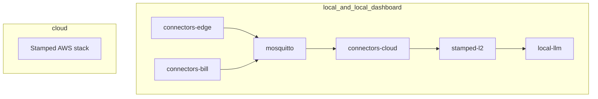

# ADR-010: Deployment modes — cloud, local, and local-dashboard

| Field | Value |
| --- | --- |
| **Status** | Accepted |
| **Date** | 2026-07-12 |
| **Deciders** | Vinayak (product), engineering |
| **Related** | [ADR-002](ADR-002-build-all-aws-networking.md) · [ADR-008](ADR-008-layer-repo-topology-and-interfaces.md) · Research brief (`docs/research/enterprise-air-gap-ai-deployment.md` in consumer repos) · [deployment-profiles.md](../handoff/deployment-profiles.md) |

---

## Context

Stamped was architected AWS-first ([ADR-002](ADR-002-build-all-aws-networking.md), [ADR-009](ADR-009-stamped-l2-repo-charter.md)). Enterprise customers and OT-security plants require the **same product** to run:

1. On Stamped-managed AWS (`cloud`)
2. Fully on customer infrastructure with **no internet** (`local`)
3. Fully local **with Stamped internal dashboard** (`local-dashboard`)

This ADR defines **three configurable deployment modes**, LLM placement, orchestration (Docker Compose only P0), and portability rules across four repos: connectors-edge, connectors-cloud, connectors-bill, stamped-l2.

---

## Decision summary

| # | Topic | Decision |
| --- | --- | --- |
| 1 | Mode selector | `STAMPED_DEPLOYMENT_MODE=local\|local-dashboard\|cloud` |
| 2 | Orchestration P0 | **Docker Compose only** — no K3s/Helm in this phase |
| 3 | Contracts | **Invariant** — `external/contracts/`, MQTT topics, HTTP envelopes unchanged |
| 4 | Local LLM | **Required** for L3/L4 intelligence in `local*` modes; **optional** at L1 via `LLM_BACKEND` |
| 5 | App tier | **No AWS SDK** in `packages/` application code — env config only |
| 6 | Edge lab ingest | `connectors-ingest` → local stack is **valid in `local` mode**; deprecated only for `cloud` |
| 7 | Dashboard | `local-dashboard` adds stamped-l6 (or internal ops UI) to compose |
| 8 | Updates (local) | Signed release bundles P1; P0 = pinned compose + egress CI |

---

## 1. Three deployment modes

| Mode | Internet | Orchestration | LLM | Dashboard |
|------|----------|---------------|-----|-------------|
| **`local`** | None | Docker Compose on customer host | Local LLM service (intelligence) | None |
| **`local-dashboard`** | None | Same as `local` + L6 UI service | Same | stamped-l6 internal |
| **`cloud`** | Stamped AWS `ap-south-1` | ECS/RDS per ADR-002/009 | Frontier API default | Stamped cloud |

---

## 2. LLM placement

| Layer | `cloud` | `local` / `local-dashboard` |
|-------|---------|----------------------------|
| L3/L4 intelligence | `LLM_BACKEND=frontier` default | `LLM_BACKEND=local` **required** |
| L1 connectors-bill extract | `LLM_BACKEND=frontier\|rules-only` | `LLM_BACKEND=local\|frontier\|rules-only` |
| L1 tag-mapping-api | `LLM_BACKEND=frontier\|rules-only` | `LLM_BACKEND=local\|frontier\|rules-only` |
| L2 | No LLM | No LLM |

Rules-only path must remain functional (deterministic engines, template OCR, recompute gates).

---

## 3. Portability rules (all repos)

1. **12-factor config** — all service URLs, secrets, broker hosts from environment
2. **Egress inventory** — documented per repo; CI blocks undeclared external calls in `local` paths
3. **Compose profiles** — `deploy/profiles/local.yml`, `local-dashboard.yml`; `cloud` uses Terraform/AWS
4. **No mode-specific code forks** — same images; different compose + env files
5. **Playbooks** — [connectors-edge](../handoff/connectors-edge-portability-playbook.md), [connectors-cloud](../handoff/connectors-cloud-portability-playbook.md), [connectors-bill](../handoff/connectors-bill-portability-playbook.md), [stamped-l2](../handoff/stamped-l2-portability-playbook.md)

---

## 4. Relationship to ADR-002

ADR-002 **remains authoritative for `cloud` mode** (AWS cost-first, Mosquitto on EC2, RDS, etc.).

ADR-010 **extends** the platform with `local` and `local-dashboard` without superseding build-all connector strategy or plant networking invariants (read-only OT, outbound-only from plant).

---

## 5. Alternatives considered

| Option | Rejected because |
|--------|------------------|
| AWS-only forever | Blocks air-gap enterprise sales |
| Separate codebases per mode | Drift; violates ADR-008 contract model |
| K3s P0 | User decision: Compose only; lower ops burden at pilot |
| Rules-only local (no LLM) | User requires local LLM for intelligence |
| Stamped cloud control plane in `local` | Not true air-gap; deferred |

---

## 6. Consequences

- Four repo playbooks must be implemented before stamped-l2 application code ships
- `external/handoff/stamped-l2-upstream-context.md` must reclassify `connectors-ingest`
- Each repo adds `deploy/profiles/` and egress CI
- L6 dashboard compose slot required for `local-dashboard` mode
- Bundle-based OTA for `local` modes is P1 deliverable
- Platform docs distributed via **stamped-platform** submodule ([ADR-011](ADR-011-stamped-platform-submodule-distribution.md))

---

## Changelog

| Date | Change |
|------|--------|
| 2026-07-12 | Initial ADR — three modes, Compose-only, LLM policy |
