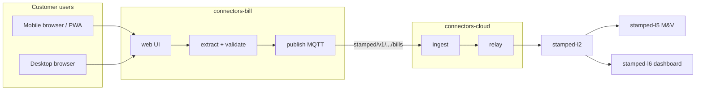

# connectors-bill — workspace handoff specification (L1 bill + customer UI)

> **Purpose:** Bootstrap **`connectors-bill`** — the **L1 bill / document ingest** portion of Connect & Normalise, plus the **customer-facing upload and review experience**.  
> **Master doc:** [Stamped master document](../technical/00-stamped-master-document.md) — *"Insight is only valuable if it reliably causes action… Measurement is only trusted if it is in rupees **on the bill**."*  
> **L1 depth:** [L1 connect & normalise §3.4](../technical/layers/L1-connect-and-normalise.md) (DISCOM bill & tariff ingest)  
> **ADRs:** [ADR-001](../decisions/ADR-001-l1-repo-split-and-boundaries.md) · [ADR-008](../decisions/ADR-008-layer-repo-topology-and-interfaces.md)  
> **Downstream consumer (ready today):** [connectors-cloud-downstream-context.md](./connectors-cloud-downstream-context.md)

---

## Table of contents

1. [Charter — what this repo is and is not](#1-charter--what-this-repo-is-and-is-not)
2. [Product vision beyond DISCOM PDFs](#2-product-vision-beyond-discom-pdfs)
3. [Ecosystem placement](#3-ecosystem-placement)
4. [Integration contracts](#4-integration-contracts)
5. [Proposed monorepo layout](#5-proposed-monorepo-layout)
6. [Build order and exit criteria](#6-build-order-and-exit-criteria)
7. [Technical decisions (defaults)](#7-technical-decisions-defaults)
8. [Environment variables](#8-environment-variables)
9. [Copy manifest](#9-copy-manifest)
10. [Verification with connectors-cloud](#10-verification-with-connectors-cloud)

---

## 1. Charter — what this repo is and is not

### 1.1 What connectors-bill IS

Per [ADR-001 §1](../decisions/ADR-001-l1-repo-split-and-boundaries.md) and [L1 spec §6 P0](../technical/layers/L1-connect-and-normalise.md):

| Responsibility | Package / surface |
|----------------|-------------------|
| Document upload (PDF, image, camera capture) | `packages/web` (Next.js PWA) |
| Object storage for originals + bbox maps | `packages/ingest` / S3 |
| OCR / layout extraction / LLM assist | `packages/extract` |
| DISCOM templates + tariff-order knowledge | `packages/templates` |
| **Deterministic bill recompute gate** (₹ arithmetic) | `packages/validate` |
| Human review queue (low confidence / recompute fail) | `packages/web` + API |
| Canonical **`BillLine`** JSON emission | `packages/publish` |
| Bill lifecycle **`Event`** emission (`bill_received`, etc.) | `packages/publish` |
| MQTT publish to plant topic family | `packages/publish` |
| Mobile-first customer UX | `packages/web` |

**P0 record type:** `bill_line` per [bill-line.json](../contracts/schemas/bill-line.json).

**P0 transport:** MQTT QoS 1 to `stamped/v1/{org_id}/{plant_id}/bills` — consumed by **connectors-cloud** (already implemented).

### 1.2 What connectors-bill IS NOT

| Out of scope | Owner repo |
|--------------|------------|
| MQTT subscriber / outbox / L2 relay | **connectors-cloud** |
| Modbus, OPC UA, edge buffer, tag mapping | **connectors-edge** |
| Timescale, graph, baselines, bill storage in L2 tables | **stamped-l2** |
| Prescriptions, M&V ledger, CFO dashboard modules | **stamped-l5** / **stamped-l6** |
| Full plant energy dashboard | **stamped-l6** (bill upload is a **module**, not the whole L6 app) |

### 1.3 Relationship to L6 dashboard

[L6 spec](../technical/layers/L6-experience-and-integration.md) owns the **prescription queue, savings ledger, and sustainability pack**.  
**connectors-bill** owns the **document ingest + bill review** journey that *feeds* L2/L5 M&V — customers interact with bill upload **here first** (especially on mobile). L6 may deep-link or embed bill status later via API.

---

## 2. Product vision beyond DISCOM PDFs

Master doc and L1 spec anchor on **DISCOM HT bills** (UPPCL, MSEDCL, etc.) because bill-verified savings is the product wedge. **Architecture must not hard-code DISCOM-only.**

### 2.1 Document types (roadmap)

| Phase | Document types | Extraction strategy |
|-------|----------------|---------------------|
| **P0** | DISCOM portal PDF, phone photo/scan of HT bill | Template + OCR + recompute gate |
| **P1** | Tariff order PDFs (ERC orders) | Analyst-assisted template builder |
| **P1** | EMS export CSV/PDF, third-party audit reports | Generic table extractor + manual map |
| **P2** | Water/gas utility bills, PPAs | New template family, same `BillLine` or schema v2 |

### 2.2 UX principle (customer-facing)

See [connectors-bill-ui-ux-charter.md](./connectors-bill-ui-ux-charter.md):

- **Mobile-first** — plant staff photograph bills on the floor (WhatsApp-quality photos are a P0 input per L1 spec).
- **Progressive disclosure** — upload → processing → review (if needed) → confirmed on bill.
- **Trust** — show recompute pass/fail, field-level confidence, side-by-side PDF highlight.
- **Hindi + English** — `next-intl` per L6 research; labels for DISCOM field names.

---

## 3. Ecosystem placement

Full map: [connectors-bill-ecosystem-integration.md](./connectors-bill-ecosystem-integration.md).



---

## 4. Integration contracts

### 4.1 Outbound MQTT — bills topic

**Canonical:** [TOPICS.md](../contracts/TOPICS.md)

| Topic | Payload | QoS | Publisher |
|-------|---------|-----|-----------|
| `stamped/v1/{org_id}/{plant_id}/bills` | `bill-line.json` (one object per message, or NDJSON batch — **pick one in P0 and document**) | 1 | connectors-bill |
| `stamped/v1/{org_id}/{plant_id}/events` | `event.json` for `bill_received`, `bill_validated`, `bill_rejected` | 1 | connectors-bill |

**connectors-cloud** subscribes to both patterns today (`bills` → `bill_line`, `health`/`events` → `event`).

### 4.2 BillLine dedupe (must match cloud)

Authority: [layer-interfaces-l2 §2.2](../architecture/layer-interfaces-l2.md).

```
sha256(plant_id | bill_id | line_type | bill_month)
```

Golden vector for [bill_line.valid.json](../contracts/fixtures/bill_line.valid.json):

```
sha256:2f855d00860753dc937837391d669e5bfd5ff7344f0ea9b788c9584205792dbb
```

Implement `compute_dedupe_key()` identically to `connectors-cloud` `packages/ingest/ingest/dedupe/keys.py` — copy test vectors from [dedupe_golden.json](../contracts/fixtures/dedupe_golden.json).

### 4.3 BillLine schema highlights

Required fields per [bill-line.json](../contracts/schemas/bill-line.json):

- Identity: `org_id`, `plant_id`, `bill_id`, `bill_month` (`YYYY-MM`)
- Line: `line_type` (enum: `demand`, `energy_tod_slot`, `pf_adjustment`, …), `qty`, `qty_unit`, `rate`, `amount_inr`
- Quality: `extraction.confidence`, `extraction.method` (`doc_ai` | `llm` | `manual`), `extraction.validated` (boolean)
- Provenance: `source_doc_ref` (S3 URI to original)

**Rule:** `extraction.validated=false` lines may be stored in bill repo for review but **must not be MQTT-published** until validated (L1 spec recompute gate).

### 4.4 Inbound — user upload

| Method | Path | Purpose |
|--------|------|---------|
| `POST` | `/v1/documents` | Presigned S3 upload or multipart; returns `document_id` |
| `GET` | `/v1/documents/{id}` | Status: uploaded → extracting → review → published |
| `GET/POST` | `/v1/bills/{bill_id}/lines` | Review queue CRUD |
| `POST` | `/v1/bills/{bill_id}/publish` | Trigger MQTT publish after validation |

Auth: org/plant scoped JWT or session; RBAC per L6 patterns (operator vs plant head).

### 4.5 No direct L2 writes

Same rule as connectors-cloud: **never** insert into `stamped-l2` tables. Publish canonical JSON on MQTT; cloud wraps in `StampedRecordEnvelope` and relays.

---

## 5. Proposed monorepo layout

```text
connectors-bill/
├── external/                    # COPY entire folder from handoff (this tree)
│   ├── contracts/
│   ├── decisions/
│   ├── technical/
│   ├── compliance/
│   └── handoff/
├── packages/
│   ├── web/                     # Next.js App Router — customer UI (PWA)
│   ├── api/                     # FastAPI or Next API routes — upload, review, publish
│   ├── extract/                 # OCR, template matching, LLM calls
│   ├── validate/                # Recompute gate, tariff engine
│   ├── publish/                 # MQTT client, dedupe, retry
│   └── templates/               # Per-DISCOM YAML/JSON field maps
├── deploy/
│   ├── docker-compose.bill.yml  # local: api + web + mosquitto + minio
│   └── terraform/               # ECS, S3, RDS (defer until pilot)
├── scripts/
│   ├── e2e-bill-to-cloud.sh     # publish → connectors-cloud inbox
│   └── contract-check.sh        # copy pattern from connectors-cloud
├── docs/
│   └── architecture/
│       └── layer-interfaces.md  # copy from connectors-cloud
├── mocks/
│   └── cloud-ingest/            # optional: HTTP accept stub for unit tests
├── AGENTS.md                    # from handoff agent onboarding
└── README.md
```

**Suggested default stack** (align with L6 research):

| Layer | Choice | Rationale |
|-------|--------|-----------|
| Web | **Next.js 15+ App Router**, TypeScript | L6 default; RSC + mobile PWA |
| UI | **Tailwind** + [Forge Industrial v2.0](../design/forge-industrial-design-system.md) | Stamped brand; see stamped.work + dashboard demo |
| API | **FastAPI** (Python) for extract/validate; Next for BFF optional | Shares Python with extract/ML libs |
| Storage | **S3** (presigned upload) | ADR-002 Topology F |
| Queue | **Postgres** job table P0; SQS P1 | Bill volume is tiny |
| MQTT | **paho-mqtt** or EMQX HTTP bridge | Same broker family as edge/cloud |
| i18n | **next-intl** | Hindi + English per L6 |

---

## 6. Build order and exit criteria

### Phase 0 — bootstrap

| # | Task | Exit |
|---|------|------|
| 1 | Create repo; copy `external/` | CI lint |
| 2 | Copy `layer-interfaces.md`, wire `contract-check.sh` | Schemas validate |
| 3 | `dedupe_key` unit tests match golden vector | pytest green |

### Phase 1 — upload + extract stub (P0 wedge)

| # | Task | Exit |
|---|------|------|
| 4 | S3 presigned upload + mobile capture UI | Upload from phone |
| 5 | PDF text extract + photo OCR path | Raw text stored |
| 6 | MSEDCL + UPPCL template v1 (1 DISCOM each) | Fixture bills parse |
| 7 | Recompute gate | Fail closes `validated=false` |

### Phase 2 — publish path

| # | Task | Exit |
|---|------|------|
| 8 | Review UI for failed/low-confidence lines | Human can fix + approve |
| 9 | MQTT publish `BillLine` per line | connectors-cloud inbox |
| 10 | `bill_received` event on events topic | Audit trail |
| 11 | E2E script with connectors-cloud compose | inbox count ≥ N |

### Phase 3 — pilot hardening

| # | Task | Exit |
|---|------|------|
| 12 | 3 DISCOM templates (per L1 P0 list) | ≥99% on core fields `[~]` |
| 13 | Observability: publish lag, reject rate | Dashboards |
| 14 | Prod secrets, mTLS to broker | validate-env pattern |

**connectors-bill P0 complete when:** validated `BillLine` records from real DISCOM PDF **and** phone photo reach `l1_processed_inbox` via connectors-cloud E2E; review UI used in pilot; contract CI green.

---

## 7. Technical decisions (defaults)

| Decision | Default | Notes |
|----------|---------|-------|
| One bill → many BillLines | **Yes** | One MQTT message per line (matches cloud E2E) |
| Recompute tolerance | **₹1** | L1 spec §3.4 |
| LLM usage | **Assist only** | Templates + arithmetic are source of truth |
| Failed recompute | **Human review queue** | Never silent publish |
| Schema changes | **BACKWARD compat** | CHANGELOG in `external/contracts/` |
| Broker auth | mTLS per plant P1 | Same cert story as edge (`docs/runbooks/mtls-plant-certs.md` in cloud repo) |

---

## 8. Environment variables

| Variable | Required | Purpose |
|----------|----------|---------|
| `DATABASE_URL` | Yes | Jobs, bills, review state |
| `S3_BUCKET` / `AWS_REGION` | Yes (prod) | Original documents |
| `MQTT_BROKER` / `MQTT_PORT` | Yes (prod) | Publish target (same broker as cloud ingest subscribes to) |
| `MQTT_USERNAME` / password or client cert | Prod | Broker ACL |
| `ORG_ID` / default tenant | Config | Multi-tenant routing |
| `OPENAI_API_KEY` or equivalent | Optional | LLM assist — feature-flagged |
| `APP_ENV` | No | `prod` → fail closed on missing secrets |

---

## 9. Copy manifest

From **this `external/` folder** into new repo:

| Source | Destination |
|--------|-------------|
| `external/contracts/` | `external/contracts/` |
| `external/decisions/` | `external/decisions/` |
| `external/technical/` | `external/technical/` (reference) |
| `external/compliance/` | `external/compliance/` |
| `external/handoff/` | `external/handoff/` |
| `external/design/` | `external/design/` — Forge Industrial v2.0 |
| `docs/architecture/layer-interfaces.md` | Copy from connectors-cloud repo |

From **connectors-cloud** (clone reference):

| Path | Use |
|------|-----|
| `packages/ingest/tests/fixtures/bill_line.valid.json` | Same as `external/contracts/fixtures/` |
| `scripts/e2e-cloud-ingest.sh` | Pattern for `e2e-bill-to-cloud.sh` |
| `deploy/docker-compose.cloud.yml` | Run cloud stack for E2E |
| `docs/how-to-use-connectors-cloud.md` | Operator context |

Do **not** copy edge agent, tag-mapping, or cloud ingest/relay packages into bill repo.

---

## 10. Verification with connectors-cloud

connectors-cloud **already**:

- Subscribes to `stamped/v1/+/+/bills`
- Validates against `bill-line.json`
- Computes dedupe per formula above
- Writes outbox → relay → mock L2 / stamped-l2

**E2E procedure (new repo):**

```bash
# Terminal 1 — cloud stack (from connectors-cloud repo)
cd connectors-cloud/deploy && docker compose -f docker-compose.cloud.yml up

# Terminal 2 — bill publish test
mosquitto_pub -h localhost -p 1883 -q 1 \
  -t "stamped/v1/org_e2e/plant_e2e/bills" \
  -m @external/contracts/fixtures/bill_line.valid.json

# Verify inbox
docker compose exec postgres psql -U postgres -d connectors_cloud \
  -c "SELECT count(*) FROM l1_processed_inbox WHERE record_type='bill_line';"
```

Your `scripts/e2e-bill-to-cloud.sh` should automate: upload → extract → validate → MQTT → assert inbox.

---

## Changelog

| Date | Change |
|------|--------|
| 2026-07-11 | Initial handoff spec — expanded scope: multi-doc + customer UI |
