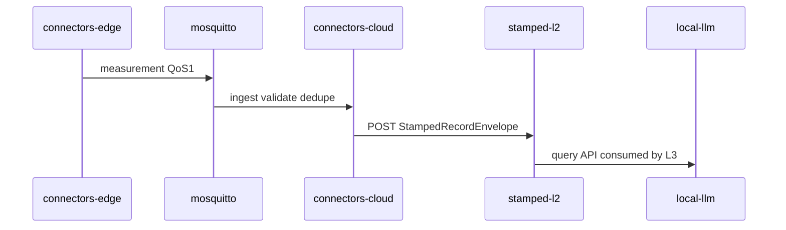

# Stamped deployment profiles — cross-repo reference

> **Authority:** [ADR-010](../decisions/ADR-010-deployment-profiles-and-portability.md)  
> **Research:** `docs/research/enterprise-air-gap-ai-deployment.md` (consumer repos)

---

## Mode selector

```bash
export STAMPED_DEPLOYMENT_MODE=local          # air-gap core
export STAMPED_DEPLOYMENT_MODE=local-dashboard  # air-gap + internal UI
export STAMPED_DEPLOYMENT_MODE=cloud         # Stamped AWS (default pilots)
```

Each repo's `deploy/profiles/` maps mode → compose file.

---

## Mode matrix

| Capability | `local` | `local-dashboard` | `cloud` |
|------------|---------|-------------------|---------|
| Outbound internet | None | None | Stamped AWS |
| Orchestration | Docker Compose | Docker Compose | ECS + RDS |
| MQTT broker | compose `mosquitto` | same | EC2 Mosquitto |
| L1 cloud ingest | compose | compose | Fargate |
| L1 bill | compose + MinIO | compose + MinIO | S3 + Fargate |
| L2 Timescale | compose | compose | RDS |
| Intelligence LLM | **local-llm required** | **local-llm required** | Frontier API |
| Connector LLM | optional `LLM_BACKEND` | optional | Frontier default |
| Customer dashboard | — | stamped-l6 compose | Vercel/CloudFront |
| OTA / updates | signed bundle P1 | same | HTTPS deploy |

---

## Full local stack (compose services)

Reference topology lives in [deploy/profiles/ARCHITECTURE.md](../../deploy/profiles/ARCHITECTURE.md) (stamped-l2 repo).

```text
mosquitto
postgres-connectors-cloud
connectors-cloud-ingest
connectors-cloud-relay
connectors-bill-api + web + extract
timescaledb-stamped-l2
stamped-l2-ingest :8090
stamped-l2-query-api :8091
minio
local-llm                    # vLLM/Ollama — intelligence
stamped-l6                   # local-dashboard mode only
```

---

## Data flow (`local` mode)



Bill path: connectors-bill → MQTT `.../bills` → same cloud ingest → L2 `commercial.bill_line`.

---

## Repo playbooks

| Repo | Playbook |
|------|----------|
| connectors-edge | [connectors-edge-portability-playbook.md](./connectors-edge-portability-playbook.md) |
| connectors-cloud | [connectors-cloud-portability-playbook.md](./connectors-cloud-portability-playbook.md) |
| connectors-bill | [connectors-bill-portability-playbook.md](./connectors-bill-portability-playbook.md) |
| stamped-l2 | [stamped-l2-portability-playbook.md](./stamped-l2-portability-playbook.md) |

---

## Validation checklist (all modes)

- [ ] `STAMPED_DEPLOYMENT_MODE` documented in `.env.example` per repo
- [ ] Egress inventory empty for `local` runtime paths
- [ ] Dedupe golden unchanged across modes
- [ ] Measurement E2E: edge → MQTT → cloud → L2 inbox + hypertable
- [ ] Bill E2E: bill publish → cloud inbox → L2 `bill_line`
- [ ] `local-dashboard`: UI reads L2 query API with `X-Org-Id`
- [ ] `cloud`: existing AWS E2E scripts still pass

---

## Changelog

| Date | Change |
|------|--------|
| 2026-07-12 | Initial cross-repo deployment profiles |
