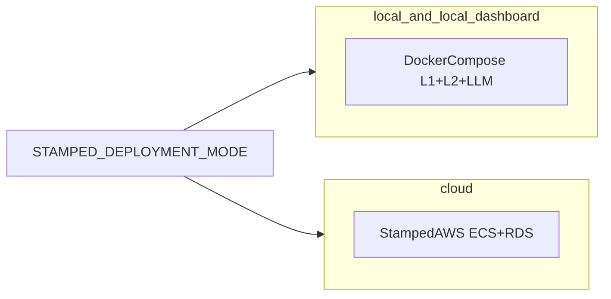
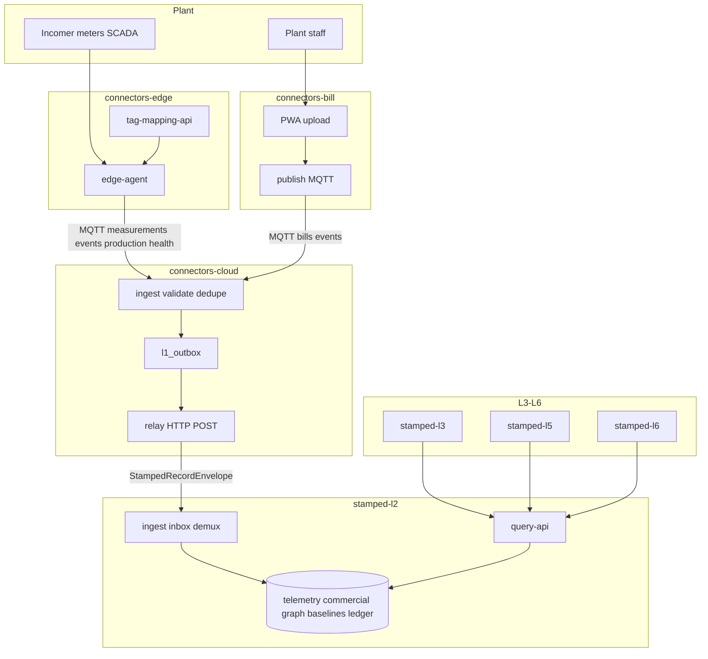
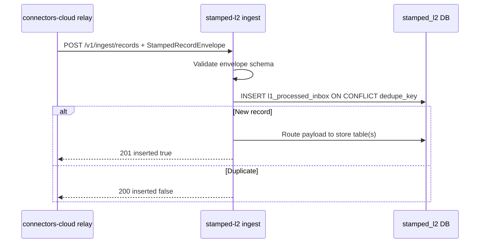

# Stamped ecosystem — how stamped-l2 connects to all repos

> **Master context:** [Stamped master document](../technical/00-stamped-master-document.md)  
> **Topology ADR:** [ADR-008](../decisions/ADR-008-layer-repo-topology-and-interfaces.md)  
> **L2 charter:** [ADR-009](../decisions/ADR-009-stamped-l2-repo-charter.md)  
> **Deployment modes:** [ADR-010](../decisions/ADR-010-deployment-profiles-and-portability.md) · [deployment-profiles.md](./deployment-profiles.md)  
> **Interface authority:** [layer-interfaces-l2.md](../architecture/layer-interfaces-l2.md)

---

## 1. Eight-repo layer map

Stamped L1–L6 is **one GitHub repo per layer** (L1 split into three deployables):

| Repo | Layer | Role | Key deployables |
| --- | --- | --- | --- |
| **connectors-edge** | L1 plant | OT/IT streaming, tag mapping, edge buffer | edge-agent, tag-mapping-api, tag-mapping-ui |
| **connectors-cloud** | L1 cloud | MQTT/HTTP ingest, validate, outbox, relay → L2 | ingest, relay |
| **connectors-bill** | L1 bill | Document ingest, extract, review UI, MQTT publish | web, api, extract, publish |
| **stamped-l2** | L2 | Universal repository — six stores, ingest + query API | ingest, query-api, migrate |
| **stamped-l3** | L3 | Intelligence engines → `Finding` | workers |
| **stamped-l4** | L4 | Prescription agent → `Prescription` | agent |
| **stamped-l5** | L5 | Workflow, M&V → `LedgerEntry` | workflow API |
| **stamped-l6** | L6 | Dashboard, customer experience, exports | Next.js app, public API |

**Communication rule:** documented interfaces only — no shared table writes across repos (ADR-008).

---

## 1.1 Deployment modes (ADR-010)

| Mode | `STAMPED_DEPLOYMENT_MODE` | Stack location | Dashboard |
|------|---------------------------|----------------|-----------|
| Fully local | `local` | Customer Docker Compose | API/CLI only |
| Local + internal UI | `local-dashboard` | Customer Compose + stamped-l6 | Internal ops UI |
| Cloud | `cloud` | Stamped AWS `ap-south-1` | Stamped cloud |

Contracts (`StampedRecordEnvelope`, MQTT topics, dedupe golden) are **invariant** across modes. Mode changes compose profile + env only — not code forks.



Playbooks: [connectors-edge](./connectors-edge-portability-playbook.md) · [connectors-cloud](./connectors-cloud-portability-playbook.md) · [connectors-bill](./connectors-bill-portability-playbook.md) · [stamped-l2](./stamped-l2-portability-playbook.md).

---

## 2. End-to-end data flow (production path)



---

## 3. Edge measurement path

```text
connectors-edge (edge-agent)
  → MQTT QoS 1: stamped/v1/{org}/{plant}/measurements
  → connectors-cloud (ingest: validate, dedupe, envelope)
  → l1_outbox
  → relay POST /v1/ingest/records
  → stamped-l2 ingest → telemetry.measurement hypertable
  → stamped-l3 MD/demand engine via query API
```

**connectors-edge does not talk to stamped-l2 directly.**

Lab shortcut: `packages/connectors-ingest` in edge repo writes MQTT → local Timescale `measurements_raw`. **Valid in `local` mode** ([ADR-010](../decisions/ADR-010-deployment-profiles-and-portability.md)); **deprecated for `cloud` mode** once stamped-l2 joint E2E is green.

---

## 4. Bill path

```text
Customer (phone/PDF)
  → connectors-bill (extract, recompute gate, review UI)
  → MQTT QoS 1: stamped/v1/{org}/{plant}/bills (BillLine JSON)
  → connectors-cloud (same ingest path as measurements)
  → relay → stamped-l2 → commercial.bill_line
  → stamped-l5 M&V reconciles model vs bill lines
  → stamped-l6 CFO exports
```

**connectors-bill does not talk to connectors-edge or stamped-l2 directly.**

Cross-check context in L2: shared `org_id + plant_id + bill_month` joins incomer telemetry to bill lines.

---

## 5. Cloud relay path (L1→L2 boundary)



Reference implementation to match: connectors-cloud `mocks/stamped-l2/`.

---

## 6. Downstream L2 → L3–L6

| Consumer | Reads from L2 via | Data needed |
| --- | --- | --- |
| **stamped-l3** | Query API | Windowed aggregates, incomer kVA, graph traversal refs, baselines |
| **stamped-l4** | Query API | `get_baseline`, `traverse_graph`, tariff versions for ₹ impact |
| **stamped-l5** | Query API + ledger append API (P1) | Locked baselines, bill_line refs, reporting-period aggregates |
| **stamped-l6** | Query API | Dashboard trends, ledger rollups |

**Rule:** L3+ never connect to `L2_DATABASE_URL`. Only stamped-l2 services hold DB credentials.

---

## 7. Shared contracts

| Artifact | Location | L2 usage |
| --- | --- | --- |
| `StampedRecordEnvelope` | `external/contracts/schemas/stamped-record-envelope.json` | Ingest validates inbound |
| L1 record schemas | `measurement.json`, `event.json`, `production-record.json`, `bill-line.json` | Validate `envelope.payload` per `record_type` |
| Dedupe golden | `external/contracts/fixtures/dedupe_golden.json` | CI must match connectors-cloud hashes |
| MQTT topics | `external/contracts/TOPICS.md` | Informational — L2 does not subscribe MQTT |

Schema ownership: canonical in **connectors-edge** `external/contracts/`; copy/sync into stamped-l2.

---

## 8. Database boundaries

| Repo | Database | Writes |
| --- | --- | --- |
| connectors-cloud | `connectors_cloud` on shared RDS | `l1_outbox`, `l1_ingress_audit`, `l1_dlq` only |
| stamped-l2 | `stamped_l2` on **same RDS instance** (P0 cost mode) | All L2 schemas |
| connectors-bill | Own Postgres (documents, review queue) | Never L2 tables |
| connectors-edge | tag-mapping-api Postgres; lab Timescale (deprecated) | Never L2 tables |

---

## 9. Authentication matrix

| Boundary | Mechanism |
| --- | --- |
| connectors-cloud relay → stamped-l2 ingest | `X-Service-Key` header (shared secret in SSM) |
| stamped-l3+ → stamped-l2 query-api | `X-Service-Key` or mTLS (P1); scoped per consumer |
| Human → L2 | **No public UI in L2** — all access via L6 dashboard |

---

## 10. Deployment independence

| Property | stamped-l2 | connectors-cloud |
| --- | --- | --- |
| Release cadence | Schema migrations gated; query API semver | Stable ingest relay path |
| Failure domain | Query latency, DB storage | MQTT lag, outbox depth |
| Scale driver | Hypertable cardinality, cagg refresh | MQTT message rate |
| Customer-facing | No — internal platform | No — backend only |

L2 outage: cloud relay retries outbox; measurements queue in `l1_outbox` until L2 recovers (at-least-once).

---

## 11. Bootstrap checklist (stamped-l2 workspace)

- [ ] Read [stamped-l2-spec.md](./stamped-l2-spec.md)
- [ ] Read [stamped-l2-l1-consumer-contract.md](./stamped-l2-l1-consumer-contract.md)
- [ ] Add **stamped-platform** submodule at `external/` ([SUBMODULE.md](../SUBMODULE.md))
- [ ] Clone connectors-cloud for mock-l2 parity + joint E2E
- [ ] Implement dedupe golden tests before first HTTP handler
- [ ] Point cloud `L2_INGEST_URL` at real L2 when POST parity proven

---

## Changelog

| Date | Change |
| --- | --- |
| 2026-07-12 | Initial ecosystem map for stamped-l2 handoff |
| 2026-07-12 | ADR-010 three-mode deployment section + connectors-ingest reclassification |
