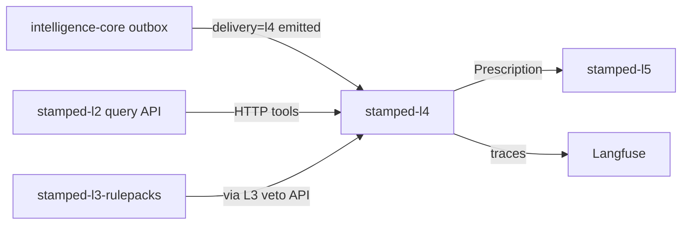

# stamped-l4 — Architecture handoff

> **Audience:** Engineers / agents building **`stamped-l4`** (single consumer repo: runtime + templates + corpus + eval).  
> **Authority:** [L4 architecture SSOT](../technical/layers/L4-knowledge-and-reasoning.md) · [ADR-017](../decisions/ADR-017-l4-adaptive-retrieval-and-web-trust.md) · [ADR-013](../decisions/ADR-013-counterfactual-savings-ledger.md) · [ADR-015](../decisions/ADR-015-l3-dual-lane-lab-detections.md)  
> **Contracts:** [`finding.json`](../contracts/schemas/finding.json) · [`prescription.json`](../contracts/schemas/prescription.json) · [`capex-proposal.json`](../contracts/schemas/capex-proposal.json) · [`stamped-record-envelope.json`](../contracts/schemas/stamped-record-envelope.json)  
> **Platform pack:** mount this repo as git submodule at `external/` ([SUBMODULE.md](../SUBMODULE.md))

**Supersedes:** [stamped-l4-build-order.md](./stamped-l4-build-order.md) (redirect stub — use this handoff).

---

## 1. Mission

**stamped-l4** turns L3 `Finding` objects into L5-ready `Prescription` records: grounded language, deterministic ₹/kWh/tCO₂e, ranked queue, full audit trail.

| Is | Is not |
| --- | --- |
| Language, ranking, evidence binding | Numeric intelligence (L3) |
| Adaptive RAG over industrial practice corpus | Direct L2 DB access |
| Bounded LangGraph agent + template fast path | OT / SCADA writes |
| Eval + tracing for RAG and agent runs | Plant operator UI (L6) |
| Sustainability narrative + conversational analyst (extended) | Closure workflow owner (L5) |

---

## 2. Upstream / downstream



- **Intake:** only envelopes with `delivery=l4` ∧ `status=emitted` (ADR-015). Never Lab-only / hypothesis / shadow.
- **L2:** HTTP only — no `L2_DATABASE_URL`.
- **Veto:** L3 `check_rule_violation` is final.

---

## 3. Dual lanes

| Lane | Trigger | LLM budget |
| --- | --- | --- |
| **A — Template** | Known high-confidence categories | **0** calls (polish off by default) |
| **B — LangGraph** | Compound / novel / multi-finding | Soft ≤5; hard stop **6** → escalate |

Foundation templates (scaffold already mirrors these): `md_overlap`, `pf_slab_breach`, `tod_exposure`. Expand taxonomy under **engineer approval** + golden cases.

---

## 4. Adaptive RAG + tools

Per [ADR-017](../decisions/ADR-017-l4-adaptive-retrieval-and-web-trust.md):

- **Path H** default: filter → BM25 + dense RRF → cross-encoder rerank → CRAG-lite
- **Path G** light KG for multi-hop
- **Path V** vectorless section nav inside one long manual
- **Path W** allowlisted web (**T4**) — never sole ₹/M&V source; forces HITL

### Tool registry

| Tool | Notes |
| --- | --- |
| `query_timeseries` | L2 |
| `get_baseline` | L2 |
| `traverse_graph` | L2 + KG edges |
| `lookup_playbook` | Paths H/G/V |
| `web_search` | Allowlist; ≤1 / run; T4 |
| `calculate_impact` | Sole ₹ / kWh / tCO₂e |
| `assign_owner` | Role map |
| `check_rule_violation` | L3 HTTP; final |

**Forbidden:** OT write, messaging send, open crawl, shell, cross-tenant retrieve.

### Retrieval config (local vs cloud)

| Layer | Local default | Cloud option |
| --- | --- | --- |
| Embed | BGE-M3 | OpenAI / Cohere (shared corpus only) |
| Vector | pgvector | Managed vector, same metadata |
| Rerank | BGE-reranker-v2-m3 | Cohere Rerank optional |
| SOP tenant slice | Always local | — |

Implement behind `RetrievalBackend` so lanes do not hardcode vendor.

---

## 5. Guardrails (must implement)

- Strict structured outputs + schema gate on every generation
- Numeric integrity: draft numerals ≡ tool outputs
- Evidence refs non-empty and resolvable
- Bounded template enum; `custom_advisory` → HITL
- T3 SOP injection scan; T1 beats T3/T4 on conflict
- T4 citation → forced approval
- Urgency-scaled HITL timeouts (critical 24h/72h; normal 48h/7d)
- Dedup-after-reject policy (L4 SSOT §5.1)
- LangGraph checkpoint + Langfuse span per node

---

## 6. Eval & observability

| Component | Use |
| --- | --- |
| **Langfuse** | Prod traces, cost/tokens per Rx (self-host or cloud) |
| **Arize Phoenix** | RAG offline/CI (faithfulness, context precision, drift) |
| **DeepEval** | Pytest agent trajectory + metric gates |
| Deterministic | Schema, numeric, evidence, template accuracy, tenant isolation, adversarial escalate |

**CI:** PR = deterministic + smoke LLM; nightly = full goldens + Phoenix + sampled judge. Online groundedness ~10% of Lane B.

Optional LangSmith for LangGraph IDE — not required.

Eval assets live **in** `stamped-l4` (not a separate eval repo). Align metrics with [evaluation & quality](../technical/cross-cutting/04-evaluation-and-quality.md) Q9–Q11.

---

## 7. Capability maturity (architecture coverage)

| Capability | Band |
| --- | --- |
| Prescription cards + adaptive RAG + eval/trace | Foundation |
| Lane B agent + HITL + Hindi Rx generation | Core |
| Sustainability narrative + gated web + conversational analyst | Extended |

---

## 8. Cost guidance (₹40L/mo plant `[~]`)

Lean target **~₹600–1,600 / plant / month** (70% Lane A, rare web, sampled judge). One verified save dwarfs model spend. Knobs: `PRIORITY=COST` (Lane A only) vs `PRIORITY=QUALITY` (always-on judge).

---

## 9. Bootstrap checklist

1. Add platform submodule at `external/`; pin SHA; run `external/scripts/contract-check.sh`
2. Read L4 SSOT + ADR-017 + this handoff
3. Implement Finding inbox from L3 outbox (pull/ack or webhook) — see prompt below if core lacks consumer API
4. Lane A templates + verifier first; wire adaptive RAG behind `lookup_playbook`
5. Instrument Langfuse; add Phoenix + DeepEval gates before Lane B ships to plants
6. Never take `L2_DATABASE_URL`; fixture L2 client until query API live (same pattern as L3)

Platform reference scaffold: [`consumers/stamped-l4/`](../consumers/stamped-l4/README.md) (Lane A only).

---

## 10. L3 change prompt

Paste into **intelligence-core** when outbox consumer API or rules veto HTTP is missing:

```text
L4 needs two platform-aligned interfaces from intelligence-core:

1) Finding delivery: durable outbox already stages StampedRecordEnvelope
   when delivery=l4 and status=emitted. Please expose a documented consumer
   API: GET/POST pull with cursor + ack (or webhook) so stamped-l4 can
   inbox Findings idempotently. No L2_DATABASE_URL. Contract:
   external/contracts/schemas/finding.json + stamped-record-envelope.json.

2) Rules veto tool: HTTP POST /v1/rules/check_violation
   body: { plant_id, template_id, params, evidence_refs }
   response: { allowed: bool, rule_refs[], reason }
   Deterministic only; versioned against RULEPACK_PATH.
   L4 must never override a veto.

Do not add prose generation or prescription logic to L3.
Pin external/ to the same SHA L4 will use. Ponytail; tests for ack
idempotency and veto finality.
```

---

## 11. Related docs

| Doc | Why |
| --- | --- |
| [L4 SSOT](../technical/layers/L4-knowledge-and-reasoning.md) | Full architecture |
| [ADR-017](../decisions/ADR-017-l4-adaptive-retrieval-and-web-trust.md) | Retrieval + T4 web |
| [L3 build order](./stamped-l3-build-order.md) | Upstream outbox |
| [L2 query API sketch](./stamped-l2-query-api-sketch.md) | Tool HTTP shapes |
| [Evaluation spine](../technical/cross-cutting/04-evaluation-and-quality.md) | Q9–Q11 gates |
| [consumer-platform-prompt](./consumer-platform-prompt.md) | Generic agent bootstrap |
