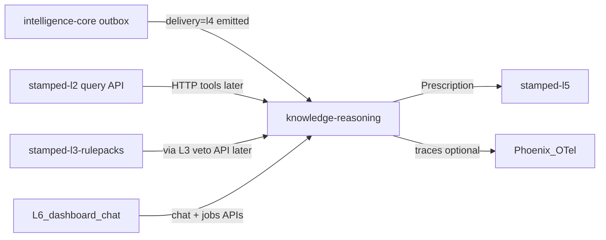

# stamped-l4 / knowledge-reasoning — Architecture handoff

> **Audience:** Engineers / agents building the L4 consumer.  
> **Live consumer repo:** [Vinayak-RZ/knowledge-reasoning](https://github.com/Vinayak-RZ/knowledge-reasoning) (package `stamped_l4`)  
> **Platform mirror README:** [`consumers/knowledge-reasoning/README.md`](../consumers/knowledge-reasoning/README.md)  
> **Authority:** [L4 architecture SSOT](../technical/layers/L4-knowledge-and-reasoning.md) · [ADR-017](../decisions/ADR-017-l4-adaptive-retrieval-and-web-trust.md) · [ADR-018](../decisions/ADR-018-l4-pilot-execution-knowledge-reasoning.md) · [ADR-013](../decisions/ADR-013-counterfactual-savings-ledger.md) · [ADR-015](../decisions/ADR-015-l3-dual-lane-lab-detections.md)  
> **Contracts:** [`finding.json`](../contracts/schemas/finding.json) · [`prescription.json`](../contracts/schemas/prescription.json) · [`capex-proposal.json`](../contracts/schemas/capex-proposal.json) · [`stamped-record-envelope.json`](../contracts/schemas/stamped-record-envelope.json)  
> **Platform pack:** mount this repo as git submodule at `external/` ([SUBMODULE.md](../SUBMODULE.md))

**Supersedes:** [stamped-l4-build-order.md](./stamped-l4-build-order.md) (redirect stub — use this handoff).

---

## 1. Mission

**knowledge-reasoning** turns L3 `Finding` objects into L5-ready `Prescription` records: grounded language, deterministic ₹/kWh/tCO₂e, ranked queue, full audit trail — plus a read-only conversational analyst API.

| Is | Is not |
| --- | --- |
| Language, ranking, evidence binding | Numeric intelligence (L3) |
| Adaptive RAG (Path H) + allowlisted Path W | Direct L2 DB access |
| Bounded LangGraph graphs (Lane A/B + analyst ReAct) | OT / SCADA writes |
| Eval + optional Phoenix/OTel | Plant operator UI (**L6**) |
| Durable jobs + checkpointer resume | Closure workflow owner (L5) |

---

## 2. Upstream / downstream



- **Intake:** only envelopes with `delivery=l4` ∧ `status=emitted` (ADR-015). Never Lab-only / hypothesis / shadow.
- **L2:** HTTP only — no `L2_DATABASE_URL`. **P0–P2:** fixture clients; live HTTP post-P2 deploy ([ADR-018](../decisions/ADR-018-l4-pilot-execution-knowledge-reasoning.md)).
- **Veto:** L3 `check_rule_violation` is final (fixture stub until live).

---

## 3. Dual lanes

| Lane | Trigger | LLM budget |
| --- | --- | --- |
| **A — Template** | Known high-confidence categories | **0** calls |
| **B — Evidence synthesis** | Compound / novel / non-template | Normal **1**; hard max **2** |

Foundation templates: `md_overlap`, `pf_slab_breach`, `tod_exposure`. Expand taxonomy under **engineer approval** + golden cases.

Orchestration: **LangGraph StateGraph** for both lanes (ADR-018 early pull). Lane A has zero LLM nodes.

---

## 4. Adaptive RAG + tools

Per [ADR-017](../decisions/ADR-017-l4-adaptive-retrieval-and-web-trust.md) and pilot shape in [ADR-018](../decisions/ADR-018-l4-pilot-execution-knowledge-reasoning.md):

| Path | Pilot status |
| --- | --- |
| **Path H** | **Shipped** — filter → FTS + dense RRF → hop-2 same-doc neighbors |
| **Path W** | **Shipped for analyst (P2)** — allowlist T4; fixture in CI / httpx live |
| **Path G** | Deferred (GraphRAG trigger) |
| **Path V** | Deferred |

### Analyst tool registry (read-only)

| Tool | Notes |
| --- | --- |
| `lookup_knowledge` | Path H |
| `query_timeseries` / `get_baseline` / `traverse_graph` / `get_role_map` | L2 fixtures → live HTTP later |
| `list_open_findings` | Preview / open store |
| `web_research` | Path W; ≤1 / cycle; T4 |
| `list_saved_notes` / `save_note` | Explicit notes only |

**Forbidden:** OT write, messaging send, open crawl, SQL, cross-tenant retrieve.

---

## 5. Guardrails (must implement)

- Strict structured outputs + schema gate on every generation
- Numeric integrity: draft numerals ≡ deterministic impact / tool outputs
- Evidence refs non-empty and resolvable when answering
- Bounded template enum; unknown → Lane B or quarantine
- T4 citation → never sole ₹/M&V truth; human approval when used on Rx
- Analyst budgets enforced (turns / tools / hops / Path W / wall clock)
- Dedup-after-reject policy (L4 SSOT §12)
- LangGraph checkpointer + OTel spans; Phoenix optional

---

## 6. Eval & observability

| Component | Use |
| --- | --- |
| **pytest** | Unit, API, fuzz, e2e, contract, integration |
| **Eval manifest ≥60** | Schema, numeric, citations, budgets, adversarial, tenant |
| **OpenTelemetry** | Workflow / retrieval / model spans when enabled |
| **Arize Phoenix** | Optional compose profile + dataset sync helpers |

**CI:** PR = deterministic + mock model; never set `L4_MODEL_*` in CI. Live upstreams not required for merge.

Eval assets live **in** `knowledge-reasoning` (not a separate eval repo).

---

## 7. Capability maturity (pilot)

| Capability | Band |
| --- | --- |
| Lane A + verifier + fixture emit | **Shipped (P0)** |
| Lane B + Path H + mock/openai_compat model | **Shipped (P1)** |
| Durable jobs + analyst ReAct + Path W + Phoenix optional + eval/60 | **Shipped (P2)** |
| Sustainability narrative | **P3** |
| Hindi Rx generation | **Far future** (not Core) |
| Live L2/L3/L5 HTTP | **Post-P2 deploy** |

---

## 8. Cost guidance (₹40L/mo plant `[~]`)

Lean target **~₹600–1,600 / plant / month** (Lane A dominant, rare web, sampled judge). One verified save dwarfs model spend. Knobs: `PRIORITY=COST` (Lane A only) vs `PRIORITY=QUALITY`.

---

## 9. Bootstrap checklist

1. Add platform submodule at `external/`; pin SHA; run `external/scripts/contract-check.sh`
2. Read L4 SSOT + ADR-017 + **ADR-018** + this handoff
3. Clone / work in [knowledge-reasoning](https://github.com/Vinayak-RZ/knowledge-reasoning); see mirrored README
4. Lane A first, then Lane B + Path H, then durable jobs + analyst
5. Instrument OTel; enable Phoenix profile when investigating traces
6. Never take `L2_DATABASE_URL`; fixture L2 client until query API live

Platform reference scaffold (Lane A only): [`consumers/stamped-l4/`](../consumers/stamped-l4/README.md).

---

## 10. L3 change prompt

Paste into **intelligence-core** when outbox consumer API or rules veto HTTP is missing:

```text
L4 needs two platform-aligned interfaces from intelligence-core:

1) Finding delivery: durable outbox already stages StampedRecordEnvelope
   when delivery=l4 and status=emitted. Please expose a documented consumer
   API: GET/POST pull with cursor + ack (or webhook) so knowledge-reasoning
   can inbox Findings idempotently. No L2_DATABASE_URL. Contract:
   external/contracts/schemas/finding.json + stamped-record-envelope.json.

2) Rules veto tool: HTTP POST /v1/rules/check_violation
   body: { plant_id, template_id, params, evidence_refs }
   response: { allowed: bool, rule_refs[], reason }
   Deterministic only; versioned against RULEPACK_PATH.
   L4 must never override a veto.

Do not add prose generation or prescription logic to L3.
Pin external/ to the same SHA L4 will use. Ponytail; tests for ack
idempotency and veto finality.
```

---

## 11. Related docs

| Doc | Why |
| --- | --- |
| [L4 SSOT](../technical/layers/L4-knowledge-and-reasoning.md) | Full architecture |
| [ADR-017](../decisions/ADR-017-l4-adaptive-retrieval-and-web-trust.md) | Retrieval + T4 web |
| [ADR-018](../decisions/ADR-018-l4-pilot-execution-knowledge-reasoning.md) | Pilot execution decisions |
| [Consumer README mirror](../consumers/knowledge-reasoning/README.md) | Full operator/integrator manual |
| [L3 build order](./stamped-l3-build-order.md) | Upstream outbox |
| [L2 query API sketch](./stamped-l2-query-api-sketch.md) | Tool HTTP shapes |
| [Evaluation spine](../technical/cross-cutting/04-evaluation-and-quality.md) | Q9–Q11 gates |
