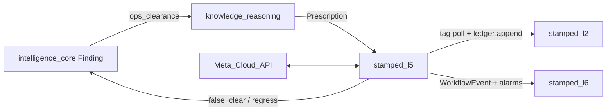

# stamped-l5 — Architecture handoff

> **Audience:** Engineers / agents building the L5 consumer repo.  
> **Planned consumer repo:** [Vinayak-RZ/stamped-l5](https://github.com/Vinayak-RZ/stamped-l5) (not created yet)  
> **Authority:** [L5 SSOT](../technical/layers/L5-closure-and-verification.md) · [ADR-019](../decisions/ADR-019-l5-runtime-and-consistency.md) · [ADR-020](../decisions/ADR-020-l5-mv-claim-governance.md) · [ADR-021](../decisions/ADR-021-l5-notification-and-evidence.md) · [ADR-013](../decisions/ADR-013-counterfactual-savings-ledger.md)  
> **L3 dependency:** [stamped-l3-ops-clearance-consumer-prompt.md](./stamped-l3-ops-clearance-consumer-prompt.md) · Finding 1.1.0 `ops_clearance`  
> **Contracts:** [`prescription.json`](../contracts/schemas/prescription.json) · [`workflow-event.json`](../contracts/schemas/workflow-event.json) · [`ledger-entry.json`](../contracts/schemas/ledger-entry.json) · [`finding.json`](../contracts/schemas/finding.json)  
> **Build plan:** [stamped-l5-build-plan.md](./stamped-l5-build-plan.md)

---

## 1. Mission

**stamped-l5** closes the loop: assign → alarm/notify → act → **ops-verify on telemetry** → track **calculated** ₹/kWh.

| Is | Is not |
| --- | --- |
| Workflow + durable timers | L3 detection engines |
| **EMS alarm router** (raise/ack/escalate/clear) | Re-implementing MD/idle/SEC detectors |
| **Ops-clearance verification** | Bill/IPMVP gate (deferred) |
| Calculated potential + ops_confirmed realised ledger | Claiming “verified on DISCOM bill” |
| WhatsApp-first notification | Plant dashboard UI (L6) |
| Opportunity-cost job (`modeled`) | OT / SCADA writes |

---

## 2. Upstream / downstream



| Rule | Detail |
| --- | --- |
| Hard gate | Every cited Finding must include `ops_clearance` |
| VERIFIED | Ops-cleared — not bill |
| Financial SoR | L2 ledger via idempotent append |
| No L2 DB URL | HTTP only |

---

## 3. Target repo layout

```text
stamped-l5/
  packages/
    api/
    worker/              # timers, clearance poller, outbox, opportunity_cost
    domain/
      workflow/
      alarms/            # EMS router
      notification/
      verification/      # ops_clearance eval
      evidence/
      integration/
    migrate/
  tests/
  external/
```

---

## 4. Domain modules

| Module | Owns |
| --- | --- |
| `workflow` | States; `verified` = ops-cleared |
| `alarms` | EMS lifecycle + L6 query |
| `notification` | Meta templates / webhooks |
| `verification` | Poll L2; eval predicates; regress |
| `integration` | Finding fetch, L2 append, measurements |

---

## 5. P0 capability band

| Capability | Band |
| --- | --- |
| Intake + owner + ops_clearance hard gate | **P0 must** |
| Alarm raise/ack/escalate/clear | **P0 must** |
| Clearance poller + ops_confirmed ledger | **P0 must** |
| Potential savings at accept | **P0 must** |
| WhatsApp templates | **P0 must** |
| Bill-verified path | **Deferred** |
| SMS send | **P1** |

---

## 6. Related docs

| Doc | Use |
| --- | --- |
| [stamped-l5-build-plan.md](./stamped-l5-build-plan.md) | Commit matrix |
| [stamped-l3-ops-clearance-consumer-prompt.md](./stamped-l3-ops-clearance-consumer-prompt.md) | Paste into L3 agents |
| [L5 SSOT](../technical/layers/L5-closure-and-verification.md) | Full architecture |
