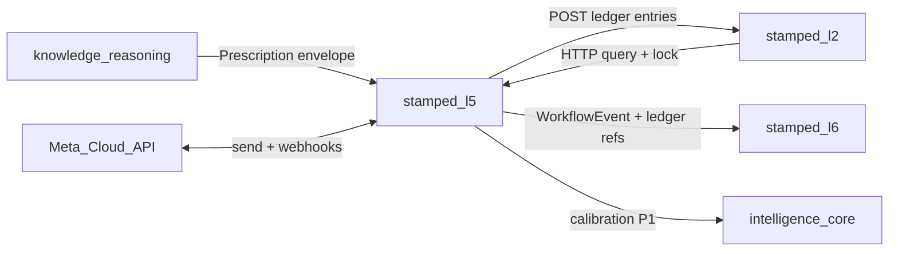

# stamped-l5 — Architecture handoff

> **Audience:** Engineers / agents building the L5 consumer repo.  
> **Planned consumer repo:** [Vinayak-RZ/stamped-l5](https://github.com/Vinayak-RZ/stamped-l5) (not created yet)  
> **Authority:** [L5 SSOT](../technical/layers/L5-closure-and-verification.md) · [ADR-019](../decisions/ADR-019-l5-runtime-and-consistency.md) · [ADR-020](../decisions/ADR-020-l5-mv-claim-governance.md) · [ADR-021](../decisions/ADR-021-l5-notification-and-evidence.md) · [ADR-013](../decisions/ADR-013-counterfactual-savings-ledger.md)  
> **Contracts:** [`prescription.json`](../contracts/schemas/prescription.json) · [`workflow-event.json`](../contracts/schemas/workflow-event.json) · [`ledger-entry.json`](../contracts/schemas/ledger-entry.json) · [`stamped-record-envelope.json`](../contracts/schemas/stamped-record-envelope.json)  
> **Build plan:** [stamped-l5-build-plan.md](./stamped-l5-build-plan.md)  
> **Platform pack:** mount this repo as git submodule at `external/` ([SUBMODULE.md](../SUBMODULE.md))

**L5 / L6 slots were empty until this handoff** — this document is the implementation authority. Improve it in the L5 workspace as code teaches, but do not contradict ADRs without a new ADR.

---

## 1. Mission

**stamped-l5** turns L4 `Prescription` objects into **assigned, acted-on, bill-verified savings**:

| Is | Is not |
| --- | --- |
| Workflow state machine + durable timers | L4 prescription drafting |
| WhatsApp-first notification (+ SMS P1) | Plant dashboard UI (L6) |
| IPMVP M&V + bill reconciliation | L2 storage of ledger SoR |
| Ledger **policy** + append client | Direct `L2_DATABASE_URL` |
| Evidence bundle assembly | OT / SCADA writes |
| Opportunity-cost job (`modeled`) | Auto-verify in P0 |

---

## 2. Upstream / downstream



| Rule | Detail |
| --- | --- |
| No L2 DB | HTTP only — service key + org header |
| Intake gates | Reject missing owner / `mv_plan` → `blocked_incomplete` bounce |
| Financial truth | Only after L2 append ACK |
| WA replies | Untrusted — button ID allowlist |

---

## 3. Target repo layout

```text
stamped-l5/
  packages/
    api/                 # FastAPI: Meta webhooks, analyst, L6 query
    worker/              # timers, outbox drain, M&V, opportunity_cost
    domain/
      workflow/
      notification/
      verification/
      reconciliation/
      evidence/
      integration/       # L2, Meta, L4 bounce clients
    migrate/             # stamped_l5 Postgres
  tests/
    unit/
    integration/
    golden/              # DISCOM bill math, workflow properties
  external/              # stamped-external submodule
  README.md
  pyproject.toml
```

**Deploy P0:** 1 API + 1 worker Fargate task · DB `stamped_l5` · `ap-south-1`.

**Explicitly not in P0–P2:** Temporal, Redis, Kafka, EKS, per-plant WA numbers, auto-verify.

---

## 4. Domain modules (responsibility)

| Module | Owns |
| --- | --- |
| `workflow` | WorkflowState, transitions, `scheduled_actions`, WorkflowEvent emit |
| `notification` | Templates, Meta send, delivery log, fatigue budget |
| `verification` | VerificationCase, G14/FSU gates, analyst decision |
| `reconciliation` | Bill decompose/attribute/cap |
| `evidence` | Bundle object keys + hashes |
| `integration` | Idempotent L2 append, query, baseline lock |

---

## 5. Consistency protocol (must implement)

See ADR-019. Summary:

1. Single L5 transaction: approve → `ledger_append_intent` + local event.
2. Worker POST L2 with stable `dedupe_key`.
3. ACK → mark intent; then L6-visible “verified” presentation.
4. Timeouts retry **same** key; 4xx → quarantine + page.

---

## 6. Contracts cheat-sheet

| Direction | Schema | Notes |
| --- | --- | --- |
| In | `prescription.json` | Intake `status` ≠ L5 verified/disputed |
| Out | `workflow-event.json` | Runtime closure stream |
| Out | `ledger-entry.json` | Includes `modeled`, `supersedes_entry_id` |
| Wrap | `stamped-record-envelope.json` | `record_type=workflow_event\|ledger_entry\|prescription` |

Pin `external/contracts` SHA; run `external/scripts/contract-check.sh` in CI.

---

## 7. P0 capability band

| Capability | Band |
| --- | --- |
| Intake + hard gates + workflow OPEN…REJECTED/DONE | **P0 must** |
| Durable timers ack/remind/escalate | **P0 must** |
| Meta WA 4 utility templates + webhooks | **P0 must** |
| MD/TOD/PF deterministic verify + Option C provisional | **P0 must** |
| Analyst gate on every claim | **P0 must** |
| L2 ledger append + opportunity_cost cron | **P0 must** (needs L2 API — fixture until live) |
| SMS send | **P1** (DLT register in P0) |
| Auto-verify / disputes / Option B / hash chain | **P2** |

---

## 8. Security & compliance checklist

- [ ] Meta app secret + webhook signature verify
- [ ] No phones in application logs (hash/last-4)
- [ ] DPDP DPIA before prod WA
- [ ] Opt-in stored per user
- [ ] DLT registration started week 1
- [ ] Evidence buckets ap-south-1 only
- [ ] Tenancy tests: org A never sees org B workflow

---

## 9. Observability

Emit: closure funnel, time-to-ack, template quality, ledger intent failures, outbox depth, analyst queue age.  
Trace: intake → notify → transition → verify → L2 ACK.  
Page on: WA failure spike, ledger append runaway, API down.

---

## 10. Open items for L5 workspace to refine

- Exact L2 append request/response OpenAPI once L2 implements it
- Empirical auto-verify band (post-pilot)
- Legal dispute arbiter copy
- Retention year counts in enterprise MSA

Update this handoff when those land — prefer additive sections over silent rewrites of ADR decisions.

---

## 11. Related docs

| Doc | Use |
| --- | --- |
| [stamped-l5-build-plan.md](./stamped-l5-build-plan.md) | Commit-level next-agent plan |
| [stamped-l2-query-api-sketch.md](./stamped-l2-query-api-sketch.md) | L2 endpoints |
| [stamped-l2-database-schema.md](./stamped-l2-database-schema.md) §7 | `ledger.mv_ledger` |
| [l6-counterfactual-display-stub.md](./l6-counterfactual-display-stub.md) | Modeled badge copy |
| [REPOS.md](../REPOS.md) | Repo map |
