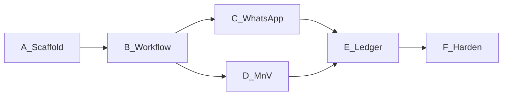

# stamped-l5 — Basic build plan (next agents)

> **Mode:** feature / greenfield consumer · **Stack:** Python 3.11+ · FastAPI · Postgres  
> **Authority:** [stamped-l5-architecture-handoff.md](./stamped-l5-architecture-handoff.md) · [L5 SSOT](../technical/layers/L5-closure-and-verification.md) · ADR-019/020/021/013  
> **Branch naming (when coding):** `cursor/<slice>-b186` style per cloud agent rules in that workspace  
> **Note:** This is a **starter** plan. L5 workspace agents should expand commit matrices and improve the handoff without violating ADRs.

---

## §0 Metadata

| Field | Value |
| --- | --- |
| Objective | Bootstrap `stamped-l5` P0: workflow + WA + M&V gate + L2 ledger append |
| Non-goals | Temporal, Redis, Kafka, L6 UI, auto-verify, SMS send (register only), Option B feeders |
| Estimated commits | **18–28** small conventional commits |
| Blocker | L2 `POST /v1/ledger/entries` — use fixture client until live |

---

## §1 Workstreams

| ID | Name | Owns |
| --- | --- | --- |
| WS-A | Scaffold + CI + contracts pin | repo layout, submodule, contract-check |
| WS-B | Workflow + timers | state machine, events, scheduled_actions |
| WS-C | Notification | Meta client, webhooks, templates, fatigue |
| WS-D | Verification + reconcile | MD/TOD/PF + Option C stub + analyst API |
| WS-E | Ledger integration | append intent, L2 client, opportunity_cost |
| WS-F | Hardening | property tests, tenancy, runbooks, README |

---

## §2 Phase map

| Phase | Exit gate |
| --- | --- |
| A | `pytest` collects; `external/scripts/contract-check.sh` green |
| B | Property tests: legal transitions only; timer crash-resume demo |
| C | Webhook dedupe on `wamid`; template send mocked in CI |
| D | Golden MD floor + Option C phantom≈0 on fixture plant |
| E | Fixture E2E: Rx → Done → analyst approve → intent → L2 fixture ACK → WorkflowEvent |
| F | Tenancy test + README + handoff delta PR to platform if APIs clarified |

---

## §3 Commit matrix (starter — expand, do not squash)

| # | WS | Commit | Gate |
| --- | --- | --- | --- |
| 1 | A | `chore: scaffold stamped-l5 pyproject + packages layout` | collect |
| 2 | A | `ci: ruff + pytest + contract-check submodule` | CI |
| 3 | A | `chore: pin external/ contracts 0.7.0+` | contract-check |
| 4 | A | `feat(migrate): workflow_state events timers inbox outbox` | migrate up |
| 5 | B | `feat(workflow): accept Prescription + hard gates` | unit |
| 6 | B | `feat(workflow): transitions + optimistic version` | unit |
| 7 | B | `feat(workflow): durable scheduled_actions worker` | integration |
| 8 | B | `feat(workflow): emit WorkflowEvent outbox` | unit |
| 9 | B | `test(workflow): property illegal transitions + redelivery` | pytest |
| 10 | C | `feat(notification): Meta client + signature verify` | unit |
| 11 | C | `feat(notification): four utility template senders` | unit |
| 12 | C | `feat(api): webhook button → transition` | integration |
| 13 | C | `feat(notification): fatigue budget + reminder path` | unit |
| 14 | D | `feat(verification): VerificationCase model` | unit |
| 15 | D | `feat(reconciliation): MD/TOD/PF deterministic` | golden |
| 16 | D | `feat(verification): Option C monthly stub + G14 flag` | unit |
| 17 | D | `feat(api): analyst approve/reject claim` | integration |
| 18 | E | `feat(integration): L2 client protocol + fixture impl` | unit |
| 19 | E | `feat(ledger): append_intent + drain worker` | integration |
| 20 | E | `feat(ledger): opportunity_cost cron` | unit |
| 21 | E | `test(e2e): prescription to ledger fixture chain` | e2e |
| 22 | F | `test: org tenancy isolation` | pytest |
| 23 | F | `docs: README + runbooks WA and ledger failure` | — |
| 24 | F | `chore: OTel spans intake to L2 ACK` | smoke |

---

## §4 Test strategy

| Tier | Command (proposed) | When |
| --- | --- | --- |
| Fast | `pytest tests/unit` + contract-check | every PR |
| Medium | `pytest tests/integration` | PR |
| Golden | `pytest tests/golden` | PR |
| E2E fixture | `pytest tests/e2e` | PR + main |

**No live Meta/L2 required to merge** — mocks/fixtures only. Live keys in staging only.

---

## §5 Rollout

1. Staging with fixture L2 → one internal plant shadow (no customer WA).
2. Enable Meta to opt-in pilot users.
3. Analyst queue staffed before first `verified` claim.
4. Flip L2 fixture → live append when L2 P1 endpoint green.
5. Rollback: stop worker drain + disable template sends (feature flags).

---

## §6 Exit criteria (P0 consumer)

- [ ] Hard gates bounce incomplete Rx
- [ ] WA ack/done/defer drive legal transitions only
- [ ] Timers survive process kill
- [ ] No LedgerEntry `verified` without analyst + L2 ACK
- [ ] `opportunity_cost` posts as `modeled` only
- [ ] Contract-check + e2e fixture green
- [ ] README documents env vars (no secrets committed)

---

## §7 Risks

| Risk | Mitigation |
| --- | --- |
| L2 append delayed | Fixture client; do not fake verified in L6 |
| Meta template reject | Keep wording transactional; dual template drafts |
| False savings | Analyst gate; G14 withhold |
| Scope creep to Temporal | ADR-019 upgrade triggers only |

---

## Approval / execution

Platform architecture for L5 is **accepted** via ADR-019/020/021.  
This build plan executes in the **stamped-l5** workspace after repo creation.  
Lead agent: one matrix row = one commit; ponytail on every edit; improve handoff when APIs solidify.
