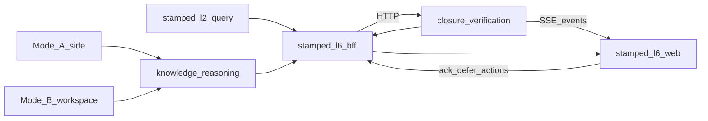

# stamped-l6 — Architecture handoff

> **Audience:** Engineers / agents starting `stamped-l6` or integrating L2/L4/L5 into the experience layer.  
> **Consumer repo (planned):** [Vinayak-RZ/stamped-l6](https://github.com/Vinayak-RZ/stamped-l6)  
> **Platform seed:** [../consumers/stamped-l6/](../consumers/stamped-l6/) (non-canonical UI reference)  
> **Authority:** [L6 SSOT](../technical/layers/L6-experience-and-integration.md) · [ADR-022](../decisions/ADR-022-l6-bff-runtime-boundary.md) · [ADR-023](../decisions/ADR-023-l6-ems-and-analyst-context.md) · [ADR-020](../decisions/ADR-020-l5-mv-claim-governance.md) · [ADR-018](../decisions/ADR-018-l4-pilot-execution-knowledge-reasoning.md)  
> **UI charter:** [stamped-l6-ui-ux-charter.md](./stamped-l6-ui-ux-charter.md)  
> **Build plan:** [stamped-l6-build-plan.md](./stamped-l6-build-plan.md)  
> **Contracts:** [`workflow-event.json`](../contracts/schemas/workflow-event.json) · [`ledger-entry.json`](../contracts/schemas/ledger-entry.json) · [`prescription.json`](../contracts/schemas/prescription.json) · [`finding.json`](../contracts/schemas/finding.json)  
> **L2 reads:** [stamped-l2-query-api-sketch.md](./stamped-l2-query-api-sketch.md)  
> **L5 connect:** [../consumers/readmes/closure-verification.md](../consumers/readmes/closure-verification.md) § Connect L6  
> **Counterfactual UI:** [l6-counterfactual-display-stub.md](./l6-counterfactual-display-stub.md)

---

## 1. Mission

**stamped-l6** is Experience & Integration — the ops-first control room where plants see alarms, close prescriptions, read ops-confirmed ₹, ask an analyst, and (later) export / webhook evidence.

| Is | Is not |
| --- | --- |
| Dashboard + EMS console + Rx queue UX | L3 detection / L5 workflow SoR |
| Dual-mode analyst UX (Mode A/B) | RAG / LangGraph runtime (L4) |
| Tenant-scoped BFF composing L2/L4/L5 | Direct Timescale / OT writes |
| Claim-safe savings display | Implying bill verification from ops |
| Public API + webhooks (P2) | SCADA HMI / ESG filing system |

---

## 2. Upstream / downstream



| Rule | Detail |
| --- | --- |
| No L2 DB URL | HTTP query only |
| Ledger append | Never from L6 — L5 only |
| Workflow truth | L5 `WorkflowEvent` / alarm lifecycle |
| Prescription text | L4; status/lanes from L5 |
| Analyst RAG | L4 HTTP; L6 sends explicit context envelope |

---

## 3. Target repo layout

```text
stamped-l6/
  packages/
    web/                 # Next.js App Router (adapt consumers/stamped-l6)
    api/                 # BFF — session + public /v1 (P2)
    worker/              # BullMQ PDF/CSV/webhooks
  tests/
  external/              # stamped-external submodule
```

---

## 4. Domain modules (BFF)

| Module | Owns |
| --- | --- |
| `shell` | Tenancy, RBAC, plant context, reveal prefs |
| `alarms` | L5 alarm list/actions + SSE fan-in |
| `prescriptions` | Queue query, ack/defer/reject → L5 |
| `ledger` | L2 ledger reads + claim badge mapping |
| `timeseries` | L2 evidence charts (granularity caps) |
| `analyst` | Context envelope validation → L4 |
| `exports` | Job triggers (P1) |
| `webhooks` | Standard Webhooks sender (P2) |

---

## 5. P0 capability band

| Capability | Band |
| --- | --- |
| Today ≤7 signals + reveal nav | **P0 must** |
| EMS console ack/escalate/silence UI | **P0 must** |
| Prescription triage + evidence drill-down | **P0 must** |
| Ops-confirmed / modeled dual badges | **P0 must** |
| SSE + stale banner | **P0 must** |
| Mode A contextual analyst shell | **P0 must** (fixture/L4 stub OK) |
| Mode B full workspace live | **P1** |
| Public `/v1` + webhooks | **P2** |
| Hindi UI | **Deferred** (ADR-018) |
| Bill-verified badge | **Deferred** (ADR-020) |

---

## 6. Bootstrap checklist

1. Create `stamped-l6` repo; add `external/` submodule ([SUBMODULE.md](../SUBMODULE.md)).
2. Paste [stamped-l6-agent-onboarding.md](./stamped-l6-agent-onboarding.md) into `AGENTS.md`.
3. Copy/adapt [consumers/stamped-l6](../consumers/stamped-l6/) per [TRANSFER.md](../consumers/stamped-l6/TRANSFER.md).
4. Wire BFF to L5 OpenAPI (queue/alarms/events) and L2 query sketch.
5. Run `external/scripts/contract-check.sh` on every PR.
6. Follow [stamped-l6-build-plan.md](./stamped-l6-build-plan.md) commit matrix.

---

## 7. Related docs

| Doc | Use |
| --- | --- |
| [stamped-l6-ui-ux-charter.md](./stamped-l6-ui-ux-charter.md) | Screens, a11y, port map |
| [stamped-l6-build-plan.md](./stamped-l6-build-plan.md) | Nawab commit matrix |
| [stamped-l5-architecture-handoff.md](./stamped-l5-architecture-handoff.md) | Upstream alarm/workflow |
| [stamped-l4-architecture-handoff.md](./stamped-l4-architecture-handoff.md) | Analyst API |
| [design/forge-industrial-design-system.md](../design/forge-industrial-design-system.md) | Visual system |
