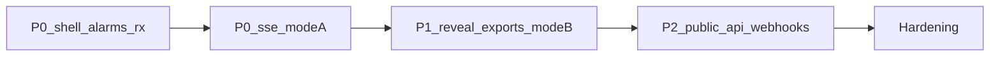

# stamped-l6 — Build plan (Nawab)

> **Mode:** feature / consumer greenfield · **Stack:** Next.js App Router + TypeScript BFF + BullMQ  
> **Branch strategy:** `cursor/l6-*` on consumer; platform pack handoffs on `cursor/l6-architecture-ui-f523`  
> **Authority:** [stamped-l6-architecture-handoff.md](./stamped-l6-architecture-handoff.md) · [UI charter](./stamped-l6-ui-ux-charter.md) · [ADR-022](../decisions/ADR-022-l6-bff-runtime-boundary.md) · [ADR-023](../decisions/ADR-023-l6-ems-and-analyst-context.md)  
> **Estimated commits (consumer):** 18–28 · **Lead:** orchestrates; max 3 parallel subagents

---

## §1 North star

Ship an ops-first L6 control room: Today, EMS, prescriptions, Mode A analyst, claim-safe ledger — adaptable from the platform seed without consulting the old Vite demo.

### Non-goals

3D twin · native app · OT writes · bill-verified claims · Hindi · named ERP connectors · embedding L4 runtime in L6.

---

## §2 Blockers

| Item | Status | Workaround |
|------|--------|------------|
| Live L5/L2 HTTP | pending | Fixture clients + seed fixtures |
| Live L4 analyst | pending | Mode A shell P0; Mode B live P1 |
| Magic-link auth ownership | open | Session auth P0; magic-link decision with L5 |

---

## §5 Workstreams

| ID | Name | Owns |
|----|------|------|
| WS-A | Platform handoff | stamped-external docs/ADRs/seed |
| WS-B | Web shell | `packages/web` |
| WS-C | BFF | `packages/api` |
| WS-D | Worker / exports | `packages/worker` (P1+) |

---

## §7 Phase map (consumer)

| Phase | Exit gate |
|-------|-----------|
| P0 | Supervisor acks alarm + closes Rx on mobile; plant head sees ops-confirmed ₹ |
| P1 | Monthly pack generates; Mode B cites sources; reveal modules shipped |
| P2 | External system consumes webhook/event poll without hand-holding |
| N | validate script + a11y + security review green |

---

## §9 Commit matrix (consumer starter)

| # | WS | Commit | Gate |
|---|-----|--------|------|
| 1 | B | `chore(web): scaffold Next.js from platform seed` | build |
| 2 | B | `feat(web): Forge tokens + primitives` | typecheck |
| 3 | B | `feat(web): AppShell reveal nav + SSE banner` | unit |
| 4 | B | `feat(web): Today board ≤7 signals` | unit |
| 5 | B | `feat(web): EMS alarm console` | unit + a11y smoke |
| 6 | B | `feat(web): prescription triage queue` | unit |
| 7 | B | `feat(web): Mode A contextual analyst` | unit (context chips) |
| 8 | C | `chore(api): scaffold BFF + tenancy middleware` | typecheck |
| 9 | C | `feat(api): L5 alarm/prescription proxy` | integration fixture |
| 10 | C | `feat(api): L2 ledger + timeseries proxy` | integration fixture |
| 11 | C | `feat(api): SSE fan-out with Last-Event-ID` | integration |
| 12 | C | `feat(api): analyst context envelope validation` | unit security |
| 13 | B | `feat(web): wire BFF mutations + Idempotency-Key` | e2e stub |
| 14 | B | `test(web): Playwright Today/Alarms/Rx mobile` | playwright |
| 15 | B | `feat(web): Mode B analyst workspace shell` | build |
| 16 | B | `feat(web): reveal Energy/Equipment routes` | build |
| 17 | D | `feat(worker): Playwright PDF monthly pack` | snapshot |
| 18 | C | `feat(api): public /v1 OpenAPI + scoped keys` | schemathesis |
| 19 | D | `feat(worker): Standard Webhooks sender` | conformance |
| 20 | all | `chore: validate.sh + hardening fixes` | validate |

*Split further if any row exceeds a single concern.*

---

## §10 Tests

| Tier | Command (consumer) |
|------|-------------------|
| Fast | `npm run typecheck && npm test` |
| UI | Playwright charter §17 |
| Contract | `./external/scripts/contract-check.sh` |
| Security | Cross-tenant + analyst envelope tests |

---

## §16 Exit criteria (P0)

- [ ] Architecture + UI charter read; seed transferred
- [ ] Today / Alarms / Prescriptions / Mode A green on fixtures or staging
- [ ] Dual claim badges correct; modeled disclaimer present
- [ ] No L2 DB credentials in L6
- [ ] PROGRESS updated in consumer

---

## Approval

Platform handoff pack complete. Consumer execution follows this matrix after repo creation.
