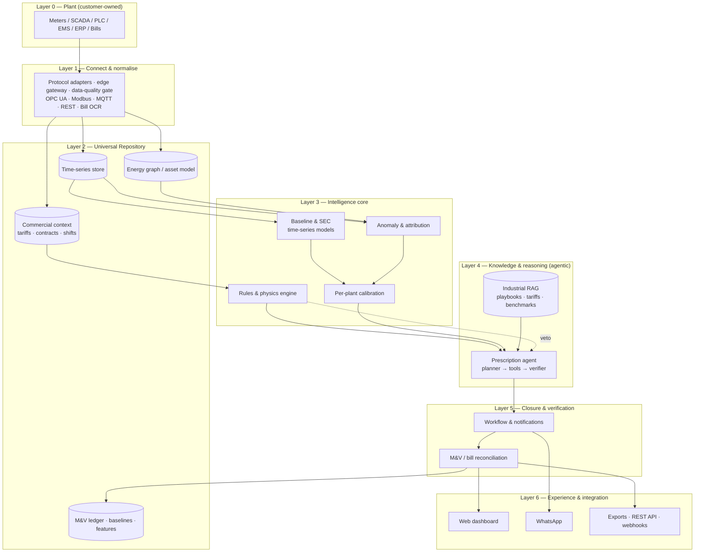

# Stamped Energy — Product Definition & High-Level Architecture

*Version 2.0 | July 2026*
*Status: Pre-build — refined for the product repo. Detailed engineering spec:* [02-technical-architecture.md](02-technical-architecture.md)
*Prepared for: internal product definition, engineering scoping, investor/technical storytelling*

> **Honesty convention:** `[~]` approximate / benchmark-derived · `[!]` evolving — verify before customer-facing claims

---

## 1. Executive summary

**Stamped Energy** is a **software-first prescriptive energy intelligence platform** for Indian energy-intensive manufacturers (≥ ₹30L/month electricity per plant). It sits **read-only** on top of existing plant infrastructure — meters, SCADA, PLCs, EMS exports, bills — and closes the loop from fragmented data to **assigned actions with ₹ impact**, verified on the **DISCOM bill**.

This document defines **what the product provides** and **how it is architected at a high level** — where time-series models, per-plant calibration, rules/physics engines, the energy graph, agentic RAG, and workflow closure each belong. It synthesizes Stamped's product thesis, the [stamped.work](https://stamped.work/) positioning, the [demo dashboard](https://stamped-energy.vercel.app/), and competitor technical patterns (Greenovative, Zerowatt, PredCo, Infinite Uptime, OEM incumbents).

**Core architectural bet:** Stamped wins on the **decision and closure layer**, not on being the best monitoring dashboard or a hardware company. Intelligence must produce **prescriptions a supervisor can execute**, not charts a plant head opens once a month.

**What changed in v2:** capability modules explicitly mapped to architecture layers (§2.5), the knowledge layer upgraded to a bounded **agentic** design with a verifier loop (§4.2 L4), open architecture questions resolved into defaults (§11), and two posture sections added — production readiness and evaluation discipline (§10) — because this software runs live in plants on continuous real-time data.

---

## 2. Product definition

### 2.1 What Stamped is

| Dimension | Definition |
| --- | --- |
| **Category** | Prescriptive energy intelligence / operational sustainability decision layer |
| **Buyer outcome** | Verified ₹ reduction on electricity bill + defensible SEC/intensity evidence |
| **Integration stance** | Read-only overlay on OT/IT — no control writes, no hardware retrofit program |
| **Operating loop** | Connect → Observe → Decide → Execute → Verify |
| **Differentiator** | Closed-loop accountability — potential vs realised savings, not passive EMS |

Stamped is **not**: a generic EMS dashboard, ESG/carbon accounting platform, SCADA replacement, or predictive-maintenance vibration company (though it may consume PdM signals where present).

### 2.2 What the product provides (capability modules)

These are the **product surfaces** a customer buys — mapped to outcomes, not engineering components.

| Module | What it does for the plant | Primary data need |
| --- | --- | --- |
| **1. Universal connect** | Pulls incomer meter, bill, SCADA/PLC/EMS, production tags into one pipeline | Path A: full OT · Path B: meter + bill first |
| **2. Baseline & SEC intelligence** | Production-normalised baselines — kWh/part, kWh/ton, kWh/shift, MD by window | Meter + production context |
| **3. Demand intelligence** | Attributes MD spikes to assets/events; prescribes stagger, shed, reschedule | Incomer + asset states |
| **4. Tariff & contract intelligence** | CMD sizing, TOD exposure, PF penalties, source-mix dispatch (grid/solar/WHR/DG) | Bill + tariff order + meters |
| **5. Utility waste detection** | Idle loads, holding, off-shift HVAC, compressor leaks (proxy), batch gaps | Meter trends + shift schedule |
| **6. Prescription engine** | Ranked actions: What / Why / Who / Effort / ₹ Impact / When | All above + domain knowledge |
| **7. Execution & governance** | Work items, owner assignment, WhatsApp + dashboard, status tracking | Workflow store |
| **8. Savings verification (M&V)** | Potential vs realised ledger; bill reconciliation; IPMVP-style narrative `[~]` | Post-action telemetry + bill |
| **9. Multi-plant benchmark** `[!]` | Cross-site SEC/MD comparison for groups (e.g. forging vs forging) | Normalised metrics across sites |
| **10. Sustainability evidence export** | SEC trends, realised savings, intensity — feeds corporate ESG tools | Verified operational data |

### 2.3 User-facing experience

The **primary UX is not a kWh chart**. Reference surfaces:

**A. Prescription card (hero artifact)**
Structured action the maintenance supervisor receives — matches stamped.work sample and demo dashboard "Action Intelligence" panel:
- What · Why · Impact (₹ + optional tCO₂e) · Owner · Due · Priority

**B. Plant head / energy manager dashboard** `[demo: stamped-energy.vercel.app]`
- Savings ledger (verified M&V)
- 30-day trend vs Stamped baseline
- Equipment health map (load %, status by asset)
- Live anomaly feed (critical → info)
- Top consumers table with benchmark deviation
- TOD / 24h demand profile
- Prescription queue with total addressable ₹

**C. Floor channel**
- WhatsApp prescription cards with interactive acknowledge / done / defer actions
- Optional mobile-responsive web for detail drill-down

**D. Executive / sustainability export**
- PDF report, realised vs potential rollup
- SEC/intensity series for PAT, BRSR, OEM supplier audits

### 2.4 Integration paths (product, not engineering)

| Path | Entry | Week-1 value | Maturity arc |
| --- | --- | --- | --- |
| **Path A — Direct OT** | SCADA, PLC, CNC, feeder meters, ERP where accessible | Machine-level attribution, shift SEC, rich prescriptions | Default for ICP (≥ ₹30L/mo) |
| **Path B — Meter-up** | Incomer meter + 6 months bills | MD pattern, PF, TOD waste, bill-level Rx | Stage 2: sub-meters · Stage 3: PLC/SCADA |

**Governing principle:** Real prescriptions from day one at the customer's integration level. Depth grows with data; value starts immediately.

### 2.5 Capability modules → architecture layers

Every module a customer buys resolves to specific layers of the stack in [02-technical-architecture.md](02-technical-architecture.md):

| Capability module | Primary layers | Layer spec |
| --- | --- | --- |
| 1. Universal connect | L1 (+ L0 sources) | [L1](layers/L1-connect-and-normalise.md) |
| 2. Baseline & SEC intelligence | L2 + L3 | [L2](layers/L2-universal-repository.md), [L3](layers/L3-intelligence-core.md) |
| 3. Demand intelligence | L3 (MD, attribution) | [L3](layers/L3-intelligence-core.md) |
| 4. Tariff & contract intelligence | L1 (bill ingest) + L3 (tariff engine) | [L1](layers/L1-connect-and-normalise.md), [L3](layers/L3-intelligence-core.md) |
| 5. Utility waste detection | L3 (rules, anomaly, classifier) | [L3](layers/L3-intelligence-core.md) |
| 6. Prescription engine | L4 (agentic RAG) | [L4](layers/L4-knowledge-and-reasoning.md) |
| 7. Execution & governance | L5 (workflow, WhatsApp) | [L5](layers/L5-closure-and-verification.md) |
| 8. Savings verification (M&V) | L5 (M&V, reconciliation, ledger) | [L5](layers/L5-closure-and-verification.md) |
| 9. Multi-plant benchmark | L6 (+ L2 fleet features) | [L6](layers/L6-experience-and-integration.md) |
| 10. Sustainability evidence export | L6 (+ L5 ledger) | [L6](layers/L6-experience-and-integration.md) |

---

## 3. Competitive architecture learnings

Synthesis from competitor research — informs Stamped's build choices, not copy-paste.

### 3.1 Pattern comparison

| Player | Architecture paradigm | AI approach | Stamped takeaway |
| --- | --- | --- | --- |
| **Greenovative** | Cloud SaaS · Universal Repository · energy graph · 4 layers (ingest → repo → contextual AI → closed-loop) | Base industrial model + per-plant parameterisation; anomaly + dispatch optimisation; MILP/rules for source mix | **Adopt:** two-layer model (fleet base + plant adapt), energy graph, closed-loop governance. **Skip early:** full digital twin / SLD for SME wedge |
| **Zerowatt (ZOE)** | Hybrid edge + cloud · AI + **rule expert system** · conversational layer | Time-series anomaly + domain rules + RAG knowledge base; IPMVP M&V; logbook learning | **Adopt:** rules + physics heuristics for explainable Rx; RAG over audit playbooks; WhatsApp delivery. **Differentiate:** software-only, no proprietary meter hardware |
| **PredCo** | Air-gap edge GPU → plant K8s → enterprise cloud | CV + fine-tuned LLMs for compliance; deterministic rules engine backing LLM outputs | **Adopt:** rules-first for prescriptions; LLM only where unstructured (tariff PDFs, SOPs). **Skip:** CV/safety stack (out of scope) |
| **Infinite Uptime** | Proprietary sensors → vertical vibration models → prescriptive CMMS | Industry-specific classifiers; human-in-loop flywheel; agentic "Trust Loop" with guardrails | **Adopt:** multi-persona outputs (supervisor vs plant head vs CFO); HITL feedback on prescription quality. **Skip:** hardware PdM core |
| **Siemens / Schneider / ABB** | Hardware-bundled EMS, siloed by vendor | Mature monitoring; prescriptive AI emerging at enterprise tier | **Position:** agile decision layer on top of their EMS — "prescribe + verify", not rip-and-replace |
| **C3.ai** (intl. ref.) | Enterprise AI platform, broad use cases | Generic ML on industrial data | **Avoid:** horizontal platform scope; stay energy-decision narrow |

### 3.2 What the market already proves

1. **Prescriptive beats descriptive** — dashboards are table stakes; willingness-to-pay is on assigned action + verification.
2. **Two-layer intelligence works** — cross-plant base patterns + per-facility calibration.
3. **Rules + ML hybrid** — explainable prescriptions for operators require domain rules, not black-box ML alone.
4. **Bill verification is the trust anchor** — IPMVP-style potential vs realised is the industry-standard narrative.
5. **WhatsApp is a product surface** in India — not an afterthought.
6. **Agentic AI belongs behind guardrails** — autonomous plant control is not phase 1; orchestration of human workflows is.

---

## 4. High-level technical architecture

### 4.1 Architecture diagram



### 4.2 Layer-by-layer definition

#### Layer 0 — Plant systems (out of Stamped's control)

Customer-owned OT/IT: incomer and feeder meters, SCADA historians, PLCs, CNC gateways, EMS exports, ERP production data, DISCOM bill PDFs. Stamped connects **read-only** — no write-capable credentials are ever provisioned.

#### Layer 1 — Connect & normalise

**Purpose:** Protocol-agnostic ingestion without replacing customer infrastructure. Full spec: [L1](layers/L1-connect-and-normalise.md).

| Component | Role |
| --- | --- |
| Edge-light gateway `[!]` | Optional containerized on-plant agent when cloud-direct is unacceptable; store-and-forward buffering, outbound-only |
| Protocol adapters | OPC UA, Modbus, MQTT, BACnet, REST, CSV/file drop — vendor tags → canonical schema |
| Data-quality gate | Physics/range/gap checks at the door — bad data quarantined with quality codes, never silently fixed |
| Bill ingest | PDF/OCR + LLM extraction, validated against tariff schema, human review for low confidence |
| Tag mapping & discovery | Plant → line → asset → meter hierarchy; LLM-assisted mapping from vertical templates |

#### Layer 2 — Universal Repository

Six coupled stores on one Postgres/Timescale core (decision rationale in [L2](layers/L2-universal-repository.md)):

| Store | Contents | Why |
| --- | --- | --- |
| **Time-series** | High-frequency telemetry, aggregates, anomaly scores | MD curves, SEC, shift patterns, M&V |
| **Energy graph** | Asset topology + typed edges (feeds, drives, shares bus) — relational, template-seeded per vertical | Root-cause attribution, owner routing |
| **Commercial context** | Versioned DISCOM tariff structures, CMD, TOD windows, shift calendar, production records, emission factors | ₹ impact calculation |
| **Feature store** | SEC, specific power, load factor, startup catalogue — continuous aggregates | L3 engines |
| **Baseline store** | Expected bands, versioned; **locked once cited by a prescription** (M&V immutability) | M&V reference |
| **M&V ledger** | Append-only verified outcomes — ₹ + kWh + tCO₂e | CFO + sustainability from one ledger |

The graph is **not** a full digital twin in v1 — it is the **minimum topology** needed to attribute waste and route prescriptions to the right owner.

#### Layer 3 — Intelligence core (deterministic + ML)

Where **numeric intelligence** lives. Outputs **structured findings**, never user-facing prose. Full spec incl. model-family research and per-engine evaluation protocol: [L3](layers/L3-intelligence-core.md).

| Engine | Technique | Output |
| --- | --- | --- |
| **Baseline engine** | Regression on calendar/production covariates (TOWT-style), quantile bands `[~]` | Expected consumption band per asset/shift/product |
| **Forecast / scenario** | Short-horizon MD forecast; deterministic what-if load shift | Predicted MD, TOD exposure |
| **Anomaly detector** | Residual-based (EWMA/CUSUM) + multivariate ML; context-aware suppression | Anomaly events with severity |
| **Attribution engine** | Graph traversal + temporal correlation | Candidate root causes ranked |
| **Rules & physics engine** | Versioned, code-reviewed rule packs (compressor SP, furnace holding, PF thresholds) | Structured findings + **veto authority over L4** |
| **Per-plant calibration** | Parameter layer adapting fleet defaults from 4–8 weeks plant data | Plant-specific config (not full retrain per site) |

**Custom model vs shared model:**

| Model class | Shared (fleet) | Custom (per plant) |
| --- | --- | --- |
| Waste pattern signatures | ✓ Trained/indexed across verticals | Calibrated thresholds |
| SEC / MD baselines | ✓ Vertical priors from benchmarks `[~]` | ✓ Production mix, asset roster |
| Tariff / dispatch rules | ✓ DISCOM order templates | ✓ Contract CMD, source mix |
| Anomaly sensitivity | ✓ Base detectors | ✓ Noise profile, shift calendar |

#### Layer 4 — Knowledge & prescription reasoning (agentic)

Where **language, context, and ranking** turn signals into **prescriptions**. v2 makes this an explicit agentic system — full spec: [L4](layers/L4-knowledge-and-reasoning.md).

| Component | Technique | Role |
| --- | --- | --- |
| **Industrial RAG** | Hybrid retrieval (BM25 + dense + metadata) over curated corpus: waste playbooks, SEC benchmarks, DISCOM tariffs, IPMVP guides, plant SOPs | Ground "Why" and "What" in defensible domain text |
| **Prescription agent** | Checkpointed agent graph: **planner → evidence-gathering tools → drafter → verifier → rules veto** | Generates prescription JSON — never writes to SCADA |
| **Impact calculator** | Deterministic tariff/baseline math — the LLM never does arithmetic | ₹ + kWh + tCO₂e per Rx |
| **Ranker** | ROI × urgency × effort × confidence; dedup by root cause | Orders prescription queue |

**Graph vs RAG vs rules — division of labour:**

| Question type | System |
| --- | --- |
| "Which assets contributed to the 07:15 MD spike?" | **Energy graph** + time-series attribution |
| "What is the standard remedy for intercooler fouling?" | **RAG** (playbook) |
| "What is the ₹ impact of staggering Furnace 2 by 10 minutes?" | **Impact calculator** + tariff context |
| "Draft the prescription card for the electrical supervisor" | **Agent** (template + evidence + verifier) |

**Agentic scope and guardrails (phase 1):**

- Read-only on OT — no autonomous setpoint changes
- **Bounded action space** — agent selects and parameterises approved action templates, never invents free-form actions
- Every prescription cites evidence pointers (meter tag, timestamp, baseline delta); a verifier node re-derives numeric claims before anything ships
- High-impact or ambiguous actions → human approval before send
- Deterministic rules engine **vetoes** agent output that violates physics/tariff/safety constraints
- Customer-uploaded SOPs and WhatsApp replies treated as untrusted input (prompt-injection defence)
- Full audit log with versioned provenance (prompt, model, rules) for OEM / ISO energy reviews

**What agentic is NOT in v1:** closed-loop autonomous plant control, self-modifying SCADA logic, unbounded chat without tool grounding.

#### Layer 5 — Closure & verification

Full spec: [L5](layers/L5-closure-and-verification.md).

| Component | Role |
| --- | --- |
| **Workflow engine** | Open → In Progress → Done → Verified / Deferred / Rejected; owner, due date, reminders, escalation, reason codes |
| **Notification router** | WhatsApp (interactive cards), email, dashboard, SMS fallback — role-based |
| **M&V engine** | IPMVP-aligned: locked baselines, adjusted comparison, verification windows |
| **Bill reconciliation** | Modelled vs actual DISCOM lines — **bill is final authority** |
| **Savings ledger** | Append-only potential vs realised ₹/kWh/tCO₂e; feeds L6 and model calibration |

#### Layer 6 — Experience & integration

Full spec: [L6](layers/L6-experience-and-integration.md).

| Surface | Primary user |
| --- | --- |
| Web dashboard | Plant head, energy manager |
| Prescription detail / queue | Supervisors, maintenance |
| WhatsApp | Floor execution |
| PDF / CSV export, sustainability pack | Sustainability, OEM audits, leadership |
| REST API + signed webhooks | Corporate IT / ESG / custom systems |

---

## 5. AI / ML component map (single view)

| Capability | Primary technique | Secondary | Phase |
| --- | --- | --- | --- |
| Ingestion & normalisation | Protocol adapters, schema mapping | — | P0 |
| Baseline & SEC | Time-series regression (TOWT-style), quantile bands | Fleet vertical priors | P0 |
| MD / demand spike detection | Streaming threshold + peak detection | Shift calendar context | P0 |
| Anomaly detection | Residual statistical + ML multivariate | Per-plant calibration | P0 |
| Root-cause attribution | Energy graph + correlation | Rules engine | P0 |
| ₹ impact calculation | Deterministic tariff engine | — | P0 |
| Prescription drafting & ranking | Bounded agent graph + templates | RAG for "Why"; verifier loop | P0 |
| Tariff / bill parsing | Layout-aware OCR + LLM extraction | Rules validation + human review | P0 |
| Source dispatch (grid/solar/WHR) | MILP or rule solver `[~]` | Greenovative pattern | P1 |
| Conversational query ("why was SEC high Tuesday?") | RAG + tool-using agent | Time-series charts as tools | P1 |
| Cross-plant benchmark | Aggregated analytics | Anonymised fleet learning | P1 |
| Predictive maintenance fusion | Consume third-party PdM signals | Not built in-house | P2 |
| Auto SCADA write-back | — | **Explicitly out of scope** | — |

---

## 6. Data flows — three exemplar prescriptions

### 6.1 Monday MD spike (die casting / forging classic)

```
Incomer kVA spike @ 07:12  (1-min streaming path)
  → Baseline: expected MD for shift-start sequence
  → Attribution: HT Furnace 3 preheat ∩ Forging Line 2 ramp (graph + timestamps)
  → Rule: stagger ≥8 min reduces overlap probability
  → Impact calc: CMD × demand charge × monthly reset
  → Agent: plan → evidence → draft → verify → veto pass → assign Electrical Supervisor
  → WhatsApp + dashboard
  → M&V: next bill MD line + incomer profile
```

### 6.2 Compressor specific power drift

```
Compressor feeder kWh ↑ at same pressure band (3 weeks)
  → Anomaly vs per-plant baseline
  → Rule match: inlet filter / intercooler fouling signature
  → RAG: playbook steps, effort estimate
  → Impact calc: SEC delta × run hours
  → Prescription: "Clean inlet filter — 2 hr job"
```

### 6.3 WHR / solar dispatch opportunity

```
Peak window 18:00–22:00; WHR output available; grid import high
  → Source mix rule engine
  → Impact calc: TOD tariff delta
  → Prescription: "Increase WHR draw 2.1 MW; reduce grid import"
  → Owner: dispatch coordinator
```

---

## 7. Deployment & tenancy model

| Aspect | Stamped choice |
| --- | --- |
| **Tenancy** | Multi-tenant SaaS; `org_id`/`plant_id` isolation with row-level security |
| **Compute** | Cloud-primary (India region); optional containerized plant gateway for constrained OT |
| **Service shape** | Modular monolith + satellite services (edge agent, ingest, ML workers, agent runtime) — sized for a 2–5 engineer team |
| **Security** | Read-only OT, outbound-only edge, TLS/mTLS, RBAC, audit logs; ISO 27001 as scale milestone `[!]` |
| **Time to first Rx** | ≤ 2 weeks (Path B bill+meter) — after shadow-mode graduation (§10.2); richer with Path A |

---

## 8. Build phasing (architecture milestones)

| Phase | Objective | Architecture delivered |
| --- | --- | --- |
| **P0 — Pilot wedge** | MD + bill + incomer prescriptions verified on DISCOM bill | Connect, TS store, baseline, MD engine, rules, Rx agent (MD/PF templates), workflow, M&V, WhatsApp — plus contract tests, data-quality gate, golden Rx set, shadow mode |
| **P1 — Path A richness** | Machine-level SEC, shift attribution, multi-asset graph | Full graph, PLC/SCADA connectors, attribution, cross-shift baselines, agentic verifier loop, drift monitors |
| **P2 — Fleet** | Multi-plant benchmark for groups | Fleet analytics, anonymised priors, executive rollups, champion/challenger evals |
| **P3 — Depth** | Source dispatch optimisation, conversational analyst | MILP dispatch, RAG chat with tool use |

---

## 9. Explicit non-goals (architecture)

- Proprietary sensor hardware (Infinite Uptime / Zerowatt meter path)
- Full digital twin / 3D plant model (Greenovative SLD — defer)
- ESG / Scope 1-3 accounting platform (export to existing tools only)
- Safety / compliance CV (PredCo lane)
- Autonomous closed-loop SCADA control in v1
- Public developer API / marketplace in v1 (outbound webhooks + documented REST API are in scope; a marketplace is not)

---

## 10. Production & evaluation posture

This product runs live in plants processing continuous telemetry; two cross-cutting disciplines are part of the product definition, not engineering afterthoughts.

### 10.1 Production readiness (summary — full doc: [production engineering](cross-cutting/03-production-engineering.md))

- **Honest scale envelope:** 10s of plants, 200–2000 tags/plant — the backbone must be reliable and replayable, not hyperscale.
- **Cost-first streaming:** MQTT (Mosquitto on edge) → ingest service → **Postgres outbox + TimescaleDB writers** at pilot scale (no broker licence). **Upgrade to Redpanda/MSK** when fan-out or replay needs justify it (§4.1 in [technical architecture](02-technical-architecture.md)).
- **Degraded modes are designed, not discovered:** plant offline → edge buffering + backfill; LLM down → rule-templated fallback prescriptions; bad data → quarantine, never silent repair.
- **Domain SLOs:** data freshness, finding→WhatsApp latency, tag staleness, closure rate, M&V dispute rate — monitored like infrastructure.

### 10.2 Cost-conscious technology posture

**Binding rule:** ship the minimum-cost option that is production-correct at pilot scale; document the paid upgrade and the trigger to switch. Full upgrade map: [technical architecture §4.1](02-technical-architecture.md).

| Area | Start now | Upgrade when (paid / better) |
| --- | --- | --- |
| Event backbone | Postgres outbox + ingest writers | Redpanda / MSK at fan-out or ~5k msg/s |
| WhatsApp | Meta Cloud API direct | Indian BSP for enterprise support / redundancy |
| OT drivers | Modbus + CSV (built) | Kepware / NeuronEX per difficult plant |
| LLM | Frontier API (pay per use) | Self-hosted for data-residency contracts |
| Observability | Grafana Cloud free tier | Paid tier at enterprise retention needs |

### 10.3 Evaluation discipline (summary — full doc: [evaluation & quality](cross-cutting/04-evaluation-and-quality.md))

- **Contract tests at every layer boundary** (Measurement, Finding, Prescription, LedgerEntry schemas) — CI-blocking.
- **Per-engine model gates:** baselines must meet CVRMSE/NMBE criteria before they back any M&V claim; anomaly engines carry a false-positive budget per plant.
- **Agent eval harness before the agent ships:** golden prescription set, faithfulness + numeric-consistency scoring, prompt regression suite in CI, red-teamed injection resistance.
- **Shadow mode for every new plant:** full pipeline runs without sending prescriptions until graduation criteria pass — then per-plant flag flips.
- **The ledger closes the loop:** predicted vs realised savings per prescription recalibrates engine confidence automatically.

---

## 11. Resolved architecture questions (were open in v0.1)

| Question (v0.1) | Resolution (v2) |
| --- | --- |
| Edge gateway vs VPN-only? | Support **both from day one**: cloud-direct where IT allows outbound; containerized edge gateway otherwise. The edge agent is a P0 artifact, expected at most plants `[~]` |
| Graph modelling effort per plant? | **Vertical templates** (forging, die casting, cement, pharma) customised at onboarding; relational storage, no graph DB in v1 |
| Rules vs ML split? | **Rules-first** for MD stagger, PF, holding, setpoint drift (deterministic, explainable, veto-capable); ML for baselines/SEC/anomaly where variance demands it. Documented per engine in [L3](layers/L3-intelligence-core.md) |
| RAG freshness? | Tariff orders: per-DISCOM watch, re-ingest on revision (annual + FPPCA updates) `[!]`; playbooks: quarterly curation; plant SOPs: on upload |
| M&V defensibility at Path B? | **IPMVP Option C** (whole-facility, bill + incomer) as account truth; **Option B** per-Rx as sub-meters arrive; per-Rx capped by account total — see [technical architecture §11.3](02-technical-architecture.md) |

Remaining open questions live in [02-technical-architecture.md §20](02-technical-architecture.md).

---

## 12. References

| Source | Path / URL |
| --- | --- |
| Master product doc | [00-stamped-master-document.md](00-stamped-master-document.md) |
| Detailed technical architecture | [02-technical-architecture.md](02-technical-architecture.md) |
| Layer specs | [layers/](layers/) — L1–L6 |
| Cross-cutting specs | [cross-cutting/](cross-cutting/) — production engineering, evaluation & quality |
| Demo dashboard | https://stamped-energy.vercel.app/ |
| Marketing site | https://stamped.work/ |
