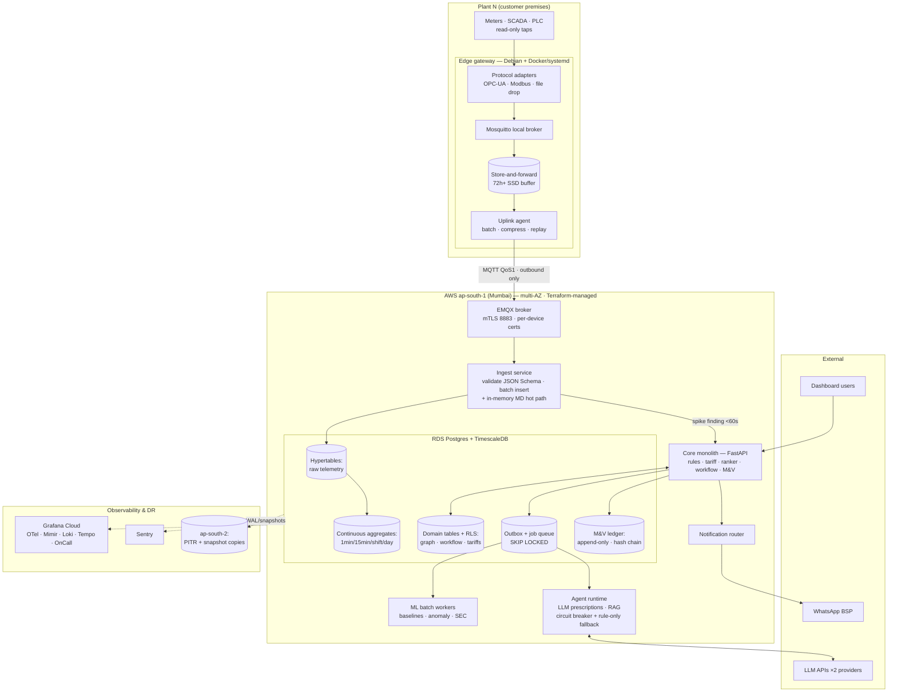

# Production Engineering — Patterns, Streaming, Reliability

*Cross-cutting research doc · July 2026 · Status: pre-build engineering reference*

> **Honesty convention:** `[~]` approximate / benchmark-derived · `[!]` evolving — verify before committing.
> **Companions:** [technical architecture](../02-technical-architecture.md) · [L1 connect & normalise](../layers/L1-connect-and-normalise.md) · [L2 universal repository](../layers/L2-universal-repository.md) · [evaluation doc](04-evaluation-and-quality.md)

The single most important sentence in this document: **Stamped's worst-case sustained ingest is a few thousand data points per second — roughly 1/50th of the throughput at which Kafka, Flink, microservices, or Kubernetes start paying for their own complexity.** Every recommendation below follows from taking that number seriously instead of pattern-matching to big-tech architectures.

---

## 1. Why production-grade matters for the 15–20% promise

Stamped's commercial promise is not "a dashboard" — it is *verified savings on the DISCOM bill* ([technical architecture](../02-technical-architecture.md), §3). That promise creates four engineering obligations that a demo-grade system cannot meet:

1. **MD spike detection is a real-time obligation.** A maximum-demand spike costs the customer ₹45k–80k/month per recurring event `[~]`. If the pipeline is 10 minutes behind when the Monday 07:12 co-start happens, the prescription arrives after the 30-minute MD integration window has already registered the peak. Sub-minute freshness on incomer kVA is a *revenue feature*, not an ops nicety.
2. **The M&V ledger is audit evidence.** Verified savings feed CFO reporting, PAT/BRSR adjuncts, and OEM supplier audits. Losing telemetry, double-counting a ledger entry, or silently backfilling bad data doesn't just break a chart — it breaks the defensibility of the number the customer pays for.
3. **Data gaps are indistinguishable from savings.** If a plant goes dark for 6 hours and we interpolate carelessly, the baseline engine will "detect" phantom reductions. Gap handling, late-data semantics, and lineage are correctness requirements for the core product math.
4. **Plants are hostile environments for software.** Flaky 4G, IT departments that block inbound ports, power cuts, an electrician unplugging the gateway to charge a phone. The system must degrade gracefully and self-heal without an engineer driving to Rudrapur.

At the same time — Stamped is a 2–5 engineer seed-stage team. Every hour spent operating infrastructure is an hour not spent on detection engines and prescription quality. The design goal is therefore **maximum reliability per unit of operational surface area**, which usually means *fewer, boring, well-understood components*, not more sophisticated ones.

---

## 2. Stamped's actual scale envelope — honest throughput math

Before any technology choice, compute the load honestly. Design targets from the product docs: 10s of plants (design headroom ~100), 200–2,000 tags per plant, telemetry at 1 s–15 min granularity, sub-minute freshness for MD detection.

### 2.1 Per-plant point rate

Not all tags are equal. A realistic tier split per plant:

| Tier | Tags (typical) | Rate | Points/s |
|---|---|---|---|
| **Fast** — incomer + HT feeder electrical (kW, kVA, PF) for MD detection | 20–100 | 1 s | 20–100 |
| **Medium** — equipment SCADA/PLC states, feeder energies | 150–800 | 10–60 s | 5–30 |
| **Slow** — 15-min block energies, BMS, production counters | 50–1,000 | 5–15 min | < 3 |
| **Typical plant total** | 200–2,000 | mixed | **~30–130 points/s** |

A heavy Path-A plant (2,000 tags, aggressive rates) lands around **~300 points/s** `[~]`. The pathological case — all 2,000 tags at 1 Hz — is 2,000 points/s, but no real plant needs 1 s resolution on a BMS zone temperature; we should refuse to configure it rather than design for it.

### 2.2 Fleet totals

| Fleet size | Typical sustained | Heavy-skew worst case `[~]` |
|---|---|---|
| 10 plants (year 1) | ~0.5–1.5k points/s | ~3k points/s |
| 30 plants | ~1.5–4k points/s | ~9k points/s |
| **100 plants (design headroom)** | **~5–13k points/s** | **~30k points/s** |

Two crucial corrections to naive math:

- **Message rate ≪ point rate.** The edge agent batches: one MQTT publish per gateway per second carrying 50–300 points (Sparkplug-style delta encoding cuts this further — report-by-exception reduces traffic 70–90% vs polling every tag [7]). The broker therefore sees **~1–5 messages/s per plant ≈ low hundreds of messages/s fleet-wide at 100 plants**. This is four orders of magnitude below MQTT broker limits (Mosquitto alone benchmarks at ~100k msg/s [6]).
- **Database write rate is batch-friendly.** 13k points/s written in 1–5 s batches is ~2,600–13,000 rows per COPY/multi-row INSERT — TimescaleDB on a mid-size instance sustains 100k+ rows/s inserts `[~]`. A single-node 4 vCPU Postgres handles ~3k *individual queue messages*/s [4]; batched telemetry inserts are far cheaper per point.

### 2.3 Volume and storage

At ~60 bytes/point stored (timestamp, value, quality, tag ref): 100 plants × ~10k points/s ≈ **50 GB/day raw ≈ 18 TB/year** before compression — and TimescaleDB columnar compression typically achieves 90–95% on regular telemetry `[~]`, i.e. ~1–2 TB/year effective. At year-1 scale (10 plants) it is ~5 GB/day raw. This fits comfortably on a single managed Postgres instance with tiering; see [L2](../layers/L2-universal-repository.md).

### 2.4 What this envelope rules in and out

| Threshold from the literature | Stamped's position |
|---|---|
| Postgres-as-queue comfortable to ~10k msg/s; graduate at ~50k msg/s [2][3] | 2–4 orders of magnitude below |
| Kafka/Redpanda earn their keep at 50k+ events/s sustained, replay, many consumer groups [1][3][4] | Not met at 100 plants |
| Kafka Streams adequate to 100–500k events/s per instance; Flink justified beyond that or for CEP [8][9] | Not met by ~50× |
| Multi-region active-active justified when RTO is measured in seconds [19][39] | Not met — prescriptions tolerate minutes of downtime |

**Conclusion:** Stamped is a *small-data real-time* problem: modest throughput with tight freshness requirements on a small subset of tags. The right architecture optimizes for freshness, durability, and operability — not horizontal scale.

---

## 3. Researched landscape by topic

### 3.1 Streaming / ingestion backbone

#### 3.1.1 MQTT broker at the edge boundary

MQTT (QoS 1, persistent sessions, TLS) is the correct plant→cloud transport: it is the industrial-IoT lingua franca, handles flaky links natively, and every SCADA-adjacent integrator understands it. The broker question has two halves — on the gateway and in the cloud.

| Option | Strengths | Weaknesses | Fit for Stamped |
|---|---|---|---|
| **Mosquitto** (edge) | Tiny footprint, battle-tested, persistence to disk, trivially containerized [5][6] | Single-threaded, no clustering — irrelevant on a gateway | **Recommended on the gateway** as local buffer/decouple point |
| **EMQX** (cloud, OSS core) | Erlang, clusters to millions of connections, built-in rule engine, Prometheus metrics, Helm/ECS-friendly [5][6] | Heavier than needed for ~100 connections; enterprise features paywalled | **Recommended cloud broker** — single small node, clustering available later |
| **HiveMQ** (cloud, commercial) | Enterprise support, mature Kafka extension, strong Sparkplug story [5][6] | Commercial licence cost unjustified at 100 clients | Skip — pay when an enterprise customer demands vendor support `[!]` |
| **AWS IoT Core** (managed) | Zero ops, per-device X.509 identity, shadow/jobs primitives | Per-message pricing, 128 KB message cap, vendor lock-in, less portable to on-prem deployments | Credible alternative `[~]` — re-evaluate if cert fleet management becomes painful |

Honest note on scale: the cloud broker will serve **~100 client connections at a few hundred messages/s** — every broker in the table is idling at that load [6]. The choice is about operability and security posture, not throughput. Sparkplug B adoption is worth evaluating for its birth/death certificates and delta encoding, but a well-specified JSON envelope achieves the same with less tooling friction `[!]` [3.1.4].

Topic namespace and QoS design (small but consequential — this is the contract between edge and cloud):

| Topic | QoS | Purpose |
|---|---|---|
| `v1/{plant_id}/live/{batch}` | 1 | Live telemetry batches — the freshness-critical path |
| `v1/{plant_id}/backfill/{batch}` | 1 | Replayed buffer after an outage — ingest deprioritizes vs `live/` |
| `v1/{plant_id}/status` | 1, retained | Gateway heartbeat: buffer depth, adapter health, versions — retained so the cloud sees last-known state immediately |
| `v1/{plant_id}/lwt` | 1, retained | MQTT Last Will — broker publishes "gateway offline" the moment the TCP session dies, giving free sub-second dark-plant detection |
| `cmd/{plant_id}/manifest` | 1 | Cloud→edge desired-state notification (edge still *pulls* the signed manifest over HTTPS — the MQTT message is only a wake-up, so the command path carries no payload trust) |

QoS 2 is deliberately not used anywhere: its four-way handshake roughly halves throughput for a duplicate-protection guarantee that idempotent inserts already provide for free (§3.1.4). Broker ACLs pin each device certificate to its own `{plant_id}` subtree — a compromised gateway cannot publish into, or subscribe to, another plant's namespace.

#### 3.1.2 The bus: Kafka vs Redpanda vs cloud-native vs "Postgres + outbox"

This is the highest-stakes premature-scale trap. The 2025–26 consensus in the practitioner literature is blunt: under ~10k msg/s, Postgres-based queues match or beat dedicated brokers on everything except top-end throughput, and dramatically undercut them on operational burden [1][2][3]. Kafka is justified by *log semantics* (replay, many independent consumer groups, event-sourcing-as-primary-pattern), not by "we have events" [1][4].

| Option | Pros | Cons | Verdict at Stamped's scale |
|---|---|---|---|
| **Apache Kafka (self-run)** | Replay, consumer groups, ecosystem | KRaft cluster, partitions, rebalancing, lag tooling — a tax on every deploy and incident for a 3-person on-call [3] | **No.** Nothing in the envelope requires it |
| **AWS MSK / MSK Serverless** | Managed Kafka semantics | Still Kafka client complexity + meaningful base cost (~$200+/mo minimum `[~]`); serverless pricing punishes small steady streams | No at P0–P1; the honest future option if replay becomes real `[!]` |
| **Redpanda** | Kafka API without JVM/ZooKeeper; single binary; good ops story under 10k msg/s [4] | Still a cluster to run; still Kafka client model | The *best* Kafka-shaped choice — but only when Kafka-shaped needs appear |
| **AWS Kinesis** | Fully managed, pay-per-shard | Shard math, 1 MB/s/shard write cap, awkward local dev, lock-in | No — shard-level thinking is overhead without benefit here |
| **Postgres: batched writes + transactional outbox** | Zero new infrastructure; the queue is backed up by the same PITR as the data; transactional with business writes [1][2] | Not a replayable log; polling latency (mitigate with LISTEN/NOTIFY); ceiling ~10k msg/s [2][3] | **Yes — the P0/P1 backbone** |

**Recommendation (sized):** telemetry flows MQTT → a thin **ingest service** → batched inserts into TimescaleDB. Domain events (finding created, prescription issued, ledger entry written) go through a **Postgres outbox table** drained by workers with `SELECT … FOR UPDATE SKIP LOCKED` [1][2]. At 100 plants this backbone runs at ≲15% of its measured ceiling [2][4]. The module boundary to defend: **all event publication goes through one `events` module** so that swapping the transport for Redpanda/MSK later is a relay change, not a rewrite.

Triggers to revisit (write these into the runbook): sustained > 5k *messages*/s on the outbox path; a second product needing independent replayable consumption of raw telemetry; fleet analytics requiring reprocessing of months of raw streams.

#### 3.1.3 Stream processing: Flink / Kafka Streams vs consumer services vs continuous aggregates

The MD engine needs sub-minute detection on ~20–100 fast tags/plant. That is a *windowed threshold + ramp detector over a few thousand keys* — not complex event processing over millions.

| Option | What it buys | What it costs | Verdict |
|---|---|---|---|
| **Apache Flink** | True streaming, CEP, event-time windows, TB-scale state [9] | A cluster + checkpoint storage + a skill set; "the biggest mistake teams make is adopting Flink prematurely and spending more on operations than business logic" [8] | **No.** Justified >500k events/s or genuine CEP [8] |
| **Kafka Streams** | Library not cluster; good to 100–500k events/s [8] | Requires Kafka (see above); JVM | No — falls with the Kafka decision |
| **Plain consumer services** (Python asyncio workers subscribing to MQTT/in-process stream, keeping rolling windows in memory/Redis) | Full control, trivially debuggable, deploys like any other service | Hand-rolled windowing; state lost on restart (recover by re-reading last N min from TSDB) | **Yes — for the fast path (MD detection)** |
| **TimescaleDB continuous aggregates** | Incremental materialized rollups (1 min/15 min/shift/day) maintained by the database itself [10] | Refresh lag (schedule-bound, typically ≥1 min); not for sub-minute alerting | **Yes — for everything that isn't the fast path** (baselines, dashboards, features) |

**Recommendation (sized):** a two-speed design. (a) **Hot path:** the ingest service forwards fast-tier points in-process to an MD detector holding ~5-minute in-memory windows per plant — worst case 100 plants × 100 tags × 300 samples ≈ 3M floats ≈ tens of MB. Detection latency is then bounded by edge publish interval (1 s) + processing (< 1 s), comfortably inside the 60 s SLO. (b) **Warm path:** TimescaleDB continuous aggregates produce 1-min/15-min/shift/day rollups for baselines, SEC, and dashboards [10]. No stream-processing framework exists in the stack.

#### 3.1.4 Backpressure, delivery semantics, schema evolution

**Backpressure.** The chain is MQTT QoS 1 with persistent sessions: if the ingest service slows, the cloud broker queues; if the WAN drops, the *edge* buffers (§3.4.2) — the edge disk is the ultimate backpressure reservoir, which is exactly where you want it (closest to the source, cheapest to size). The ingest service applies bounded in-memory queues and sheds by *slowing consumption* (broker holds), never by dropping.

**At-least-once + idempotent writes vs exactly-once.** Exactly-once *delivery* is impossible in distributed systems; what's achievable is at-least-once delivery plus idempotent processing ("effectively once") [11][14]. For Stamped this is unusually cheap:

- Telemetry has a natural idempotency key — `(plant_id, tag_id, timestamp)`. `INSERT … ON CONFLICT DO NOTHING` makes replays and duplicate publishes harmless. Kafka-style transactional exactly-once wouldn't extend to the Postgres sink anyway [11].
- Domain events carry a UUID; consumers keep an **inbox table** (processed event IDs) committed in the same transaction as their side effect [11][12].

**Verdict: exactly-once machinery is not worth it here — idempotency by natural key gives the same guarantee for ~zero cost.** The one place duplicates are business-visible — WhatsApp sends — gets an explicit dedup key (`prescription_id + channel + attempt window`) checked before dispatch.

**Schema registry & evolution.** Avro + Confluent Schema Registry is the Kafka-ecosystem default; Protobuf wins on compile-time safety; JSON Schema wins on debuggability and developer experience at 2–3× payload size [34][35][40]. With ~10 message types, one producer team, and no Kafka, running a registry service is pure overhead. **Recommendation:** versioned **JSON Schema** files in the monorepo (`schemas/measurement.v1.json`…), an envelope with an explicit `schema_version` field, CI-enforced backward-compatibility checks (additive-only changes within a major version), and validation at the ingest boundary. The payload-size tax is absorbed by gzip/zstd on the MQTT link. Revisit Protobuf if edge bandwidth costs bite or a registry if consumer teams multiply `[!]`.

### 3.2 Event-driven patterns

#### 3.2.1 Transactional outbox — adopt

The dual-write problem (DB commit + broker publish are not atomic) is the root cause of most "lost event" incidents [11][12][13]. Since Postgres *is* the backbone, the outbox is nearly free: findings, prescriptions, and ledger entries write their event row in the same transaction as the business row; workers drain via `SKIP LOCKED`. Polling every 500 ms is fine at our rates; add `LISTEN/NOTIFY` to cut latency when needed [3]. Debezium-style CDC is the scale-up path, not the starting point [12].

#### 3.2.2 Idempotent consumers + dead-letter queue — adopt

Every consumer: (a) dedups by event ID via inbox table [11], (b) has a bounded retry budget with exponential backoff, (c) moves poison messages to a **quarantine table** (`dead_events` with error, attempt count, payload) that pages nobody at 2 AM but appears on the morning dashboard and alerts if depth > threshold [12][14]. Replay from quarantine is a supported admin action, not a SQL improvisation.

#### 3.2.3 Saga vs simple orchestration — simple orchestration

Sagas exist to coordinate transactions *across services that own separate databases*. Stamped's prescription lifecycle (finding → prescription → notification → acknowledgment → M&V window → ledger) reads and writes **one Postgres database**. A state-machine table with explicit statuses and idempotent transitions is strictly simpler and fully transactional. The only genuinely distributed steps are calls to external systems (LLM API, WhatsApp BSP), which are handled with retries + idempotency keys, not compensating transactions. **Verdict: no saga framework; a well-tested state machine.**

#### 3.2.4 CQRS — only the version the database gives us free

Full CQRS (separate write/read models, projections, eventual consistency) is warranted when read and write shapes diverge violently *and* scale independently. Stamped has exactly one such divergence — high-rate telemetry writes vs aggregate-shaped reads — and TimescaleDB continuous aggregates *are* that read model, maintained by the database [10]. Application-level CQRS for prescriptions/workflow (hundreds of rows/day) would be resume-driven design. **Verdict: skip, knowingly.**

#### 3.2.5 Event sourcing for the M&V ledger specifically — yes, in spirit

The M&V ledger is the one place where event-sourcing *properties* (append-only, replayable, auditable) are product requirements: verified savings must be reconstructible and tamper-evident for audits ([L2](../layers/L2-universal-repository.md), §6.5). But those properties don't require an event-sourcing *framework*:

- `ledger_entries` is **append-only** (no UPDATE/DELETE grants to the app role; corrections are new entries with `supersedes_entry_id`).
- Each entry carries a **hash chain** (`entry_hash = H(prev_hash ‖ canonical_payload)`) making silent mutation detectable `[~]`.
- Every entry references its evidence: baseline version, rule-pack version, model version, bill line refs — lineage is a column set, not an afterthought.
- Current totals are a plain materialized rollup — rebuildable from the entries, which *is* event sourcing's replay property without the framework.

**Verdict: append-only + hash chain + lineage columns on this one table; no Axon/EventStore-class machinery anywhere.**

### 3.3 Reliability patterns

#### 3.3.1 Timeouts, retries with jitter, circuit breakers, bulkheads

Baseline hygiene, applied where it matters rather than everywhere:

| Pattern | Where it applies at Stamped | Sizing |
|---|---|---|
| **Explicit timeouts** | Every outbound call: LLM API (30–60 s), WhatsApp BSP (10 s), DISCOM portals/OCR (60 s), internal DB (statement_timeout 5–30 s by role) | No unbounded call anywhere; enforced in one shared HTTP client wrapper |
| **Retries + exponential backoff + jitter** | Idempotent operations only (telemetry insert, event publish, WhatsApp send with dedup key) | 3–5 attempts, capped backoff, full jitter; retry budget per dependency to avoid retry storms |
| **Circuit breakers** | LLM API, WhatsApp BSP, tariff/OCR vendors — third parties with real outage history | Trip after N consecutive failures, half-open probe; on trip, activate the degradation mode below. A library-level breaker (e.g. purgatory/pybreaker-class) suffices — no service mesh |
| **Bulkheads** | Separate worker pools/queues per concern: ingest, detection, LLM prescription drafting, notifications, M&V batch | One plant's malformed data or one slow LLM call must not starve MD detection; queue-per-concern with per-plant fairness (round-robin by plant on batch jobs) |

#### 3.3.2 Graceful degradation — the two scenarios that will actually happen

**Plant goes dark for 6 hours** (WAN cut, gateway power loss, DISCOM outage):

1. **Buffering:** edge agent keeps writing to its local store-and-forward buffer (§3.4.2) — sized for ≥72 h, so 6 h is routine.
2. **Detection of darkness:** cloud-side per-plant freshness monitor flags `stale > 5 min` (warning) and `dark > 30 min` (incident + customer-ops notification `[!]` — the fix is often "ask the electrician to check the router").
3. **Suppression:** baselines, anomaly detection, and prescription generation for that plant pause — a silent plant must produce *no* findings, never phantom ones. Dashboard shows an explicit data-gap band, not interpolated lines.
4. **Backfill:** on reconnect, the edge replays in timestamp order at a throttled rate (so backfill doesn't starve live data — two MQTT topics: `live/` and `backfill/`, ingest prioritizes live). Idempotent inserts make replay safe.
5. **Late-data handling:** continuous aggregates refresh over a lagging window (e.g. recompute the trailing 24–48 h `[~]`); the MD engine re-runs retrospectively over the backfilled window and marks findings `detected_late = true` — they feed M&V and reporting but skip real-time WhatsApp (a 6-hour-old "spike happening now" message destroys trust).
6. **M&V integrity:** verification windows overlapping a gap > X% are flagged `data_insufficient` rather than silently computed.

**LLM API is down** (or degraded, or rate-limited):

1. **Queue, don't drop:** prescription drafting jobs are durable queue entries; they wait and retry with backoff behind the circuit breaker.
2. **Rule-only degraded mode:** the rules/physics engine — the *primary* detection layer per the [technical architecture](../02-technical-architecture.md) §7.4 — keeps producing structured findings. High-urgency categories (MD spike, CMD breach) fall back to **deterministic templates**: the What/Why/₹/Who fields are computed by the rules and tariff engines anyway; the LLM adds fluency and playbook grounding, not the numbers. A templated MD-stagger prescription in 60 seconds beats an eloquent one after the outage.
3. **Multi-provider hedge `[!]`:** keep a second LLM provider configured behind the same interface; fail over on breaker trip. Cheap insurance given API-first LLM usage.
4. **Explicit banner:** dashboard shows "prescription enrichment delayed"; nothing pretends to be fine.

The design rule generalizing both: **every intelligence layer must have a defined output when its inputs are absent — and that output is "explicitly degraded", never "silently wrong".**

For completeness, the failure-mode catalogue the runbooks should be written against — each row is a drill to rehearse, not just a table cell:

| Failure | Blast radius | Automatic behaviour | Human action needed |
|---|---|---|---|
| Gateway power loss / reboot | One plant, minutes | Buffer survives reboot (disk-backed); adapters and uplink restart via systemd; LWT fires, cloud marks plant dark then recovering | None if < 30 min; customer-ops ping if longer |
| WAN outage (hours) | One plant | Buffer absorbs (≥72 h); backfill + late-data flow on reconnect (§ above) | None up to buffer horizon |
| SCADA/historian source stops publishing | Subset of one plant's tags | Per-tag staleness watchdog flags; affected engines suppress findings on stale tags | Coordinate with plant IT — usually their change |
| Cloud broker down | All plants, ingest halts | Edges buffer (outage looks like WAN-down from their side); ingest reconnect loop | Restore broker (single stateless-ish node — redeploy from IaC in minutes) |
| Ingest service crash-loop | All plants | Broker holds QoS 1 queues; no data loss; page fires | Roll back deploy (last image digest) |
| Postgres primary failure | Everything | RDS multi-AZ automatic failover (~1–2 min `[~]`); apps reconnect | Verify; no manual failover |
| Postgres corruption / bad migration | Everything | — | PITR restore (rehearsed runbook, §3.3.3); recent telemetry re-replayable from edge buffers |
| LLM API outage | Prescription enrichment | Breaker trips → rule-only templated mode; jobs queue | None; monitor queue drain on recovery |
| WhatsApp BSP outage | Delivery | Retry with backoff; after budget, fall back to dashboard + email `[!]`; delivery SLO alert | Escalate to BSP; consider dual-BSP trigger (§7) |
| Bad rule-pack deploy | Fleet or canary plants | Canary-first rollout catches most; per-plant version pin → instant rollback (repoint version) | Roll back artifact version; add eval case |
| Poison event / malformed payload | One consumer | Retry budget → quarantine table; depth alert | Inspect, fix, replay from quarantine |

#### 3.3.3 Disaster recovery — RPO/RTO for India

The failure that matters at this stage is *database loss/corruption*, not region loss. Multi-AZ handles the overwhelming majority of real infrastructure failures at a fraction of multi-region cost [19][39]; the 2025 ap-south-1 incident made in-country DR a real conversation, and AWS's two India regions (Mumbai `ap-south-1`, Hyderabad `ap-south-2`) allow DR entirely within Indian borders [17][18].

| Aspect | P0–P1 target | P2+ target | Mechanism |
|---|---|---|---|
| **RPO (telemetry & business data)** | ≤ 5 min | ≤ 5 min | RDS/Aurora PITR (continuous WAL archiving); edge buffers mean telemetry lost in a DB restore is *re-playable from the plants* for the trailing ~72 h — an unusual and valuable property: effective telemetry RPO ≈ 0 for recent data |
| **RTO** | ≤ 4 h `[~]` | ≤ 1 h | P0: restore-from-PITR runbook, rehearsed quarterly [18]. P2: cross-region read replica in `ap-south-2` promotable (pilot-light → warm standby [20]) |
| **Backups** | Daily snapshot + WAL, copied cross-region to `ap-south-2` | same + tested automated restore | S3 CRR for exports/artifacts [18] |
| **Region strategy** | **Multi-AZ only** in `ap-south-1` | Warm standby in `ap-south-2` when contracts/SLA demand (~1.5× infra cost [17]) | Multi-region active-active explicitly rejected — RTO in seconds is not required for a prescription product [19] |

Honest framing for customers: during a rare cloud outage, plants keep buffering, no data is lost, prescriptions resume on recovery. That story is entirely adequate for this product category — and it's cheap.

### 3.4 Edge computing

#### 3.4.1 Edge agent design: k3s vs systemd + Docker

The unit of deployment is **one small industrial gateway per plant** (fanless x86 or ARM, 4–8 GB RAM, SSD, DIN-rail, dual WAN: plant broadband + 4G fallback). It runs: protocol adapters (OPC-UA/Modbus poller), local Mosquitto, the buffering/uplink agent, and a node metrics exporter.

| Option | Case for | Case against | Verdict |
|---|---|---|---|
| **k3s (single-node)** | Declarative manifests, k8s-native fleet tools; "consensus choice" when you want multi-gateway fleet management with k8s RBAC [15] | A Kubernetes control plane *per gateway* to keep healthy; failure modes an OT-adjacent debug session at 02:00 does not want [15]; buys scheduling across nodes we don't have (one node!) | **No** at one-box-per-plant |
| **Plain systemd + Docker Compose** | Boring, debuggable over a serial console, tiny surface, every engineer already knows it | Fleet state management is DIY — solved by pairing with a fleet/OTA tool (below) | **Yes** |
| **balenaOS/balenaCloud** | Vertically integrated container-first fleet: OS + supervisor + dashboard [42] | Vendor lock-in on the OS layer; per-device pricing; less control over the base system [16][42] | Credible alternative if fleet ops eats too much time `[!]` |

#### 3.4.2 Store-and-forward buffer sizing

The buffer is "non-negotiable for sites with flaky WANs" [15]. Compute it honestly for Stamped's payloads (~100 bytes/point on disk with tag ref, quality, lineage `[~]`):

| Plant profile | Point rate | Disk per 24 h | Per 72 h | Per 7 days |
|---|---|---|---|---|
| Typical (500 tags, tiered) | ~80 points/s | ~0.7 GB | ~2 GB | ~5 GB |
| Heavy Path-A (2,000 tags) | ~300 points/s | ~2.6 GB | ~8 GB | ~18 GB |
| Pathological (2,000 @ 1 Hz) | 2,000 points/s | ~17 GB | ~52 GB | ~121 GB |

**A stock 128–256 GB industrial SSD holds weeks of telemetry for any realistic plant.** (Contrast with the 50k-tags-at-1-Hz sites in the IIoT literature that need 2 TB for 72 h [15] — Stamped is ~100× smaller per site.) Implementation: append-only segmented log on disk (SQLite WAL or flat segment files), ring-buffer eviction at a high-water mark with oldest-first drop *and an alarm long before that*, replay in timestamp order on reconnect, throttled so live data keeps priority (§3.3.2). Buffer depth is itself a telemetry metric — creeping buffer = degrading WAN, catch it before the outage.

#### 3.4.3 OTA updates and fleet management

Ad-hoc SSH-and-update "should be treated as a security incident" [15]. Two layers, updated differently:

- **Application layer (weekly-ish):** containers. The agent polls the control plane (outbound HTTPS) for a signed desired-state manifest (image digests, config version), pulls, health-checks, and **rolls back automatically** if the new container fails its self-test. Staged rollout: 1 canary plant → cohort → fleet [15].
- **OS layer (quarterly-ish):** A/B partition atomic updates. **Mender** (open-source core, A/B rootfs state machine, rewritten client, Apache-2.0 with some commercial-tier features) is the strongest fit [16]; delta updates are commercial-tier-gated — acceptable, updates are small and rare [16]. balena is the integrated alternative if we'd rather buy the whole stack [16][42].

**Recommendation (sized):** at 5–15 plants, a *pull-based signed-manifest container updater + Debian unattended-upgrades for security patches* is honestly sufficient `[~]`. Adopt Mender when fleet > ~20 gateways or the first bricked-gateway incident occurs — whichever comes first `[!]`.

#### 3.4.4 Edge security and flaky-network handling

- **No inbound ports. Ever.** All flows are outbound-only: MQTT over TLS (8883) + HTTPS (443). This single property defuses most plant-IT security reviews and most attack surface.
- **mTLS with per-device certificates**: unique X.509 identity per gateway, issued at provisioning, rotated ~every 90 days via an automated renewal call (the gateway requests a new cert with its current one before expiry `[~]`); revocation list on the broker. Compromised device = one cert revoked, not a shared secret rotated fleet-wide.
- **Remote support without inbound ports:** on-demand outbound reverse tunnel (WireGuard to a bastion, or Mender/balena remote terminal), activated per-session, audited, off by default `[!]`.
- **Read-only enforcement in depth:** OPC-UA sessions opened without write scopes; Modbus adapter compiled with read function codes only (0x01–0x04); gateway firewall egress-restricted to broker/control-plane IPs; where a customer demands it, a hardware data diode is the L1 topology option ([L1](../layers/L1-connect-and-normalise.md); [technical architecture](../02-technical-architecture.md) §14).
- **Flaky 4G:** QoS 1 + persistent sessions absorb blips; the buffer absorbs outages; delta/report-by-exception encoding keeps a typical plant under ~0.5 GB/day uplink `[~]` [7] — within industrial 4G data plans; backfill is throttled to avoid burning the data cap in one burst.

### 3.5 Multi-tenancy & isolation

The 2026 practitioner consensus for B2B SaaS is unambiguous: **pooled (shared schema + `tenant_id` + Postgres row-level security) is the default to ~1,000+ tenants**; siloed per-tenant databases cost 10–50× per tenant and are reserved for contracts that demand physical isolation [28][29][30].

| Model | Isolation | Ops cost | When |
|---|---|---|---|
| **Pooled + RLS** | Logical, DB-enforced | Lowest | **Stamped default** — 10s–100 org tenants is deep inside this pattern's comfort zone [29] |
| Schema-per-tenant | Logical, schema-scoped | High (N× migrations) | Avoid — worst of both worlds at cross-cutting-migration time [29] |
| DB-per-tenant (silo) | Physical | 10–50× per tenant [29] | Only if an enterprise contract or compliance regime demands it — price it into that contract `[!]` |

Implementation discipline:

- `org_id`/`plant_id` on every tenant-scoped table; composite indexes `(plant_id, …)` — which is *also* the right time-series partitioning key.
- **RLS as backstop, not primary gate** [30]: application code still filters explicitly; `SET LOCAL app.tenant_id` per transaction; a forgotten WHERE clause returns zero rows instead of another customer's plant [28][30]. Enforce the same discipline in background jobs — jobs run with tenant context or a deliberate, logged, fleet-scope role.
- **Noisy neighbour** at this scale is a config problem, not an architecture problem [29]: `statement_timeout` per role, PgBouncer transaction pooling, per-tenant API rate limits, per-plant fairness in job scheduling (§3.3.1). One plant's 2,000-tag backfill must not delay another's MD detection — bulkheads cover this.
- **Fleet learning caveat:** cross-tenant aggregation (vertical benchmarks, fleet priors) is a *product feature* — do it through one audited, anonymizing aggregation module, never ad-hoc cross-tenant queries. Contract language must permit it.
- **Per-tenant encryption:** default AES-256 at rest (KMS) + TLS in transit; *per-tenant keys* (BYOK-style) deferred until an enterprise deal requires it — meaningful key-management complexity for a control no current buyer has demanded `[!]`.
- **India data residency:** everything in `ap-south-1`, DR copies in `ap-south-2` — residency preserved even in DR [17][18]. Verify LLM API data-processing terms and pin regional endpoints where offered; redact plant identifiers from prompts where feasible `[!]`.

### 3.6 Service architecture

#### 3.6.1 Modular monolith + satellites — the honest argument

Every current decision framework lands the same way: for teams under ~8–15 engineers, microservices are a net productivity loss; the modular monolith is the recommended starting point, with extraction only on concrete pain [21][22]. Microservices solve *organizational* problems (independent team deploys) that a 2–5 engineer team does not have [22]. The cost side is concrete: N× CI/CD pipelines, distributed tracing as a prerequisite for debugging, API contract versioning between your own services, and 2–3× infra cost at startup scale [22].

**Stamped's shape: one modular monolith + four satellites** — each satellite existing for a *physical or runtime* reason, not a fashionable one:

| Component | Why it's separate | Runtime |
|---|---|---|
| **Core monolith** — API (FastAPI), workflow/state machines, tariff engine, rules engine, ranker, M&V, dashboard backend, notification router | The domain logic; single deploy, single DB, single debugger | ECS Fargate service |
| **Edge agent** | Runs on customer premises — separate by physics | Gateway (Docker/systemd) |
| **Ingest service** | Availability isolation: must keep accepting telemetry during monolith deploys; different load profile (steady stream vs request/response) | ECS Fargate service |
| **ML batch workers** | Different resource shape (CPU/memory burst), different cadence (scheduled), crash-isolation from API | ECS Fargate tasks (scheduled/queued) |
| **Agent runtime (LLM prescription drafting)** | Long, spiky, third-party-latency-bound calls; bulkhead from everything else; likely different iteration speed | ECS Fargate service/worker |

Inside the monolith: module boundaries by domain (`ingest_contracts`, `intelligence`, `prescriptions`, `mv_ledger`, `tenancy`, `events`), no cross-module table access, communication through interfaces — enforced with import-linting in CI [21]. This is what makes future extraction "a surgical operation instead of a painful untangling" [21].

#### 3.6.2 Background jobs: Celery/Dramatiq vs Temporal

| Option | Fit | Notes |
|---|---|---|
| **Postgres-backed job queue** (Procrastinate/pgmq-class, `SKIP LOCKED`) | **P0 default** | Same durability/backup story as the outbox; zero new infra; ideal for short idempotent jobs (rollups, notifications, bill OCR) [1][2] |
| **Celery/Dramatiq + Redis** | Acceptable alternative | Adds Redis as a dependency; fine, but buys little over the Postgres queue at our job rates [23] |
| **Temporal** | **Adopt at P1–P2 for two workflows only** | Durable execution earns its keep on long-running, stateful, high-cost-of-failure workflows [23][24]: (a) the **M&V verification window** — a workflow that spans *weeks* (lock baseline → wait for window → compute → reconcile bill → write ledger) and must survive every deploy in between; (b) the **prescription delivery/escalation** flow (send → wait for ack → remind → escalate). Hand-rolling these as cron + status-column state machines is exactly the fragile pattern the literature warns about [24]. Use **Temporal Cloud** rather than self-hosting the cluster `[~]` |

**Recommendation:** Postgres queue at P0 (accepting that the M&V window is initially a scheduled-job state machine — it works, it's just more code to test); introduce Temporal when M&V workflow bugs or deploy-safety pain appear, which the research suggests they will [23][24] `[!]`.

#### 3.6.3 API layer and deployment platform

**FastAPI** is the uncontroversial choice: async-native (fits the I/O-bound profile), Pydantic models double as the schema-validation layer at boundaries, OpenAPI for the dashboard and future customer API. Uvicorn workers behind an ALB.

| Platform | Verdict | Reasoning |
|---|---|---|
| **ECS on Fargate (ap-south-1)** | **Recommended** | The 2026 default for AWS-first teams under ~15 services: free control plane, no nodes, task-definition simplicity; ~10–15% of one engineer's time vs 30–50% for k8s [36][37][38]. Small service ≈ $15–18/mo [37] |
| EKS (managed k8s) | No | +$73/mo control plane and — the real cost — a k8s skill tax estimated at ₹5–12 L/yr of engineering time at small-company scale [38]. Nothing in the stack needs the k8s ecosystem |
| Fly.io / Render | No — on residency alone | Neither offers an India region `[~]`; Stamped's enterprise posture requires data in-country (§3.5). Otherwise genuinely attractive ops story for small teams [3.6, [3]] |
| EC2 + Docker Compose | Fallback | Cheapest, most manual; acceptable P0 bridge but Fargate's marginal cost is worth the deploy/rollback machinery |

Managed everything at the data layer: RDS/Aurora Postgres + Timescale (or Timescale Cloud `ap-south-1` `[!]` — evaluate against RDS with the timescaledb extension availability), ElastiCache only if/when Redis becomes needed, S3 for artifacts/exports.

### 3.7 Observability

#### 3.7.1 Stack

The small-team consensus: instrument with **OpenTelemetry from day one** (keeps every backend option open), ship to **managed Grafana Cloud** rather than self-hosting the LGTM stack; the free tier (10k metric series, 50 GB logs/traces) genuinely covers a small production workload, and paid tiers scale predictably [25][26][27]. Self-hosting Prometheus+Loki+Tempo is three or four stateful systems for a team that cannot spare the attention [26][27]. Self-host only for data-sovereignty needs or >100k active series [25].

- **Metrics:** OTel → Grafana Cloud (Mimir). Cardinality discipline: label by `plant_id` (≤100), never by `tag_id` (200k) — tag-level health lives in Postgres as data, not in the metrics system.
- **Logs:** structured JSON → Loki. `trace_id` + `plant_id` + `org_id` on every line.
- **Traces:** OTel auto-instrumentation on FastAPI + workers; the trace that matters end-to-end: *measurement → finding → prescription → WhatsApp delivery*.
- **Errors:** Sentry (free/low tier) — the highest-leverage SaaS purchase for a tiny team [26].

#### 3.7.2 Domain SLOs — the observability that is actually the product

Infrastructure metrics are table stakes; Stamped's real health is domain-shaped. These SLOs are also customer-facing trust artifacts (the technical architecture already lists pipeline lag and tag staleness as ops concerns — §14):

| SLO | Target `[~]` | Measurement |
|---|---|---|
| **Data freshness (fast tier, per plant)** | p95 < 60 s, p99 < 120 s end-to-end (device → queryable) | Ingest stamps arrival; compare to measurement timestamp |
| **MD detection latency** | spike → finding < 60 s | Detector emits latency histogram |
| **Prescription latency (urgent)** | finding → WhatsApp delivered < 10 min (rule-templated path < 2 min) | Workflow timestamps end-to-end |
| **Tag staleness** | < 2% of active tags stale > 15 min, per plant | Cloud-side per-tag watchdog |
| **Pipeline lag (warm path)** | continuous aggregate lag < 5 min | Timescale job monitoring |
| **Edge buffer depth** | < 1 h equivalent under normal ops | Gateway agent metric |
| **Model/agent health** | LLM success rate > 99% daily; rule-engine eval-suite pass on deploy | Breaker stats; CI evals ([evaluation doc](04-evaluation-and-quality.md)) |
| **WhatsApp delivery** | > 98% delivered < 5 min | BSP delivery receipts |
| **Platform availability (dashboard/API)** | 99.5% monthly (≈ 3.6 h) — honest for seed stage; raise with contracts | ALB + synthetic checks |

A note on *why* domain SLOs go into the metrics system and not just a report: the freshness and staleness SLOs directly gate the intelligence layers (a finding computed on stale data is suppressed — §3.3.2), so the same measurements serve three masters — paging, engine gating, and the customer-facing data-quality panel. Compute them once, in the ingest/watchdog path, and export to all three. This is also the honest answer to "how do you know your numbers are right?" in an enterprise security/quality review: the system that produces the savings claim continuously measures its own input quality, and those measurements are retained ([evaluation doc](04-evaluation-and-quality.md) covers the model-quality half of this story).

#### 3.7.3 Alerting and on-call for 2–5 engineers

Start with **5–8 paging alerts** and refuse to grow the list without retiring one [26]: plant dark > 30 min (after auto-remediation attempts), fast-tier freshness SLO breach fleet-wide, ingest service down, DB CPU/disk critical, outbox/DLQ depth runaway, WhatsApp delivery failure spike, error-rate spike. Everything else is a ticket on the morning dashboard. Single rotation, one primary; Grafana OnCall (bundled, free tier) for routing/escalation [26]. Two honesty rules: *night pages only for things a human must fix before morning* — a single plant going dark at 02:00 usually isn't (the buffer holds; page at 07:00, or route to the customer's own ops WhatsApp group `[!]`); and *every page gets a follow-up*: runbook link, or automation, or deletion.

### 3.8 Deployment & change management

- **CI/CD:** GitHub Actions — lint, typecheck, tests, rule-pack eval suite, image build/scan, deploy. Trunk-based; deploy on merge to main behind flags.
- **Rollout strategy — what's proportionate:** ECS **rolling deploys with health checks** for the monolith and satellites (Fargate does this natively); blue/green via CodeDeploy only for the ingest service if connection-draining issues appear `[!]`. **Infrastructure canary is overkill** at ~5 services and this traffic; but **per-plant canary of *intelligence* changes is essential** (below). The riskiest deploys at Stamped are not code — they're rule packs and models.
- **IaC:** Terraform for all AWS resources from day one; one repo, plan-review-apply in CI; no console-created resources (SOC 2/ISO evidence collection later depends on this discipline [33]).
- **Config, rule packs, and models as versioned artifacts.** This is Stamped-specific and load-bearing: rule packs, baseline/model parameters, tariff templates, and prompt templates are **semver-versioned artifacts** (S3 + registry table), deployed *independently of code*, activated per-plant. Every finding and ledger entry already cites rule/model versions for audit ([technical architecture](../02-technical-architecture.md) §7.4) — that only works if versions are first-class deployable objects with instant rollback (repoint the plant's active version).
- **Feature flags for per-plant rollout:** a `plant_features` table + cached lookup — not LaunchDarkly-class SaaS at 10s of plants `[~]`. New detection engine → enable on 1–2 friendly plants → watch domain SLOs + false-positive rate for a week → fleet. Same mechanism gates Path A/Path B capability differences per plant.
- **Migrations:** expand-and-contract (add nullable → backfill → constrain → drop) so rolling deploys never race the schema.

### 3.9 Security

- **OT-side read-only guarantees — defense in depth, and a sales asset.** Four independent layers (§3.4.4): protocol sessions without write scopes; adapters that do not implement write function codes; egress-only network policy on the gateway; and organizational guarantee (no SCADA-write code paths exist to misuse — [technical architecture](../02-technical-architecture.md) §16 boundary). Document this as a one-page security note for plant IT — it shortens sales cycles `[!]`.
- **Compliance path: ISO 27001 first, SOC 2 second.** For an India-anchored buyer base, ISO 27001 has the higher recognition and directly supports DPDP Act posture; SOC 2 matters when US enterprise buyers appear [31]. Costs in India are far below US-default assumptions: ₹8–14 L all-in for SOC 2 Type II at seed stage via Indian platforms/auditors (vs ₹34 L+ on the "Vanta + Big-4" path) [32]; ISO 27001 ≈ ₹5.5–8 L in 4–6 months [31]. **Sprinto** (India-HQ, INR billing, DPDP workflows, local auditor partnerships) is the sized platform pick [33]. Sequencing per the dual-track pattern: ISO 27001 months 1–6, SOC 2 observation window overlapping, both inside ~12 months when a contract demands it [31]. Don't start either until a deal requires it — but *run the controls* (access reviews, audit logs, IaC, secrets hygiene) from day one so the audit is evidence collection, not remediation.
- **Secrets:** AWS Secrets Manager / SSM Parameter Store; injected at runtime by ECS task definitions; never in images, env files, or the repo; per-environment isolation; rotation on the DB and third-party keys. Edge devices hold only their own device cert + broker endpoint.
- **Supply chain basics (proportionate):** lockfiles + Dependabot/Renovate; `pip-audit`/`npm audit` in CI; Trivy image scanning; pinned base images; images pulled by digest at the edge; signed edge manifests (§3.4.3). SBOM generation and Sigstore signing are cheap to add and increasingly asked for in enterprise questionnaires `[!]`.
- **AuthN/Z:** RBAC roles per the architecture (operator/supervisor/plant head/sustainability/admin); short-lived JWTs; audit log on prescription issue/view/act/verify (already a product requirement — reuse it as the compliance audit trail).

---

## 4. Recommended reference architecture

One coherent picture. Named technologies, chosen for the envelope in §2 — every component is either managed or boring.

**The backbone in one line:** *Mosquitto (edge) → EMQX (cloud, mTLS) → Python ingest service → TimescaleDB-on-Postgres (single writer DB, outbox events, continuous aggregates) → modular FastAPI monolith + 3 cloud satellites on ECS Fargate in `ap-south-1`, observed via OpenTelemetry → Grafana Cloud.*

### 4.1 Named stack summary

| Concern | Choice | Fallback / upgrade trigger |
|---|---|---|
| Edge OS/runtime | Debian LTS + Docker Compose + systemd | balenaOS if fleet ops > 0.5 eng-days/week |
| Edge OTA | Signed-manifest container pull + unattended-upgrades → **Mender** at ~20+ gateways | — |
| Plant→cloud transport | MQTT QoS 1, mTLS, per-device X.509 | — |
| Cloud broker | EMQX (single node, OSS) | AWS IoT Core if cert ops become painful |
| Ingest | Python service, JSON Schema validation, batched COPY | — |
| Time-series + OLTP | **One RDS Postgres + TimescaleDB** (multi-AZ) | ClickHouse for fleet analytics at 100+ plants `[!]` |
| Event backbone | Postgres outbox + SKIP LOCKED workers | Redpanda/MSK at sustained >5k msg/s or real replay needs |
| Stream processing | In-memory hot path + continuous aggregates | Flink: never at this scale |
| Jobs/workflows | Postgres job queue → **Temporal Cloud** for M&V window + delivery/escalation (P1–P2) | — |
| App architecture | Modular monolith (FastAPI) + ingest, ML workers, agent runtime, edge satellites | Extract more services only on concrete pain |
| Deployment | ECS Fargate, `ap-south-1`, Terraform, GitHub Actions, rolling deploys | EKS only with >15 services + platform hire |
| Tenancy | Pooled Postgres + RLS backstop, per-plant flags | Siloed DB per contract demand |
| Observability | OpenTelemetry → Grafana Cloud + Sentry + Grafana OnCall | Self-host at >100k series |
| DR | Multi-AZ + PITR + cross-region copies to `ap-south-2`; RPO ≤5 min, RTO ≤4 h | Warm standby at P2 (RTO ≤1 h) |
| Compliance | Controls from day 1; ISO 27001 → SOC 2 via Sprinto when a deal requires | — |

### 4.2 Cost envelope `[~]`

Rough monthly run-rate for the reference architecture (ap-south-1, on-demand pricing, year-1 fleet of ~10 plants) — the point being that the whole production stack costs less than a fraction of one engineer:

| Line item | Monthly `[~]` |
|---|---|
| RDS Postgres + Timescale (db.m6g.large multi-AZ, 500 GB gp3) | $350–450 |
| ECS Fargate (monolith ×2 tasks, ingest ×2, agent runtime, workers) | $150–250 |
| EMQX node (t4g.medium) + ALB + NAT + misc networking | $80–120 |
| S3, backups, cross-region snapshot copies | $30–60 |
| Grafana Cloud (free → first paid tier) + Sentry | $0–80 |
| Temporal Cloud (from P1–P2) | $0–100 |
| **Cloud total** | **~$650–1,050/mo** (~₹55–90k) |
| Edge gateway hardware (one-time, per plant) | $300–600 capex |

At 100 plants the dominant growth terms are RDS storage/instance size and Fargate task count — plausibly $2.5–4k/mo `[~]`, still far below the cost of the premature-scale alternatives in §5 (a modest MSK + EKS + self-hosted observability stack starts around $1–1.5k/mo before any engineering time [2][36][37]).

### 4.3 SLO table (production commitments, internal)

| Domain SLO | Target | Alert threshold |
|---|---|---|
| Fast-tier freshness (per plant) | p95 < 60 s | p95 > 120 s for 10 min |
| MD spike → finding | < 60 s | > 120 s |
| Finding → WhatsApp (urgent, rule path) | < 2 min | > 10 min |
| Finding → WhatsApp (LLM-enriched) | < 10 min | > 30 min backlog |
| Tag staleness per plant | < 2% > 15 min | > 5% |
| Aggregate pipeline lag | < 5 min | > 15 min |
| Edge buffer depth | < 1 h | > 6 h (WAN degrading) |
| Dashboard/API availability | 99.5%/mo | error budget burn > 2× |
| Ledger write integrity | 100% hash-chain valid | any failure — page immediately |

---

## 5. What we explicitly do NOT build yet — premature-scale traps

Each item below is a *named decision with a revisit trigger*, so nobody relitigates it casually and nobody misses the moment it becomes wrong:

| Not building | Why not | Revisit when |
|---|---|---|
| **Kafka / MSK / Redpanda cluster** | 2–4 orders of magnitude of headroom in Postgres backbone [1][2][4] | >5k sustained outbox msg/s, or second independent consumer of raw streams |
| **Flink / Kafka Streams / any stream-processing framework** | Hot path is a windowed detector over thousands of keys [8] | CEP-class detection needs, or >100k events/s |
| **Microservices decomposition** | 2–5 engineers; org problems microservices solve don't exist [21][22] | >15 engineers, or a module with proven divergent scaling |
| **Kubernetes (EKS or self-managed)** | Skill tax ≈ ₹5–12 L/yr of eng time at this size [38] | >15 services + dedicated platform hire |
| **k3s on gateways** | One node per plant; control plane buys nothing [15] | Multi-node edge compute at a single site |
| **Schema registry service** | ~10 message types, one producing team [34] | Multiple teams/external producers on the bus |
| **Multi-region active-active** | RTO-in-seconds not required; ~2× cost [19][20] | Contractual sub-minute RTO |
| **Per-tenant databases / per-tenant keys** | 10–50× per-tenant cost [29] | Specific enterprise contract — priced in |
| **Event-sourcing framework / CQRS app layer** | Ledger append-only-with-hash-chain covers the audit need | Never, probably |
| **Service mesh, API gateway products, LaunchDarkly, self-hosted observability** | Config-file-scale problems at this size [26][27][29] | Respective scale triggers above |
| **Custom LLM serving infra** | API-first per the architecture; agent runtime is a bulkheaded client | Unit economics or data-residency force self-hosting `[!]` |

The discipline that makes this list safe: **module boundaries in the monolith, the single `events` module, versioned schemas, and OTel-from-day-one** are the cheap options we *do* buy now — they are what make every deferred decision reversible later.

---

## 6. Build phasing P0–P3

Aligned to the product build phases ([technical architecture](../02-technical-architecture.md) §15):

| Phase | Production-engineering deliverables | Exit criteria |
|---|---|---|
| **P0 (weeks 1–8)** — pilot wedge | Terraform baseline (`ap-south-1`, multi-AZ RDS+Timescale, ECS Fargate); edge image v1 (adapters, Mosquitto, buffer, uplink, signed-manifest updater); EMQX + mTLS provisioning; ingest + hot-path MD detector; outbox + job queue + DLQ; monolith skeleton with module boundaries + RLS; append-only ledger with hash chain; OTel + Grafana Cloud + Sentry + 6 paging alerts; PITR + restore runbook (rehearsed once); rule-pack versioning v1 | 2 pilot plants live; fast-tier freshness p95 < 60 s measured; a full plant-dark → backfill cycle executed successfully; restore drill done |
| **P1 (months 3–6)** — Path A richness | SCADA/PLC adapter expansion; per-plant feature flags for engine rollout; LLM circuit breaker + rule-only degraded mode + second provider; WhatsApp delivery SLO instrumentation; buffer-depth fleet dashboard; ISO 27001 controls in daily practice (not certification); load test at 10× current fleet | New engine shipped to 2 canary plants then fleet without incident; degraded-mode drill (kill LLM key in staging, confirm rule-only Rx flows) |
| **P2 (months 6–12)** — fleet | Temporal Cloud for M&V window + delivery/escalation workflows; Mender (or equivalent) OTA as fleet passes ~20 gateways; warm-standby DR in `ap-south-2` (RTO ≤1 h) if contracts demand; ISO 27001 certification when a deal requires; anonymized fleet-aggregation module with audit trail | M&V workflows survive deploys with zero manual repair; DR failover rehearsed; first compliance certificate if triggered |
| **P3** — depth | Revisit-trigger review (Kafka? ClickHouse for fleet analytics? SOC 2?); cost/perf tuning (Timescale compression policies, Fargate → partial EC2 if steady-state economics say so); public evidence API hardening `[!]` | Decisions re-made *with production data*, not projections |

---

## 7. Open questions `[!]`

1. **Timescale hosting:** RDS-with-extension vs Timescale Cloud in `ap-south-1` — verify current extension availability/support tiers and compression behavior on managed RDS before P0 commit.
2. **Sparkplug B vs plain JSON envelope** on the MQTT link: does birth/death + delta encoding justify the tooling constraint, given our own edge agent controls both ends?
3. **AWS IoT Core vs EMQX** for the cloud boundary: at what fleet size does managed per-device cert lifecycle beat a self-run EMQX + own CA? (Suspicion: never at ≤100 devices, but price it.)
4. **LLM data-processing terms and regional endpoints** for prompts containing plant telemetry — residency and confidentiality review before first enterprise contract; prompt-redaction design.
5. **Customer-side ops integration for plant-dark events:** do we route "check the router" to the customer's WhatsApp group (fast, but exposes our monitoring) or keep it internal (slower recovery)?
6. **Gateway hardware standard:** one certified SKU (simpler fleet, inventory risk) vs approved-list (flexible, more test surface)?
7. **Backfill semantics for M&V:** exact policy for verification windows overlapping data gaps — threshold %, customer communication, IPMVP-narrative wording.
8. **WhatsApp BSP redundancy:** single BSP with degraded-mode fallback to dashboard/email, or dual-BSP from P1? Cost vs the delivery SLO.
9. **On-call compensation/rotation model** once the team passes 3 engineers — small-team on-call is a retention issue as much as an ops one.
10. **When does fleet analytics outgrow Timescale?** Define the query-latency/cost threshold at which a columnar sidecar (ClickHouse) is added for cross-plant benchmarking, so it's a measurement, not a debate.

---

# Citations

1. https://dev.to/poojang/you-probably-dont-need-kafka-a-durable-outbox-and-job-queue-in-plain-postgres-4791
2. https://novvista.com/pgqueue-joins-the-postgres-as-a-queue-wave-should-you-actually-replace-your-dedicated-message-bus/
3. https://mvpfactory.io/blog/replacing-your-message-queue-with-postgresql-listen-notify-skip-locked-queues/
4. https://www.birjob.com/blog/kafka-overkill-redpanda-nats-message-broker
5. https://www.manubes.com/mqtt-brokers-comparison/
6. https://www.javacodegeeks.com/2025/08/mqtt-brokers-at-scale-performance-tuning-mosquitto-hivemq-and-emqx.html
7. https://industrialmonitordirect.com/blogs/knowledgebase/mqtt-sparkplug-b-industrial-protocol-implementation-guide
8. https://iotclass.org/stream-processing/stream-processing-architectures.html
9. https://www.conduktor.io/glossary/kafka-streams-vs-apache-flink
10. https://medium.com/@dmitri.mahayana/from-events-to-insights-streaming-kafka-confluent-into-timescaledb-15276e74f84b
11. https://kloudvin.com/article/transactional-outbox-inbox-exactly-once-event-publishing/
12. https://solana.garden/guides/transactional-outbox-pattern-explained/
13. https://docs.aws.amazon.com/prescriptive-guidance/latest/cloud-design-patterns/transactional-outbox.html
14. https://oneuptime.com/blog/post/2026-01-30-exactly-once-delivery/view
15. https://iotdigitaltwinplm.com/iiot-edge-gateway-architecture-2026/
16. https://rugix.org/blog/2026-02-28-ota-update-engines-compared/
17. https://www.techplained.com/aws-mumbai-vs-hyderabad
18. https://opsiocloud.com/in/knowledge-base/disaster-recovery-business-continuity/
19. https://medium.com/@udi.kshp/aws-multi-az-vs-multi-region-what-companies-actually-use-and-why-it-matters-for-your-architecture-f9cc7fdc1a4e
20. https://teamaws.com/aws-disaster-recovery-rto-and-rpo-planning-for-real-workloads/
21. https://dev.to/spectredevxyz/monolith-vs-modular-monolith-vs-microservices-the-honest-decision-framework-5bb5
22. https://ubikon.in/blog/microservices-vs-monolith-for-startups
23. https://markaicode.com/vs/temporal-vs-celery/
24. https://zhuoqidev.com/en/posts/why-temporal-not-celery/
25. https://www.techplained.com/best-monitoring-tools
26. https://listicler.com/best/monitoring-stack-three-person-devops-team
27. https://pickuma.com/for-dev/grafana-cloud-vs-self-hosted-2026/
28. https://bedrocklabs.co/blog/multi-tenant-postgres-saas-patterns-2026
29. https://cadence.withremote.ai/blog/multi-tenancy-saas
30. https://clickhouse.com/resources/engineering/multi-tenant-saas-postgres-architecture
31. https://myitmanager.in/iso-27001-vs-soc-2-indian-saas-companies/
32. https://matrixgard.com/blog/soc2-india-cost-2026/
33. https://cybersecify.com/blog/vanta-vs-drata-vs-manual-soc2/
34. https://www.automq.com/blog/avro-vs-json-schema-vs-protobuf-kafka-data-formats
35. https://www.conduktor.io/glossary/avro-vs-protobuf-vs-json-schema
36. https://squareops.com/blog/kubernetes-vs-ecs-vs-fargate-aws-container-platform-2026/
37. https://tech-insider.org/ecs-vs-eks-vs-fargate-2026/
38. https://itdefined.org/blogs/details/80/eks-vs-ecs-vs-fargate:-a-decision-guide-for-indian-startups-in-2026/
39. https://criticalcloud.ai/blog/aws/multi-az-vs-multi-region-disaster-recovery/
40. https://sivaro.in/articles/avro-vs-protobuf-for-kafka-schema-registry-the-real-world/
41. https://neon.com/blog/noisy-neighbor-multitenant
42. https://round2pos.com/pos-technology-stack/balenaos
43. https://codeables.dev/article/fly-io-vs-aws-fargate-ecs-is-fly-simpler-for-a-small-team-without
44. https://stanislavkozlovski.github.io / https://github.com/stanislavkozlovski/pg-queue-pubsub-benchmark
45. https://secureroot.co/soc-2-compliance/
