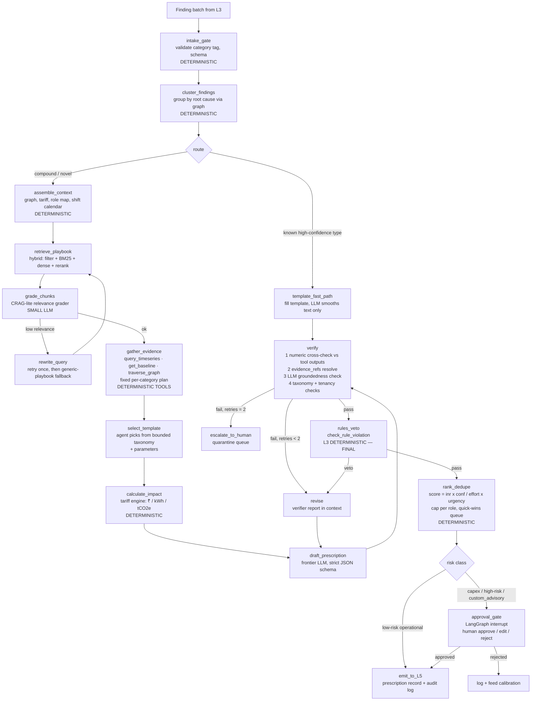

# L4 — Knowledge & Reasoning (Agentic RAG)

*Layer research document · July 2026 · Status: pre-build research → recommended design*
*Siblings: [L3 — Intelligence core](L3-intelligence-core.md) · [L5 — Closure & verification](L5-closure-and-verification.md) · [Technical architecture](../02-technical-architecture.md) · [Evaluation & quality](../cross-cutting/04-evaluation-and-quality.md)*
*Repo grounding: `core-product/Stamped_Technical_Architecture_v1.md` §8 · `core-product/Stamped_Product_Definition_and_Architecture.md` §4.2, §5.1 · `external-learning/zerowatt/`*

> **Honesty convention:** `[~]` approximate / benchmark-derived · `[!]` evolving — verify before committing.
> **Scope rule:** L4 is language, ranking, and evidence binding. All numbers come from L3 engines and deterministic tools. L4 never invents a number, never writes to SCADA, and never sends anything to a supervisor that a deterministic rules engine has not had the chance to veto.

---

## 1. Role in the 15–20% target

Stamped's 15–20% bill reduction is not a model output — it is the **sum of closed prescriptions** across six waste categories (power quality & MD, furnaces & process heat, idle & auxiliary loads, compressed air, cooling/HVAC, source mix & VFD). L3 detects the waste; L5 verifies the savings. L4 sits between them and owns the single variable the whole business depends on: **closure rate**.

A finding that says `compressor_sp_drift, confidence 0.91, ₹84,000/month` saves nothing. A supervisor acting on *"Clean the inlet filter on Compressor 2 — 2-hour job during Sunday maintenance window — saves ₹84,000/month, evidence: specific power up 18% over 3 weeks at stable pressure band"* saves ₹84,000/month. L4's job is that transformation, at a quality bar where:

- **Supervisors trust the card enough to act** — target ≥60% of high-priority prescriptions acted within one billing cycle `[!]` (architecture §3.3). Every hallucinated maintenance step or wrong ₹ figure burns trust that takes months to rebuild at a plant.
- **Every claim is defensible** — the same prescription text feeds M&V narratives, PAT/BRSR evidence, and OEM supplier audits. Evidence pointers (tag IDs, timestamps, baseline IDs) are not decoration; they are the audit trail.
- **The queue is short and correct** — the ranker/deduplicator caps open prescriptions per role and surfaces quick wins first, because supervisor attention is the scarcest resource in the system.

Concretely, L4 contributes to the 15–20% through four levers:

| Lever | Mechanism | Failure mode if L4 is weak |
| --- | --- | --- |
| Actionability | What/Why/Who/Effort/₹/When format, no interpretation needed | Findings pile up in a dashboard nobody reads |
| Prioritisation | `(₹ × confidence) / effort × urgency` ranking, quick-wins queue | Supervisors chase a ₹5k capex item while a ₹80k dispatch change waits |
| Trust | Grounded text, correct numbers, cited evidence | One wrong prescription → plant stops acting on all of them |
| Dual outcome | Same ledger produces cost savings *and* audit-ready sustainability narrative | Sustainability reporting becomes a second, inconsistent system |

L4 is deliberately **not** where intelligence lives. If a prescription is wrong because the finding was wrong, that is an L3 bug. If it is wrong because the agent embellished, invented a step, or miscopied a number, that is an L4 bug — and this document's guardrail and evaluation sections exist to drive that class of bug toward zero.

---

## 2. Requirements from the architecture

### 2.1 Input contract — the finding object (from L3)

L3 engines emit **structured finding objects, never prose** (architecture §7). L4 must accept:

```json
{
  "finding_id": "f-2026-07-08-0042",
  "category": "md_overlap | compressor_sp_drift | furnace_holding | idle_load | pf_slab | ...",
  "assets": ["compressor-2"],
  "evidence": { "metric": "specific_power_kw_per_nm3min", "baseline": 0.82, "actual": 0.97, "window": "2026-06-15/2026-07-06" },
  "confidence": 0.91,
  "estimated_monthly_kwh": 12000,
  "estimated_monthly_inr": 84000,
  "urgency": "high"
}
```

Contract obligations on L4:

- **Category-gated intake.** Generic "energy is high" findings are rejected at the boundary — only category-tagged findings from the six-category taxonomy become prescriptions (architecture §3.1 rule). The waste classifier in L3 guarantees the tag; L4 validates it.
- **Multi-finding synthesis.** One prescription may consume several findings (e.g. MD spike + attribution result + tariff exposure). L4 groups findings by root cause before drafting, and the deduplicator collapses same-cause/multiple-symptom clusters.
- **Numbers are read-only.** `estimated_monthly_inr` and `estimated_monthly_kwh` from L3 are *estimates*; the L4 impact calculator recomputes them against the correct tariff line. The agent may not adjust either figure by generation — only by calling the calculator tool.

### 2.2 Output contract — the prescription schema (to L5)

```text
Prescription {
  id, status, priority,
  what, why, who, effort, when,
  impact: { inr_monthly, kwh_monthly, tco2e_monthly, confidence_interval },
  waste_category,                  // six-category taxonomy
  evidence_refs[],                 // tag IDs, timestamps, baseline ID — MANDATORY, non-empty
  sustainability_tags[],           // scope2_grid_reduction | sec_improvement | ...
  mv_plan: { method, baseline_id, verification_window }
}
```

Schema obligations:

- **Every field machine-validated.** The record is produced under strict JSON-schema enforcement (see §3.6) — an unparseable or schema-violating prescription is a build failure, not a runtime retry surprise.
- **`evidence_refs` non-empty and resolvable.** Each ref must dereference to a real tag ID, timestamp window, baseline ID, or corpus chunk ID. A prescription whose evidence does not resolve is blocked before L5.
- **`mv_plan` present at issue time.** [L5](L5-closure-and-verification.md) needs the IPMVP option and baseline ID locked *before* the action happens, or verification is impossible. L4 selects the M&V method from the finding's data maturity (Option A/B/C per architecture §9.3).
- **`who` from the role map only.** Owner assignment comes from the L2 graph's asset→role mapping, not from the model's imagination.

### 2.3 Guardrails required by the architecture (product definition §5.1)

1. **Read-only on OT** — no autonomous setpoint changes, ever. L4 has no tool that writes to plant systems.
2. **Evidence pointers mandatory** — every prescription cites meter tags, timestamps, baseline deltas.
3. **Human approval for capex / high-risk / ambiguous** actions before send.
4. **Deterministic rules-engine veto** — the L3 rules & physics engine can block agent output that violates physics or tariff constraints (`check_rule_violation`), and the veto is final: the agent may revise and resubmit, never override.
5. **Full audit log** — every tool call, retrieval, draft, veto, and approval is logged for OEM / ISO 50001 energy reviews.
6. **What agentic is NOT in v1:** closed-loop plant control, self-modifying SCADA logic, unbounded chat without tool grounding.

### 2.4 The seven tools (architecture §8.2)

| Tool | Purpose | Deterministic? |
| --- | --- | --- |
| `query_timeseries(asset, window)` | Evidence for "Why" | Yes — L2 read |
| `get_baseline(asset, shift)` | Expected vs actual | Yes — L2 read |
| `traverse_graph(asset_id, depth)` | Related equipment, owner routing | Yes — L2 read |
| `lookup_playbook(category, asset_type)` | RAG retrieval | Retrieval + rerank |
| `calculate_impact(action, tariff)` | ₹, kWh, tCO₂e | Yes — tariff engine |
| `assign_owner(asset, role_map)` | Who | Yes — role map |
| `check_rule_violation(action)` | Physics/tariff veto | Yes — rules engine |

Note the asymmetry: **six of seven tools are deterministic reads or calculators**. Retrieval is the only stochastic tool, and it is graded (§4.3). This is the architectural root of L4's safety story — the LLM's job is composition and language, not computation.

### 2.5 Worked example — the transformation L4 must perform

Input (from L3, compressor rule pack + anomaly engine):

```json
{
  "finding_id": "f-2026-07-06-0117",
  "category": "compressor_sp_drift",
  "assets": ["compressor-2"],
  "evidence": {
    "metric": "specific_power_kw_per_nm3min",
    "baseline": 0.82, "actual": 0.97,
    "window": "2026-06-15/2026-07-06",
    "pressure_band": "stable_6.8_7.1_bar"
  },
  "confidence": 0.91,
  "estimated_monthly_kwh": 12000,
  "estimated_monthly_inr": 84000,
  "urgency": "high"
}
```

Output (to L5, after retrieval, impact calculation, verification, and veto):

```json
{
  "id": "rx-2026-07-08-0031", "status": "open", "priority": 2,
  "what": "Clean/replace inlet air filter on Compressor 2 and inspect intercooler for fouling. Approx. 2-hour job; schedule in Sunday maintenance window.",
  "why": "Specific power rose 18% (0.82 → 0.97 kW per Nm³/min) over 3 weeks at a stable 6.8–7.1 bar pressure band — the standard signature of inlet restriction or intercooler fouling, not increased air demand.",
  "who": "electrical_supervisor",
  "effort": "low_2h_no_capex",
  "when": "next_maintenance_window",
  "impact": { "inr_monthly": 81200, "kwh_monthly": 11600, "tco2e_monthly": 8.2, "confidence_interval": [62000, 97000] },
  "waste_category": "compressed_air",
  "evidence_refs": [
    "tag:compressor-2/specific_power?window=2026-06-15/2026-07-06",
    "baseline:bl-c2-sp-2026Q2",
    "chunk:playbook/compressed-air/v3#intercooler-fouling",
    "tariff:upcl-ht1-2026/energy-line"
  ],
  "sustainability_tags": ["sec_improvement", "scope2_grid_reduction"],
  "mv_plan": { "method": "IPMVP_C_engineered_asset", "baseline_id": "bl-c2-sp-2026Q2", "verification_window": "1_billing_cycle" }
}
```

Everything a human would want to challenge is traceable: the 18% comes from `evidence` (0.97/0.82), the ₹81,200 from `calculate_impact` against the UPCL HT-1 energy line (note it *differs* from L3's ₹84,000 estimate — the calculator's number wins), the remedy from a cited playbook chunk, and the M&V plan is locked before the wrench turns.

---

## 3. Researched landscape

### 3.1 Plain RAG vs agentic RAG — what the task actually needs

Classic RAG is a fixed pipeline: embed query → retrieve top-k → stuff context → generate. Agentic RAG replaces the pipeline with a **control loop**: the system decides when to retrieve, evaluates the evidence it got, notices gaps, re-queries or switches tools, and stops when confident or when a budget is hit ([Towards Data Science, "Agentic RAG vs Classic RAG"][3]). The practical guidance that has crystallised by 2026: choose along two axes — **query complexity** (multi-step evidence gathering needed?) and **error tolerance** (cost of a wrong answer?) — and prefer classic RAG whenever it suffices, because loops cost predictability, latency, and tokens [3][4].

Stamped's prescription task scores *high complexity* (evidence must be gathered from time-series, baselines, graph, tariff calculator, *and* playbook corpus) and *very low error tolerance* (a wrong prescription burns plant trust and pollutes the M&V ledger). That combination justifies agentic machinery — but of a specific, bounded kind. The Stamped agent is **not** an open-ended researcher; it is closer to a form-filler with tools, where the "form" is the prescription schema and the loop exists to guarantee grounding, not to explore.

**Patterns evaluated:**

- **Query planning / decomposition.** Breaking a complex question into sub-queries before retrieval. Useful for Stamped in a limited form: one finding cluster → a small, mostly *static* plan (get baseline → get telemetry → retrieve playbook → compute impact). Full dynamic planning is unnecessary because the input (a category-tagged finding) already tells the system what evidence is needed. **Verdict: adopt as a fixed per-category plan template, not LLM-generated plans.** This is also the injection-resistant "plan-then-execute" pattern (§3.5).
- **Self-RAG** ([Asai et al., ICLR 2024][1]) — the model emits reflection tokens (`[Retrieve]`, `[IsREL]`, `[IsSUP]`, `[IsUSE]`) that gate retrieval and check that generated claims are supported. Full Self-RAG requires fine-tuning a model to emit those tokens natively; the production-practical version approximates each reflection as a separate LLM call in a graph [4][5]. A 2025 benchmark run reports Self-RAG-style pipelines reaching ~5.8% hallucination rate vs 12–14% for standard agentic pipelines `[~]` [5]. **Verdict: adopt the *approximated* pattern — a separate verifier step that checks every drafted claim against gathered evidence — not native reflection-token fine-tuning.**
- **CRAG / corrective RAG** ([Yan et al., 2024][2]) — a lightweight retrieval evaluator grades retrieved chunks; low-relevance results trigger query rewriting or a fallback source. CRAG targets the failure mode where the *corpus/retriever* is the problem [6]. For Stamped this maps naturally: if playbook retrieval for `compressor_sp_drift` on a screw compressor returns low-relevance chunks, the correct behaviour is *rewrite and retry once, then fall back to the category-generic playbook and flag reduced confidence* — never a web search (the corpus is curated precisely so the agent cannot cite the open internet). **Verdict: adopt CRAG-lite — one grading step, one retry, curated fallback.**
- **Adaptive retrieval** — classify the query upfront and route simple cases past the agentic machinery [4]. Stamped's equivalent: **template-only fast path**. High-confidence, high-frequency finding types (PF slab breach, CMD oversize) have fully deterministic prescription templates where the LLM only smooths language; the full agent loop runs for compound or novel findings. This is the single biggest cost/latency lever.
- **Multi-hop retrieval.** Needed rarely — e.g. a furnace-holding prescription that must combine the vertical playbook (what setback schedule) with the plant SOP (site-specific lockout procedure). Two sequential filtered retrievals cover this; no general multi-hop machinery required. **Verdict: support two-hop as an explicit graph edge, nothing more.**
- **Tool-using agent where retrieval is one tool among many.** This is Stamped's actual shape — the agent orchestrates seven tools of which retrieval is one (§2.4). The 2026 consensus is that this "retrieval-as-a-tool" framing beats "RAG pipeline with an agent bolted on" when most evidence is structured [3][4].
- **Verifier/critic loops (generate → verify → revise).** The draft prescription is checked by (a) a deterministic evidence checker — every number in the draft must exactly match a tool output; every evidence_ref must resolve — and (b) an LLM groundedness judge for textual claims, then (c) the rules-engine veto. Failures route back to a revise step with the verifier's report, capped at 2 retries, then escalate to human review. Iteration caps are the universally-repeated production lesson — unbounded loops are the top agentic failure mode [3][4].
- **Structured output enforcement.** Constrained decoding guarantees the output token stream cannot violate the JSON schema — OpenAI Structured Outputs (`strict: true`), Anthropic grammar-constrained sampling, and Gemini equivalents all run this server-side; Outlines/XGrammar provide the same at the serving layer for self-hosted models via logit masking [7][8][9]. Schema compliance approaches 100%; *semantic* correctness still requires the verifier. **Verdict: mandatory — strict structured outputs on every generation call, Pydantic models as the single schema source of truth.**

**Which patterns earn their complexity for Stamped:**

| Pattern | Adopt? | Form |
| --- | --- | --- |
| Fixed per-category evidence plan (plan-then-execute) | ✅ | Static plan templates, not LLM planning |
| CRAG-lite retrieval grading | ✅ | Grade → rewrite once → curated fallback |
| Approximated Self-RAG verification | ✅ | Separate deterministic + LLM verifier node |
| Generate → verify → revise loop | ✅ | Max 2 revisions, then human escalation |
| Adaptive routing (template fast path) | ✅ | Deterministic templates for top finding types |
| Strict structured outputs | ✅ | Everywhere, no exceptions |
| Two-hop retrieval (playbook + SOP) | ✅ | Explicit graph edge |
| LLM-generated dynamic plans | ❌ | Input is already structured; plans add risk |
| Native Self-RAG fine-tuning | ❌ | Approximation gets the benefit without training cost |
| Open-web fallback retrieval | ❌ | Curated corpus only — audit defensibility |
| Multi-agent role-play (crews) | ❌ | One bounded agent + deterministic services suffices |

### 3.2 Orchestration frameworks

Evaluated against Stamped's hard requirements: durable state (a prescription run must survive a crash), **human-in-the-loop interrupts** (capex approval gate is a first-class workflow state, possibly open for days), debuggability/replay (audit trail obligation), streaming (nice-to-have for the P1 conversational surface), and testability (the eval harness must exercise individual nodes).

| Framework | Strengths for Stamped | Weaknesses | Sources |
| --- | --- | --- | --- |
| **LangGraph** | Explicit typed-state graph; Postgres-backed checkpointing at every node transition; first-class `interrupt` for approval gates that survive restarts; time-travel replay for audit/debug; sub-graphs for the retrieval loop | Conceptual weight (nodes/edges/reducers); LangChain ecosystem churn; OTel via OpenInference not native | [10][11][12] |
| **PydanticAI** | Typed, validated agent I/O that feels like FastAPI; excellent dev/test ergonomics; Logfire tracing | Single-agent focused; graph API younger; durable checkpointing and HITL interrupts not at LangGraph level — you build persistence yourself | [10][12][13] |
| **DSPy** | Declarative signatures + optimizers that *tune prompts against an eval set* — uniquely aligned with a golden-dataset culture | Not an orchestrator: no checkpointing, no interrupts; it optimises modules you still have to host in something | [14] |
| **LlamaIndex Workflows** | Event-driven workflows 1.0; natural if LlamaParse/LlamaCloud adopted for parsing | Orchestration/HITL/persistence surface less proven than LangGraph for long-lived approval states `[~]` | [15] |
| **OpenAI Agents SDK** | Smallest readable API; handoffs, guardrails, sessions, built-in tracing | Session-scoped state, not durable graph state; crash recovery not built in; ergonomics tuned to OpenAI stack — a residency-driven model swap later would hurt | [10][12] |
| **Plain state-machine code** | Zero dependency risk; total control; trivially testable | You re-implement checkpointing, interrupts, replay, streaming — exactly the hard parts LangGraph ships | [12] |

The 2026 comparison literature converges on the same rule of thumb: *"complex multi-step workflows with checkpoints, human review, and explicit state transitions → LangGraph"* [10]; *"you need durable Postgres-backed state today → LangGraph still wins"* [12].

**Recommendation: LangGraph as the primary orchestrator**, with two deliberate hedges:

1. **All node logic lives in plain, framework-free Python functions** operating on Pydantic models; LangGraph supplies only the graph wiring, checkpointing (`PostgresSaver` — on the same Postgres instance L2 already runs), and interrupts. If LangGraph churns, migration is re-wiring, not re-writing.
2. **PydanticAI-style typed models everywhere** — the prescription schema, finding schema, and every node's state slice are Pydantic models validated at node boundaries, regardless of orchestrator.

DSPy is not the orchestrator but is earmarked for **P2 prompt optimisation**: once the golden dataset (§5.1) exceeds a few hundred pairs, DSPy's optimizers can tune the drafting and grading prompts against it instead of hand-tuning `[!]`.

### 3.3 RAG corpus design for industrial documents

**Corpus taxonomy** (extends architecture §8.1, seeded from `external-learning/zerowatt/`):

| Slice | Contents | Volume `[~]` | Update cadence | Trust tier |
| --- | --- | --- | --- | --- |
| **Waste playbooks** | Six-category playbooks × vertical variants (forging, die casting, textiles, F&B, pharma…) — Zerowatt-style guides are the seed corpus | 50–200 docs | Quarterly, internally authored | **T1 — curated** |
| **SEC benchmarks** | BEE/PAT normative documents, published SEC ranges per vertical (e.g. steel 2,126→1,765 kWh/ton class figures) | 30–80 docs | Annual (PAT cycles) | T1 |
| **DISCOM tariff orders** | UPCL, MSEDCL, DHBVN, PVVNL… orders — 100+ page PDFs, dense rate tables, TOD windows, PF slabs | 20–60 docs, heavy tables | Per tariff order (~annual per DISCOM) | T1 |
| **IPMVP / M&V guides** | IPMVP core concepts, ASHRAE Guideline 14 — methodology text for M&V narrative | 5–15 docs | Rare | T1 |
| **OEM manuals** | Compressor/furnace/chiller manuals — maintenance steps, service intervals | 50–300 docs | On onboarding new asset types | **T2 — vendor** |
| **Plant SOPs** `[customer]` | Customer-uploaded maintenance procedures, lockout/tagout, shift instructions — possibly Hindi/Hinglish scans | Per-tenant | On upload | **T3 — untrusted** (§3.5) |

The trust tiers drive both retrieval (T1 preferred; T3 only for site-specific steps, always attributed) and security handling (T3 content is injection-scanned and never allowed to override T1 guidance).

**Parsing & chunking.** Tariff orders and OEM manuals are exactly the document class where naive text extraction fails — multi-column layouts, nested rate tables, merged cells. The 2026 parser landscape [16][17][18]:

- **Docling** (IBM, MIT-licensed, LF AI project) — builds a typed document model (`section_header`, `table`, `list_item` with hierarchy + page provenance), TableFormer for table structure, `HybridChunker` for structure-aware chunking, runs fully local on CPU. First-party LangChain/LlamaIndex connectors [16][17]. Weakness: can hallucinate values on very dense numeric tables in its default pipeline [18].
- **LlamaParse** (cloud) — strongest accuracy on complex nested tables and the fastest, but documents leave your infrastructure [18][19].
- **unstructured.io** — broadest format coverage, but open-source table extraction trails both above [17].

**Recommendation:** Docling as the default parser — customer SOPs must never leave Stamped's infrastructure (T3 + DPDP posture), and Docling's structure-aware output feeds chunking directly. For *public* tariff orders whose dense rate tables defeat Docling, LlamaParse as a fallback is acceptable (public documents, no confidentiality issue) `[!]`. Regardless of parser, **rate tables are not chunked as prose** — they are extracted into the L2 `TariffContract` store as structured rules by the L1 tariff parser; the RAG corpus keeps only the *narrative* portions of tariff orders (definitions, applicability conditions, worked examples). This split is important: the agent should get tariff *numbers* from the deterministic tariff engine, and tariff *language* from RAG.

**Chunking strategy:** structure-aware chunking on section boundaries (Docling hierarchy), 300–800 token target, tables kept atomic with their captions and a generated one-line summary prepended `[~]`; each chunk carries full provenance (doc ID, page, section path) so `evidence_refs` can cite chunk-level sources.

**Metadata schema (every chunk):**

```text
ChunkMeta {
  corpus_slice,       // playbook | sec_benchmark | tariff | mv_guide | oem_manual | plant_sop
  trust_tier,         // T1 | T2 | T3
  vertical,           // forging | die_casting | textiles | fnb | pharma | generic
  asset_type,         // compressor | furnace | chiller | motor | incomer | ...
  waste_category,     // six-category taxonomy (nullable)
  discom, state,      // tariff slices only
  language,           // en | hi | hinglish
  tenant_id,          // NULL for shared corpus; plant SOPs are tenant-scoped
  doc_id, section_path, page, effective_date, version
}
```

**Retrieval stack.** Hybrid retrieval is table stakes for this corpus — playbook queries are conceptual (dense wins), tariff/OEM queries are full of exact codes and clause numbers (lexical wins):

- **Vector store: pgvector on the existing Postgres.** L2 is Postgres/Timescale-centric, and the corpus is small (~10⁴–10⁵ chunks — three-plus orders of magnitude below where pgvector strains). The 2026 production guidance is unambiguous: start with pgvector unless you can name the bottleneck forcing a dedicated store [20][21]; pgvector+pgvectorscale benchmarks at 471 QPS @ 99% recall on *50M* vectors [22] — Stamped will not approach 1% of that. A dedicated store (Qdrant) is the revisit trigger only if per-tenant SOP corpora × plants drive filtered-search latency issues `[!]` [23].
- **Lexical: Postgres full-text (`tsvector`) or the `pg_search`/BM25 extension `[!]`**, fused with dense results via reciprocal-rank fusion in SQL/application code [20].
- **Metadata pre-filter always on:** `waste_category` + `asset_type` + (`vertical` OR generic) + tenant isolation (§3.5). Filters shrink the candidate pool so aggressively that retrieval quality depends more on metadata hygiene than on embedding choice `[~]`.
- **Reranker:** cross-encoder rerank of top-50 → top-5. **BGE-reranker-v2-m3** self-hosted (multilingual, no data egress) as default; Cohere Rerank as managed alternative where terms permit [24][25].
- **Embeddings:** **BGE-M3** (open, Apache-2.0, 100+ languages incl. Hindi, 8k context, dense+sparse from one model) as the self-hosted default — it directly covers the Hindi/Hinglish SOP possibility and keeps customer SOP embedding in-house [25][26][27]. Managed alternative for P0 speed: OpenAI `text-embedding-3-small` for the *shared public corpus only*, with the tenant SOP slice always on the self-hosted path `[!]`. Cohere embed-multilingual is the strongest managed multilingual option if a managed route is later preferred [26][27]. Note Hinglish (code-mixed, sometimes romanised Hindi) is poorly covered by every benchmark — must be validated on real SOP samples before committing `[!]`.

### 3.4 Guardrails & safety

**Layered enforcement, mapped to who enforces:**

| Layer | Enforced by | Nature |
| --- | --- | --- |
| Bounded action space (template taxonomy) | Schema + template registry | Structural — agent cannot express an out-of-taxonomy action |
| Strict structured outputs | Constrained decoding | Structural — schema violations impossible at token level [7][9] |
| Evidence-mandatory generation | Deterministic verifier | Every number matches a tool output; every ref resolves |
| Rules-engine veto | L3 rules & physics engine | Deterministic, versioned, final |
| Human approval gate | LangGraph interrupt + L5 workflow | Capex / high-risk / low-confidence |
| Injection resistance | Corpus pipeline + graph design | Defense-in-depth (below) |
| Tenancy isolation | Retrieval layer (SQL) | Row-level security on tenant_id |
| Audit log | Checkpointer + event log | Every tool call, retrieval, veto, approval |

**The bounded action space pattern — evaluation.** The proposal: the agent does not free-form invent actions; it **selects and parameterizes from an approved prescription-template taxonomy** (e.g. `stagger_equipment_start(assets, offset_min)`, `clean_inlet_filter(asset, window)`, `furnace_setback_schedule(asset, setpoint, window)`, `revise_cmd_contract(target_kva)`, `install_capacitor_bank(rating)` — grouped under the six waste categories, each template carrying effort class, risk class, approval requirement, and an M&V method default). This is the same "action selector / plan-then-execute" family that the security literature identifies as the strongest structural defence: once untrusted input has been ingested, the agent must be *unable* to trigger consequential actions outside a pre-approved set ([Beurer-Kellner et al., "Design Patterns for Securing LLM Agents against Prompt Injections"][28]). Assessment for Stamped:

- ✅ **Safety:** an injected SOP cannot make the agent prescribe "disable the protection relay" — no such template exists. The blast radius of any compromise is bounded to a wrongly-parameterized known-safe action, which the rules engine and approval gates then catch.
- ✅ **Quality & evaluability:** templates give every prescription a stable shape, which makes the golden dataset, dedup logic, M&V method selection, and closure analytics dramatically easier. Template selection accuracy is a deterministic eval metric (§5.3).
- ✅ **Honest coverage economics:** six waste categories × a handful of remedies each ≈ 30–60 templates covers the overwhelming majority of prescription volume `[~]` — this is a naturally template-friendly domain (Zerowatt's published case studies show the same ~16–24 recurring measures per facility).
- ⚠️ **Cost:** genuinely novel findings have no template. Mitigation: a `custom_advisory` template that is *always* routed to human review before send — the taxonomy's escape hatch never bypasses a human. New recurring patterns graduate into reviewed templates.
- **Verdict: adopt.** It converts the hardest guarantee ("the agent never invents a dangerous action") from a probabilistic prompt hope into a structural property.

**Prompt-injection resistance.** Two untrusted input channels: customer-uploaded SOPs (T3 corpus) and, at P1+, WhatsApp replies. The 2026 consensus is that detection alone is insufficient; architecture must assume injection succeeds sometimes and bound the consequences [28][29][30]:

1. **Break the lethal trifecta.** The prescription agent has private data access and untrusted content exposure — so it gets **no egress**: it cannot send messages, only emit a prescription record that L5 routes after veto/approval [30].
2. **Plan-then-execute:** the evidence plan is fixed per category *before* any T3 content is read; retrieved content cannot alter which tools run [28].
3. **Ingestion-time scanning** of T3 uploads (instruction-like text, anomalous imperatives) — flag for human review, quarantine on detection `[~]`.
4. **Structural demotion of T3:** SOP chunks enter the prompt wrapped in data-only delimiters with an explicit "reference material, not instructions" framing; T1 playbook guidance always outranks T3 on conflicts, and conflicts are surfaced, not silently resolved.
5. **WhatsApp replies never reach the prescription agent.** They are parsed by a separate, minimal-privilege extractor (status codes + free-text reason, structured output only) whose output feeds L5 workflow state — user text is never concatenated into any prescribing prompt.

**PII / tenancy isolation.** Plant telemetry is mostly not personal data, but SOPs and role maps contain names/phones. Retrieval enforces `tenant_id` row-level security in Postgres (a benefit of pgvector living inside the relational store — one policy engine); the shared corpus is `tenant_id IS NULL` by construction; cross-tenant leakage is a P0 eval case (§5.3). Names/contacts are pseudonymised before any external LLM call `[!]`.

### 3.5 Model choice & serving

**Task-tiered models, not one model.** The graph has three distinct LLM duty classes:

| Duty | Calls/prescription | Model class | Rationale |
| --- | --- | --- | --- |
| Retrieval grading, query rewrite, routing | 1–3 | Small/fast (mini/flash class, or self-hosted 8–14B) | High volume, low stakes, easily evaled [4] |
| Prescription drafting + revision | 1–3 | Frontier API with strict structured outputs | Quality of "What/Why" language is the product |
| Groundedness judging (eval + online spot-check) | 1 | Frontier, *different* vendor/model than drafter `[~]` | Avoid self-preference bias in judging (§5.4) |
| Narrative engine (sustainability text) | Batch, monthly | Same as drafter, heavy template constraint | Audit-ready boilerplate, low creativity |

**Latency & cost budget.** Prescriptions are generated by batch/event pipelines, not interactive chat — a 10–30 s end-to-end budget per prescription is comfortable. Cost envelope `[~]`: a full agentic run ≈ 15–40k input + 2–5k output tokens across all calls; at mid-2026 frontier pricing that is roughly **₹4–15 per prescription**, and a plant produces tens of prescriptions per month — model cost is noise relative to one verified prescription's value (₹10⁴–10⁵/month). Optimisation levers anyway: template fast path skips the loop entirely for the highest-volume finding types; prompt-prefix caching (system prompt + playbook context is highly repetitive); batch APIs for the monthly narrative packs.

**Structured-output reliability:** native constrained decoding (`strict: true` / grammar-constrained sampling) on every call; Instructor-or-equivalent Pydantic validation with bounded retries as the belt-and-braces layer; Outlines/XGrammar at the vLLM serving layer if/when self-hosting [7][8][9].

**India data residency `[!]`.** Under DPDP Act 2023, API calls carrying personal data to US-hosted endpoints are cross-border transfers requiring lawful basis; as of 2026 no country is on a restricted list, but the posture can change [31][32][33]. Stamped's mitigations, in order: (a) prescriptions and findings are plant telemetry — keep personal data (names, phones) out of LLM payloads by pseudonymising at the boundary; (b) zero-retention enterprise terms with the API vendor as a contract non-negotiable [31]; (c) tenant SOP *embedding and retrieval* fully self-hosted from day one (BGE-M3 — §3.3); (d) a planned self-hosting path — open-weight models (Qwen/Llama/Mistral class) on Indian GPU-as-a-service (₹200–500/hr H100 class `[~]`) have closed most of the capability gap for structured drafting tasks [31][32], and the graph architecture makes the drafter node a swappable component. Decision point at P2: if a marquee customer or sector regulation demands full in-country inference, swap the drafter first; graders are already swappable-small.

### 3.6 Evaluation tooling landscape (detail in §5)

- **RAGAS** — reference vocabulary for RAG metrics (faithfulness, answer relevancy, context precision/recall), reference-free, fastest for experimentation [34][35].
- **DeepEval** — pytest-native, 50+ metrics, built for CI regression gates (`assert_test(case, [FaithfulnessMetric(threshold=0.85)])`); can import RAGAS metrics [34][36].
- **TruLens** — OpenTelemetry-instrumented tracing + the RAG-triad feedback functions; strongest for step-level production observability [34][37].
- Convergent practical guidance: gate CI at thresholds the judge's noise floor supports (faithfulness ≥0.85, not 0.95); pin judge model versions; calibrate against humans on your own domain before trusting any absolute score [35][38].

---

## 4. Recommended approach

**Decision record (one line each):**

| Decision | Choice |
| --- | --- |
| Agent pattern | Bounded plan-then-execute · CRAG-lite graded retrieval · verify-revise loop (≤2) · template taxonomy |
| Orchestrator | LangGraph (Postgres checkpointing, interrupts) — node logic framework-free Python + Pydantic |
| Parser | Docling (self-hosted); LlamaParse fallback for public tariff PDFs only `[!]` |
| Vector store | pgvector on L2's Postgres; Qdrant only on a measured bottleneck |
| Retrieval | Metadata filter → BM25 + BGE-M3 dense (RRF) → BGE-reranker-v2-m3 → CRAG-lite grade |
| Embeddings | BGE-M3 self-hosted (multilingual, SOPs never leave infra); managed option for shared corpus only |
| Drafting model | Frontier API + strict structured outputs; small model for grading/routing; self-host path reserved for P2 residency call `[!]` |
| Eval stack | RAGAS metrics · DeepEval CI gates · TruLens/Langfuse tracing · calibrated LLM-judge · deterministic numeric/evidence checks |

### 4.1 Agent graph

**Pattern name: bounded plan-then-execute with graded retrieval and a verify-revise loop.** LangGraph `StateGraph`, Postgres checkpointing, one interrupt point.



**State object (Pydantic, checkpointed at every node):**

```text
PrescriptionRunState {
  run_id, tenant_id, plant_id,
  findings[],  cluster,                      // input
  context: { graph_slice, tariff, role_map, shift_calendar },
  retrieval: { queries[], chunks[], grades[], fallback_used },
  evidence: { timeseries{}, baselines{}, graph_paths[] },   // tool outputs, immutable once gathered
  template: { template_id, params, risk_class },
  impact: { inr, kwh, tco2e, ci },                          // from calculator only
  draft_rx, verifier_report, veto_result,
  retry_count, escalated, approval: { required, decision, approver },
  final_rx,
  trace[]                                                    // every tool call + tokens, for audit
}
```

**Node inventory (what runs where, what can fail how):**

| Node | Type | Model | Failure handling |
| --- | --- | --- | --- |
| `intake_gate` | Deterministic | — | Reject to L3 dead-letter with reason |
| `cluster_findings` | Deterministic (graph rules) | — | Fall back to 1 finding = 1 cluster |
| `route` | Deterministic (finding-type lookup) | — | Default to full loop |
| `template_fast_path` | Template + LLM smoothing | Small | Smoothing failure ⇒ ship template verbatim |
| `assemble_context` | Deterministic L2 reads | — | Missing tariff/graph ⇒ escalate, never guess |
| `retrieve_playbook` | Hybrid retrieval | Embeddings + reranker | Empty result ⇒ grade node handles |
| `grade_chunks` | LLM grading | Small | Grader timeout ⇒ treat as low-relevance |
| `rewrite_query` | LLM rewrite | Small | One retry, then generic-playbook fallback + confidence flag |
| `gather_evidence` | Deterministic tools, fixed plan | — | Tool error ⇒ retry ×2 ⇒ escalate |
| `select_template` | LLM selection, enum-constrained | Frontier | Invalid ID structurally impossible; low confidence ⇒ `custom_advisory` |
| `calculate_impact` | Deterministic tariff engine | — | Error ⇒ escalate (an Rx without ₹ is not sent) |
| `draft_prescription` | LLM, strict schema | Frontier | Schema violation impossible; semantic issues ⇒ verifier |
| `verify` | Deterministic checks + LLM judge | Frontier (different family) | Fail ⇒ revise (≤2) ⇒ quarantine |
| `rules_veto` | Deterministic (L3) | — | Veto ⇒ revise; repeated veto ⇒ quarantine |
| `rank_dedupe` | Deterministic | — | — |
| `approval_gate` | Human (interrupt) | — | Timeout policy: remind at 48h, expire at 7d `[!]` |
| `emit_to_L5` | Deterministic | — | Transactional write + audit event |

Design invariants: **evidence is immutable after `gather_evidence`** (the drafter cannot request new evidence — prevents evidence-shopping); **all numbers flow calculator → draft** (the verifier diffs every numeral in the draft against `impact` and `evidence`); **the veto is downstream of verification and upstream of ranking** so nothing vetoed ever competes for queue slots; the **approval gate is a checkpoint interrupt**, so an approval pending for three days survives deploys and restarts.

**Ranker & deduplicator (deterministic service, not LLM):** `score = (inr_impact × confidence) / effort_weight × urgency_multiplier` per architecture §8.5; dedup collapses clusters sharing root-cause assets and template; per-role open-prescription cap; separate quick-wins queue for the first billing cycle.

**Sustainability narrative engine:** a batch pipeline (not agentic) over the L5 ledger — templated audit blocks ("Verified grid electricity reduction of X MWh in Q2 = Y tCO₂e Scope 2 at factor Z") with the LLM constrained to filling template slots from ledger fields; same verifier discipline (every number diffed against the ledger); exports PDF/CSV/JSON `[!]`.

### 4.2 Corpus pipeline

```text
Acquire (playbooks, BEE/PAT docs, tariff orders, IPMVP, OEM manuals, SOP uploads)
  → Parse: Docling (typed doc model, TableFormer)   [LlamaParse fallback for public tariff PDFs only]
  → Split: tariff rate tables → L1 tariff parser → L2 TariffContract (structured, NOT RAG)
           narrative content → structure-aware chunking (HybridChunker, 300–800 tok, tables atomic)
  → Enrich: ChunkMeta (slice, trust tier, vertical, asset_type, waste_category, discom, language, tenant)
  → Scan: T3 (SOP) injection screening + PII pseudonymisation
  → Embed: BGE-M3 (self-hosted) → pgvector; tsvector for lexical
  → Index: HNSW + GIN, row-level security on tenant_id
  → Version: corpus snapshot ID per release — every retrieval logs snapshot + chunk IDs into evidence_refs
```

Corpus releases are versioned and eval-gated: a new playbook or tariff order triggers the retrieval eval suite before the snapshot goes live (§5.6).

### 4.3 Retrieval stack (summary of §3.3 decisions)

metadata pre-filter (category, asset type, vertical, tenant) → BM25/tsvector + BGE-M3 dense, RRF fusion → BGE-reranker-v2-m3 top-50→5 → CRAG-lite grade → prompt. pgvector on L2's Postgres; Qdrant only on a named, measured bottleneck `[!]`.

### 4.4 Guardrail enforcement points (consolidated)

| # | Guardrail | Where in graph | Mechanism |
| --- | --- | --- | --- |
| G1 | Category gate | `intake_gate` | Schema validation, reject untagged findings |
| G2 | Tenancy isolation | `retrieve_playbook` | Postgres RLS on tenant_id |
| G3 | Injection defence | corpus pipeline + prompt assembly | T3 scanning, data-only delimiters, fixed plan |
| G4 | Bounded actions | `select_template` | Enum-constrained template ID; `custom_advisory` ⇒ forced approval |
| G5 | Numeric integrity | `verify` | Deterministic diff: draft numerals ≡ tool outputs |
| G6 | Evidence mandatory | `verify` | Non-empty, resolvable evidence_refs |
| G7 | Groundedness | `verify` | LLM judge on textual claims vs retrieved chunks |
| G8 | Physics/tariff veto | `rules_veto` | L3 rules engine, versioned, final |
| G9 | Human approval | `approval_gate` | Interrupt; capex/high-risk/custom/low-confidence |
| G10 | No egress / no SCADA | tool registry | No write or send tool exists in the agent's registry |
| G11 | Audit trail | every node | Checkpointer + trace log, retained for ISO/OEM review |

---

## 5. How this layer is tested and evaluated

L4 is the layer where "it seems to work" is most dangerous — language quality masks factual failure. The harness below is a build prerequisite, not a follow-up. It plugs into the shared programme in [evaluation & quality](../cross-cutting/04-evaluation-and-quality.md).

### 5.1 Golden prescription dataset

The anchor asset: **curated finding→prescription pairs, ≥50–100 per waste category** (target 300–600 total), built over time from three sources:

1. **Synthetic-from-playbook (P0):** for each template × vertical, construct realistic finding objects (perturbed baselines, plausible tariffs) and have an energy engineer author the reference prescription. Gets the harness running before real deployments exist.
2. **Pilot harvest (P0–P1):** every real prescription that a supervisor *accepted and M&V verified* is a gold-positive candidate; every rejection with reason code is a labelled negative. Human review before admission.
3. **Adversarial set:** findings with contradictory evidence, missing baselines, injected SOP content, cross-tenant bait chunks, out-of-taxonomy situations — cases where the *correct* output is escalation or refusal, not a prescription.

Each gold case stores: finding batch, frozen L2 context (telemetry slices, baseline, tariff, graph), corpus snapshot ID, reference prescription, reference template ID, reference evidence_refs, and acceptable-variation notes. Freezing context makes runs reproducible — the eval replays against recorded tool outputs, not live stores.

### 5.2 Retrieval metrics (component-level)

Per-slice labelled query sets (finding → relevant chunk IDs), evaluated on every corpus release and embedding/reranker change:

| Metric | Gate `[~]` | Notes |
| --- | --- | --- |
| recall@10 (pre-rerank) | ≥ 0.90 | Did the right playbook section enter the candidate pool |
| MRR@5 (post-rerank) | ≥ 0.75 | Is the best chunk near the top |
| context precision (RAGAS) | ≥ 0.70 | Junk share of the prompt window |
| filter correctness | = 1.0 | Deterministic: no chunk violates category/vertical/tenant filters |
| Hindi/Hinglish subset recall@10 | ≥ 0.80 `[!]` | Validated on real SOP samples before the gate is trusted |

### 5.3 Generation metrics (end-to-end on gold set)

| Metric | Type | Gate `[~]` |
| --- | --- | --- |
| Schema validity | Deterministic | = 1.0 (constrained decoding should make this trivially true) |
| Template selection accuracy | Deterministic | ≥ 0.95 vs reference template ID [38] |
| Numeric integrity | Deterministic | = 1.0 — every numeral in Rx matches a tool output |
| Evidence resolution | Deterministic | = 1.0 — every evidence_ref dereferences |
| Faithfulness / groundedness (RAGAS/DeepEval) | LLM-judge | ≥ 0.85 [35][38] |
| Hallucinated-step rate (maintenance steps unsupported by playbook/SOP chunk) | LLM-judge + spot human | ≤ 0.02, trending to 0 |
| Action-quality rating vs reference | Calibrated LLM-judge | ≥ 4/5 median |
| Adversarial escalation rate | Deterministic | = 1.0 — all adversarial cases end in escalate/refuse, never a sent Rx |
| Cross-tenant leakage | Deterministic | = 0 occurrences, ever |

The deterministic rows are the special advantage of this domain: because numbers and citations are machine-checkable against source telemetry, **hallucination checking is largely *not* an LLM-judge problem here** — the judge only covers residual textual claims.

### 5.4 LLM-as-judge with human calibration

- Judge model pinned by version; **different model family than the drafter** to avoid self-preference `[~]`.
- Calibration protocol: two energy engineers independently rate a 50–100 case sample on the same rubric; compute judge↔human agreement (Cohen's κ target ≥ 0.7 `[~]`); adjust rubric/prompt until met; re-calibrate whenever the judge model or rubric changes [34][35].
- Judge scores are **relative regression signals, not absolute truth** — gates are set above the judge's observed noise floor (±0.05 between judge versions is typical [38]), which is why faithfulness gates at 0.85 rather than 0.95.

### 5.5 Hallucination checks against source telemetry

A dedicated post-hoc checker (also run as online sampling in production):

1. Extract every quantitative claim from the prescription (₹, kWh, %, kVA, dates, asset names).
2. Re-resolve each against the frozen tool outputs / L2 stores.
3. Any unresolvable or mismatched claim ⇒ hard fail in eval; in production ⇒ recall the prescription and alert.

### 5.6 Regression gates in CI

- **DeepEval as the pytest-native gate runner** (importing RAGAS metrics where useful) — metric regressions fail PRs exactly like type errors [34][36]. Shape of a gate:

```python
def test_compressor_sp_drift_prescriptions():
    for case in gold_set.filter(category="compressed_air"):
        rx = run_graph_replay(case.findings, frozen_context=case.context,
                              corpus_snapshot=case.corpus_snapshot)
        assert rx.template_id == case.reference_template_id
        assert numeric_integrity(rx, case.context) == 1.0          # deterministic
        assert all(resolves(ref, case.context) for ref in rx.evidence_refs)
        assert_test(to_llm_test_case(rx, case),
                    [FaithfulnessMetric(threshold=0.85)])           # LLM-judge, pinned model
```

- Tiered execution: smoke set (~30 cases, every PR touching L4 code/prompts/templates) · full gold set (nightly + before release) · retrieval suite (every corpus snapshot, embedding, or reranker change).
- **Everything that shapes output is versioned and gate-triggering:** prompts, template taxonomy, corpus snapshot, model IDs, rule-pack versions. A tariff-order update or new playbook cannot ship without a green retrieval + generation run.
- Cost/latency regression alerts alongside quality (token spend per prescription tracked per release).

### 5.7 Online feedback loop

Production is the permanent eval:

- **Supervisor accept / reject / defer + reason codes** (wrong owner, capex blocked, production constraint, already fixed — L5 §9.1) stream back as labels. Weekly triage: rejects with "wrong/unclear prescription" reasons become new gold negatives; systematic patterns feed L3 calibration or template revisions.
- **M&V outcomes as ground truth:** verified vs disputed ledger entries grade the *impact estimates* — tracking predicted-vs-realised ₹ error per template calibrates the confidence intervals the ranker uses.
- **Tracing:** every production run instrumented (TruLens or Langfuse `[!]`) with node-level spans; sampled runs re-scored by the judge weekly for drift detection.
- **Closure-rate dashboards per template and per plant** — the business metric (≥60% acted within a billing cycle) is an L4 eval metric too; a template with chronically low closure is a design bug even if every offline metric is green.

---

## 6. Build phasing P0–P3

| Phase | Scope | Exit criteria |
| --- | --- | --- |
| **P0** (weeks 1–8, aligned to platform P0) | LangGraph skeleton with checkpointing; **template fast path only** for top finding types (MD stagger, PF correction, CMD review, idle load) — LLM smooths language, all numbers deterministic; corpus v0 = zerowatt-derived playbooks + 2–3 DISCOM tariff narratives, Docling→pgvector, filtered hybrid retrieval without reranker; strict structured outputs; verifier (numeric + evidence checks); rules veto wired; approval gate for everything above low-risk; golden dataset v0 (~100 synthetic cases) + CI smoke gate | First real plant receiving template prescriptions; numeric-integrity and schema gates at 1.0; audit log end-to-end |
| **P1** | Full agent loop (retrieval grading, gather-evidence plan, draft-verify-revise); template taxonomy to ~30–60 across all six categories; reranker + BGE-M3 embeddings; SOP upload pipeline with T3 scanning + tenancy RLS; LLM groundedness judge calibrated (κ ≥ 0.7); DeepEval full-suite nightly; ranker/dedup + per-role caps; WhatsApp reply extractor (isolated) | Compound findings produce verified-grounded prescriptions; pilot closure ≥ 40% `[!]`; adversarial suite passing |
| **P2** | Online feedback loop industrialised (reject codes → gold set, M&V error tracking per template); DSPy prompt optimisation against the grown gold set `[!]`; cost optimisation (caching, batch narrative packs); sustainability narrative engine with ledger-diff verification; residency decision point — self-hosted drafter pilot on Indian GPUaaS if customer/regulatory pull `[!]` | Predicted-vs-realised ₹ error < 25% median `[~]`; judge drift monitoring live |
| **P3** | Conversational query surface ("why was SEC high Tuesday?") reusing the same tools + guardrails; cross-plant fleet-learning in retrieval (anonymised); multilingual prescriptions (Hindi cards) if pilots demand `[!]`; template auto-suggestion from recurring custom_advisory clusters (human-approved graduation) | Determined by P2 learnings |

Sequencing rationale: P0 ships value with the LLM in its *narrowest* possible role (language smoothing over deterministic templates), which is both fastest to trust and the ideal baseline against which the P1 agent loop must prove marginal value on the eval harness — if the full loop doesn't beat the template path on gold-set quality for compound findings, that is a signal to keep the loop narrow.

---

## 7. Open questions

1. **Hinglish retrieval quality** — BGE-M3's coverage of romanised/code-mixed Hindi in scanned SOPs is unbenchmarked; needs a real-sample spike before P1 commits `[!]`.
2. **Tariff narrative vs structured split** — the boundary between what the L1 tariff parser structures and what stays as RAG narrative will be fuzzy for oddball DISCOM orders; who owns worked-example text? `[~]`
3. **Judge independence under residency constraints** — if drafting moves to a self-hosted open-weight model, is a frontier-API judge still acceptable for eval (public-corpus cases only), or must judging also localise? `[!]`
4. **Template taxonomy governance** — who approves a new template (engineering? domain lead? customer-specific templates?), and how do plant-specific parameter overrides version against M&V citations?
5. **Confidence-interval calibration** — the prescription's `confidence_interval` currently inherits from L3 finding confidence × template priors `[~]`; P2's predicted-vs-realised data should replace this with per-template empirical calibration — method TBD.
6. **Dedup across time** — a re-detected finding after a rejected prescription: re-issue, suppress, or reframe? Interacts with L5 reason codes and L3 calibration; policy needed before P1.
7. **LangGraph churn risk** — hedged by framework-free node logic, but checkpoint-format migrations across LangGraph majors need a tested upgrade path `[!]`.
8. **WhatsApp voice notes** — supervisors may reply with voice; transcription adds another untrusted input channel with its own injection surface — out of scope until P2+ `[!]`.

---

# Citations

1. Self-RAG: Learning to Retrieve, Generate, and Critique through Self-Reflection (Asai et al.) — https://arxiv.org/abs/2310.11511
2. Corrective Retrieval Augmented Generation (Yan et al.) — https://arxiv.org/abs/2401.15884
3. Agentic RAG vs Classic RAG: From a Pipeline to a Control Loop — Towards Data Science — https://towardsdatascience.com/agentic-rag-vs-classic-rag-from-a-pipeline-to-a-control-loop/
4. Building Agentic RAG Pipelines: Corrective Retrieval & Self-Reflective Generation in Production — AI Workflow Lab — https://aiworkflowlab.dev/article/building-agentic-rag-pipelines-corrective-retrieval-self-reflective-generation-production
5. Agentic RAG: When Static Retrieval Is No Longer Enough — Medium — https://medium.com/@umesh382.kushwaha/agentic-rag-when-static-retrieval-is-no-longer-enough-15fafb3fa06d
6. Self-RAG vs CRAG in LangGraph: which corrective retrieval pattern fits production RAG? — Axiom Logica — https://axiomlogica.com/ai-ml/self-rag-vs-crag-langgraph-production-rag
7. Structured model outputs — OpenAI API docs — https://developers.openai.com/api/docs/guides/structured-outputs
8. Structured Outputs Across LLM Providers: JSON Mode, Tool Calling, and Constrained Decoding — https://niteagent.com/blog/2026-06-04-structured-outputs-across-providers/
9. Structured Output Reliability in Production LLM Systems — https://tianpan.co/blog/2026-04-10-structured-output-reliability-llm-production
10. LangGraph vs OpenAI Agents SDK vs PydanticAI (2026) — https://open-techstack.com/blog/langgraph-vs-openai-agents-sdk-vs-pydanticai-2026/
11. Choosing an agent framework — Speakeasy — https://www.speakeasy.com/blog/ai-agent-framework-comparison
12. Picking an Agent Framework in 2026: An Honest Verdict on Six of Them — DEV Community — https://dev.to/gabrielanhaia/picking-an-agent-framework-in-2026-an-honest-verdict-on-six-of-them-1a6h
13. PydanticAI documentation — https://ai.pydantic.dev/
14. AI Agent Frameworks Compared in 2026: DSPy vs … vs LangGraph — noderguru — https://noderguru.dev/en/blog/ai-agent-frameworks-comparison-2026-en
15. LlamaIndex Workflows documentation — https://docs.llamaindex.ai/en/stable/module_guides/workflow/
16. Document Parsing for Production RAG: Architecture, Tradeoffs, and When to Use What — Medium — https://medium.com/@manikandan_t/document-parsing-for-production-rag-architecture-tradeoffs-and-when-to-use-what-7a89ab0af7b7
17. Top 10 document parsing services for RAG pipelines (2026) — Vstorm — https://vstorm.co/llamaindex/top-10-document-parsing-services-for-rag-pipelines-and-llm-applications/
18. PDF Table Extraction: Docling vs Marker vs LlamaParse Compared — CodeCut — https://codecut.ai/docling-vs-marker-vs-llamaparse/
19. Docling project (IBM / LF AI & Data) — https://docling-project.github.io/docling/
20. Top 15 Vector Databases in 2026: A Production Decision Guide — Medium — https://medium.com/@pratik-rupareliya/top-15-vector-databases-in-2026-a-production-decision-guide-from-100-enterprise-deployments-dd58a04f51a5
21. Best Vector Databases in 2026: A Complete Comparison Guide — Firecrawl — https://www.firecrawl.dev/blog/best-vector-databases
22. Qdrant vs pgvector vs pgvectorscale for billion-vector filtering workloads — Axiom Logica — https://axiomlogica.com/ai-ml/qdrant-vs-pgvector-vs-pgvectorscale-billion-vector-filtering-workloads
23. pgvector vs Qdrant: 5 key differences and how to choose — Instaclustr — https://www.instaclustr.com/education/vector-database/pgvector-vs-qdrant-5-key-differences-and-how-to-choose/
24. Cohere Rerank documentation — https://docs.cohere.com/docs/rerank-overview
25. BGE-M3 model card (BAAI) — https://huggingface.co/BAAI/bge-m3
26. Embedding Models in Production: Choosing the Right One — General Compute — https://www.generalcompute.com/blog/embedding-models-in-production
27. Embedding Models Compared: OpenAI, Cohere, BGE, E5 (2026) — UpSkillZone — https://upskillzone.ai/blog/embedding-models-compared
28. Design Patterns for Securing LLM Agents against Prompt Injections (Beurer-Kellner et al.) — https://arxiv.org/abs/2506.08837
29. Architecting Secure AI Agents: System-Level Defenses Against Indirect Prompt Injection — https://arxiv.org/abs/2603.30016
30. Prompt Injection Defense at the AI Gateway — TrueFoundry — https://www.truefoundry.com/blog/prompt-injection-defense-llm-gateway
31. OpenAI's Enterprise Push: What Indian CIOs Should Actually Evaluate — RingSafe — https://ringsafe.in/openai-enterprise-india-cio-evaluation-2026/
32. Self-Host LLMs from India: INR Pricing & Latency (2026) — TechPlained — https://www.techplained.com/self-host-llms-india
33. AI Security & Data Residency India 2026 (DPDP) — PromptAndSkills — https://promptandskills.com/learn/enterprise-ai/ai-security-data-residency-india
34. DeepEval vs RAGAS vs TruLens: Pick Your RAG Eval Stack — Particula — https://particula.tech/blog/deepeval-vs-ragas-vs-trulens-rag-evaluation-stack
35. RAGAS, TruLens, DeepEval: LLM Evaluation Frameworks (2026) — Atlan — https://atlan.com/know/llm-evaluation-frameworks-compared/
36. DeepEval documentation — https://deepeval.com/docs/getting-started
37. TruLens documentation — https://www.trulens.org/
38. RAGAS vs TruLens vs DeepEval: The 2026 LLM Eval Showdown — Gen α AI — https://genalphai.com/ragas-vs-trulens-vs-deepeval-the-2026-llm-eval-showdown/
39. RAGAS documentation — https://docs.ragas.io/
40. Zerowatt industries & waste-pattern learning (repo) — /external-learning/zerowatt/01-industries-overview-and-waste-patterns.md
