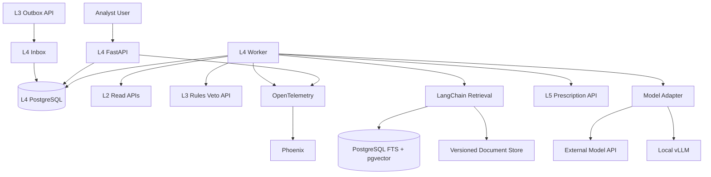
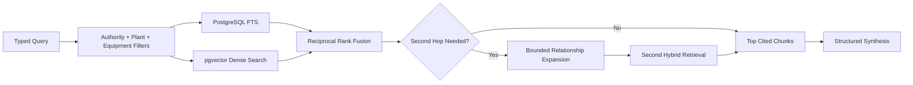

# L4 — Knowledge & Reasoning

*Architecture SSOT · July 2026 · Pilot target: **1–2 plants***
*Siblings: [L3 — Intelligence core](L3-intelligence-core.md) · [L4 decision defense](L4-decision-defense-brief.md) · [L5 — Closure & verification](L5-closure-and-verification.md) · [Technical architecture](../02-technical-architecture.md) · [Evaluation & quality](../cross-cutting/04-evaluation-and-quality.md)*
*Related decisions: [ADR-013 counterfactual ledger](../../decisions/ADR-013-counterfactual-savings-ledger.md) · [ADR-015 L3 dual lane](../../decisions/ADR-015-l3-dual-lane-lab-detections.md) · [ADR-017 retrieval trust tiers](../../decisions/ADR-017-l4-adaptive-retrieval-and-web-trust.md)*

> **Honesty convention:** `[~]` is an estimate or target; `[!]` must be validated on pilot data.
>
> **Scope rule:** L4 composes evidence into advice. It does not detect waste, own tariff arithmetic, verify realised savings, write to OT, or send an action without deterministic policy checks.

---

## 1. Executive thesis

L4 is not a free-running “society of agents.” It is a **durable, mostly deterministic prescription compiler** with four bounded surfaces:

1. **Finding → Prescription** — production-critical; zero or one normal LLM call.
2. **Conversational energy analyst** — read-only, cited, bounded to four model turns.
3. **Sustainability narrative** — ledger-backed templates with optional one-call language composition.
4. **Curated web research** — explicit, allowlisted, separately labelled; never silent evidence.

LangChain supplies model adapters, retrievers, structured output, and composable `Runnable` primitives. **Application code owns routing, state transitions, budgets, retries, permissions, and final decisions.** The prescription path does not use `AgentExecutor`, an LLM-generated plan, or an unbounded ReAct loop.

The cheapest correct path always wins:

```text
known Finding + approved action template
  → deterministic evidence + impact + owner + M&V
  → verified Prescription
  → zero LLM calls
```

An LLM is used only when language or synthesis adds measurable value.

---

## 2. Objectives and non-goals

### 2.1 Objectives

| Objective | Design response |
| --- | --- |
| Cheap for 1–2 pilot plants | Modular monolith; existing Postgres; API models by default; no always-on GPU |
| Accurate and defensible | Deterministic numbers, source-level citations, rules veto, abstention |
| Easy to showcase | Cited analyst and polished English prescriptions over the same trusted tools |
| Production-correct | Durable jobs, idempotency, DLQ, timeouts, degraded modes, audit trail |
| Provider portable | Application-owned model capability contract; external API or local vLLM |
| Evolvable without fleet machinery | Measured upgrade triggers for rerank, graph retrieval, workflow engine, dedicated vector DB |

### 2.2 Non-goals

- Hindi or Hinglish generation/retrieval
- Autonomous plant control or SCADA/PLC writes
- Automatic unrestricted web crawling
- Generic autonomous research
- Fine-tuning, custom embedding training, or local GPU procurement before benchmark evidence
- Multi-agent role-play
- Cross-plant memory or fleet learning
- Exactly-once claims across remote calls

---

## 3. Layer boundaries and contracts

### 3.1 L3 → L4

Canonical input: [`contracts/schemas/finding.json`](../../contracts/schemas/finding.json), wrapped in [`stamped-record-envelope.json`](../../contracts/schemas/stamped-record-envelope.json).

L4 consumes only L3 records where:

```text
delivery = l4 AND status = emitted
```

Suppressed, hypothesis, and shadow detections remain in the L3 Lab ([ADR-015](../../decisions/ADR-015-l3-dual-lane-lab-detections.md)).

### 3.2 L4 → L5

Canonical output: [`contracts/schemas/prescription.json`](../../contracts/schemas/prescription.json). Capex actions additionally require [`capex-proposal.json`](../../contracts/schemas/capex-proposal.json).

Every emitted Prescription must have:

- stable `id` and upstream `finding_id` / `dedupe_key`;
- approved `template_id`;
- `what`, `why`, `who`, `effort`, `when`;
- impact values produced by the deterministic calculator;
- non-empty, resolvable evidence references;
- locked M&V plan and baseline reference;
- prompt/workflow/model/corpus provenance when an LLM or retrieval was used.

### 3.3 L2 reads

L4 uses L2 HTTP APIs only. `L2_DATABASE_URL` is forbidden. L4's own workflow/corpus Postgres is a separate security principal and schema.

### 3.4 Ownership of truth

| Truth | Owner | L4 may do |
| --- | --- | --- |
| Waste detection and confidence | L3 | Consume; never silently alter |
| Telemetry / baseline / role map | L2 | Read through typed tools |
| Tariff and impact arithmetic | Deterministic calculator | Format; never calculate in prose |
| Physics / tariff safety veto | L3 rule service | Submit candidate; never override |
| Prescription language and ranking | L4 | Produce within approved taxonomy |
| Approval, execution, verified savings | L5 | Hand off with M&V plan |

---

## 4. Product surfaces

### 4.1 Prescription compiler — production-critical

Event-driven, asynchronous, durable. It converts category-tagged findings into a validated Prescription. Unknown or insufficiently supported findings are queued for human triage; they are not “creatively completed.”

### 4.2 Conversational energy analyst — bounded showcase surface

Answers questions such as:

- “Why was demand high on Tuesday?”
- “Which open opportunities have the strongest evidence?”
- “What does the OEM manual say about this compressor condition?”

The analyst is read-only and source-cited. It has:

- maximum four model turns;
- maximum six tool calls;
- maximum two retrieval hops;
- no persistent semantic memory;
- no write or dispatch tools;
- explicit abstention when evidence is missing.

Conversation history is session state, not product truth. A summary may be stored for UX, but every factual answer is rebuilt from current tools and cited evidence.

### 4.3 Sustainability narrative — deterministic-first

Inputs are L5 ledger rows, emission-factor records, and approved methodology text. Numeric statements are rendered from templates. An optional single LLM call may improve English flow; a numeric-diff verifier must pass before export.

### 4.4 Curated web research — explicit fallback

Web research is a separate route for freshness or missing public material. It is never an invisible extension of internal RAG.

- allowlisted official sources first: BEE, CEA, Ministry of Power, DISCOM, OEM;
- one search pass and bounded result count;
- fetched page stored with URL, retrieval time, checksum, and authority tier;
- web claims labelled as external/current research;
- any Prescription depending on web evidence requires human approval;
- web evidence cannot supply authoritative impact arithmetic or override current plant/OEM limits.

---

## 5. Runtime architecture

### 5.1 Pilot topology



### 5.2 Deployable units

| Unit | Responsibility | Pilot form |
| --- | --- | --- |
| `api` | Analyst endpoint, approvals/status, health/readiness | FastAPI process |
| `worker` | Inbox consumption, workflow transitions, corpus ingestion | Same image, separate process |
| `postgres` | Jobs, idempotency, prompts/provenance, FTS, vectors | Existing managed/local instance; L4-owned DB/schema |
| document store | Original PDFs, parsed Markdown/JSON, checksums | S3-compatible bucket or encrypted volume |
| `phoenix` | Traces, datasets, experiments | One optional self-hosted service; can begin local |
| local model | Offline/provider qualification | vLLM for production-like serving; Ollama only for development |

No Redis, Kafka, Temporal, dedicated vector database, or Kubernetes is required for the pilot.

### 5.3 Technology choices

- Python 3.11+ (aligns with L3)
- FastAPI + Pydantic v2
- LangChain Core / LangChain integrations and `RunnableSequence`
- PostgreSQL 16 + `pgvector` + native full-text search
- OpenTelemetry / OpenInference-compatible spans
- Arize Phoenix for traces and experiments
- External structured-output model API by default
- vLLM OpenAI-compatible server as the local production option

---

## 6. Deterministic workflow model

### 6.1 Why LangChain without an agent executor

LangChain is used for:

- provider adapters;
- prompt templates;
- structured-output binding;
- retrievers;
- `Runnable` composition;
- callbacks / telemetry.

It does **not** decide the workflow. A typed application state machine does.

```text
RECEIVED
  → VALIDATED
  → DEDUPED
  → ROUTED
  → EVIDENCE_READY
  → IMPACT_READY
  → DRAFTED
  → VERIFIED
  → VETO_PASSED
  → READY
  → EMITTED
```

Terminal non-success states:

```text
REJECTED_INPUT | BLOCKED_EVIDENCE | BLOCKED_POLICY |
QUARANTINED | DEAD_LETTER | SUPERSEDED
```

Each transition is a plain function over Pydantic input/output models. The worker persists the transition transactionally before running the next step.

L4 annotates `approval_required` and its reason, then emits the candidate. **L5 owns `approval_pending`, approval decisions, execution, and closure.** L4 does not wait in an approval state.

### 6.2 Lane A — template path

Use when one high-confidence Finding maps to an approved action template.


**LLM calls: 0.** Templates must remain readable English without polishing.

### 6.3 Lane B — evidence synthesis path

Use for compound findings or when the template needs cited playbook synthesis.

1. Select a fixed evidence recipe from finding category.
2. Gather L2 evidence and run bounded retrieval.
3. Compute impact / owner / M&V deterministically.
4. Make one structured generation call to fill the Prescription language fields.
5. Split the draft into atomic claims; verify every number and identifier deterministically and bind every non-numeric claim to one or more cited source spans.
6. Permit one schema/grounding repair call only.
7. Apply final L3 rules veto.
8. Escalate on repeated failure; never loop.

Normal call budget: **one**. Hard maximum: **two** generation calls.

### 6.4 Analyst workflow

The conversational analyst uses a bounded LangChain tool loop because query shapes vary, but routing remains constrained:

1. classify intent with deterministic rules; one structured classifier call only when ambiguous;
2. generate a maximum two-subquestion `QueryPlan`;
3. call read-only tools;
4. synthesize once with citations;
5. verify sources and numeric claims;
6. answer or abstain.

It cannot call itself, rewrite its own policy, create tools, or exceed the stored budget.

---

## 7. Industrial RAG

### 7.1 Pilot retrieval pipeline



Baseline retrieval is:

1. hard metadata filter;
2. sparse + dense retrieval;
3. reciprocal-rank fusion (RRF);
4. top evidence chunks;
5. optional bounded second hop.

Reranking is **off by default**. Enable a cross-encoder only when a labelled retrieval slice improves enough to justify its added latency and cost.

### 7.2 Bounded multi-hop synthesis

Multi-hop does not require a GraphRAG index.

**Hop 1 — remedy/standard discovery**

- retrieve category + equipment + vertical guidance;
- identify cited standard, OEM section, related asset, or prerequisite;
- accept only extracted entities that resolve to corpus metadata or the L2 graph.

**Hop 2 — evidence completion**

- retrieve the exact referenced OEM/standard/plant-SOP section, or traverse one L2 asset relationship;
- merge evidence into a small citation graph;
- stop after hop 2.

Examples:

```text
compressor_sp_drift
  → Hop 1: compressed-air specific-power remedy
  → Hop 2: matching compressor model's inlet-filter service limits

md_overlap
  → Hop 1: stagger-start best practice
  → Hop 2: L2 graph/shift-calendar constraints for the implicated assets
```

For prescriptions, second-hop expansion is deterministic from the evidence recipe and validated metadata. For analyst questions, one structured decomposition call may propose at most two subquestions. Unresolved references cause abstention or human review, not a third hop.

### 7.3 Why not GraphRAG or vectorless retrieval now

- The pilot corpus is document-centric, not an established relationship graph.
- Full graph extraction adds indexing/model cost and entity-resolution failure modes.
- Vectorless tree navigation adds LLM calls to ordinary lookups.
- L2 already contains the authoritative plant asset graph.

Upgrade triggers are in §17.

### 7.4 Corpus authority tiers

| Tier | Source | Use |
| --- | --- | --- |
| **T1** | Official BEE/PAT/IPMVP sources and reviewed Stamped playbooks | Reviewed guidance |
| **T2** | OEM manuals / vendor service documents | Equipment-specific limits and procedures |
| **T3** | Plant SOPs, audits, maintenance notes | Tenant-scoped constraints; untrusted instructions |
| **T4** | Allowlisted web snapshot | Freshness/discovery; approval required for Rx |

Conflict precedence depends on claim type:

- legal/regulatory → current official source;
- equipment operating limit → matching current OEM/model manual;
- plant operational constraint → approved plant SOP;
- impact number → deterministic plant/tariff calculation only.

Within T1, official standards/regulatory material (`T1-official`) outranks internally authored reviewed guidance (`T1-internal`) for normative claims. Stamped playbooks may operationalize an official source, but must cite it and cannot silently replace it.

### 7.5 Document lifecycle

```text
Acquire
  → checksum + malware scan
  → parse/OCR
  → human review / authority classification
  → section-aware chunk
  → deterministic context header
  → embed + FTS index
  → retrieval eval
  → promote immutable corpus snapshot
```

Required document metadata:

- `document_id`, `version_id`, checksum, publisher, source URL;
- page, section path, issue/effective/expiry dates;
- `supersedes_version_id`;
- authority tier and review status;
- tenant/plant scope;
- vertical, process, equipment class, OEM/model;
- waste category;
- parser/OCR confidence;
- corpus snapshot ID.

Chunks use 300–800 token section-aware targets `[!]`; tables stay atomic with title/header/page. Deterministic context headers precede content:

```text
BEE PAT | Forging | Compressed air | Specific power | Section 4.2 | 2025 edition
```

LLM-generated contextual summaries are deferred until retrieval evals prove headers insufficient.

### 7.6 Retrieval safety

- tenant/plant/access filters are applied **before** similarity search;
- only approved corpus snapshots serve production;
- T3/T4 content is wrapped as untrusted data, never instructions;
- retrieved text cannot change tool permissions or workflow;
- citations carry source, page/section, version, and checksum;
- empty or conflicting evidence yields abstention;
- no automatic ingestion from web search.

### 7.7 Claim grounding

Citation existence does not prove support. After drafting, L4 stores an atomic claim ledger:

```text
Claim {
  claim_id,
  text,
  claim_type,          // numeric | asset | maintenance | safety | explanatory
  source_spans[],      // chunk_id + page/section + start/end offsets
  verification,       // deterministic | supported | unsupported | conflicting
  reviewer_required
}
```

- Numeric, date, asset, and unit claims are matched deterministically to tool outputs.
- Explanatory claims must be entailed by cited source spans. Source-span presence is only a structural check; an independently qualified verifier assesses entailment and cannot override a deterministic conflict.
- Unsupported claims are removed or repaired once.
- Novel maintenance or safety claims require the qualified verifier; if it is unavailable, uncertain, unsupported, or conflicting, human review is mandatory. Pre-reviewed template language does not require per-run LLM judging.
- The verifier and drafter use different prompts and, where practical, different model families.

---

## 8. Deterministic tools

All tools have strict input/output schemas, service identity, timeout, and correlation ID.

| Tool | Owner | Idempotent | Failure behavior |
| --- | --- | --- | --- |
| `query_timeseries` | L2 | Read | Retry transient once; then queue |
| `get_baseline` | L2 | Read | Fail closed if M&V baseline required |
| `traverse_graph` | L2 | Read | Omit optional relation; block required owner/asset |
| `get_role_map` | L2 | Read | Block emission; never invent owner |
| `lookup_knowledge` | L4 | Read | Retry once; then template/abstain |
| `calculate_impact` | deterministic service | Pure for pinned inputs | Block emission |
| `check_rule_violation` | L3 | Read/policy | Fail closed |
| `emit_prescription` | L5 | Idempotent write | Retry by idempotency key |
| `web_research` | L4 | Snapshot-producing | One pass; label T4; no silent fallback |

No shell, arbitrary SQL, arbitrary URL, messaging, or OT tool exists in the registry.

---

## 9. Model strategy and portability

### 9.1 Application-owned capability contract

Provider compatibility is a tested capability, not a shared URL shape:

```text
generate_structured(
  task_class,
  messages,
  json_schema,
  deadline,
  max_output_tokens,
  idempotency_key
) → {
  value,
  provider,
  model,
  usage,
  latency_ms,
  finish_reason,
  schema_mode
}
```

Each model deployment declares:

- supported JSON Schema subset;
- strict structured-output support;
- context/output limits;
- tool support;
- retention/data-region classification;
- cost metadata;
- eval qualification version.

### 9.2 Pilot model policy

- Use the **smallest external model that passes the frozen task eval**.
- Use a larger model only for failed/high-complexity analyst cases.
- Do not route or fallback to an unqualified model.
- Record actual provider/model for every call.
- Temperature 0 improves stability but is not treated as determinism.

### 9.3 Local model path

- **vLLM** is the production-like local serving option: OpenAI-compatible endpoint, constrained output support, metrics.
- **Ollama** is allowed for developer/showcase qualification, not assumed equivalent for production tool/structured-output behavior.
- A local model must pass the same frozen evals and budgets as an API model.
- No pilot GPU purchase until measured API volume, quality, utilisation, and support show lower total cost.

### 9.4 Gateway policy

Use a thin in-process LangChain model adapter for the pilot. Add LiteLLM only when more than one application needs central keys, budgets, or routing. Automatic cross-provider fallback is disabled unless every fallback model independently passes the same task-class gates.

### 9.5 External-model data policy

External APIs are allowed only through an approved provider configuration:

| Data class | External API policy |
| --- | --- |
| Public T1/T2 documents | Allowed |
| Redacted telemetry and pseudonymous asset IDs | Allowed under approved enterprise terms |
| Plant identity, personnel, phone/email, credentials | Remove before model context |
| T3 SOP text | Deny by default; permit only after customer/data-owner approval |
| Secrets, raw auth headers, unrestricted logs | Never |

Provider onboarding requires contractual no-training/retention terms appropriate to the data class; documented processing region/sub-processors; TLS, key isolation, and egress allowlisting; deletion/retention policy; prompt-content logging disabled by default; and a redaction test suite at the model boundary.

If a request contains a disallowed class, route to the qualified local model or human review. Local serving changes egress, not authorization or data-minimisation duties.

---

## 10. Safety and human control

### 10.1 Autonomy boundary

L4 can recommend, rank, explain, and request approval. It cannot:

- change a setpoint;
- write SCADA/PLC configuration;
- schedule maintenance directly;
- send WhatsApp/email directly;
- approve capex;
- mark work complete or savings verified.

### 10.2 Approval matrix

| Action | Treatment |
| --- | --- |
| Low-risk approved operational template, T1/T2 evidence | May emit to L5 as open |
| Capex, production interruption, safety relevance | Human approval required |
| T4 web evidence | Human approval required |
| `custom_advisory` or low confidence | Human review |
| Missing owner, baseline, impact, citation, or veto | Block |

L5 owns the approval lifecycle. L4 records why approval is required.

### 10.3 Prompt-injection controls

Prompt injection cannot be “solved” by a prompt or classifier. Controls are structural:

1. fixed workflow and read-only allowlist;
2. untrusted corpus text separated from instructions;
3. no secrets in model context;
4. authorization outside the model;
5. tenant filters before retrieval;
6. source provenance and claim citations;
7. one bounded web pass;
8. adversarial evals for SOP/PDF/web injection;
9. deterministic output validation;
10. physical and logical disconnection from actuation.

---

## 11. Reliability, state, and degraded operation

### 11.1 Durable state

L4 Postgres stores:

- `workflow_run`: input hash, plant, workflow version, status, deadline;
- `workflow_step`: step name, attempt, typed input/output hashes, status;
- `model_call`: prompt/schema/model versions, usage, result hash;
- `retrieval_run`: query, filters, corpus snapshot, ranked chunk IDs;
- `approval_requirement`: reason and L5 reference;
- `outbox`: idempotent L5 emission;
- `dead_letter`: terminal error and replay metadata.

Large prompt/tool content may stay in encrypted object storage; database rows hold hashes and references.

Workers claim jobs with `SELECT ... FOR UPDATE SKIP LOCKED`, increment a `lease_generation` fencing token, set a lease expiry, and heartbeat while processing. Every transition and outbox write uses compare-and-set on `(run_id, lease_generation, lease_owner)`; a stale worker therefore cannot commit after a replacement claims the run. An expired lease returns the run to `READY_FOR_RETRY` only when the current step is retryable. A unique run key prevents duplicate logical runs. Operators replay dead-lettered runs from the last completed typed transition.

### 11.2 Idempotency

The run key is derived from:

```text
plant_id + sorted finding_ids + finding versions +
workflow_version + template_version + corpus_snapshot
```

At-least-once processing is expected. Side effects use unique idempotency keys. A remote success followed by lost acknowledgement must not duplicate the Prescription.

### 11.3 Retry policy

- Retry connection reset, 429, and selected 5xx with jitter.
- Maximum two transport attempts within a total deadline.
- One structured-output repair attempt.
- Never retry policy rejection, invalid input, unsupported evidence, or rules veto.
- No recursive retry through a different model unless that model is qualified.

### 11.4 Timeouts and latency targets `[!]`

| Operation | Timeout / target |
| --- | --- |
| L2 read / L3 veto | 3 s each |
| Hybrid retrieval | p95 ≤ 500 ms |
| Optional rerank | ≤ 700 ms additional |
| Model call | 20 s hard timeout |
| Prescription end-to-end | p95 ≤ 45 s (asynchronous) |
| Analyst internal answer | 30 s total deadline; p95 target ≤ 15 s |
| Analyst web answer | 45 s total deadline; p95 target ≤ 30 s |

The analyst allocates its total deadline before execution. It refuses a new turn/tool when the remaining budget cannot safely accommodate it, then returns a partial cited answer or abstains.

### 11.5 Degraded modes

| Failure | Behavior |
| --- | --- |
| Model API/local model down | Lane A continues; Lane B queues human review |
| Retrieval unavailable | Lane A without RAG continues; analyst abstains |
| L2 unavailable/stale | Queue; do not draft from stale hidden state |
| Impact calculator fails | Block |
| L3 veto unavailable | Fail closed |
| Phoenix unavailable | Continue with local OTel buffer/logs; do not block Rx |
| L5 unavailable | Keep transactional outbox; retry idempotently |
| Corpus deployment regresses | Roll back immutable snapshot |

Per-plant flags control Lane B, analyst, web, and shadow/live status.

### 11.6 Backup and recovery

Pilot minimum:

- managed Postgres daily snapshot plus point-in-time recovery where available;
- versioned document/corpus bucket with immutable checksums;
- encrypted weekly export of workflow/template/prompt/corpus manifests;
- quarterly restore test into an isolated environment;
- target RPO ≤24 h and RTO ≤8 h `[!]`;
- replay from L3/L5 durable boundaries after restore using idempotency keys.

Phoenix traces are diagnostics, not the recovery source of truth.

---

## 12. Ranking, deduplication, and attention budget

Ranking is deterministic:

```text
score = (monthly_inr × confidence × urgency_multiplier) / effort_weight
```

Pilot safeguards:

- maximum two open non-urgent prescriptions per role/plant;
- urgent safety/availability findings are separately reviewed;
- same root cause/template cluster collapses to one Rx;
- re-detected identical evidence updates the existing candidate;
- reason codes from L5 control reissue.

After rejection:

| Reason | Policy |
| --- | --- |
| `already_fixed` | Suppress 90 days unless materially new evidence |
| `wrong_unclear` | Suppress 14 days; allow one reframed Rx with new evidence |
| `production_constraint` | Wait for matching maintenance/shift window |
| `capex_blocked` | Wait for budget/status change |
| duplicate/no new evidence | Do not reissue |

---

## 13. Evaluation and observability

### 13.1 Minimum stack

| Component | Role |
| --- | --- |
| pytest | Deterministic unit, contract, trajectory, security gates |
| OpenTelemetry | Vendor-neutral workflow/retrieval/model spans |
| Phoenix | Trace inspection, datasets, experiments, human labels, selected RAG evals |
| Energy-engineer review | Gold labels and safety adjudication |

Do not operate Langfuse, LangSmith, Phoenix, DeepEval, and RAGAS simultaneously. Selected RAGAS/DeepEval metrics may run through Phoenix or pytest when they add a diagnostic not already covered.

Prompt/tool content capture is off by default; hashes, versions, tokens, latency, and result labels are always recorded.

The minimum monitoring destination is the existing structured-log/metrics backend plus OTel export. Alert the on-call engineer on sustained dead-letter growth, L2/veto dependency failure, outbox age, cross-tenant/security gate failure, budget breach, and unsupported safety claims. Phoenix enriches investigation but is not required for basic paging.

### 13.2 Pilot eval dataset

Minimum before live prescriptions: **60 expert-reviewed cases** `[!]`.

| Slice | Cases | Purpose |
| --- | ---: | --- |
| Template prescriptions | 24 | Categories, edge values, owner/M&V |
| Retrieval | 18 | Exact terms, semantic variants, source/version conflicts |
| Multi-hop analyst | 8 | Two-hop synthesis and abstention |
| Adversarial/failure | 10 | Injection, tenant isolation, missing evidence, provider failure |

Store frozen findings, tool results, corpus snapshot, expected template, atomic claims, acceptable ranges, citations, expected route, and reviewer.

### 13.3 Hard gates

These are deterministic and must be 100%:

- schema validity;
- every numeric claim equals an approved tool output;
- every citation resolves to the pinned snapshot/version;
- every non-numeric claim has a source span or is removed (structural gate);
- novel maintenance/safety entailment passes a qualified verifier or human review;
- no cross-tenant retrieval;
- no forbidden tool;
- call/step budget respected;
- missing required evidence blocks;
- veto blocks;
- duplicate input does not duplicate output;
- adversarial high-risk cases abstain/escalate.

### 13.4 Statistical metrics `[!]`

Initial targets are project gates, not industry truths:

| Area | Metric | Initial target |
| --- | --- | ---: |
| Retrieval | Recall@10 | ≥ 0.90 |
| Ranking | nDCG@10 | ≥ 0.75 |
| Exact model/standard lookup | Recall@5 | ≥ 0.95 |
| Answer | Atomic-claim correctness | ≥ 0.90 |
| Citations | Claim-to-source correctness | ≥ 0.95 |
| Abstention | Unsafe answer rate | 0 |

Report by query class and source tier. Aggregate averages must not hide a failed safety or exact-lookup slice.

### 13.5 Judge policy

LLM judges are regression aids, not truth:

- calibrate on 30–60 human-labelled cases;
- use claim-level rubrics;
- use a different model family where practical;
- test order and verbosity bias;
- judge 5–10% of low-risk production traffic plus all flagged cases;
- human-review uncertain/high-impact outputs;
- recalibrate after model, rubric, or domain changes.

### 13.6 Production SLIs

- Lane A/B share;
- prescriptions generated / blocked / vetoed / quarantined;
- unsupported-claim and citation failure rate;
- human accept/edit/reject rate;
- cost and tokens per surface/plant;
- p50/p95 latency by step;
- retrieval-empty and second-hop rates;
- retry/fallback/cache rates;
- approval age and outbox backlog;
- predicted vs realised impact from L5 (calibration only; L5 remains truth).

---

## 14. Cost controls

### 14.1 Budgets

Configurable pilot ceilings `[!]`:

| Surface | Normal calls | Hard calls | Target variable AI cost |
| --- | ---: | ---: | ---: |
| Lane A Rx | 0 | 0 | ₹0 |
| Lane B Rx | 1 | 2 | ≤₹2 / candidate |
| Internal analyst answer | 1–2 | 4 | ≤₹3 / answer |
| Web research answer | 2 | 4 | ≤₹8 / answer |
| Narrative block | 0–1 | 1 | ≤₹2 / block |

Target total variable AI + retrieval spend for two low-volume pilot plants: **≤₹1,500/month** `[!]`. The ceiling includes model generation, embeddings, optional managed reranking, OCR/parser API, and web search/fetch usage. It excludes engineering labour, existing shared Postgres/hosting, object-storage base charges, and optional local GPU hardware. This is a budget to enforce, not a forecast.

### 14.2 Cost levers in order

1. zero-call templates;
2. deterministic routing and two-hop cap;
3. smallest qualified model;
4. bounded context and output;
5. batch offline narratives;
6. rerank only on measured misses;
7. add a version-keyed synthesis cache only after repeat traffic is measured;
8. local serving only after TCO evidence.

Every workflow has a token, call, latency, and currency ceiling. Exceeding any ceiling escalates instead of continuing.

---

## 15. Deployment and security posture

### 15.1 Pilot deployment

One modular-monolith image, two process roles (`api`, `worker`), one L4 Postgres, one document store, optional Phoenix, and one external model provider. A local vLLM endpoint can replace the external provider through configuration after qualification.

### 15.2 Security

- service-to-service auth and least-privilege scopes;
- TLS in transit; encryption at rest;
- secrets from environment/secret manager only;
- tenant/plant ID from authenticated context, never model output;
- egress allowlist for model and web providers;
- audit privileged corpus promotion and approval;
- no prompt content in ordinary application logs;
- retention policy for traces and source documents;
- L4 deployed outside OT control networks with read-only ingress.

### 15.3 Release strategy

1. offline replay;
2. shadow mode (Prescription withheld);
3. engineer-reviewed pilot;
4. category-by-category live enablement;
5. rollback by workflow/template/model/corpus version.

No model, prompt, template, retrieval change, or corpus snapshot goes live without its relevant eval slice.

---

## 16. Capability maturity

| Capability | Pilot status | Production rule |
| --- | --- | --- |
| Lane A + impact + veto + verifier | **Required** | Production-critical |
| Small hybrid RAG corpus | **Required for Lane B/analyst** | Feature-flagged |
| Bounded two-hop synthesis | **Included** | Maximum two hops |
| Lane B one-call drafting | Shadow first | Category-gated |
| Conversational analyst | Showcase/read-only | Separate budgets |
| Sustainability narrative | Showcase/batch | Ledger-backed |
| Curated web research | Manual/explicit | No automatic Rx fallback |
| Local model | Qualification path | Same frozen gates |
| Reranker | Off | Enable on measured eval win |
| LangGraph/Temporal | Not used | Upgrade only on workflow evidence |
| GraphRAG/vectorless | Not used | Upgrade only on retrieval evidence |
| English | **Only supported language** | Revisit on customer demand |

---

## 17. Evidence-driven upgrade triggers

| Upgrade | Trigger |
| --- | --- |
| Cross-encoder reranker | Hybrid retrieval misses top-5 but relevant docs appear top-20; reranker improves locked slice materially within budget |
| GraphRAG/light KG index | >20% important queries require 3+ cross-document relationship traversals and L2 graph + two-hop retrieval fails |
| Vectorless/tree retrieval | Repeated misses within long structured manuals despite section metadata/chunking |
| Dedicated vector DB | Measured pgvector filtered-search p95 exceeds SLO at real corpus size |
| LangGraph | Multiple resumable model branches/HITL loops make the explicit state machine harder to test than a graph |
| Temporal | Multi-service, multi-day workflows need stronger scheduling/recovery than Postgres jobs |
| LiteLLM gateway | Multiple applications/providers need central key, budget, and routing policy |
| Local GPU serving | Qualified local model meets quality/SLO and measured TCO beats API including utilisation/ops |
| Persistent analyst memory | Users need continuity that cannot be reproduced from current plant data and explicit saved notes |
| Automatic web fallback | Curated corpus freshness misses are frequent, allowlist quality is proven, and human review capacity exists |

---

## 18. Failure modes and ownership

| Failure | Detection | Response | Owner |
| --- | --- | --- | --- |
| Hallucinated number | Numeric verifier | Block | L4 |
| Unsupported maintenance step | Citation/claim verifier | Repair once, then review | L4 |
| Wrong finding | L5 reject / L3 replay | Feed L3 calibration | L3 |
| Wrong impact formula | Calculator tests / M&V error | Correct versioned calculator | L3/L4 deterministic service owner |
| Retrieval poisoning | Corpus review + adversarial eval | Quarantine snapshot | L4 |
| Cross-tenant leak | RLS/filter hard gate | Incident; disable surface | L4/platform |
| Unsafe action | Template policy + L3 veto | Block | L3/L4 |
| Prescription ignored | L5 closure metrics | Rank/template/owner review | L4/L5 |
| Provider quality drift | Frozen eval canary | Pin/rollback model | L4 |

---

## 19. Sources and further reading

Primary/official references guiding this design:

1. LangChain retrieval and Runnables — https://docs.langchain.com/oss/python/langchain/retrieval
2. LangGraph persistence (upgrade reference, not pilot dependency) — https://docs.langchain.com/oss/python/langgraph/persistence
3. pgvector hybrid search with PostgreSQL FTS — https://github.com/pgvector/pgvector
4. vLLM OpenAI-compatible server — https://docs.vllm.ai/en/stable/serving/openai_compatible_server/
5. OpenTelemetry GenAI conventions — https://opentelemetry.io/docs/specs/semconv/registry/attributes/gen-ai/
6. Arize Phoenix documentation — https://arize.com/docs/phoenix
7. OWASP RAG Security Cheat Sheet — https://cheatsheetseries.owasp.org/cheatsheets/RAG_Security_Cheat_Sheet.html
8. OWASP LLM Prompt Injection — https://genai.owasp.org/llmrisk/llm01-prompt-injection/
9. NIST AI 600-1 Generative AI Profile — https://doi.org/10.6028/NIST.AI.600-1
10. NIST SP 800-82r3 OT Security — https://csrc.nist.gov/pubs/sp/800/82/r3/final
11. DOE M&V Guidelines 5.0 — https://www.energy.gov/sites/default/files/2024-10/mv_guide_5_0.pdf
12. BEE PAT downloads — https://beeindia.gov.in/en/pat-downloads

The rationale, rejected alternatives, and debate responses are in [L4 — Decision Defense Brief](L4-decision-defense-brief.md).
