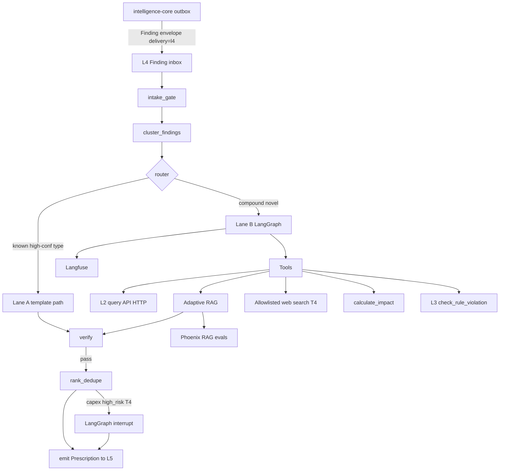

# L4 — Knowledge & Reasoning (Agentic RAG)

*Architecture SSOT · July 2026 · Status: **accepted architecture***
*Siblings: [L3 — Intelligence core](L3-intelligence-core.md) · [L5 — Closure & verification](L5-closure-and-verification.md) · [Technical architecture](../02-technical-architecture.md) · [Evaluation & quality](../cross-cutting/04-evaluation-and-quality.md)*
*Decisions: [ADR-017 adaptive retrieval + web T4](../../decisions/ADR-017-l4-adaptive-retrieval-and-web-trust.md) · [ADR-013 counterfactual ledger](../../decisions/ADR-013-counterfactual-savings-ledger.md) · [ADR-015 dual-lane](../../decisions/ADR-015-l3-dual-lane-lab-detections.md)*
*Consumer handoff: [handoff/stamped-l4-architecture-handoff.md](../../handoff/stamped-l4-architecture-handoff.md)*

> **Honesty convention:** `[~]` approximate / benchmark-derived · `[!]` evolving — verify before committing.
> **Scope rule:** L4 is language, ranking, and evidence binding. All numbers come from L3 engines and deterministic tools. L4 never invents a number, never writes to SCADA, and never sends anything to a supervisor that a deterministic rules engine has not had the chance to veto.

---

## 1. Role in the 15–20% target

Stamped's bill reduction is the **sum of closed prescriptions** across six waste categories. L3 detects waste; L5 verifies savings. L4 owns **closure rate**: turning structured findings into trusted, actionable prescription cards.

| Lever | Mechanism | Failure if L4 is weak |
| --- | --- | --- |
| Actionability | What/Why/Who/Effort/₹/When | Findings pile up unread |
| Prioritisation | `(₹ × confidence) / effort × urgency` | Wrong work gets attention |
| Trust | Grounded text, correct numbers, citations | One bad Rx kills plant engagement |
| Dual outcome | Cost savings + audit-ready sustainability narrative | Two inconsistent reporting systems |

**Repo:** single consumer `stamped-l4` (runtime + templates + corpus pipeline + eval). Not split like L3.

---

## 2. Contracts

### 2.1 Input — Finding (from L3)

Canonical: [`contracts/schemas/finding.json`](../../contracts/schemas/finding.json).

Intake only when L3 outbox stages `StampedRecordEnvelope` with **`delivery=l4` ∧ `status=emitted`** ([ADR-015](../../decisions/ADR-015-l3-dual-lane-lab-detections.md)). Lab-only / hypothesis / suppressed / shadow never enter L4.

Obligations:

- Schema gate — reject invalid findings to dead-letter
- Category-gated intake — six-category taxonomy only
- Multi-finding synthesis — cluster by root cause before drafting
- Numbers are read-only — impact calculator recomputes ₹/kWh/tCO₂e; agent may not invent figures

### 2.2 Output — Prescription (to L5)

Canonical: [`contracts/schemas/prescription.json`](../../contracts/schemas/prescription.json). Lifecycle timestamps per [ADR-013](../../decisions/ADR-013-counterfactual-savings-ledger.md). Capex requires [`capex-proposal.json`](../../contracts/schemas/capex-proposal.json).

Hard requirements: non-empty resolvable `evidence_refs`; `mv_plan` at issue time; `who` from L2 role map only.

### 2.3 Worked example

Input finding (`compressor_sp_drift`) → output Rx with what/why/who/effort/when, impact from `calculate_impact` (may differ from L3 estimate — calculator wins), playbook chunk citation, locked `mv_plan`. Full example retained in research archive notes; contract fixtures: [`contracts/fixtures/prescription.valid.json`](../../contracts/fixtures/prescription.valid.json).

---

## 3. Architecture overview



### 3.1 Dual lanes (cost spine)

| Lane | When | LLM |
| --- | --- | --- |
| **A — Template fast path** | High-confidence known categories (`md_overlap`, `pf_slab_breach`, `tod_exposure`, …) | **0** (language polish off by default) |
| **B — Bounded LangGraph** | Compound / novel / multi-finding clusters | Soft ≤5 calls; hard escalate at 6 |

Lane A fills approved templates from finding fields + deterministic impact. Lane B runs plan-then-execute with adaptive retrieval, enum-constrained template select, strict structured draft, verify/revise, rules veto, rank.

### 3.2 Orchestrator

**LangGraph** with Postgres checkpointing and HITL `interrupt`. All node logic is **framework-free Python + Pydantic** so migration is re-wiring, not re-writing. Optional self-hosted open-weight drafter for residency later; graph node stays swappable.

### 3.3 LLM call budget (Lane B)

| Step | Model class | Count |
| --- | --- | --- |
| Route / ambiguity | small | 0–1 |
| CRAG grade (+ optional rewrite) | small | 1–2 |
| Template select + draft | frontier API | 1 |
| Revise (verify fail only) | frontier | 0–1 |
| Groundedness judge | frontier, **different family** | 0 online (sample ~10%); 1 in CI |

Hard stop at **6** LLM calls → quarantine / human escalate. Prefer skipping rewrite and online judge to stay ≤5.

### 3.4 Tool registry

| Tool | Deterministic? | Notes |
| --- | --- | --- |
| `query_timeseries` | Yes | L2 HTTP |
| `get_baseline` | Yes | L2 |
| `traverse_graph` | Yes | L2 + light industrial KG edges |
| `lookup_playbook` | Hybrid retrieve | Adaptive paths H / G / V ([ADR-017](../../decisions/ADR-017-l4-adaptive-retrieval-and-web-trust.md)) |
| `web_search` | External | Allowlist; trust **T4**; ≤1 call / run |
| `calculate_impact` | Yes | Sole source of ₹ / kWh / tCO₂e |
| `assign_owner` | Yes | Role map |
| `check_rule_violation` | Yes | L3 HTTP — veto is final |

**Forbidden:** OT writes, WhatsApp/email send, unbounded web crawl, shell, cross-tenant retrieval.

---

## 4. Adaptive RAG (retrieval architecture)

Research compared hybrid vector+BM25, GraphRAG, and vectorless structure-nav. **Locked choice: adaptive hybrid primary** with specialized secondary paths — see [ADR-017](../../decisions/ADR-017-l4-adaptive-retrieval-and-web-trust.md).

```text
Query classifier (deterministic from finding.category + doc_type; small LLM only if ambiguous)
  → Path H (default): metadata filter → BM25 + dense RRF → cross-encoder rerank → CRAG-lite (1 retry)
  → Path G (relational / multi-hop): light KG traverse + cited chunks
  → Path V (long structured manual): vectorless TOC/section nav inside one doc_id
  → Path W (web): allowlisted search only when curated recall fails AND query is non-numeric advisory
```

### 4.1 Corpus slices

| Slice | Trust | Notes |
| --- | --- | --- |
| Waste playbooks (six categories × verticals) | T1 | Curated |
| BEE / PAT / SEC / equipment EE best practices | T1 | Large practice library |
| DISCOM tariff **narrative** | T1 | Rate tables → L2 `TariffContract`, not RAG |
| IPMVP / M&V guides | T1 | |
| OEM manuals | T2 | Vendor |
| Plant SOPs | T3 | Tenant-scoped; injection-scanned |
| Allowlisted web fetch | T4 | Never sole source of numbers / M&V |

Parser: **Docling** (local). Chunk meta: slice, trust_tier, vertical, asset_type, waste_category, tenant_id, provenance.

### 4.2 Dual backends (local + cloud)

`RetrievalBackend` abstraction — Lane B does not hardcode vendor.

| Layer | Local / sovereignty | Cloud / speed |
| --- | --- | --- |
| Embeddings | BGE-M3 self-hosted | OpenAI `text-embedding-3-small` or Cohere multilingual (**shared corpus only**; tenant SOPs always local) |
| Vector index | pgvector on L2 Postgres | Managed vector with same metadata schema |
| Lexical | Postgres `tsvector` / BM25 | Same or OpenSearch at scale |
| Rerank | **BGE-reranker-v2-m3** (default cross-encoder) | Cohere Rerank optional |
| Web | Self-hosted fetcher + domain allowlist | Same policy |

### 4.3 Web search trust (T4)

- Never sole source of ₹ / kWh / tCO₂e / M&V method
- Allowlist: BEE, CEA, MoP, DISCOM sites, major OEM docs — no open crawl
- Any Rx citing T4 → **forced human approval**
- Prefer promote-to-corpus (engineer review → T2/T1) so web is discovery, not permanent dependency
- Conversational analyst may use web more freely; prescription path stays conservative

---

## 5. Guardrails

| # | Guardrail | Where |
| --- | --- | --- |
| G1 | Category + schema gate | `intake_gate` |
| G2 | Tenancy RLS | retrieval |
| G3 | Injection defence | T3 scan + data-only delimiters + fixed plans |
| G4 | Bounded templates | enum `template_id`; `custom_advisory` ⇒ HITL |
| G5 | Numeric integrity | verify vs tool outputs |
| G6 | Evidence mandatory | resolvable refs |
| G7 | Groundedness | LLM judge (sampled online; full in CI) |
| G8 | Rules veto | L3 — final |
| G9 | Human approval | capex / high-risk / T4 / low-confidence |
| G10 | No egress / no SCADA | tool registry |
| G11 | Audit | LangGraph checkpoint + Langfuse |

**HITL timeouts (urgency-scaled):** critical — remind 24h / expire 72h; normal — remind 48h / expire 7d.

**Template governance:** engineers approve new templates (semver + golden cases).

### 5.1 Dedup-after-reject

Same `dedupe_key` / root-cause cluster after supervisor reject:

1. `already_fixed` → suppress **90 days**
2. `wrong_unclear` / quality reject → suppress **14 days**, then **reframe** once with new evidence window
3. `production_constraint` / `capex_blocked` → suppress until maintenance/CMD signal; may reframe as scheduled advisory
4. Never silent re-issue of identical Rx inside suppress window

---

## 6. Agent graph (Lane B)

Pattern: **bounded plan-then-execute** + CRAG-lite + verify-revise (≤2) + rules veto + rank.

Nodes (summary): `intake_gate` → `cluster_findings` → `route` → (`template_fast_path` | `assemble_context` → `retrieve_*` → `grade_chunks` → `gather_evidence` → `select_template` → `calculate_impact` → `draft_prescription`) → `verify` → (`revise` | `escalate`) → `rules_veto` → `rank_dedupe` → (`approval_gate` | `emit_to_L5`).

Invariants:

- Evidence immutable after `gather_evidence` (no evidence-shopping)
- All numbers: calculator → draft; verifier diffs numerals
- Veto downstream of verify, upstream of rank
- Approval is checkpoint interrupt (survives restarts)

Ranker (deterministic): `score = (inr_impact × confidence) / effort_weight × urgency_multiplier`; per-role open-Rx caps; quick-wins queue.

---

## 7. Eval & observability

OSS-first stack (cost-efficient):

| Tool | Role |
| --- | --- |
| **Langfuse** | Production traces, token/cost per Rx (self-host or cloud) |
| **Arize Phoenix** | Offline + CI RAG evals (faithfulness, context precision, retrieval drift) |
| **DeepEval** | Pytest gates for agent trajectory + RAGAS-style metrics |
| Deterministic gates | Schema, numeric integrity, evidence resolve, template accuracy, cross-tenant=0, adversarial escalate=1.0 |

Optional: **LangSmith** for LangGraph-native IDE UX (not required).

Assets live inside `stamped-l4`: golden Finding→Prescription pairs (frozen L2 context + corpus snapshot); retrieval labelled queries; trajectory cases; red-team (SOP injection, cross-tenant, web poisoning).

**CI:** PR = deterministic + small smoke LLM set; nightly = full golden + Phoenix RAG + sampled judge. Online groundedness judge samples ~10% of Lane B production runs.

Cross-cutting programme: [04-evaluation-and-quality.md](../cross-cutting/04-evaluation-and-quality.md) (Q9–Q11, Q16).

---

## 8. Product surfaces (capability maturity)

Not a build schedule — maturity bands for what the architecture covers:

| Capability | Band | Notes |
| --- | --- | --- |
| Prescription cards (Lane A + verifier + rank) | **Foundation** | L3→L4→L5 core path |
| Adaptive RAG over practice corpus | **Foundation** | Required with prescriptions |
| Eval / trace (Langfuse + Phoenix + DeepEval) | **Foundation** | Ships with agent |
| Lane B bounded agent + HITL | **Core** | Compound / novel |
| Hindi / Hinglish Rx text | **Core** | L4 generates; L6 renders |
| Sustainability narrative engine | **Extended** | Batch over L5 ledger; template-constrained |
| Gated web search (T4) | **Extended** | After curated recall gaps proven |
| Conversational analyst | **Extended** | Same tools + stricter budgets; no SCADA |

---

## 9. Cost envelope — example ₹40L / month plant

Assumptions `[~]`: ~15% addressable ≈ ₹6L/mo; ~25–40 Rx considered/month; **70% Lane A / 30% Lane B**; Lane B ≈ ₹3–8 / Rx at mid-tier API; self-hosted embed/rerank amortized.

| Item | Monthly |
| --- | --- |
| Lane A (~25 Rx) | ~₹0 |
| Lane B (~10 × ₹5) | ~₹50 |
| Sampled online judge | ~₹5–15 |
| Embed/rerank infra share | ~₹500–1,500 |
| **Lean total** | **~₹600–1,600 / plant / month** |

Keep cheap: template dominance, prefix caching, no Lane A polish, CRAG rewrite only on low grade, rare web, sampled judge.

Override: `PRIORITY=COST` → Lane A only + web off; `PRIORITY=QUALITY` → always-on judge + Path G more often.

---

## 10. Integration boundaries

| Boundary | Rule |
| --- | --- |
| L3 → L4 | Outbox pull/webhook; only `delivery=l4` ∧ `emitted` |
| L4 → L2 | HTTP query API only — **no** `L2_DATABASE_URL` |
| L4 → L3 veto | `POST /v1/rules/check_violation` |
| L4 → L5 | Prescription (+ CapexProposal when needed) outbox/API |

L3 change prompt (outbox consumer + veto HTTP): see [handoff § L3 prompt](../../handoff/stamped-l4-architecture-handoff.md#l3-change-prompt).

---

## 11. Open follow-ups

1. Hinglish retrieval quality on real SOP samples before trusting Hindi gates `[!]`
2. Tariff narrative vs L1 structured split ownership for oddball DISCOM orders
3. Judge residency if drafting moves fully self-hosted
4. LangGraph checkpoint migration tests across majors
