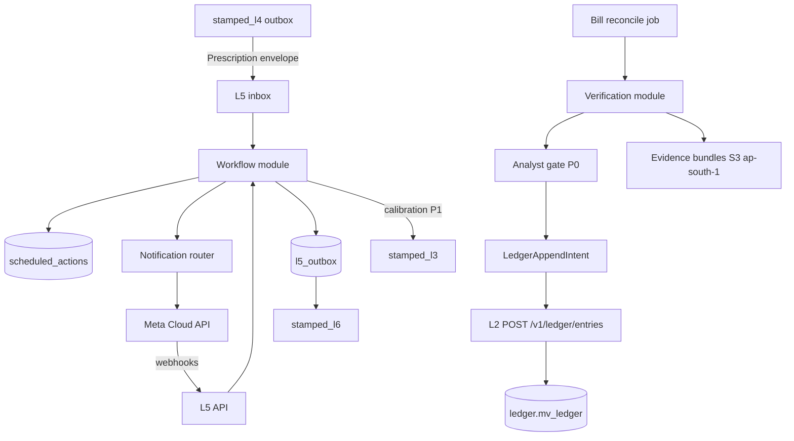

# L5 — Closure & Verification (Workflow, WhatsApp, M&V)

*Authoritative architecture · July 2026. Companion: [technical architecture](../02-technical-architecture.md) §11 · ADRs [019](../../decisions/ADR-019-l5-runtime-and-consistency.md) · [020](../../decisions/ADR-020-l5-mv-claim-governance.md) · [021](../../decisions/ADR-021-l5-notification-and-evidence.md) · [013](../../decisions/ADR-013-counterfactual-savings-ledger.md). Handoff: [stamped-l5-architecture-handoff.md](../../handoff/stamped-l5-architecture-handoff.md).*

> **Honesty convention:** `[~]` approximate / benchmark-derived · `[!]` evolving — verify before customer-facing claims.
> Prices and vendor terms drift — re-verify before contracts.

---

## 0. Authority and supersession

| Rank | Artifact | Role |
| --- | --- | --- |
| 1 | This document + ADR-019/020/021/013 | **L5 product and runtime SSOT** |
| 2 | `contracts/schemas/{prescription,ledger-entry,workflow-event}.json` | Wire contracts (CI-blocking) |
| 3 | [stamped-l5-architecture-handoff.md](../../handoff/stamped-l5-architecture-handoff.md) | Implementation authority for `stamped-l5` agents |
| 4 | [02-technical-architecture.md](../02-technical-architecture.md) §11 | Stack summary (must not contradict this doc) |
| 5 | [03-production-engineering.md](../cross-cutting/03-production-engineering.md) | Fleet-wide ops patterns — **L5-specific rows superseded below** |

**Supersession rules (resolve prior contradictions):**

| Topic | Prior conflict | Binding decision |
| --- | --- | --- |
| Topology | Prod-eng “core monolith” vs ADR-008 layer repos | **Separate `stamped-l5` repo** (ADR-008). L5 is its own modular monolith — not embedded in an L2–L6 mega-service. |
| Workflow engine | Prod-eng Temporal at P1–P2 vs L5 custom Postgres | **Postgres state machine + durable timers through P0–P2** (ADR-019). Temporal only if upgrade triggers fire. |
| Ledger storage | Spec “one Postgres txn with ledger” vs ADR-013 L2 store | **L5 owns policy + local intent; L2 stores append-only `ledger.mv_ledger` via HTTP** (ADR-013/019). No distributed single-transaction claim. |
| Prescription vs workflow status | `prescription.json` lacks `verified`/`disputed` | **L4 `Prescription` is intake + lifecycle timestamps; L5 owns `WorkflowState`** (this doc §2, §6). |
| `verification_status` | Arch prose vs contract vs L2 DDL drift | **Contract enum wins:** `pending \| verified \| disputed \| modeled`. Corrections via new rows + `supersedes_entry_id` (not mutating status to `superseded`). |
| Notification SLO | 5 min (L5) vs 10 min (arch) vs 2/10 min (prod-eng) | **High-urgency Rx → WhatsApp accepted by Meta ≤ 5 min** after L5 intake. End-to-end finding→WA remains a platform SLO elsewhere. |
| Baseline lock timing | Issue-time vs window-open | **Lock (or confirm already locked) when verification window opens**; `mv_plan.baseline_id` must reference a versioned baseline at Rx intake (reject if missing). |

---

## 1. Role in the 15–20% target

L5 is the only layer that produces **verified DISCOM bill reduction in ₹/month**. Upstream layers produce *potential*.

```
verified_savings = detection_coverage × prescription_quality × closure_rate × persistence × verification_yield
```

**Closure rate** (workflow + notification) and **verification yield** (M&V + bill reconciliation) are L5-owned multipliers. Target: **≥60% of high-priority prescriptions acted within one billing cycle** `[!]`.

L5 also owns the anti-churn calibration loop: defer/reject reason codes → L3/L4 so the stack stops re-issuing unworkable prescriptions.

---

## 2. Terminology (single model)

| Term | Owner | Meaning |
| --- | --- | --- |
| **Prescription (input)** | L4 → L5 | Immutable intake payload (`prescription.json`). Status at intake: `open` / `blocked_incomplete` (rejected back). Lifecycle timestamps updated by L5 via L4 handshake or L5-local copy fields. |
| **WorkflowState** | L5 | Projection row: current status, owner, timers, version for optimistic concurrency. |
| **WorkflowEvent** | L5 → L6 | Append-only transition / notification / reason-code event (`workflow-event.json`). |
| **VerificationCase** | L5 | One Rx × one verification window: modelled savings, bill comparison, analyst decision. |
| **LedgerAppendIntent** | L5 | Local outbox row requesting L2 append; not financial truth until L2 ACK. |
| **LedgerEntry** | L5 policy / L2 store | Append-only financial/M&V record (`ledger-entry.json`) in `ledger.mv_ledger`. |
| **Dispute** | L5 | Case opened when claim challenged; freezes customer-facing “verified” presentation until resolved_* outcome posts correction entries. |
| **EvidenceBundle** | L5 | Immutable snapshot refs (Rx, baseline hash, bill lines, series windows, FSU) for audit export. |

---

## 3. Requirements

### 3.1 Input — L4 `Prescription`

Schema: [`contracts/schemas/prescription.json`](../../contracts/schemas/prescription.json).

**Hard gates (reject → `blocked_incomplete` outbox back to L4):**

1. Resolvable `who` against L2 role/owner map (or onboarding fixture in pilot).
2. Complete `mv_plan` `{method, baseline_id, verification_window}` with resolvable `baseline_id`.

| Field | L5 use |
| --- | --- |
| `id`, `priority`, `waste_category` | Queue, ledger rollups |
| `what/why/who/effort/when` | WhatsApp card |
| `impact` | Potential ledger side, escalation weight |
| `evidence_refs[]` | Evidence bundle |
| `mv_plan` | M&V contract |
| `first_recommended_at`, `implemented_at`, `verified_at` | Opportunity cost (ADR-013) + lifecycle |

### 3.2 Outputs

1. **WorkflowEvent stream** → L6 (and audit).
2. **LedgerEntry** → L2 append API → L6 query.
3. **Calibration signals** → L3 (reason-code counts, closure latency, realised÷potential) — async metrics/events, P1.

### 3.3 Non-functional requirements

| Requirement | Target |
| --- | --- |
| High-urgency notification | ≤ **5 min** from L5 intake to Meta accept |
| Idempotent transitions | Optimistic `expected_version`; webhook dedupe on `wamid` |
| Ledger appends | At-least-once + idempotent `dedupe_key` on L2 |
| Baseline immutability | Locked for open VerificationCase |
| Lineage | bill line → LedgerEntry → Rx → finding → source tags |
| Thin-staff plants | One WhatsApp phone, no dashboard required for ack/done/defer |
| Multi-tenant | `org_id` + `plant_id` on every row/event; per-plant SLA policy |
| Data residency | L5 DB + evidence objects in **ap-south-1** (DR copies ap-south-2) |

---

## 4. Runtime architecture

### 4.1 Topology (ADR-019)

```text
stamped-l5/                     # separate repo (ADR-008)
  packages/
    api/                        # FastAPI — webhooks, internal query, analyst actions
    worker/                     # timers, outbox drain, M&V jobs, opportunity_cost cron
    domain/
      workflow/
      notification/
      verification/
      reconciliation/
      evidence/
      integration/              # L2/L4/L6/Meta clients
    migrate/                    # L5 Postgres only
```

**Deploy (P0 cost mode):** 1× ECS Fargate API + 1× worker task, **one** RDS Postgres database `stamped_l5` (can share instance with other DBs, separate database name). No Redis, Kafka, Temporal, or K8s in P0–P2.

### 4.2 Component diagram



### 4.3 L5-owned tables (sketch)

| Table | Purpose |
| --- | --- |
| `inbox_processed` | Idempotency for L4 envelopes / Meta webhooks |
| `prescription_snapshot` | Immutable copy of accepted Prescription JSON |
| `workflow_state` | Current status, owner, version, SLA fields |
| `workflow_events` | Append-only event log (source of WorkflowEvent) |
| `scheduled_actions` | Durable timers (ack/remind/escalate/resurface/M&V due) |
| `notification_log` | Template, wamid, delivery/read/tap |
| `verification_case` | Modelled vs billed, FSU, analyst decision |
| `dispute_case` | P2 dispute lifecycle |
| `ledger_append_intent` | Outbox toward L2 with status `pending\|acked\|failed` |
| `evidence_bundle` | Object keys + content hashes |
| `dead_events` | Poison quarantine |
| `outbox` | L5 → L6 / L3 / L4 bounce events |

**Rule:** L5 never holds financial truth as the system of record. Local `ledger_append_intent` is an integration journal.

### 4.4 Cross-service ledger consistency (critical)

```text
1. Analyst (or P2 auto-verify) decides claim → commit in L5 DB:
     verification_case.status = approved_for_append
     INSERT ledger_append_intent (dedupe_key, payload)
     INSERT outbox workflow event (optional "pending_ledger")
   — single L5 transaction

2. Worker drains intent → POST L2 /v1/ledger/entries
     Idempotency-Key / dedupe_key = intent.dedupe_key
     On 200/409-duplicate → mark intent acked; store L2 entry_id
     On 5xx/timeout → retry with backoff; never invent a second dedupe_key
     On 4xx validation → dead_events + page

3. After ACK → emit L6 WorkflowEvent / ledger.entry.added
```

**Forbidden claims:** “exactly-once delivery”, “one Postgres transaction across L5+L2”. Guarantees are **at-least-once + idempotent append + explicit reconciliation states**.

### 4.5 Interfaces

| Boundary | Transport | Contract |
| --- | --- | --- |
| L4 → L5 | Outbox / poll or HTTP ingest | `Prescription` + envelope |
| L5 → L2 | Sync HTTP | Query baselines/bills/owners; `POST /v1/ledger/entries`; baseline lock confirm |
| L5 → L6 | Outbox + query API | `WorkflowEvent`, `LedgerEntry` refs |
| L5 → L3 | Outbox metrics (P1) | Calibration payload (reason codes, ratios) |
| Meta → L5 | Webhooks | Button replies; delivery receipts |
| L5 → Meta | Cloud API | Utility templates |

Auth to L2: `X-Service-Key` + `X-Org-Id` ([query API sketch](../../handoff/stamped-l2-query-api-sketch.md)).

---

## 5. Workflow engine

**Decision:** custom Postgres state machine (not Temporal/Camunda through P0–P2).

```
BLOCKED (missing owner/mv_plan → bounce L4)
  ↓ accept
OPEN → IN_PROGRESS → DONE → VERIFIED
  │         │           │
  ├─ DEFERRED (timer resurface → OPEN)
  ├─ REJECTED (terminal + reason)
  └─ from VERIFIED/DONE: DISPUTED → resolved_* (P2)
```

| Rule | Detail |
| --- | --- |
| Actor required | user / system-timer / mv_engine / analyst |
| Event log | Every transition → `workflow_events` |
| Optimistic concurrency | API requires `expected_version` |
| SLA timers | Durable rows — never in-process sleep |
| High urgency ack | 4 h re-ping → 24 h escalate to plant head `[~]` configurable |
| Defer | Snooze with reason; resurface 48 h–14 d by reason |
| Done | One WhatsApp tap (+ optional photo); M&V verifies later |
| Auto-verify | **Forbidden in P0** — analyst reviews every claim |

Illegal transitions are logged as rejected events (audit intent), not swallowed.

---

## 6. Notification — WhatsApp-first (ADR-021)

| Decision | Choice |
| --- | --- |
| Primary | **Meta Cloud API direct** |
| SMS fallback | MSG91 + **TRAI DLT** — register P0 week 1; send live **P1** |
| Number strategy | **One shared Stamped WhatsApp number** until quality blast-radius or enterprise contract forces isolation |
| Budget | ≤ **3** business-initiated pushes / role / day `[~]`; overflow → digest |
| Templates (P0) | issue, reminder, escalation, verified — utility + quick-reply buttons |

**Cost note `[~]`:** ~60 utility msgs/plant/month ≈ ₹7/plant/month at Meta India utility rates — message cost is irrelevant vs engineering control and deliverability.

**Fallback chain:** WA undelivered 6 h → SMS (P1) → CS call task for high-priority.

**Trust:** WhatsApp replies are untrusted input (prompt-injection / spoof risk) — map button IDs to allowed transitions only; free-text never executes side effects without structured parse + allowlist.

**Compliance gates:** Meta Business verification before scale; DPDP DPIA for staff phone numbers (ADR-004); contractual opt-in at onboarding.

---

## 7. M&V and claim governance (ADR-020)

### 7.1 Two-tier model

1. **Tier 1 — Account truth (Option C):** production-normalised whole-facility + bill reconciliation → customer-facing verified ₹.
2. **Tier 2 — Per-Rx attribution (Option A/B):** boundary estimates; **Σ attributed ≤ Tier-1** (pro-rata scale-down; metered Rx protected first).

**Option D not used.**

### 7.2 Category defaults

| Category | Method | Window |
| --- | --- | --- |
| MD / PQ | Deterministic tariff + incomer (A-like) | 1–2 cycles |
| TOD | Bill TOD registers | 1 cycle |
| PF / CMD | Bill arithmetic | 1 cycle |
| Idle / aux | Option C non-production sub-series | 2–4 weeks + bill |
| Compressed air / furnace | Option B feeder (P1) | 2–6 weeks |
| Account total | Option C monthly (+ interval P1) | Rolling monthly |

### 7.3 Baseline policy

| Rule | Decision |
| --- | --- |
| Preferred history | **12 months** bills + incomer |
| Provisional | **9 months** allowed with `low_confidence_mv` flag — **manual-only** claims |
| Lock | Confirm lock when VerificationCase window opens; never silent retrain of cited baseline |
| NRE / NRA | Signed artifacts; dual reporting on adjusted history (P1 workflow) |
| G14 gates | NMBE / CV(RMSE) before Option C claims; fail → withhold verified |

### 7.4 Overlap attribution

| Case | Policy |
| --- | --- |
| Disjoint feeders | Independent verify |
| Shared boundary | **Prescription bundle** — one combined window; allocate by engineering estimate (P2) |
| MD/TOD/PF lines | Deterministic; overlap non-issue |

### 7.5 Auto-verify promotion

P0: **every** verification human-reviewed.  
P2 candidate: auto-verify when `|modelled − billed|` within empirical FSU band from ≥3 pilot plants **and** dispute rate <5%. Else analyst queue.

### 7.6 Bill reconciliation algorithm

```
1 VALIDATE   recompute lines from registers vs tariff model
2 NORMALISE  daily-ise; snapshot tariff; isolate FPPCA/duty
3 DECOMPOSE  Δbill = rate + volume + efficiency  ← claim only efficiency
4 ATTRIBUTE  map efficiency to MD/TOD/energy lines ↔ Rx set
5 RECONCILE  cap Σ Rx ≤ account efficiency; post intents or dispute
6 REPORT     show three-way decomposition; constant reference rates
```

**kVAh regimes:** treat reactive/PF fold-in as documented fourth term when plant tariff is kVAh-billed `[~]`.

### 7.7 Emission factors

Versioned factor snapshotted **at post time** into LedgerEntry `avoided_tco2e`. Default CEA national grid factor unless plant contract specifies state factor (documented override).

---

## 8. Savings ledger and evidence

### 8.1 Ledger rules

- Append-only in L2; L5 never UPDATE/DELETE remote rows.
- Entry types: `potential_savings`, `realised_savings`, `opportunity_cost` (ADR-013).
- `verification_status`: `pending | verified | disputed | modeled`.
- Corrections: new entry with `supersedes_entry_id` + compensating amounts; never edit original.
- Triple currency (₹, kWh, tCO₂e) computed at post with versioned tariff + emission factor.

### 8.2 Opportunity cost (ADR-013)

When `implemented_at > first_recommended_at`:

```
realised_inr = delay_days × (potential_inr / 30)
entry_type = opportunity_cost
verification_status = modeled  # never verified
```

### 8.3 Evidence bundles (ADR-021)

P0: store object keys + hashes for Rx snapshot, baseline definition, bill line JSON, modelled worksheet.  
P2: one-click ZIP/PDF export for auditors.  
Retention classes: operational (hot), audit (years — contract), legal-hold. **India residency required.** Exact year counts need legal/template confirmation (open item).

---

## 9. Security, tenancy, observability

### 9.1 Security

| Control | Detail |
| --- | --- |
| Tenancy | `org_id`/`plant_id` on all tables; reject cross-tenant params |
| Secrets | Meta tokens, L2 keys in SSM/Secrets Manager only |
| Webhook auth | Meta signature verification mandatory |
| PII | Staff phones — DPIA; minimize in logs (hash/last-4) |
| Injection | Button ID allowlist; free-text quarantine |
| OT | No SCADA write path |

### 9.2 SLOs (L5-authoritative)

| SLO | Target |
| --- | --- |
| High-urgency WA accept | p95 ≤ 5 min |
| WA delivery | ≥ 98% |
| Ledger intent → L2 ACK | p95 ≤ 2 min under normal ops |
| Workflow transition API | p95 ≤ 500 ms |
| RPO (L5 DB) | ≤ 5 min (PITR) |
| RTO (L5 service) | ≤ 4 h P0 |

### 9.3 Metrics and alerts

**Metrics:** closure funnel, time-to-ack, template quality, dispute rate, realised÷potential, outbox depth, ledger intent failures, analyst queue age.

**Pages (keep ≤8 fleet-wide contribution):** WA delivery failure spike; ledger append failure runaway; outbox/DLQ depth; L5 API down.

**Tracing:** `correlation_id` / `traceparent` on envelopes — span: intake → notify → transition → verify → L2 append.

---

## 10. Failure modes

| Failure | Behaviour |
| --- | --- |
| Meta outage | Retry with circuit breaker; queue sends; P1 SMS fallback; dashboard still works |
| L2 append timeout | Retry same dedupe_key; intent stays pending; no double claim in L6 until ACK |
| L2 4xx | Quarantine + page; never auto-mark verified |
| Bill missing / gap > threshold | VerificationCase `data_insufficient`; no verified claim |
| Duplicate WhatsApp webhook | Inbox hit on `wamid` → no-op event |
| Worker crash mid-timer | Timer rows durable; resume on restart |
| Analyst backlog | Cap new non-urgent Rx (closure ratio throttle — product flag) |

---

## 11. P0–P3 phasing and cost

### 11.1 Capability matrix

| Phase | In scope | Explicitly out |
| --- | --- | --- |
| **P0** | Workflow 6+ states, durable timers, Meta WA (4 templates), hard gates, MD/TOD/PF verifiers, provisional Option C, **analyst gate**, L2 ledger append client, basic evidence refs, opportunity_cost job, OTel basics, DLT **registration**, Meta verification start | Auto-verify, Option B feeders, SMS send, full disputes, hash chain, WhatsApp Flows, Temporal |
| **P1** | Interval Option C, Option B feeders, SMS live, per-plant escalation config, L3 calibration feed, NRE/NRA workflow, FSU on claims, richer evidence export | Portfolio FSU, maker-checker |
| **P2** | Auto-verify in band, dispute lifecycle, overlap bundles, HVAC ambient adjust, hash-chained audit, enterprise retention controls | — |
| **P3** | Fleet FSU rollups, maker-checker NRAs, WhatsApp Flows closeout, predictive closure scoring **only if data proves lift** | Speculative infra |

### 11.2 Cost model (drivers, not fixed quotes)

| Driver | P0 posture | Control |
| --- | --- | --- |
| Compute | 2 small Fargate tasks | Split only if CPU/lag triggers |
| L5 DB | Shared RDS instance, separate DB, Single-AZ ok at pilot | Multi-AZ when RTO contracts demand |
| WhatsApp | Direct API, shared number | Avoid BSP markup until ops pain |
| SMS | Register only until P1 | Pay per fallback, not primary |
| Evidence | S3 standard ap-south-1 | Lifecycle to IA after hot window |
| Orchestration | Postgres timers/outbox | **No Temporal Cloud** until upgrade trigger |
| Observability | Grafana Cloud free → paid when series/retention force | |

**Upgrade triggers:** sustained timer/outbox bugs across deploys → reconsider Temporal; WA quality pauses → per-account numbers; query load → separate read replica (L2 side).

### 11.3 Dependencies

| Dependency | Blocks |
| --- | --- |
| L4 valid Prescription outbox | Intake |
| L2 baselines + bill lines + ledger append API | Verification + claims |
| ≥9 months bills at onboarding | Option C |
| Meta + DLT calendar time | Notifications / SMS |

---

## 12. Testing and evaluation

| Class | Pass criteria |
| --- | --- |
| M&V backtest | Phantom savings ≈ 0 within FSU; G14 gates |
| Synthetic intervention | Recover within FSU |
| Billing-demand floor | Golden DISCOM templates to the rupee |
| Workflow property tests | No illegal transitions; crash-safe timers; webhook redelivery safe |
| Notification | Delivered ≥98%; quality ≥ Medium; budget respected |
| Closure funnel | ≥60% high-priority acted / cycle `[!]` |
| Dispute rate | <5% `[~]`; upheld ≥80% |
| Estimate calibration | Median realised÷potential 0.7–1.2 `[~]` |
| Evidence drill | Quarterly hostile-auditor walkthrough |

---

## 13. Open questions — resolved defaults vs still open

### 13.1 Defaults adopted (cost-aware)

| # | Topic | Default |
| --- | --- | --- |
| 1 | Auto-verify band | Empirically set after ≥3 plants; P0 manual |
| 2 | Baseline window | 12 mo preferred; 9 mo provisional/manual |
| 5 | WA number | Shared Stamped number |
| 7 | kVAh | Fourth reactive term when tariff requires |
| 8 | Emission factor | CEA national default; versioned at post |
| 10 | L4 throttle | Enabled behind product flag at closure ratio <0.7 / 14d |

### 13.2 Still need product/legal confirmation

| # | Topic | Owner |
| --- | --- | --- |
| 3 | Contractual dispute arbiter language | Legal + CS |
| 4 | CMD renegotiation lag treatment | Product |
| 6 | Meta utility→marketing reclass monitoring | Ops quarterly |
| 9 | Evidence retention years + contract clauses | Legal |

---

## 14. Opportunity cost ledger job

*ADR-013.* Cron in L5 worker: scan Done/Verified Rx with delay; emit `opportunity_cost` LedgerEntry via same append protocol; L6 shows modeled disclaimer ([handoff stub](../../handoff/l6-counterfactual-display-stub.md)).

---

## 15. Research appendix (condensed)

Prior deep research (WhatsApp pricing Jul 2026, BSP comparison, IPMVP/ASHRAE/CalTRACK, HT bill anatomy, CMMS closure mechanics) remains valid as background. Key citations retained below. Architecture decisions above override any conflicting “recommended approach” phrasing from earlier drafts that implied L5-local ledger tables as system of record or Temporal-by-default.

### Closure arithmetic reminder

At ₹6L/month detected on a ₹40L bill: 60% closure → ~₹3.6L verified (~9% of bill) before persistence/verification yield — hence L5 is first-class, not a notification sidecar.

---

# Citations

1. https://developers.facebook.com/docs/whatsapp/pricing/
2. https://blueticks.co/blog/whatsapp-business-api-pricing-2026
3. https://mindlytics.in/blog/whatsapp-business-api-pricing-india-2026
4. https://developers.facebook.com/docs/whatsapp/guides/interactive-messages/
5. https://developers.facebook.com/docs/whatsapp/api/messages/message-templates/interactive-message-templates/
6. https://developers.facebook.com/docs/whatsapp/message-templates/guidelines
7. https://developers.facebook.com/docs/whatsapp/flows/guides/sendingaflow/
8. https://bizeract.com/blog/whatsapp-cloud-api-vs-twilio-india
9. https://richautomate.in/blog/msg91-vs-gupshup-india-2026-pricing-decoded
10. https://codingclave.com/guides/whatsapp-api-pricing-india-2026-comparison
12. https://www.openmalo.com/blog/india-dlt-sms-marketing-setup-guide
13. https://metareachmarketing.com/trai-dlt-compliance-guide-india-2026.php
14. https://martinfric.dev/blog/posts/workflow-engine-why-not-temporal
15. https://dev.to/contrite42/durable-workflows-on-postgres-what-you-dont-need-temporal-actually-buys-you-3o0f
17. https://www.energy.gov/sites/default/files/2024-10/mv_guide_5_0.pdf
18. https://evo-world.org/images/corporate_documents/IPMVP-Generally-Accepted-Principles_Final_26OCT2018.pdf
19. https://evo-world.org/en/m-v-community/mv-focus/883-october-2020-m-v-focus-issue-7/1192-detecting-savings-under-10-using-ipmvp-option-c
21. https://docs.caltrack.org/en/latest/methods.html
23. https://evo-world.org/en/products-services-mainmenu-en/protocols/ipmvp
26. https://krahejacorppower.com/know-your-bill
27. https://zerowatt.energy/knowledge-centre/discom-tariff-guide/
28. https://cescrajasthan.co.in/kedl/pages/event/uploads/JVVNL_Tariff-24.pdf
30. https://powerline.net.in/2025/02/05/reforming-tariff-structures-the-cea-proposes-adjustments-to-the-fppas-model/
32. https://eworkorders.com/work-order-delays-consequences/
33. https://www.infodeck.io/resources/blog/maintenance-workflow-automation-guide/
34. https://tractian.com/en/blog/6-cmms-reports-to-optimize-your-industrial-maintenance
