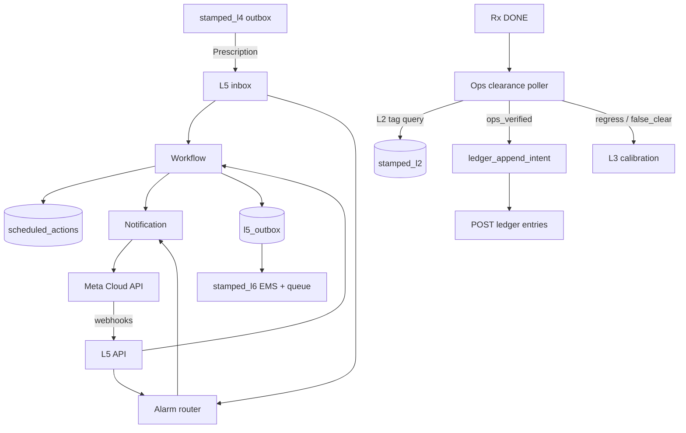

# L5 — Closure & Verification (Ops-first, EMS alarms, calculated savings)

*Authoritative architecture · July 2026 (ops-first revision 2026-07-21). Companion: [technical architecture](../02-technical-architecture.md) §11 · ADRs [019](../../decisions/ADR-019-l5-runtime-and-consistency.md) · [020](../../decisions/ADR-020-l5-mv-claim-governance.md) · [021](../../decisions/ADR-021-l5-notification-and-evidence.md) · [013](../../decisions/ADR-013-counterfactual-savings-ledger.md). Handoff: [stamped-l5-architecture-handoff.md](../../handoff/stamped-l5-architecture-handoff.md). L3 clearance emit: [stamped-l3-ops-clearance-consumer-prompt.md](../../handoff/stamped-l3-ops-clearance-consumer-prompt.md).*

> **Honesty convention:** `[~]` approximate / benchmark-derived · `[!]` evolving — verify before customer-facing claims.
> Prices and vendor terms drift — re-verify before contracts.

---

## 0. Authority and supersession

| Rank | Artifact | Role |
| --- | --- | --- |
| 1 | This document + ADR-019/020/021/013 | **L5 product and runtime SSOT** |
| 2 | `contracts/schemas/{prescription,ledger-entry,workflow-event}.json` | Wire contracts (CI-blocking) |
| 3 | [stamped-l5-architecture-handoff.md](../../handoff/stamped-l5-architecture-handoff.md) | Implementation authority for `stamped-l5` agents |
| 4 | [02-technical-architecture.md](../02-technical-architecture.md) §11 | Stack summary (must not contradict this doc) |
| 5 | [03-production-engineering.md](../cross-cutting/03-production-engineering.md) | Fleet-wide ops patterns — **L5-specific rows superseded below** |

**Supersession rules (resolve prior contradictions):**

| Topic | Prior conflict | Binding decision |
| --- | --- | --- |
| Topology | Prod-eng “core monolith” vs ADR-008 layer repos | **Separate `stamped-l5` repo** (ADR-008). L5 is its own modular monolith — not embedded in an L2–L6 mega-service. |
| Workflow engine | Prod-eng Temporal at P1–P2 vs L5 custom Postgres | **Postgres state machine + durable timers through P0–P2** (ADR-019). Temporal only if upgrade triggers fire. |
| Ledger storage | Spec “one Postgres txn with ledger” vs ADR-013 L2 store | **L5 owns policy + local intent; L2 stores append-only `ledger.mv_ledger` via HTTP** (ADR-013/019). No distributed single-transaction claim. |
| Prescription vs workflow status | `prescription.json` lacks `verified`/`disputed` | **L4 `Prescription` is intake + lifecycle timestamps; L5 owns `WorkflowState`** (this doc §2, §6). |
| `verification_status` | Prior bill-centric `verified` | **P0 ops-first:** `ops_confirmed` = telemetry clearance held. Reserve `verified` for **future bill path** (deferred). Also: `pending`, `disputed`, `modeled`. |
| What “verified” means | Bill/IPMVP gate | **Ops-cleared:** load stabilized / fault fixed per L3 `ops_clearance` (ADR-020 supersession 2026-07-21). |
| Notification SLO | 5 min (L5) vs 10 min (arch) vs 2/10 min (prod-eng) | **High-urgency Rx/alarm → WhatsApp accepted by Meta ≤ 5 min** after L5 intake. |
| Detection vs alarms | — | **L3 detects**; **L5** routes EMS-style alarms, ack/escalate, evaluates clearance, L6 console contracts. |

---

## 1. Role in the 15–20% target

L5 turns detections into **acted-on, ops-proven fixes** and tracks **Stamped-calculated ₹/kWh savings**. Upstream layers produce *potential*; L5 proves the plant condition actually cleared.

```
ops_proven_savings = detection_coverage × prescription_quality × closure_rate × persistence × ops_verification_yield
```

| Factor | Owned by | Meaning |
| --- | --- | --- |
| Closure rate | L5 workflow + notification + **alarm router** | Named owner acts |
| **Ops verification yield** | **L5 clearance eval** | Telemetry shows underload fixed, leak stopped, coincidence broken, SEC drift reversed |
| Calculated ₹ tracking | L5 ledger policy → L2 store | Potential at issue + realised after ops_confirmed (not bill) |
| Bill confirmation | **Deferred** | Later add-on; never the P0 gate for calling a Rx verified |

Target: **≥60% of high-priority prescriptions acted within one billing cycle** `[!]`, with ops-clearance on Done Rx.

Anti-churn: defer/reject + false-clear / regress labels → L3 calibration.

---

## 2. Terminology (single model)

| Term | Owner | Meaning |
| --- | --- | --- |
| **Prescription (input)** | L4 → L5 | Intake payload. L5 loads cited Findings for `ops_clearance`. |
| **WorkflowState** | L5 | Runtime status, owner, version. `verified` here means **ops-cleared**. |
| **WorkflowEvent** | L5 → L6 | Transitions, notifications, **alarm_***, **ops_verified** / **ops_regressed**. |
| **Alarm** | L5 | EMS-style presentation of an open Finding/Rx: raise, ack, escalate, silence, clear. |
| **VerificationCase** | L5 | Evaluates Finding `ops_clearance` against L2 tags; stabilize window; regress reopen. |
| **LedgerAppendIntent** | L5 | Outbox toward L2 append. |
| **LedgerEntry** | L5 policy / L2 | Calculated potential / ops-realised / opportunity_cost. Status `ops_confirmed` (not bill). |
| **EvidenceBundle** | L5 | Rx + clearance predicate eval traces + tag windows (+ bill refs only when bill path exists). |

---

## 3. Requirements

### 3.1 Input — L4 `Prescription`

Schema: [`contracts/schemas/prescription.json`](../../contracts/schemas/prescription.json).

**Hard gates (reject → `blocked_incomplete` outbox back to L4):**

1. Resolvable `who` against L2 role/owner map (or onboarding fixture in pilot).
2. Every `finding_refs[]` Finding must include **`ops_clearance`** (Finding schema 1.1.0+) — without a machine-evalable clearance contract, L5 cannot ops-verify.
3. `mv_plan` remains **recommended** for future bill path but is **not** a P0 hard gate for ops-verified closure.

| Field | L5 use |
| --- | --- |
| `id`, `priority`, `waste_category` | Queue, ledger rollups, alarm grouping |
| `what/why/who/effort/when` | WhatsApp / alarm card |
| `impact` | **Potential** ledger entry (calculated) |
| `finding_refs[]` | Load Finding.`ops_clearance` + `alarm_hint` |
| `evidence_refs[]` | Evidence bundle |
| `mv_plan` | Deferred bill path only |
| `first_recommended_at`, `implemented_at`, `verified_at` | Opportunity cost + lifecycle (`verified_at` = ops-cleared time) |

### 3.2 Outputs

1. **WorkflowEvent stream** → L6 (transitions + alarm_* + ops_*).
2. **LedgerEntry** → L2: `potential_savings` at issue; `realised_savings` with `ops_confirmed` after clearance.
3. **EMS alarm list query** → L6 console (open/acked/cleared).
4. **Calibration signals** → L3 (reason codes, false-clear, regress, realised÷potential).

### 3.3 Non-functional requirements

| Requirement | Target |
| --- | --- |
| High-urgency notification | ≤ **5 min** from L5 intake to Meta accept |
| Ops-clearance eval latency | p95 ≤ **2 min** after stabilize_window elapses (poll L2) |
| Idempotent transitions | Optimistic `expected_version`; webhook dedupe on `wamid` |
| Ledger appends | At-least-once + idempotent `dedupe_key` on L2 |
| Clearance lineage | tag windows → VerificationCase → LedgerEntry → Rx → Finding |
| Thin-staff plants | One WhatsApp phone, no dashboard required for ack/done/defer |
| Multi-tenant | `org_id` + `plant_id` on every row/event |
| Data residency | L5 DB + evidence in **ap-south-1** |

---

## 4. Runtime architecture

### 4.1 Topology (ADR-019)

```text
stamped-l5/                     # separate repo (ADR-008)
  packages/
    api/                        # FastAPI — webhooks, analyst, alarm/query for L6
    worker/                     # timers, outbox, clearance poller, opportunity_cost
    domain/
      workflow/
      notification/
      alarms/                   # EMS alarm router
      verification/             # ops_clearance eval (not bill-first)
      evidence/
      integration/              # L2/L4/L6/Meta + Finding fetch
    migrate/
```

**Deploy (P0 cost mode):** 1× ECS Fargate API + 1× worker · DB `stamped_l5` · no Redis/Kafka/Temporal/K8s.

### 4.2 Component diagram



### 4.3 L5-owned tables (sketch)

| Table | Purpose |
| --- | --- |
| `inbox_processed` | Idempotency L4 / Meta |
| `prescription_snapshot` | Accepted Rx JSON |
| `workflow_state` | Status / owner / version |
| `workflow_events` | Event log |
| `alarms` | EMS alarm projection (severity, state, silence) |
| `scheduled_actions` | Durable timers |
| `notification_log` | Template / wamid |
| `verification_case` | ops_clearance eval runs + outcomes |
| `ledger_append_intent` | Toward L2 |
| `evidence_bundle` | Object keys + hashes |
| `outbox` / `dead_events` | Downstream + quarantine |

### 4.4 Cross-service ledger consistency (critical)

```text
1. On Rx accept → append potential_savings (calculated from impact) intent
2. On ops_clearance success → VerificationCase = ops_verified
     INSERT realised_savings LedgerAppendIntent
       verification_status = ops_confirmed
     WorkflowEvent ops_verified; WorkflowState → VERIFIED
3. Worker POST L2 with stable dedupe_key (ADR-019 protocol)
4. On regress → WorkflowEvent ops_regressed; compensating ledger row; alarm re-raise
```

**Forbidden:** claiming bill-verified; distributed single-transaction myths. Guarantees: at-least-once + idempotent append.

### 4.5 Interfaces

| Boundary | Transport | Contract |
| --- | --- | --- |
| L4 → L5 | Outbox | `Prescription` |
| L5 → Finding source | HTTP / fixture | Finding 1.1.0 by `finding_refs` (`ops_clearance`) |
| L5 → L2 | HTTP | Tag query for clearance; `POST /v1/ledger/entries` |
| L5 → L6 | Outbox + query | `WorkflowEvent`, alarm list, ledger refs |
| L5 → L3 | Outbox (P1) | false_clear, regress, reason codes, realised÷potential |
| Meta ↔ L5 | Cloud API + webhooks | Alarms + Rx actions |

Auth to L2: `X-Service-Key` + `X-Org-Id`.

---

## 5. Workflow engine

**Decision:** custom Postgres state machine (P0–P2).

```
BLOCKED (missing owner / ops_clearance → bounce L4)
  ↓ accept (+ alarm_raised)
OPEN → IN_PROGRESS → DONE → VERIFIED   ← VERIFIED = ops-cleared
  │         │           │
  ├─ DEFERRED → OPEN
  ├─ REJECTED (reason)
  └─ VERIFIED → reopen on ops_regressed → OPEN/IN_PROGRESS
```

| Rule | Detail |
| --- | --- |
| VERIFIED | Clearance predicate held for `stabilize_window` |
| Done | Owner tap; starts clearance poll — **does not** wait for bill |
| Actor | user / system_timer / clearance_engine / webhook |
| Auto ops-verify | **Allowed in P0** when predicate holds |
| Analyst | Optional override — not required for every clear |

Illegal transitions logged as rejected events.

---

## 6. EMS alarm router + notification

### 6.1 Alarm router (normal EMS behaviour)

L3 detects; L5 presents EMS-style alarms:

| Alarm state | Meaning |
| --- | --- |
| `raised` | New Finding/Rx accepted; notify owner |
| `acked` | Owner acknowledged |
| `escalated` | SLA breach |
| `silenced` | Temporary mute (policy-bounded) |
| `cleared` | Ops-verified or rejected terminal |

Severity from Finding `alarm_hint.severity` (fallback: urgency high→error, medium→warning, low→info).

L6 consumes alarm list query + WorkflowEvents (`alarm_raised`, `alarm_acked`, `alarm_cleared`, …).

### 6.2 WhatsApp (ADR-021)

Meta Cloud API direct; DLT register P0 / SMS P1; shared number; ≤3 pushes/role/day; templates issue / reminder / escalation / **ops_verified**.

WhatsApp replies untrusted — button ID allowlist only. Compliance: Meta verification, DPDP DPIA, contractual opt-in.

---

## 7. Ops-first verification (ADR-020)

### 7.1 Definition

**Verification = the plant condition actually cleared**, proven on telemetry:

- Underload / idle → load in band or asset off as prescribed
- Leak / SP drift → residual or SP within clearance band
- Coincidence / MD overlap → co-start absent for stabilize window
- SEC drift → intensity within band
- Early warning → precursor no longer trending to trip

Bill movement is **not** the definition of verified (deferred §7.5).

### 7.2 Evaluation algorithm

```
1 LOAD      Finding.ops_clearance for each finding_ref
2 WAIT      until Rx DONE (or early clear if predicate already true)
3 POLL      L2 measurements for related_tag_ids over stabilize_window
4 EVAL      clearance_predicate
5 HOLD      continuous hold for stabilize_window
6 PASS      → ops_verified + ledger realised ops_confirmed + alarm cleared
7 REGRESS   → reopen; emit ops_regressed; re-raise alarm
```

Data gaps → `data_insufficient` (no ops_confirmed).

### 7.3 Vertical catalog map (alarms / findings — not a second L5 detector)

| Theme (cement / metals / pharma) | Finding `category` | waste |
| --- | --- | --- |
| MD coincidence, headroom, mill+kiln / furnace+mill / chiller+autoclave | `md_overlap`, `md_exceedance_risk`, `cmd_oversized` | 1 |
| Idle / run-on / utilities across stops / CIP holding | `idle_load` | 3 |
| Furnace holding / preheat / reheat setback | `furnace_holding` | 2 |
| Compressor unload / leaks / staging / baghouse fans | `compressor_sp_drift`, `idle_load` | 4 / 3 |
| HVAC/chiller staging, overcool, unload | `cop_degradation` | 5 |
| WHR under-draw, peak import, TOU mistiming, captive idle | `tod_exposure`, `dispatch_gap` | 6 |
| SEC / kWh/t / kWh/batch / PAT-aligned drift | `sec_drift` | 2–5 |
| Early warning before trip | same + `alarm_hint.severity=critical` | — |

### 7.4 Calculated savings ledger (P0)

| When | Entry | `verification_status` |
| --- | --- | --- |
| Rx accept | `potential_savings` from impact / Finding estimates | `pending` |
| Ops clear | `realised_savings` from post-fix estimate | **`ops_confirmed`** |
| Delay cost | `opportunity_cost` (ADR-013) | `modeled` |
| Future bill path | same types | `verified` **reserved — deferred** |

UI: “Ops-confirmed (telemetry)” — never “Verified on DISCOM bill” until bill path ships.

### 7.5 Bill / IPMVP — deferred appendix

IPMVP Option C/A/B, bill decomposition, G14 gates remain **future work**. They do **not** gate P0–P1 ops-verified closure.

---

## 8. Evidence + append-only ledger

- Evidence P0: Rx snapshot, Finding `ops_clearance`, eval trace (tag windows + predicate result).
- Append-only in L2; corrections via `supersedes_entry_id`.
- Opportunity cost always `modeled` (ADR-013).
- India residency for evidence objects (ADR-021).

---

## 9. Security, tenancy, observability

### 9.1 Security

| Control | Detail |
| --- | --- |
| Tenancy | `org_id`/`plant_id` on all tables; reject cross-tenant params |
| Secrets | Meta tokens, L2 keys in SSM/Secrets Manager only |
| Webhook auth | Meta signature verification mandatory |
| PII | Staff phones — DPIA; minimize in logs (hash/last-4) |
| Injection | Button ID allowlist; free-text quarantine |
| OT | No SCADA write path |

### 9.2 SLOs (L5-authoritative)

| SLO | Target |
| --- | --- |
| High-urgency WA accept | p95 ≤ 5 min |
| Ops-clearance decision after stabilize_window | p95 ≤ 2 min |
| WA delivery | ≥ 98% |
| Ledger intent → L2 ACK | p95 ≤ 2 min under normal ops |
| Workflow transition API | p95 ≤ 500 ms |
| RPO (L5 DB) | ≤ 5 min (PITR) |
| RTO (L5 service) | ≤ 4 h P0 |

### 9.3 Metrics and alerts

**Metrics:** closure funnel, time-to-ack, alarm ack rate, ops-clear rate, false-clear/regress rate, realised÷potential, outbox depth, ledger intent failures.

**Pages:** WA delivery failure spike; ledger append runaway; outbox/DLQ depth; L5 API down; clearance poller stalled.

**Tracing:** `correlation_id` / `traceparent` on envelopes — span: intake → notify → transition → verify → L2 append.

---

## 10. Failure modes

| Failure | Behaviour |
| --- | --- |
| Meta outage | Retry with circuit breaker; queue sends; P1 SMS fallback |
| L2 append timeout | Retry same dedupe_key; no ops_confirmed presentation until ACK |
| L2 tag gap during stabilize | `data_insufficient`; do not ops_confirm |
| Clearance never holds | Stay DONE; escalate; optional analyst review |
| Duplicate WhatsApp webhook | Inbox hit on `wamid` → no-op |
| Worker crash mid-timer | Timer rows durable; resume |
| Regress after clear | Reopen workflow; re-raise alarm; compensating ledger |

---

## 11. P0–P3 phasing and cost

### 11.1 Capability matrix

| Phase | In scope | Explicitly out |
| --- | --- | --- |
| **P0** | Workflow, durable timers, **EMS alarm router**, Meta WA, Finding `ops_clearance` eval, ops_confirmed ledger, potential+realised calculated savings, opportunity_cost, OTel, DLT register | Bill-verified claims, IPMVP Option C gate, SMS send, Temporal |
| **P1** | SMS live, per-plant escalation, L3 calibration (false-clear/regress), richer evidence, alarm silence policies | Bill path |
| **P2** | Optional bill-reconcile confirmation layer (non-blocking or dual-label), hash-chained audit, dispute lifecycle | — |
| **P3** | Portfolio rollups, WhatsApp Flows closeout, predictive stall scoring if data proves | Speculative infra |

### 11.2 Cost model (drivers, not fixed quotes)

| Driver | P0 posture | Control |
| --- | --- | --- |
| Compute | 2 small Fargate tasks | Split only if CPU/lag triggers |
| L5 DB | Shared RDS instance, separate DB | Multi-AZ when contracts demand |
| WhatsApp | Direct API, shared number | Avoid BSP markup |
| SMS | Register only until P1 | Fallback only |
| Evidence | S3 ap-south-1 | Lifecycle to IA |
| Orchestration | Postgres timers/outbox | No Temporal until upgrade trigger |

### 11.3 Dependencies

| Dependency | Blocks |
| --- | --- |
| L4 Prescription outbox | Intake |
| Finding 1.1.0 with `ops_clearance` | Ops-verify |
| L2 measurement query + ledger append | Clearance + savings tracking |
| Meta + DLT calendar | Notifications / SMS |

---

## 12. Testing and evaluation

| Class | Pass criteria |
| --- | --- |
| Clearance unit tests | Predicate true/false/gap/regress golden cases |
| Workflow property tests | Legal transitions; crash-safe timers; webhook redelivery |
| Alarm lifecycle | raise→ack→clear; escalate on SLA |
| Notification | Delivered ≥98%; budget respected |
| Closure funnel | ≥60% high-priority acted / cycle `[!]` |
| Ops-clear rate | Rising; false-clear &lt;5% `[~]` |
| Estimate calibration | Median ops-realised÷potential 0.7–1.2 `[~]` |
| Bill path (deferred) | Not required for P0 exit |

---

## 13. Open questions — resolved defaults vs still open

### 13.1 Defaults adopted

| # | Topic | Default |
| --- | --- | --- |
| 1 | What verified means | **Ops-cleared** (telemetry) |
| 2 | Bill gate | **Deferred** |
| 3 | Alarm ownership | L3 detect / L5 route+clear |
| 5 | WA number | Shared Stamped number |
| 10 | L4 throttle | Product flag at closure ratio &lt;0.7 / 14d |

### 13.2 Still need product/legal confirmation

| # | Topic | Owner |
| --- | --- | --- |
| 3 | Disputeual dispute language (when bill path returns) | Legal + CS |
| 6 | Meta utility→marketing reclass monitoring | Ops quarterly |
| 9 | Evidence retention years | Legal |

---

## 14. Opportunity cost ledger job

*ADR-013.* Cron in L5 worker: delay cost with `verification_status=modeled`; L6 disclaimer ([handoff stub](../../handoff/l6-counterfactual-display-stub.md)).

---

## 15. Research appendix (condensed)

Prior WhatsApp / IPMVP / bill research remains background for the **deferred** bill path. Ops-first verification and EMS alarms supersede bill-as-gate language from earlier drafts.

---

# Citations

1. https://developers.facebook.com/docs/whatsapp/pricing/
2. https://blueticks.co/blog/whatsapp-business-api-pricing-2026
3. https://mindlytics.in/blog/whatsapp-business-api-pricing-india-2026
4. https://developers.facebook.com/docs/whatsapp/guides/interactive-messages/
5. https://developers.facebook.com/docs/whatsapp/api/messages/message-templates/interactive-message-templates/
6. https://developers.facebook.com/docs/whatsapp/message-templates/guidelines
14. https://martinfric.dev/blog/posts/workflow-engine-why-not-temporal
17. https://www.energy.gov/sites/default/files/2024-10/mv_guide_5_0.pdf
18. https://evo-world.org/images/corporate_documents/IPMVP-Generally-Accepted-Principles_Final_26OCT2018.pdf
32. https://eworkorders.com/work-order-delays-consequences/
33. https://www.infodeck.io/resources/blog/maintenance-workflow-automation-guide/
